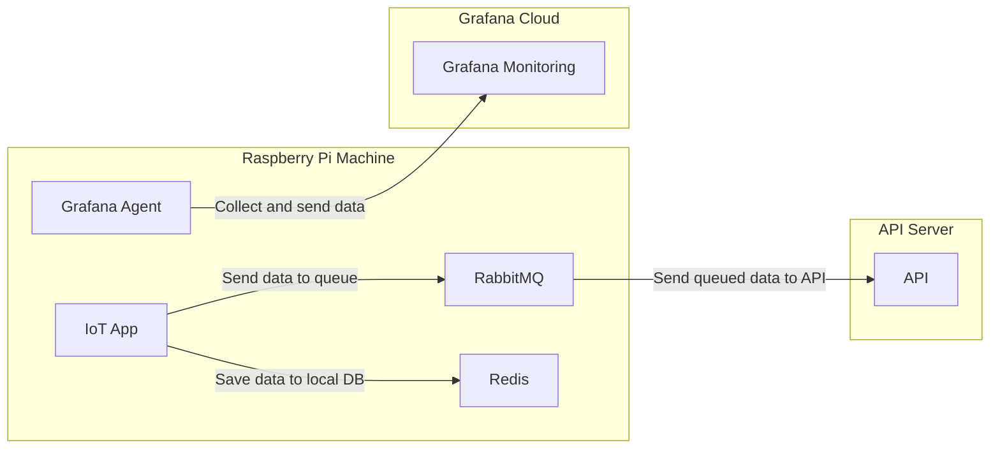

1 - Event Pattern

---

Author: Hudya (@perogeremmer)

 

# Overview

Ketika mendengar kata IoT, kamu pasti berpikir tentang bagaimana sebuah alat terhubung ke internet.
Pernyataan tersebut benar, namun tidak sepenuhnya benar. Mengapa? Hal ini dikarenakan untuk mencapai aplikasi yang terhubung penuh ke internet, membutuhkan koneksi internet yang stabil.

Kenyataanya, kondisi internet di Indonesia membuat pengembangan IoT yang terhubung dengan internet secara penuh. Pada materi IoT yang dikembangkan oleh Komandro CCIT - FTUI, kami mengenalkan materi IoT yang menjelaskan konseptual pembuatan aplikasi IoT yang mendukung sistem secara Hybrid. Artinya, aplikasi yang kita bangun tidak akan bergantung kepada internet sepenuhnya, dan akan menggunakan sistem lokal.

 

Lalu, bagaimana nanti struktur aplikasi yang akan kita bangun? Perhatikan diagram berikut:

 

Dapat diperhatikan dari diagram di atas, kita melihat bahwa sistem akan menyimpan data lokal menggunakan Redis. Redis sendiri adalah in-memory database yang menyimpan data pada memori (RAM). Kita juga menyimpan data pada RabbitMQ (Broker Message) yang akan berfungsi sebagai Queue, artinya apabila ada proses yang dapat berjalan di belakang, maka dapat diproses oleh RabbitMQ.

Selanjutnya kamu lihat ada grafana agent, tools ini digunakan untuk melakukan monitoring. Monitoring ini berfungsi untuk memahami keadaan pada mesin IoT yang kita gunakan, seperti:

- Berapa RAM yang tersisa
- Berapa CPU yang digunakan
- Berapa Memory Disk yang tersisa
- Penggunaan RAM, CPU, Memory Disk setiap 15 menit
- Log dari aplikasi yang berjalan

Hal ini ditujukan untuk mempermudah tracking apabila terjadi masalah, atau memahami keadaan mesin sebelum terjadinya masalah.

 

Berikut adalah contoh monitoring pada Grafana

 

Sebenarnya selain grafana ada juga tools lainnya, namun Grafana menawarkan free-tier yang dapat digunakan oleh kamu khususnya para mahasiswa untuk belajar dan memahami konsep dasar monitoring.

 

# Requirements

Pada aplikasi IoT yang kita bangun kita akan menggunakan tools sebagai berikut:

- Python 3: Bahasa pemrograman yang digunakan untuk membangun app (Minimal versi 3.7)
- Redis: Database lokal in-memory DB
- RabbitMQ: Broker message yang digunakan sebagai Queue
- Pytest: Software unit testing
- Grafana: Tools Monitoring
- Raspbian: OS Raspberry yang akan diinstall

 

# How we learn

Meskipun IoT sangat dekat dengan raspberry / arduino, namun keterbatasan yang ada membuat kita bergerak tidak akan mudah. Oleh karena itu, kita mengakali keterbatasan ini dengan minimal menggunakan environment yang sama. Sehingga, kita tidak perlu menggunakan raspberry secara fisik, namun mengakalinya dengan virtual box.

 

> Loh bukannya kalau pake virtual box kita jadi gak bisa pakai sensor-sensornya?

Betul, memang adanya keterbatasan dari Vbox ini membuat kita tidak dapat belajar penggunaan GPIO dari raspberry, tapi ketahuilah, ini bukanlah masalah utama. Masalah utama dari pembelajaran IoT adalah pemahaman terkait bagaimana algoritma dari sistem berjalan, hingga pemahaman terkait bagaimana mengelola data yang tersimpan di lokal hingga mengirim ke API.

Jadi, daripada kita tidak sama sekali belajar untuk membuat aplikasi IoT, lebih baik belajar hal-hal yang kita dapat pelajari dengan keterbatasan yang ada. Namun tenang saja, materi yang akan kamu pelajari ini sangat worth it dan sudah standar dengan kebutuhan industri.

 

> [!NOTE]
> Materi ini di-supervisi oleh pak [Hudya](https://linkedin.com/in/perogeremmer), lead backend developer di [Soul Parking](https://soulparking.co.id) sekaligus pengajar di [CCIT - FTUI](https://ccit.eng.ui.ac.id).

 

Untuk instalasi dapat kamu baca melalui [URL berikut](https://roboticsbackend.com/install-raspbian-desktop-on-a-virtual-machine-virtualbox/). Pastikan kamu sudah menginstall raspbian di virtual box ya agar pembelajaranmu dapat maksimal 😃.

# Material Planning

Pada materi pembelajaran IoT ini kamu akan mempelajari beberapa materi sebagai berikut:

- Pengenalan dasar Python
- Introduction to Redis with Python
- Introduction to RabbitMQ with Python
- Introduction to Event Pattern with Python
- Introduction to Logging with Python
- Introduction to Automation Testing with Python
- Connecting our machine to Grafana
- Creating dashboard in Grafana
- Building our first app: Simple Vending Machine

Pada akhir materi IoT ini, kamu akan membuat simple vending machine dengan tampilan HTML yang akan disambungkan dengan websocket dan terhubung sistem yang kita bangun.

Selamat Belajar! 🔥

 

> [!NOTE]
> Perlu diketahui bahwa materi ini tidak akan menjelaskan Python dari awal hingga akhir, sehingga bagi kamu yang belum pernah belajar bahasa pemrograman kami tidak sarankan untuk mengikuti materi ini.

