| Author                                        | Editor |
| --------------------------------------------- | ------ |
| [mawlibrahim](https://github.com/mawlibrahim) | Ifarra |

# Introduction to Dart

- [Introduction to Dart](#introduction-to-dart)
  - [Apa itu Dart?](#apa-itu-dart)
  - [Mengapa Menggunakan Dart?](#mengapa-menggunakan-dart)
  - [Instalasi Dart](#instalasi-dart)
    - [1. Unduh Dart SDK](#1-unduh-dart-sdk)
    - [2. Ekstrak SDK](#2-ekstrak-sdk)
    - [3. Tambahkan Dart ke PATH](#3-tambahkan-dart-ke-path)
    - [5. Verifikasi Instalasi](#5-verifikasi-instalasi)
- [Instalasi Visual Studio Code (VS Code)](#instalasi-visual-studio-code-vs-code)
    - [1. Unduh dan Instal VS Code](#1-unduh-dan-instal-vs-code)
    - [2. Instal Ekstensi Dart](#2-instal-ekstensi-dart)
    - [3. Buat Proyek Dart](#3-buat-proyek-dart)
    - [4. Jalankan Program "Hello, World"](#4-jalankan-program-hello-world)

## Apa itu Dart?

Dart adalah bahasa pemrograman yang dikembangkan oleh Google. Bahasa ini dirancang untuk pengembangan aplikasi frontend yang cepat dan efisien, khususnya dengan Flutter, sebuah framework UI open-source. Dart memungkinkan pengembangan aplikasi mobile, web, dan desktop dari satu basis kode dengan performa tinggi dan sintaks yang mudah dipelajari.

## Mengapa Menggunakan Dart?

Dart menawarkan beberapa keuntungan utama yang membuatnya layak untuk dipelajari dan digunakan:

- **Performa Tinggi**: Dart dikompilasi ke dalam kode native untuk aplikasi mobile dan JavaScript untuk aplikasi web, sehingga menghasilkan aplikasi yang cepat dan responsif.
- **Produktivitas Pengembang**: Dengan fitur seperti hot reload, pengembang dapat melihat perubahan kode secara instan tanpa harus merestart aplikasi.
- **Ekosistem yang Kuat**: Dart memiliki ekosistem yang kaya dengan banyak paket dan alat bantu yang memudahkan pengembangan aplikasi.

Jika Anda familiar dengan Java atau JavaScript, Anda tidak akan kesulitan untuk mempelajari Dart. Sintaks dan konsep dasar Dart sangat mirip dengan kedua bahasa tersebut, sehingga memudahkan transisi dan mempercepat proses pembelajaran.

Kebanyakan orang belajar Dart karena ingin menggunakan Flutter. Flutter adalah framework UI open-source yang memungkinkan pengembangan aplikasi mobile, web, dan desktop dari satu basis kode. Apa itu Flutter? Akan kita bahas di materi-materi berikutnya.

## Instalasi Dart

Untuk memulai dengan Dart, pertama-tama Anda perlu menginstal Dart SDK. Berikut langkah-langkah untuk menginstal Dart SDK:

### 1. Unduh Dart SDK

- Kunjungi situs resmi Dart di [dart.dev](https://dart.dev/get-dart/archive) dan unduh Dart SDK untuk sistem operasi Anda.

   <p align="center">
   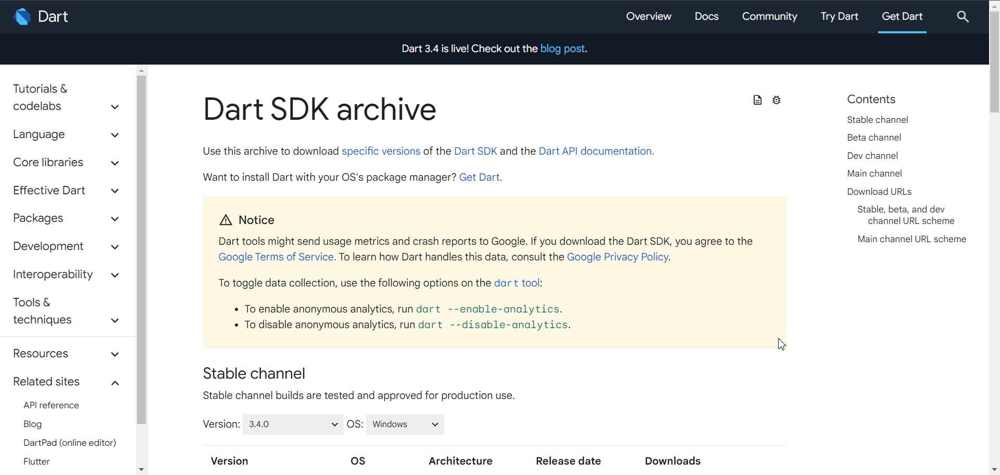
   </p>

### 2. Ekstrak SDK

- Ekstrak file yang diunduh ke direktori pilihan Anda.

      <p align="center">
      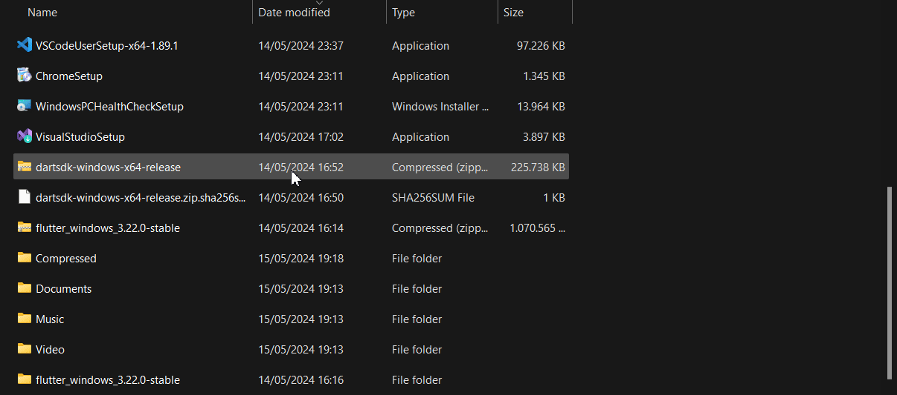
      </p>

### 3. Tambahkan Dart ke PATH

- Tambahkan direktori `bin` dari Dart SDK ke variabel PATH sistem Anda. Ini memungkinkan Anda untuk menjalankan perintah Dart dari terminal atau command prompt. Untuk melakukannya ikuti langkah-langkah di bawah ini :

- salin directory `bin` dark Dart SDK yang sudah kamu extract.

      <p align="center">
      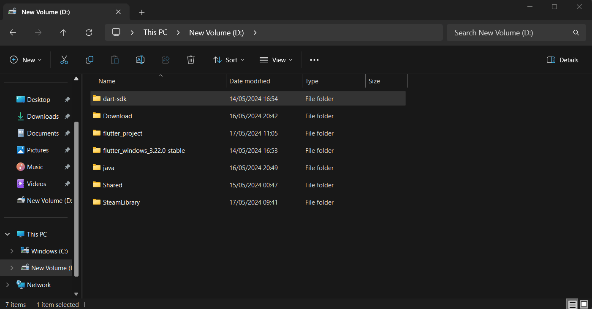
      </p>

- Lalu, masukan directory `bin` yang sudah kamu salin tadi ke dalam enviorment variable `path` dengan ketik **env** pada search bar windows kamu.

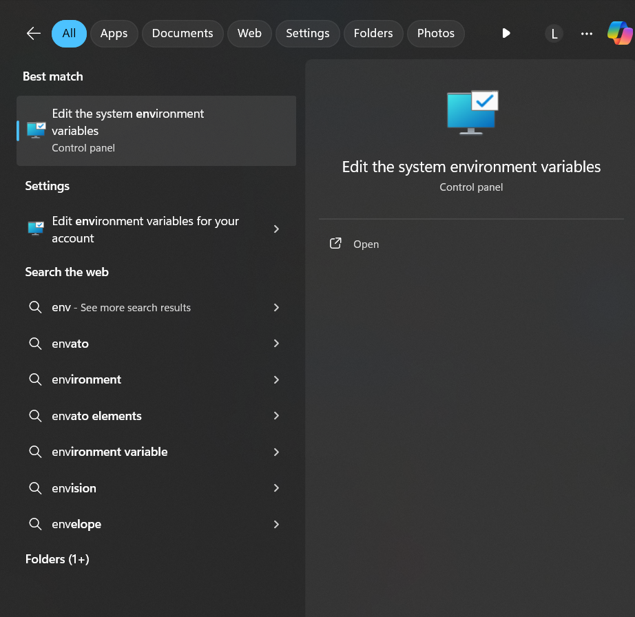

- Pilih **advanced** dan click **Enviorment Variable**
      <p align="center">
      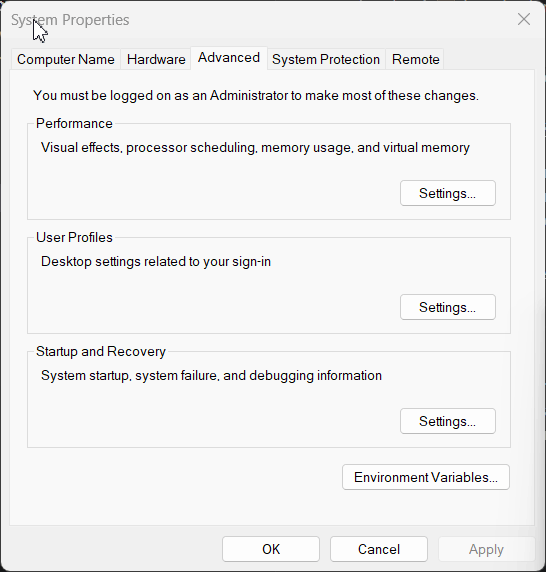
      </p>
- Click **Path**, click **New** dan **Paste** directory `bin` Dart SDK yang sudah kamu **Salin**, lalu click **OK** untuk save.
      <p align="center">
      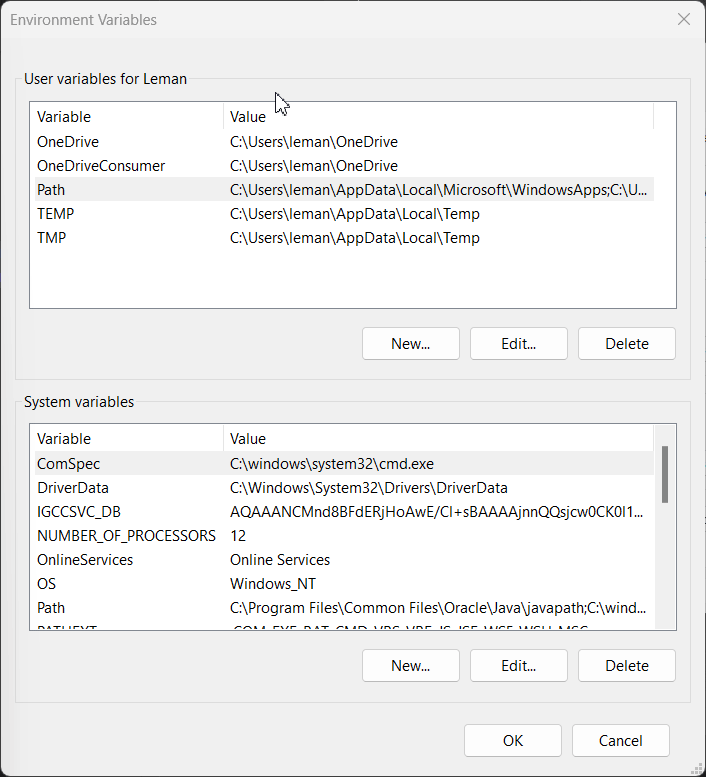
      </p>

### 5. Verifikasi Instalasi

- Buka terminal atau command prompt dan jalankan perintah berikut untuk memastikan Dart telah terinstal dengan benar:

   ```bash
   dart --version
   ```

   jika dart telah terinstal dengan benar maka akan muncul seperti ini :

   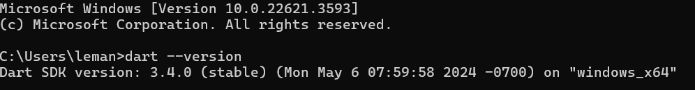

# Instalasi Visual Studio Code (VS Code)

Untuk mengembangkan aplikasi menggunakan Dart, disarankan menggunakan Visual Studio Code (VS Code) karena menyediakan berbagai ekstensi yang mendukung Dart dan Flutter.

### 1. Unduh dan Instal VS Code

Kunjungi situs resmi [Visual Studio Code](https://code.visualstudio.com/) dan unduh installer untuk sistem operasi Anda. Ikuti petunjuk instalasi yang muncul.

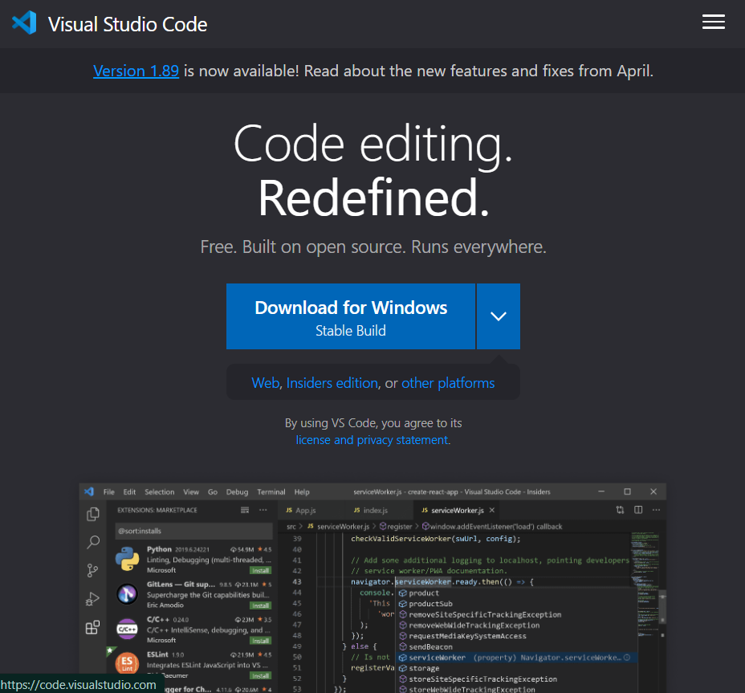

### 2. Instal Ekstensi Dart

Buka VS Code, lalu buka Extensions View dengan menekan `Ctrl+Shift+X`. Cari ekstensi Dart dan klik **Install**.

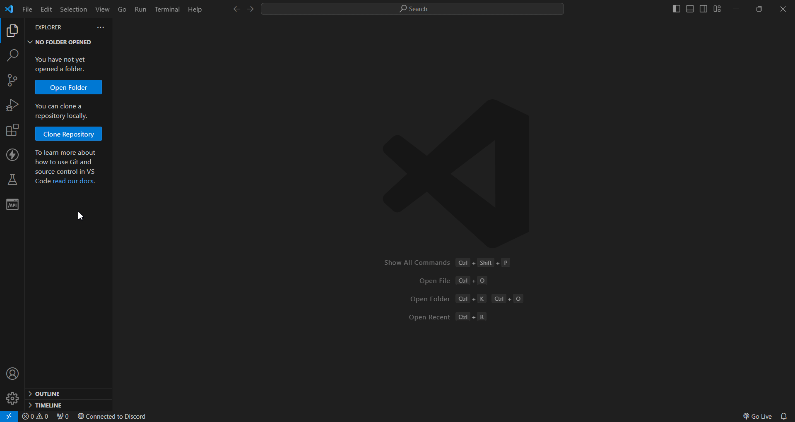

### 3. Buat Proyek Dart

Buka terminal baru di VS Code dengan menekan Ctrl + Shift + ` dan jalankan perintah berikut untuk membuat proyek Dart baru:

```bash
dart create hello_world
```

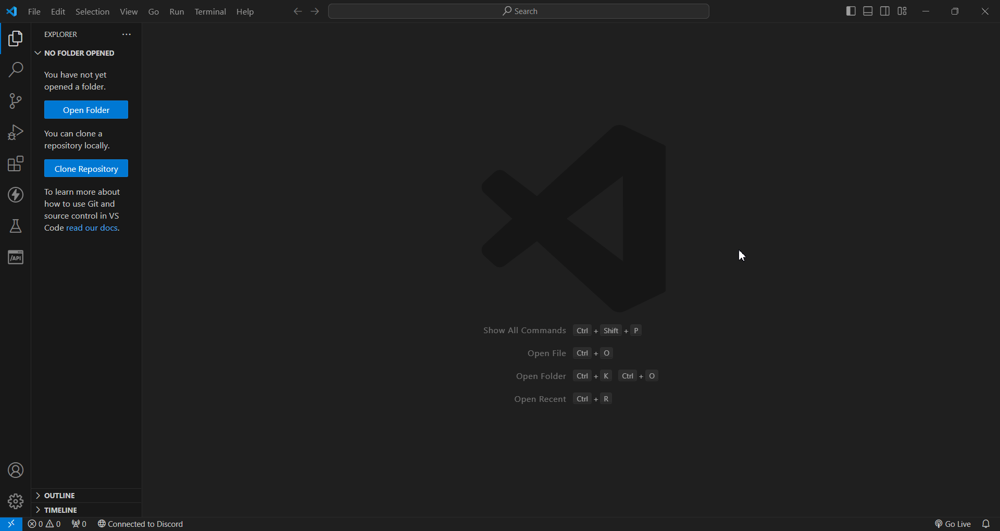

Buka folder **hello_world** yang tadi dibuat :

```bash
code hello_world
```

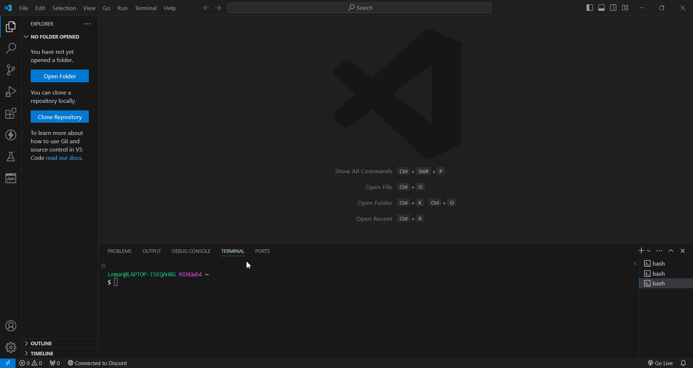

### 4. Jalankan Program "Hello, World"

Masuk kedalam direktori `bin`, lalu click `hello_world.dart` dan tuliskan kode berikut :

```dart
void main() {
  print('Hello, World!');
}
```

Untuk menjalankan program ini kalian bisa menclick tombol debug pada vscode :
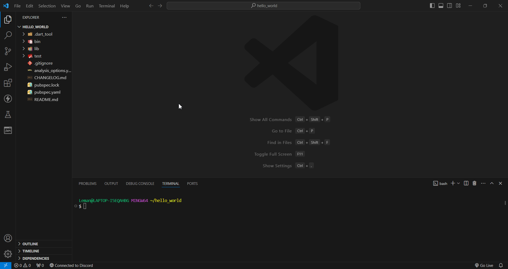
