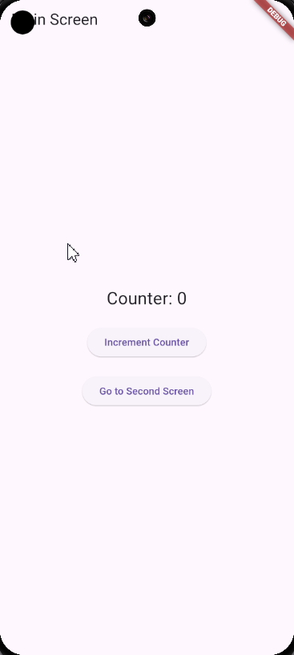

# Soal:

Buatlah aplikasi Flutter yang terdiri dari dua layar: `MainScreen` dan `SecondScreen`. Aplikasi ini akan menggunakan state management dengan `setState` untuk mengelola nilai counter pada `MainScreen`. Di `MainScreen`, tambahkan tombol untuk meningkatkan nilai counter dan tombol untuk navigasi ke `SecondScreen`. Di `SecondScreen`, tampilkan nilai counter yang sama, dan tambahkan tombol untuk kembali ke `MainScreen`. Pastikan nilai counter tetap sama antara kedua layar.

Tuliskan kode lengkap untuk aplikasi Flutter ini.

