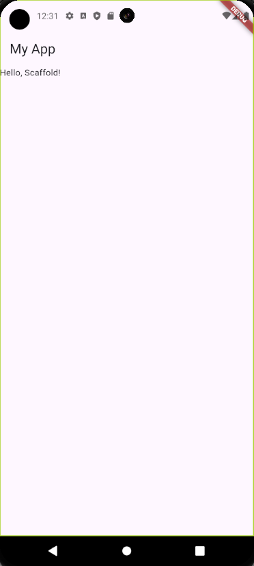
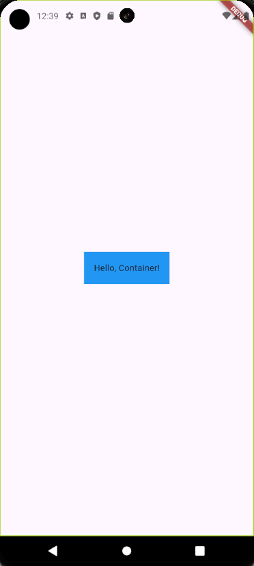
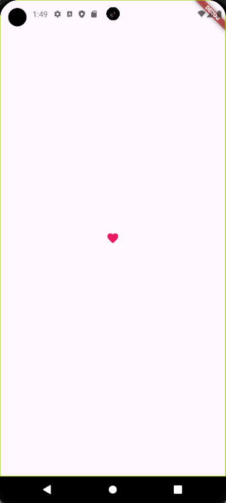
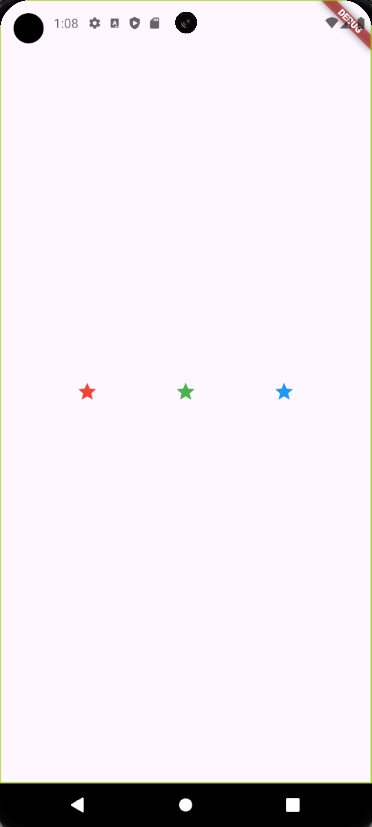
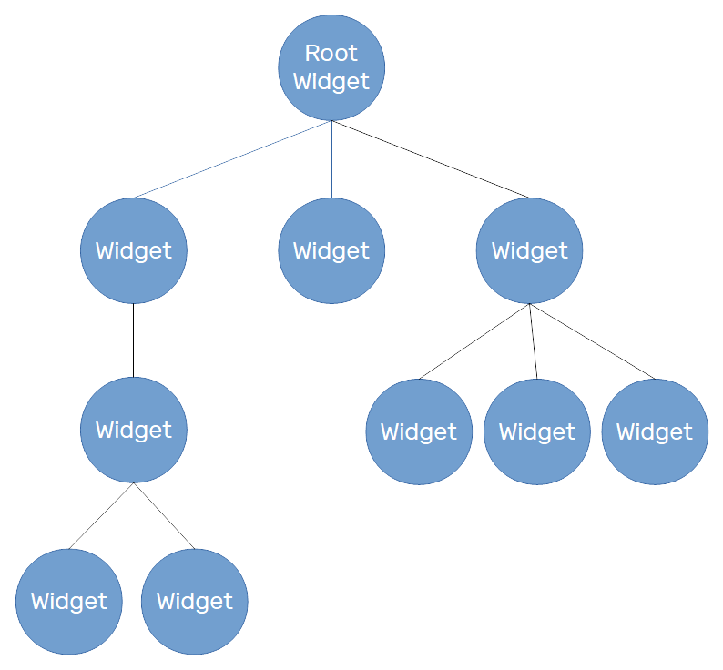

# Widget Dasar

<br />

### Apa itu Widget?

Di Flutter, semua yang ada di aplikasi adalah **widget**. Tapi, apa sebenarnya yang dimaksud dengan **widget**?

**Widget** adalah elemen dasar dari antarmuka pengguna di aplikasi Flutter. Mereka adalah komponen yang dapat digunakan kembali yang mendeskripsikan bagian dari antarmuka pengguna. Dalam Flutter, hampir setiap hal adalah **widget**, termasuk:

- **Layout** (tata letak)
- **Tombol**
- **Teks**
- **Gambar**
- **Formulir**
- Bahkan seluruh halaman aplikasi

# Widget penting yang harus anda ketahui

Daftar **widget** di bawah ini menawarkan berbagai fungsi untuk membuat antarmuka pengguna yang menarik.

- ### Scaffold

  **Scaffold** adalah widget tata letak utama yang menyediakan struktur dasar untuk aplikasi. Ini memberikan API untuk menambahkan **app bar**, **drawer**, **snackbar**, dan banyak lagi.


  ```dart
  import 'package:flutter/material.dart';

  void main() {
    runApp(MyApp());
  }

  class MyApp extends StatelessWidget {
    @override
    Widget build(BuildContext context) {
      return MaterialApp(
        home: Scaffold(
          appBar: AppBar(
            title: Text('My App'),
          ),
          body: Text('Hello, Scaffold!'),
        ),
      );
    }
  }
  ```
  <p align="center">
  
  </p>

  ### Properti pada widget Scaffold yang Digunakan
  - **appBar**: Menambahkan toolbar di bagian atas layar.
  - **body**: Menentukan konten utama aplikasi.

- ### Container
  `Container` adalah **widget** serbaguna yang dapat menampung **widget** lain dan dapat diatur tata letak serta tampilannya sesuai keinginan.

  ```dart
  import 'package:flutter/material.dart';

  void main() {
    runApp(MyApp());
  }

  class MyApp extends StatelessWidget {
    @override
    Widget build(BuildContext context) {
      return MaterialApp(
        home: Scaffold(
          body: Center(
            child: Container(
              padding: EdgeInsets.all(16.0),
              color: Colors.blue,
              child: Text('Hello, Container!'),
            ),
          ),
        ),
      );
    }
  }
  ```
  <p align="center">
  
  </p>

  ### Properti pada widget Container yang Digunakan
  - **padding**: Menentukan ruang di sekitar konten dalam **Container**. Padding sebesar 16 piksel membuat teks tidak menempel pada tepi **Container**.

  - **color**: Menentukan warna latar belakang **Container**. Warna biru digunakan di sini.

- ### Text
  **Text** adalah **widget** yang digunakan untuk menampilkan teks. Anda bisa mengatur font, warna, ukuran, dan gaya lainnya.

  ```dart
  import 'package:flutter/material.dart';

  void main() {
    runApp(MyApp());
  }

  class MyApp extends StatelessWidget {
    @override
    Widget build(BuildContext context) {
      return MaterialApp(
        home: Scaffold(
          body: Center(
            child: Text(
              'Hello, Flutter!',
              style: TextStyle(fontSize: 24, color: Colors.black),
            ),
          ),
        ),
      );
    }
  }
  ```
  <p align="center">
  
  </p>
 
  ### Properti pada widget Text yang Digunakan
  - **style**: Properti ini digunakan untuk mengatur gaya teks, seperti `fontSize` dan `color`. Di sini, ukuran font adalah 24 dan warna teks adalah hitam.

  ### Icon
  **Icon** adalah **widget** yang digunakan untuk menampilkan ikon.
  ```dart
  import 'package:flutter/material.dart';

  void main() {
    runApp(MyApp());
  }

  class MyApp extends StatelessWidget {
    @override
    Widget build(BuildContext context) {
      return MaterialApp(
        home: Scaffold(
          body: Center(
            child: Icon(
              Icons.favorite,
              color: Colors.pink,
              size: 24.0,
            ),
          ),
        ),
      );
    }
  }

  ```
  <p align="center">
  
  </p>

  ### Properti pada widget Icon yang Digunakan
  - **Icons.favorite**: Menentukan jenis ikon yang akan ditampilkan, di sini kita menggunakan ikon hati (favorite).

  - **color**: Menentukan warna ikon. Di sini, warna ikon adalah pink.

  - **size**: Menentukan ukuran ikon dalam piksel. Ukuran ikon di sini adalah 24 piksel.

- ### Row dan Column
  **Row** dan **Column** adalah **widget** yang mengatur **widget** anak dalam garis horizontal dan vertikal.

  ### Row
  ```dart
  import 'package:flutter/material.dart';

  void main() {
    runApp(MyApp());
  }

  class MyApp extends StatelessWidget {
    @override
    Widget build(BuildContext context) {
      return MaterialApp(
        home: Scaffold(
          body: Center(
            child: Row(
              mainAxisAlignment: MainAxisAlignment.spaceEvenly,
              children: <Widget>[
                Icon(Icons.star, color: Colors.red),
                Icon(Icons.star, color: Colors.green),
                Icon(Icons.star, color: Colors.blue),
              ],
            ),
          ),
        ),
      );
    }
  }
  ```
  <p align="center">
  
  </p>

  ### Properti pada widget Row yang Digunakan
  - **mainAxisAlignment**: Properti ini menentukan bagaimana widget anak disejajarkan di sepanjang sumbu utama (horizontal untuk **Row**). **spaceEvenly** memastikan bahwa jarak antara, sebelum, dan sesudah setiap ikon adalah sama.

  ### Column
  ```dart
  import 'package:flutter/material.dart';

  void main() {
    runApp(MyApp());
  }

  class MyApp extends StatelessWidget {
    @override
    Widget build(BuildContext context) {
      return MaterialApp(
        home: Scaffold(
          body: Center(
            child: Column(
              mainAxisAlignment: MainAxisAlignment.center,
              children: <Widget>[
                Text('Item 1'),
                Text('Item 2'),
                Text('Item 3'),
              ],
            ),
          ),
        ),
      );
    }
  }
  ```
  <p align="center">
  
  </p>

  ### Properti pada widget Column yang Digunakan
    - **mainAxisAlignment**: Properti ini menentukan bagaimana widget anak disejajarkan di sepanjang sumbu utama (vertikal untuk **Column**). **center** membuat semua teks terpusat di tengah layar.

- ### Image
  **Image** adalah **widget** yang digunakan untuk menampilkan gambar. Anda dapat memuat gambar dari berbagai sumber seperti internet atau file lokal.

  ```dart
  import 'package:flutter/material.dart';

  void main() {
    runApp(MyApp());
  }

  class MyApp extends StatelessWidget {
    @override
    Widget build(BuildContext context) {
      return MaterialApp(
        home: Scaffold(
          body: Center(
              child: Image.network('https://i.kym-cdn.com/photos/images/newsfeed/002/697/316/d31'),
          ),
        ),
      );
    }
  }
  ```
  <p align="center">
  
  </p>

  ### Properti pada widget Image yang Digunakan
  - `Image.network`: Properti ini digunakan untuk memuat gambar dari internet dengan URL yang diberikan. Gambar akan ditampilkan di pusat layar.
  
- ### Button
  Flutter menyediakan beberapa jenis tombol, seperti **ElevatedButton**, **TextButton**, dan **IconButton**.

  ### ElevatedButton
  ```dart
  import 'package:flutter/material.dart';

  void main() {
    runApp(MyApp());
  }

  class MyApp extends StatelessWidget {
    @override
    Widget build(BuildContext context) {
      return MaterialApp(
        home: Scaffold(
          body: Center(
            child: ElevatedButton(
              onPressed: () {
                // Aksi yang dilakukan saat tombol ditekan
              },
              child: Text('Click Me'),
            ),
          ),
        ),
      );
    }
  }
  ```
  <p align="center">
  
  </p>

  ### Properti pada widget ElevatedButton yang Digunakan
  - **onPressed**: Fungsi yang akan dijalankan saat tombol ditekan.

  - **child**: **Widget** yang ditampilkan di dalam tombol, di sini berupa teks "Click Me".

  ### TextButton
  ```dart
  import 'package:flutter/material.dart';

  void main() {
    runApp(MyApp());
  }

  class MyApp extends StatelessWidget {
    @override
    Widget build(BuildContext context) {
      return MaterialApp(
        home: Scaffold(
          body: TextButton(
            onPressed: () {
              // Aksi yang dilakukan saat tombol ditekan
            },
            child: Text('Click Me'),
          ),
        ),
      );
    }
  }
  ```
  <p align="center">
  
  </p>

  ### Properti pada widget TextButton yang Digunakan
  - **onPressed**: Fungsi yang akan dijalankan saat tombol ditekan.

  - **child**: **Widget** yang ditampilkan di dalam tombol, di sini berupa teks "Click Me".

  ### IconButton
  ```dart
  import 'package:flutter/material.dart';

  void main() {
    runApp(MyApp());
  }

  class MyApp extends StatelessWidget {
    @override
    Widget build(BuildContext context) {
      return MaterialApp(
        home: Scaffold(
          body: IconButton(
            onPressed: () {
              // Aksi yang dilakukan saat tombol ditekan
            },
            icon: Icon(Icons.favorite),
            color: Colors.red,
            iconSize: 24.0,
          ),
        ),
      );
    }
  }
  ```
  <p align="center">
  
  </p>

  ### Properti pada widget IconButton yang Digunakan
  - **onPressed**: Fungsi yang akan dijalankan saat tombol ditekan.

  - **icon**: Ikon yang ditampilkan di dalam tombol.

  - **color**: Warna ikon.

  - **iconSize**: Ukuran ikon dalam piksel.

# Jenis-Jenis Widget

- ### Stateless Widget

    **Stateless Widget** adalah **widget** yang tidak memiliki state (keadaan) yang dapat berubah. Mereka dirender sekali dan tidak berubah selama siklus hidup aplikasi.

    ### Contoh Stateless Widget
    ```dart
    import 'package:flutter/material.dart';

    class MyStatelessWidget extends StatelessWidget {
    @override
    Widget build(BuildContext context) {
        return Text('Hello, Flutter!');
    }
    }
    ```
    Pada contoh di atas, `MyStatelessWidget` hanya menampilkan teks "Hello, Flutter!" dan tidak pernah berubah.

- ### Stateful Widget
    **Stateful Widget** adalah widget yang memiliki state yang dapat berubah. Mereka dapat dirender ulang ketika state mereka berubah, memungkinkan tampilan yang dinamis.
    
    ### Contoh Stateful Widget
    ```dart 
    import 'package:flutter/material.dart';

    class MyStatefulWidget extends StatefulWidget {
    @override
    _MyStatefulWidgetState createState() => _MyStatefulWidgetState();
    }

    class _MyStatefulWidgetState extends State<MyStatefulWidget> {
    int _counter = 0;

    void _incrementCounter() {
        setState(() {
        _counter++;
        });
    }

    @override
    Widget build(BuildContext context) {
        return Column(
        mainAxisAlignment: MainAxisAlignment.center,
        children: <Widget>[
            Text('Counter: $_counter'),
            ElevatedButton(
            onPressed: _incrementCounter,
            child: Text('Increment'),
            ),
        ],
        );
    }
    }
    ```
    Pada contoh ini, `MyStatefulWidget` memiliki state `_counter` yang dapat diubah dengan menekan tombol. Setiap kali tombol ditekan, tampilan diperbarui dengan nilai counter yang baru.

- ### Inherited Widget
  **InheritedWidget** adalah salah satu cara untuk berbagi state antara widget di Flutter. **InheritedWidget** memungkinkan state untuk diakses oleh widget yang berada jauh di dalam hierarki widget tanpa perlu melewatkan state tersebut secara eksplisit melalui constructor. Kita akan bahas **inheritedWidget** lebih detail pada materi state management.

  **Inherited Widget** memiliki dua komponen utama:
  - **InheritedWidget**: Widget ini menyimpan data yang ingin dibagikan dengan subtree widget.

  - **InheritedWidget.of(context)**: Metode statis yang digunakan untuk mendapatkan instance dari InheritedWidget dari subtree widget mana pun.

  Implementasi **InheritedWidget** dapat menjadi kompleks, tetapi memberikan manfaat yang besar dalam mengelola state dan data dalam aplikasi Flutter.

# MaterialApp dan CupertinoApp

Flutter mendukung dua jenis desain antarmuka pengguna utama: **Material Design** yang dikembangkan oleh Google, dan **Cupertino Design** yang merupakan gaya antarmuka pengguna dari iOS oleh Apple. Flutter menyediakan dua widget utama untuk masing-masing desain ini: `MaterialApp` dan `CupertinoApp`.

### Apa Itu MaterialApp?

**MaterialApp** adalah widget utama untuk aplikasi yang mengikuti panduan desain Material Design. Material Design adalah gaya desain visual yang dikembangkan oleh Google, yang digunakan secara luas dalam aplikasi Android dan beberapa aplikasi web.

### Fitur Utama MaterialApp

- **Tema**: Mendukung tema yang dapat disesuaikan, termasuk warna utama dan warna aksen.
- **Navigasi**: Mendukung navigasi dan routing, termasuk deep linking.
- **Integrasi dengan Widget Material**: Mendukung semua widget yang mengikuti panduan Material Design seperti **AppBar**, **FloatingActionButton**, **Drawer**, dan banyak lagi.

### Contoh Penggunaan MaterialApp

```dart
import 'package:flutter/material.dart';

void main() {
  runApp(MyApp());
}

class MyApp extends StatelessWidget {
  @override
  Widget build(BuildContext context) {
    return MaterialApp(
      title: 'Flutter Demo',
      theme: ThemeData(
        primarySwatch: Colors.blue,
      ),
      home: MyHomePage(),
    );
  }
}

class MyHomePage extends StatelessWidget {
  @override
  Widget build(BuildContext context) {
    return Scaffold(
      appBar: AppBar(
        title: Text('Home Page'),
      ),
      body: Center(
        child: Text('Hello, Material Design!'),
      ),
      floatingActionButton: FloatingActionButton(
        onPressed: () {},
        child: Icon(Icons.add),
      ),
    );
  }
}
```

### Apa Itu CupertinoApp?
**CupertinoApp** adalah widget utama untuk aplikasi yang mengikuti panduan desain Cupertino (iOS). Cupertino Design adalah gaya desain visual yang dikembangkan oleh Apple, yang digunakan secara luas dalam aplikasi iOS.

Fitur Utama CupertinoApp
- **Tema**: Mendukung tema Cupertino yang mirip dengan tampilan dan nuansa aplikasi iOS.

- **Navigasi**: Mendukung navigasi dan routing yang konsisten dengan navigasi iOS.

- **Integrasi dengan Widget Cupertino**: Mendukung semua widget yang mengikuti panduan Cupertino seperti **CupertinoNavigationBar**, **CupertinoButton**, **CupertinoTabScaffold**, dan banyak lagi.

```dart
import 'package:flutter/cupertino.dart';

void main() {
  runApp(MyCupertinoApp());
}

class MyCupertinoApp extends StatelessWidget {
  @override
  Widget build(BuildContext context) {
    return CupertinoApp(
      title: 'Flutter Demo',
      theme: CupertinoThemeData(
        primaryColor: CupertinoColors.systemBlue,
      ),
      home: MyHomePage(),
    );
  }
}

class MyHomePage extends StatelessWidget {
  @override
  Widget build(BuildContext context) {
    return CupertinoPageScaffold(
      navigationBar: CupertinoNavigationBar(
        middle: Text('Home Page'),
      ),
      child: Center(
        child: Text('Hello, Cupertino Design!'),
      ),
    );
  }
}
```

### Perbandingan MaterialApp dan CupertinoApp
### Kapan Menggunakan MaterialApp?
Saat mengembangkan aplikasi yang mengikuti panduan desain Material Design.
Saat menargetkan pengguna Android sebagai audiens utama.
Saat memerlukan akses ke widget dan komponen spesifik Material Design.

### Kapan Menggunakan CupertinoApp?
Saat mengembangkan aplikasi yang mengikuti panduan desain Cupertino.
Saat menargetkan pengguna iOS sebagai audiens utama.
Saat memerlukan akses ke widget dan komponen spesifik Cupertino Design.


# Widget Tree
   <p align="center">
    
   </p>
Widget tree adalah hierarki dari semua widget yang digunakan dalam aplikasi. Root widget adalah titik awal dari pohon, dan semua widget lain adalah anak dari root widget atau turunannya. Struktur ini memungkinkan pengembangan antarmuka pengguna yang kompleks dari komponen-komponen kecil yang dapat digunakan kembali.

### Contoh Widget Tree
```dart
Widget build(BuildContext context) {
  return Scaffold(
    appBar: AppBar(
      title: Text('My App'),
    ),
    body: Center(
      child: Column(
        mainAxisAlignment: MainAxisAlignment.center,
        children: <Widget>[
          Text('Hello, World!'),
          Icon(Icons.star),
        ],
      ),
    ),
  );
}
```
Pada contoh ini, widget tree-nya adalah sebagai berikut:
```matematica
Scaffold
 ├── AppBar
 │    └── Text
 └── Center
      └── Column
           ├── Text
           └── Icon
```
- **Scaffold** adalah root widget yang memiliki dua anak: `AppBar` dan `Center`.

- **AppBar** memiliki satu anak yaitu **Text**.

- **Center** memiliki satu anak yaitu **Column**.

- **Column** memiliki dua anak: **Text** dan **Icon**.

Jika kalian ingin tahu lebih lanjut tentang materi diatas kalian bisa check langsung dokumentasi yang sudah disediakan pihak [flutter](https://docs.flutter.dev/ui/widgets).