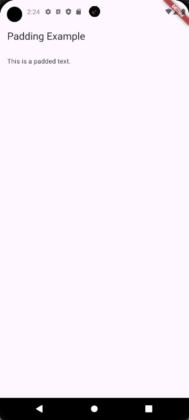
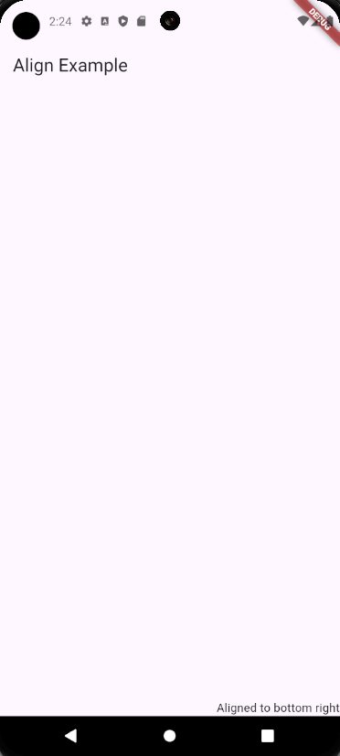
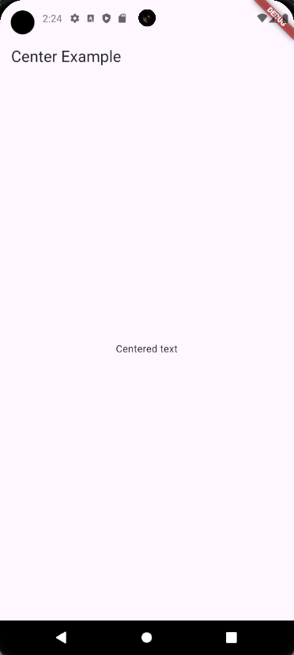
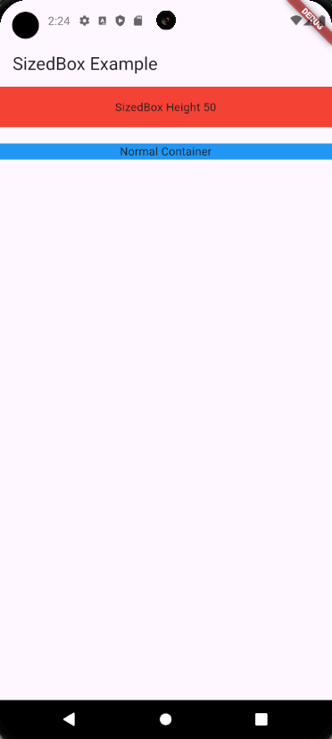
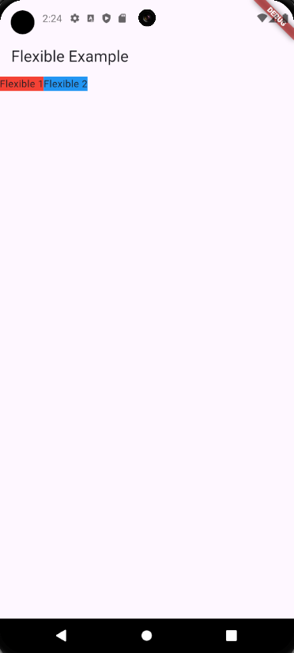
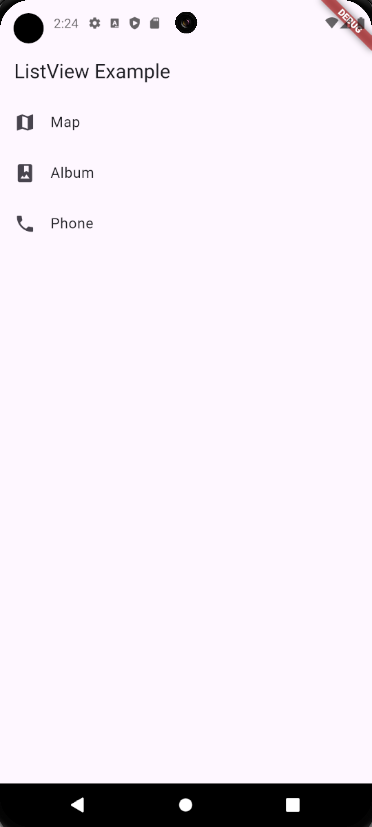
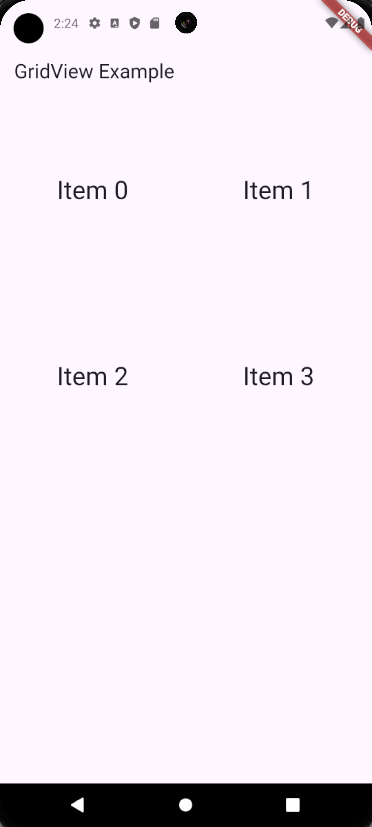

| Author                                        | Editor |
| --------------------------------------------- | ------ |
| [SulaimanLmn](https://github.com/SulaimanLmn) | Ifarra |

# Layout Dasar

- [Layout Dasar](#layout-dasar)
  - [Padding](#padding)
  - [Align](#align)
  - [Center](#center)
  - [Expanded](#expanded)
  - [SizedBox](#sizedbox)
  - [Flexible dan Expanded](#flexible-dan-expanded)
    - [Flexible](#flexible)
    - [Expanded](#expanded-1)
- [ListView dan GridView](#listview-dan-gridview)
    - [ListView](#listview)
    - [ListView.builder](#listviewbuilder)
    - [GridView](#gridview)
    - [PageView](#pageview)

Flutter menyediakan berbagai widget layout yang memungkinkan Anda untuk mengatur tampilan dan posisi elemen-elemen dalam aplikasi. Beberapa widget dasar yang sering digunakan adalah Padding, Align, Center, Expanded, SizedBox, ListView.builder, dan PageView. Berikut adalah penjelasan dan contoh penggunaan masing-masing widget.

## Padding

`Padding` digunakan untuk memberikan jarak di sekitar widget anak. Ini sangat berguna untuk memastikan bahwa elemen dalam UI Anda tidak saling berhimpitan. Berikut adalah contoh penggunaannya:

```dart
import 'package:flutter/material.dart';

void main() => runApp(MyApp());

class MyApp extends StatelessWidget {
  @override
  Widget build(BuildContext context) {
    return MaterialApp(
      home: Scaffold(
        appBar: AppBar(title: Text('Padding Example')),
        body: Padding(
          padding: const EdgeInsets.all(16.0),
          child: Text('This is a padded text.'),
        ),
      ),
    );
  }
}
```

<p align="center">

</p>

Dalam contoh ini, `Padding` memberikan jarak 16 piksel di semua sisi dari teks `"This is a padded text."`.

## Align

`Align` digunakan untuk mengatur posisi widget anak di dalam widget induk. Anda bisa menggunakan properti `alignment` untuk menentukan posisi relatif dari widget anak. Berikut adalah contohnya:

```dart
import 'package:flutter/material.dart';

void main() => runApp(MyApp());

class MyApp extends StatelessWidget {
  @override
  Widget build(BuildContext context) {
    return MaterialApp(
      home: Scaffold(
        appBar: AppBar(title: Text('Align Example')),
        body: Align(
          alignment: Alignment.bottomRight,
          child: Text('Aligned to bottom right'),
        ),
      ),
    );
  }
}
```

<p align="center">

</p>

Di sini, `Align` mengatur teks agar berada di sudut kanan bawah dari area yang tersedia.

## Center

`Center` digunakan untuk menempatkan widget anak di tengah-tengah widget induk. Ini adalah cara yang mudah untuk memusatkan konten dalam tampilan. Contoh penggunaan:

```dart
import 'package:flutter/material.dart';

void main() => runApp(MyApp());

class MyApp extends StatelessWidget {
  @override
  Widget build(BuildContext context) {
    return MaterialApp(
      home: Scaffold(
        appBar: AppBar(title: Text('Center Example')),
        body: Center(
          child: Text('Centered text'),
        ),
      ),
    );
  }
}
```

<p align="center">

</p>

Dengan menggunakan `Center`, teks "Centered text" akan ditempatkan tepat di tengah layar.

## Expanded

Expanded digunakan di dalam widget `Row` atau `Column` untuk mengambil semua ruang yang tersedia di sumbu utama. Berikut adalah contoh penggunaan `Expanded` dalam `Row`:

```dart
import 'package:flutter/material.dart';

void main() => runApp(MyApp());

class MyApp extends StatelessWidget {
  @override
  Widget build(BuildContext context) {
    return MaterialApp(
      home: Scaffold(
        appBar: AppBar(title: Text('Expanded Example')),
        body: Row(
          children: [
            Expanded(
              child: Container(
                color: Colors.red,
                child: Text('Expanded'),
              ),
            ),
            Container(
              color: Colors.blue,
              child: Text('Not Expanded'),
            ),
          ],
        ),
      ),
    );
  }
}
```

Di sini, widget `Expanded` akan mengambil semua ruang yang tersedia di dalam `Row`, sedangkan widget `Container` biru hanya akan mengambil ruang yang dibutuhkannya.

## SizedBox

`SizedBox` digunakan untuk memberikan ukuran tetap atau jarak antar widget. Ini sangat berguna untuk mengatur ruang kosong atau mengatur ukuran widget. Berikut adalah contoh penggunaan `SizedBox`:

```dart
import 'package:flutter/material.dart';

void main() => runApp(MyApp());

class MyApp extends StatelessWidget {
  @override
  Widget build(BuildContext context) {
    return MaterialApp(
      home: Scaffold(
        appBar: AppBar(title: Text('SizedBox Example')),
        body: Column(
          children: [
            SizedBox(
              height: 50.0,
              child: Container(
                color: Colors.red,
                child: Center(child: Text('SizedBox Height 50')),
              ),
            ),
            SizedBox(height: 20.0), // Spacer
            Container(
              color: Colors.blue,
              child: Center(child: Text('Normal Container')),
            ),
          ],
        ),
      ),
    );
  }
}
```

<p align="center">

</p>

Di sini, `SizedBox` memberikan jarak tetap setinggi 50 piksel pada widget pertama dan jarak kosong setinggi 20 piksel sebagai pemisah.

## Flexible dan Expanded

### Flexible

Flexible digunakan untuk memberikan fleksibilitas pada widget anak untuk mengambil ruang yang tersedia dalam Row atau Column, namun dengan proporsi yang bisa diatur. Berikut adalah contoh penggunaan

```dart
import 'package:flutter/material.dart';

void main() => runApp(MyApp());

class MyApp extends StatelessWidget {
@override
Widget build(BuildContext context) {
    return MaterialApp(
    home: Scaffold(
        appBar: AppBar(title: Text('Flexible Example')),
        body: Row(
        children: [
            Flexible(
            flex: 1,
            child: Container(
                color: Colors.red,
                child: Text('Flexible 1'),
            ),
            ),
            Flexible(
            flex: 2,
            child: Container(
                color: Colors.blue,
                child: Text('Flexible 2'),
            ),
            ),
        ],
        ),
    ),
    );
}
}
```

<p align="center">

</p>

Pada contoh ini, `Flexible` dengan `flex` 1 akan mengambil setengah ruang dari `Flexible` dengan `flex` 2, membuat perbandingan ruang antara keduanya menjadi 1:2.

### Expanded

`Expanded` adalah bentuk khusus dari `Flexible` yang secara default memiliki `flex` 1. Berikut adalah contoh penggunaan `Expanded`:

```dart
import 'package:flutter/material.dart';

void main() => runApp(MyApp());

class MyApp extends StatelessWidget {
@override
Widget build(BuildContext context) {
    return MaterialApp(
    home: Scaffold(
        appBar: AppBar(title: Text('Expanded Example')),
        body: Row(
        children: [
            Expanded(
            child: Container(
                color: Colors.red,
                child: Text('Expanded'),
            ),
            ),
            Container(
            color: Colors.blue,
            child: Text('Not Expanded'),
            ),
        ],
        ),
    ),
    );
}
}
```

  <p align="center">

</p>

Pada contoh ini, widget `Expanded` akan mengambil semua ruang yang tersedia di dalam `Row`, sementara widget `Container` biru hanya akan mengambil ruang yang dibutuhkannya.

# ListView dan GridView

### ListView

`ListView` digunakan untuk membuat daftar yang dapat di-scroll. Berikut adalah contoh sederhana membuat daftar dengan `ListView`:

```dart
import 'package:flutter/material.dart';

void main() => runApp(MyApp());

class MyApp extends StatelessWidget {
@override
Widget build(BuildContext context) {
    return MaterialApp(
    home: Scaffold(
        appBar: AppBar(title: Text('ListView Example')),
        body: ListView(
        children: [
            ListTile(
            leading: Icon(Icons.map),
            title: Text('Map'),
            ),
            ListTile(
            leading: Icon(Icons.photo_album),
            title: Text('Album'),
            ),
            ListTile(
            leading: Icon(Icons.phone),
            title: Text('Phone'),
            ),
        ],
        ),
    ),
    );
}
}
```

<p align="center">

</p>

Dalam contoh ini, `ListView` berisi tiga item `ListTile` yang masing-masing memiliki ikon dan teks.

### ListView.builder

`ListView.builder` digunakan untuk membuat daftar yang panjang atau dinamis dengan lebih efisien karena hanya membuat item yang terlihat di layar. Berikut adalah contoh penggunaan `ListView.builder`:

```dart
import 'package:flutter/material.dart';

void main() => runApp(MyApp());

class MyApp extends StatelessWidget {
@override
Widget build(BuildContext context) {
    return MaterialApp(
    home: Scaffold(
        appBar: AppBar(title: Text('ListView.builder Example')),
        body: ListView.builder(
        itemCount: 20,
        itemBuilder: (context, index) {
            return ListTile(
            leading: Icon(Icons.star),
            title: Text('Item $index'),
            );
        },
        ),
    ),
    );
}
}
```

<p align="center">

</p>

Dalam contoh ini, `ListView.builder` membuat daftar dengan 20 item, masing-masing menampilkan ikon bintang dan teks "Item {index}".

### GridView

`GridView` digunakan untuk membuat grid yang dapat di-scroll. Berikut adalah contoh penggunaan `GridView` dengan dua kolom:

```dart
import 'package:flutter/material.dart';

void main() => runApp(MyApp());

class MyApp extends StatelessWidget {
@override
Widget build(BuildContext context) {
    return MaterialApp(
    home: Scaffold(
        appBar: AppBar(title: Text('GridView Example')),
        body: GridView.count(
        crossAxisCount: 2,
        children: List.generate(4, (index) {
            return Center(
            child: Text(
                'Item $index',
                style: Theme.of(context).textTheme.headlineMedium,
            ),
            );
        }),
        ),
    ),
    );
}
}
```

<p align="center">
    
</p>

Dalam contoh ini, `GridView.count` digunakan untuk membuat grid dengan dua kolom (`crossAxisCount: 2`). `List.generate` digunakan untuk membuat empat item dalam grid, masing-masing item ditampilkan di tengah kotak dengan teks "Item 0", "Item 1", dan seterusnya.

### PageView

`PageView` digunakan untuk membuat tampilan halaman yang dapat di-swipe. Ini sangat berguna untuk membuat panduan pengguna, carousel gambar, atau tab yang dapat di-swipe. Berikut adalah contoh penggunaan `PageView`:

```dart
import 'package:flutter/material.dart';

void main() => runApp(MyApp());

class MyApp extends StatelessWidget {
  @override
  Widget build(BuildContext context) {
    return MaterialApp(
      home: Scaffold(
        appBar: AppBar(title: Text('PageView Example')),
        body: PageView(
          children: [
            Container(
              color: Colors.red,
              child: Center(child: Text('Page 1')),
            ),
            Container(
              color: Colors.green,
              child: Center(child: Text('Page 2')),
            ),
            Container(
              color: Colors.blue,
              child: Center(child: Text('Page 3')),
            ),
          ],
        ),
      ),
    );
  }
}
```

Dalam contoh ini, `PageView` membuat tiga halaman yang masing-masing berisi `Container` berwarna berbeda dengan teks di tengahnya. Anda dapat menggeser ke kiri atau kanan untuk melihat halaman-halaman tersebut.

Dengan memahami dan mempraktikkan penggunaan dasar widget ini, Anda dapat membuat layout aplikasi Flutter yang menarik dan responsif. Jangan ragu untuk bereksperimen dengan berbagai kombinasi widget untuk mendapatkan desain yang Anda inginkan.

Jika kalian ingin tahu lebih lanjut tentang materi diatas kalian bisa check langsung dokumentasi yang sudah disediakan pihak [flutter](https://docs.flutter.dev/ui/widgets).
