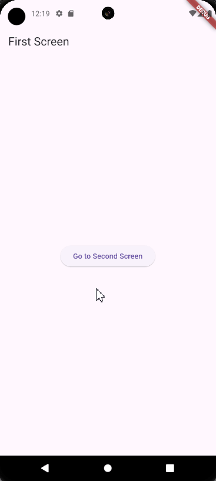
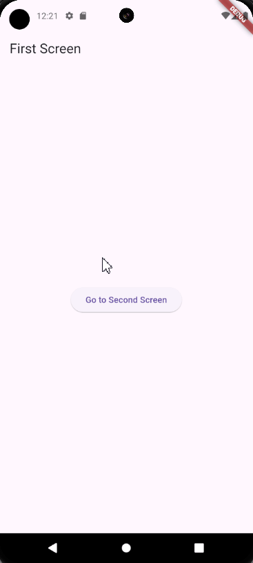

| Author                                        | Editor |
| --------------------------------------------- | ------ |
| [SulaimanLmn](https://github.com/SulaimanLmn) | Ifarra |

# Navigasi dan Routing

- [Navigasi dan Routing](#navigasi-dan-routing)
  - [Navigasi Dasar](#navigasi-dasar)
    - [Tambahkan Widget Navigasi](#tambahkan-widget-navigasi)
    - [Navigasi ke Halaman Baru](#navigasi-ke-halaman-baru)
    - [Kembali ke Halaman Sebelumnya](#kembali-ke-halaman-sebelumnya)
  - [Routing](#routing)
    - [Named Routes](#named-routes)
    - [Route Table](#route-table)
    - [Route Generator](#route-generator)
    - [Initial Route](#initial-route)
    - [Navigasi Biasa](#navigasi-biasa)
  - [Routing](#routing-1)

<br />

## Navigasi Dasar

Navigasi dalam Flutter mengacu pada proses berpindah antara layar atau halaman dalam aplikasi. Salah satu cara dasar untuk melakukan navigasi adalah dengan menggunakan `Navigator` class. Berikut adalah langkah-langkah dasar untuk melakukan navigasi menggunakan `Navigator`:

### Tambahkan Widget Navigasi

Untuk melakukan navigasi, pastikan Anda telah menambahkan widget `Navigator` di dalam widget utama aplikasi Anda. Widget `Navigator` bertanggung jawab untuk menangani perpindahan antara halaman-halaman dalam aplikasi.

### Navigasi ke Halaman Baru

Untuk navigasi ke halaman baru, Anda dapat menggunakan method `Navigator.push()`. Method ini memungkinkan Anda untuk menentukan rute tujuan yang ingin ditampilkan.

### Kembali ke Halaman Sebelumnya

Untuk kembali ke halaman sebelumnya, Anda dapat menggunakan method `Navigator.pop()`. Ini akan menghapus halaman saat ini dari tumpukan navigasi dan kembali ke halaman sebelumnya.

```dart
import 'package:flutter/material.dart';

void main() {
  runApp(MyApp());
}

class MyApp extends StatelessWidget {
  @override
  Widget build(BuildContext context) {
    return MaterialApp(
      home: FirstScreen(),
    );
  }
}

class FirstScreen extends StatelessWidget {
  @override
  Widget build(BuildContext context) {
    return Scaffold(
      appBar: AppBar(
        title: Text('First Screen'),
      ),
      body: Center(
        child: ElevatedButton(
          onPressed: () {
            // Navigasi ke halaman kedua
            Navigator.push(
              context,
              MaterialPageRoute(builder: (context) => SecondScreen()),
            );
          },
          child: Text('Go to Second Screen'),
        ),
      ),
    );
  }
}

class SecondScreen extends StatelessWidget {
  @override
  Widget build(BuildContext context) {
    return Scaffold(
      appBar: AppBar(
        title: Text('Second Screen'),
      ),
      body: Center(
        child: ElevatedButton(
          onPressed: () {
            // Kembali ke halaman pertama
            Navigator.pop(context);
          },
          child: Text('Go back to First Screen'),
        ),
      ),
    );
  }
}
```

<p align="center">

</p>

Dalam contoh di atas, `Navigator.push()` digunakan untuk perpindahan dari `FirstScreen` ke `SecondScreen`, sedangkan `Navigator.pop()` digunakan untuk kembali dari `SecondScreen` ke `FirstScreen`.

## Routing

Routing dalam Flutter mengacu pada proses membuat dan mengelola rute (routes) aplikasi. Rute merupakan representasi dari halaman atau layar dalam aplikasi. Flutter menyediakan berbagai cara untuk mengelola rute, termasuk menggunakan `MaterialApp`, `Navigator`, dan `Route` class.

Beberapa konsep penting dalam routing Flutter meliputi:

### Named Routes

Penggunaan nama sebagai identifikasi untuk setiap rute dalam aplikasi.

### Route Table

Daftar yang berisi semua rute yang tersedia dalam aplikasi.

### Route Generator

Fungsi untuk menghasilkan rute berdasarkan nama yang diberikan.

### Initial Route

Rute yang ditampilkan saat aplikasi pertama kali dijalankan.

```dart
import 'package:flutter/material.dart';

void main() {
  runApp(MyApp());
}

class MyApp extends StatelessWidget {
  @override
  Widget build(BuildContext context) {
    return MaterialApp(
      initialRoute: '/',
      routes: {
        '/': (context) => FirstScreen(),
        '/second': (context) => SecondScreen(),
      },
    );
  }
}

class FirstScreen extends StatelessWidget {
  @override
  Widget build(BuildContext context) {
    return Scaffold(
      appBar: AppBar(
        title: Text('First Screen'),
      ),
      body: Center(
        child: ElevatedButton(
          onPressed: () {
            // Navigasi ke halaman kedua
            Navigator.pushNamed(context, '/second');
          },
          child: Text('Go to Second Screen'),
        ),
      ),
    );
  }
}

class SecondScreen extends StatelessWidget {
  @override
  Widget build(BuildContext context) {
    return Scaffold(
      appBar: AppBar(
        title: Text('Second Screen'),
      ),
      body: Center(
        child: ElevatedButton(
          onPressed: () {
            // Kembali ke halaman pertama
            Navigator.pop(context);
          },
          child: Text('Go back to First Screen'),
        ),
      ),
    );
  }
}
```

<p align="center">

</p>

Dalam contoh ini, kita menggunakan properti `initialRoute` untuk menentukan rute awal yang akan ditampilkan saat aplikasi dimulai, dan `routes` untuk mendefinisikan daftar rute dalam aplikasi.

Mungkin kalian bertanya-tanya kenapa hasil output navigasi biasa dan routing terlihat sama? Berikut adalah perbedaannya:

### Navigasi Biasa

Pada contoh navigasi biasa, kita menggunakan `Navigator.push()` dan `Navigator.pop()` untuk berpindah antara halaman-halaman dalam aplikasi. Setiap perpindahan halaman akan diinisiasi dan dikelola secara manual.

## Routing

Dalam contoh kode routing, kita menggunakan pendekatan yang lebih terstruktur dengan mendefinisikan rute-rute dalam bentuk daftar yang terpisah dari widget-widger halaman. Ini memungkinkan kita untuk dengan mudah mengatur dan mengelola rute-rute aplikasi, serta memisahkan logika navigasi dari tampilan halaman.

Dengan menggunakan pendekatan routing, Anda dapat memiliki kontrol yang lebih baik terhadap navigasi dalam aplikasi yang lebih besar dan kompleks. Ini juga mempermudah untuk menambahkan fitur seperti pengolahan parameter rute, menangani rute tidak ditemukan, dan banyak lagi.

Jika kalian ingin tahu lebih lanjut tentang materi diatas kalian bisa check langsung dokumentasi [Navigasi dan Routing](https://docs.flutter.dev/ui/navigation).
