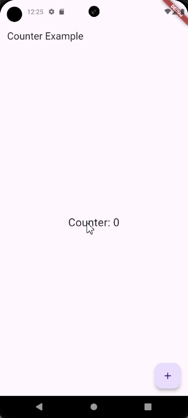
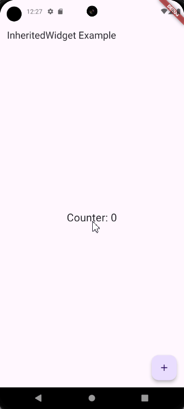

# State Management Dasar
State management adalah salah satu aspek paling penting dalam pengembangan aplikasi Flutter. Ada beberapa teknik untuk mengelola state di Flutter, mulai dari yang paling dasar seperti `setState`, hingga yang lebih kompleks seperti menggunakan `InheritedWidget` atau berbagai state management library. Di bagian ini, kita akan membahas cara mengelola state lokal dengan `setState` dan memahami cara kerja `InheritedWidget` yang sebelumnya sudah kita bahas pada materi widget dasar untuk berbagi state.

# setState
`setState` adalah cara paling dasar untuk mengelola state di Flutter. `setState` digunakan untuk memberi tahu framework bahwa state telah berubah dan UI perlu diperbarui. Biasanya digunakan dalam `StatefulWidget`.

```dart
import 'package:flutter/material.dart';

import 'package:flutter/material.dart';

void main() {
  runApp(const MyApp());
}

class MyApp extends StatelessWidget {
  const MyApp({super.key});

  @override
  Widget build(BuildContext context) {
    return const MaterialApp(
      home:  CounterScreen(),
    );
  }
}

class CounterScreen extends StatefulWidget {
  const CounterScreen({super.key});

  @override
  _CounterScreenState createState() => _CounterScreenState();
}

class _CounterScreenState extends State<CounterScreen> {
  int _counter = 0;

  void _incrementCounter() {
    setState(() {
      _counter++;
    });
  }

  @override
  Widget build(BuildContext context) {
    return Scaffold(
      appBar: AppBar(
        title: const Text('Counter Example'),
      ),
      body: Center(
        child: Text(
          'Counter: $_counter',
          style: const TextStyle(fontSize: 24),
        ),
      ),
      floatingActionButton: FloatingActionButton(
        onPressed: _incrementCounter,
        tooltip: 'Increment',
        child: const Icon(Icons.add),
      ),
    );
  }
}
```
<p align="center">

</p>


Dalam contoh di atas, ketika tombol `FloatingActionButton` ditekan, metode `_incrementCounter` dipanggil, yang kemudian memanggil setState untuk memperbarui nilai `_counter` dan memicu pembaruan UI.

# InheritedWidget
Seperti pada materi widget dasar `InheritedWidget` adalah salah satu cara untuk berbagi state antara widget di Flutter. `InheritedWidget` memungkinkan state untuk diakses oleh widget yang berada jauh di dalam hierarki widget tanpa perlu melewatkan state tersebut secara eksplisit melalui constructor.

```dart
import 'package:flutter/material.dart';

void main() {
  runApp(MyApp());
}

class MyApp extends StatelessWidget {
  @override
  Widget build(BuildContext context) {
    return MaterialApp(
      home: CounterManager(),
    );
  }
}

class CounterManager extends StatefulWidget {
  @override
  _CounterManagerState createState() => _CounterManagerState();
}

class _CounterManagerState extends State<CounterManager> {
  int _counter = 0;

  void _incrementCounter() {
    setState(() {
      _counter++;
    });
  }

  @override
  Widget build(BuildContext context) {
    return CounterProvider(
      counter: _counter,
      incrementCounter: _incrementCounter,
      child: CounterScreen(),
    );
  }
}

class CounterProvider extends InheritedWidget {
  final int counter;
  final VoidCallback incrementCounter;
  final Widget child;

  CounterProvider({
    Key? key,
    required this.counter,
    required this.incrementCounter,
    required this.child,
  }) : super(key: key, child: child);

  @override
  bool updateShouldNotify(CounterProvider oldWidget) {
    return oldWidget.counter != counter;
  }

  static CounterProvider? of(BuildContext context) {
    return context.dependOnInheritedWidgetOfExactType<CounterProvider>();
  }
}

class CounterScreen extends StatelessWidget {
  @override
  Widget build(BuildContext context) {
    final counterProvider = CounterProvider.of(context);

    return Scaffold(
      appBar: AppBar(
        title: Text('InheritedWidget Example'),
      ),
      body: Center(
        child: Text(
          'Counter: ${counterProvider?.counter ?? 0}',
          style: TextStyle(fontSize: 24),
        ),
      ),
      floatingActionButton: FloatingActionButton(
        onPressed: counterProvider?.incrementCounter,
        tooltip: 'Increment',
        child: Icon(Icons.add),
      ),
    );
  }
}
```
<p align="center">

</p>

Dalam contoh di atas, `CounterProvider` adalah `InheritedWidget` yang menyediakan nilai counter dan metode `incrementCounter` kepada widget dalam sub-tree-nya. `CounterScreen` mengakses nilai counter dan metode incrementCounter menggunakan `CounterProvider.of(context)`. Pembaruan state dilakukan di `CounterManager`, dan `CounterProvider` memperbarui widget di sub-tree-nya ketika nilai counter berubah.

Dengan memahami `setState` dan `InheritedWidget`, Anda memiliki dasar yang kuat untuk mengelola state dalam aplikasi Flutter.

Jika kalian ingin tahu lebih lanjut tentang materi diatas kalian bisa check langsung dokumentasi [State Management](https://docs.flutter.dev/data-and-backend/state-mgmt/options).
