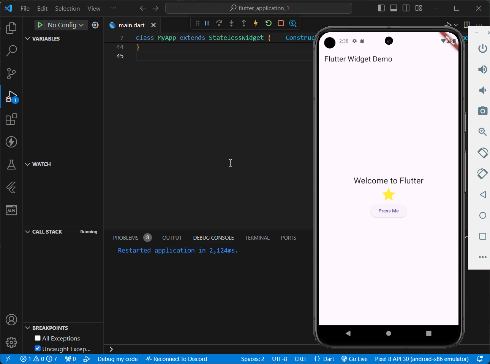

# Soal 
Buatlah aplikasi Flutter sederhana yang menampilkan antarmuka pengguna dengan layout berikut:

1. AppBar di bagian atas dengan judul "Flutter Widget Demo".

2. Body yang terdiri dari sebuah Column yang di tengah layar.

3. Di dalam Column tersebut, terdapat tiga widget anak:
    - Sebuah Text yang menampilkan "Welcome to Flutter".
    - Sebuah Icon dengan ikon bintang (star), warna kuning, dan ukuran 48 piksel.

    - Sebuah ElevatedButton dengan teks "Press Me", yang ketika ditekan akan menampilkan sebuah pesan di console menggunakan fungsi `print`.

Buatlah kode Flutter yang mengimplementasikan deskripsi di atas.

