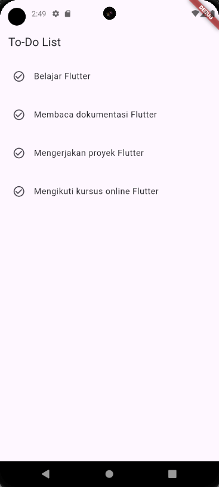

# Soal:

Anda diminta untuk membuat aplikasi Flutter yang menampilkan halaman daftar tugas (to-do list) menggunakan `ListView.builder`. Setiap item dalam daftar tugas harus menampilkan ikon centang dan teks deskripsi tugas. Selain itu, tambahkan padding di sekitar setiap item daftar tugas agar tidak saling berhimpitan.

Berikut adalah beberapa tugas yang harus ditampilkan dalam daftar:

1. Belajar Flutter
2. Membaca dokumentasi Flutter
3. Mengerjakan proyek Flutter
4. Mengikuti kursus online Flutter

Tuliskan kode lengkap untuk aplikasi Flutter ini.

