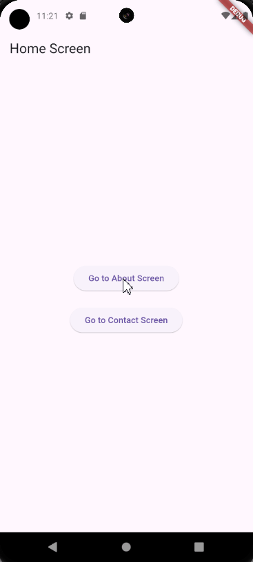

# Soal
Anda diminta untuk membuat aplikasi Flutter dengan tiga layar: `HomeScreen`, `AboutScreen`, dan `ContactScreen`. Gunakan Named Routes untuk mengelola navigasi antara layar-layar ini. Tambahkan tombol di `HomeScreen` untuk berpindah ke `AboutScreen` dan `ContactScreen`. Di setiap layar (`AboutScreen` dan `ContactScreen`), tambahkan tombol untuk kembali ke `HomeScreen`.

Tuliskan kode lengkap untuk aplikasi Flutter ini.

