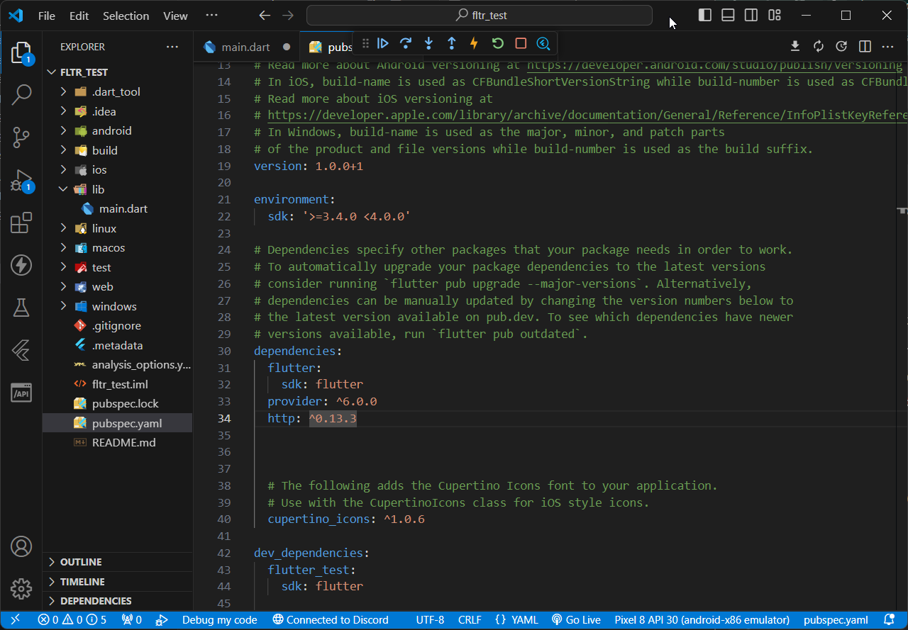
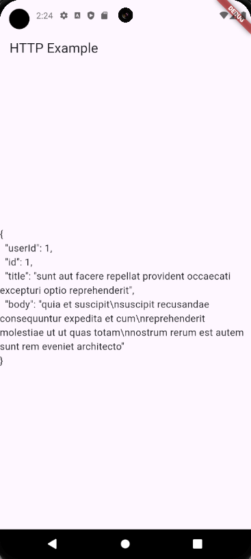
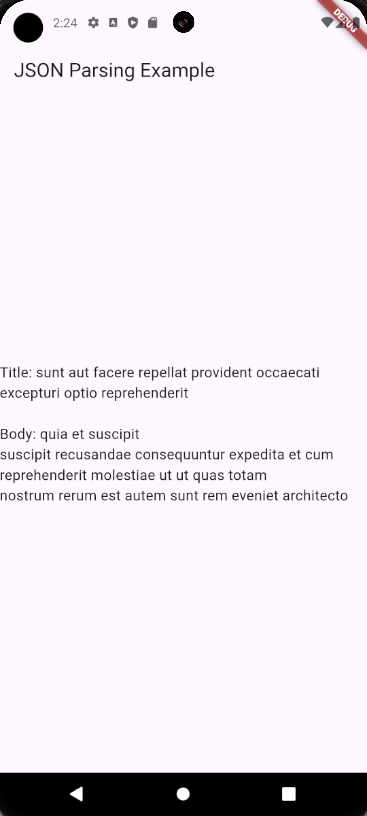

| Author                                        | Editor |
| --------------------------------------------- | ------ |
| [SulaimanLmn](https://github.com/SulaimanLmn) | Ifarra |

# Networking

- [Networking](#networking)
  - [HTTP](#http)
    - [Apa itu http?](#apa-itu-http)
  - [Request dan Response](#request-dan-response)
    - [Request](#request)
    - [Response](#response)
    - [Menggunakan package HTTP](#menggunakan-package-http)
    - [Membuat Permintaan HTTP](#membuat-permintaan-http)
  - [JSON Parsing](#json-parsing)
    - [Mengapa Menggunakan Map untuk Menyimpan Data JSON di Flutter?](#mengapa-menggunakan-map-untuk-menyimpan-data-json-di-flutter)
    - [Mengonversi JSON menjadi Objek Dart](#mengonversi-json-menjadi-objek-dart)

Dalam pengembangan aplikasi, sering kali kita perlu berkomunikasi dengan server atau API eksternal untuk mendapatkan atau mengirim data. Di Flutter, kita bisa menggunakan paket `http` untuk membuat permintaan HTTP dan mengonversi data JSON menjadi objek Dart.

## HTTP

### Apa itu http?

Paket http merupakan bagian integral dari Flutter yang memungkinkan kita berkomunikasi dengan server atau API eksternal. Dengan menggunakan metode yang disediakan oleh paket ini, aplikasi Flutter dapat membuat permintaan ke server dan mendapatkan responsnya.

## Request dan Response

### Request

Permintaan (request) adalah pesan yang dikirim oleh klien (aplikasi Flutter) ke server dengan tujuan untuk meminta data atau melakukan tindakan tertentu. Permintaan ini dapat berisi informasi seperti metode HTTP (GET, POST, dll.), header, body, dan parameter.

### Response

Respon (response) adalah pesan yang dikirim oleh server sebagai tanggapan atas permintaan yang diterima. Respon ini berisi informasi seperti status kode (200 OK, 404 Not Found, dll.), header, body, dan data yang diminta.

<p align="center">

</p>

Gambar di atas adalah visualisasi sederhana dari proses HTTP request dan response. Ketika aplikasi Flutter membuat permintaan (request) ke server, server akan memproses permintaan tersebut dan mengirimkan respons (response) kembali ke aplikasi. Respons ini kemudian dapat digunakan oleh aplikasi untuk menampilkan data atau melakukan tindakan tertentu.

### Menggunakan package HTTP

Pertama, tambahkan package http ke `pubspec.yaml`:

```yaml
dependencies:
  flutter:
    sdk: flutter
  http: ^0.13.3
```

<p align="center">

</p>

setelah itu tekan `CTRL` + `S` untuk save sekaligus mengunduh depedensi.

### Membuat Permintaan HTTP

Untuk membuat permintaan HTTP, kita bisa menggunakan metode `get`, `post`, `put`, `delete`, dll. dari paket `http`. Berikut adalah contoh sederhana bagaimana membuat permintaan `GET`:

```dart
import 'package:flutter/material.dart';
import 'package:http/http.dart' as http;
import 'dart:convert';

void main() {
  runApp(MyApp());
}

class MyApp extends StatelessWidget {
  @override
  Widget build(BuildContext context) {
    return MaterialApp(
      home: HttpExample(),
    );
  }
}

class HttpExample extends StatefulWidget {
  @override
  _HttpExampleState createState() => _HttpExampleState();
}

class _HttpExampleState extends State<HttpExample> {
  String _data = "Loading...";

  @override
  void initState() {
    super.initState();
    fetchData();
  }

  Future<void> fetchData() async {
    final response = await http.get(Uri.parse('https://jsonplaceholder.typicode.com/posts/1'));
    if (response.statusCode == 200) {
      setState(() {
        _data = response.body;
      });
    } else {
      setState(() {
        _data = "Failed to load data";
      });
    }
  }

  @override
  Widget build(BuildContext context) {
    return Scaffold(
      appBar: AppBar(
        title: Text('HTTP Example'),
      ),
      body: Center(
        child: Text(
          _data,
          style: TextStyle(fontSize: 16),
        ),
      ),
    );
  }
}
```

<p align="center">

</p>

Kita menggunakan`http.get` untuk membuat permintaan `GET` ke `https://jsonplaceholder.typicode.com/posts/1.`

Jika permintaan berhasil (`statusCode` 200), data dari respons disimpan di `_data` dan ditampilkan di UI.

## JSON Parsing

JSON (JavaScript Object Notation) adalah format pertukaran data yang sering digunakan dalam pengembangan perangkat lunak. JSON memiliki struktur yang mirip dengan objek JavaScript dan sangat umum digunakan dalam API web untuk mengirim dan menerima data.

Di Flutter, kita menggunakan Map untuk menyimpan data JSON karena struktur data JSON bisa langsung diinterpretasikan sebagai Map di Dart. Map adalah struktur data yang terdiri dari kunci dan nilai, mirip dengan objek di JavaScript. Ini membuat pengonversian data JSON menjadi objek Dart menjadi lebih mudah, karena kita bisa langsung mengakses nilai dengan menggunakan kunci yang sesuai.

### Mengapa Menggunakan Map untuk Menyimpan Data JSON di Flutter?

Penggunaan Map untuk menyimpan data JSON memudahkan pengolahan data di Flutter karena struktur datanya sudah dikenali dan dapat diakses dengan mudah. Ini adalah salah satu keunggulan Flutter dalam melakukan parsing JSON dan berinteraksi dengan API eksternal.

### Mengonversi JSON menjadi Objek Dart

Setelah mendapatkan data JSON dari permintaan HTTP, kita perlu mengonversinya menjadi objek Dart yang bisa digunakan dalam aplikasi. Berikut adalah contoh bagaimana melakukan parsing `JSON`:

```dart
import 'package:flutter/material.dart';
import 'package:http/http.dart' as http;
import 'dart:convert';

void main() {
  runApp(MyApp());
}

class MyApp extends StatelessWidget {
  @override
  Widget build(BuildContext context) {
    return MaterialApp(
      home: JsonParsingExample(),
    );
  }
}

class Post {
  final int userId;
  final int id;
  final String title;
  final String body;

  Post({required this.userId, required this.id, required this.title, required this.body});

  factory Post.fromJson(Map<String, dynamic> json) {
    return Post(
      userId: json['userId'],
      id: json['id'],
      title: json['title'],
      body: json['body'],
    );
  }
}

class JsonParsingExample extends StatefulWidget {
  @override
  _JsonParsingExampleState createState() => _JsonParsingExampleState();
}

class _JsonParsingExampleState extends State<JsonParsingExample> {
  late Future<Post> _post;

  @override
  void initState() {
    super.initState();
    _post = fetchPost();
  }

  Future<Post> fetchPost() async {
    final response = await http.get(Uri.parse('https://jsonplaceholder.typicode.com/posts/1'));

    if (response.statusCode == 200) {
      return Post.fromJson(jsonDecode(response.body));
    } else {
      throw Exception('Failed to load post');
    }
  }

  @override
  Widget build(BuildContext context) {
    return Scaffold(
      appBar: AppBar(
        title: Text('JSON Parsing Example'),
      ),
      body: Center(
        child: FutureBuilder<Post>(
          future: _post,
          builder: (context, snapshot) {
            if (snapshot.connectionState == ConnectionState.waiting) {
              return CircularProgressIndicator();
            } else if (snapshot.hasError) {
              return Text('${snapshot.error}');
            } else if (snapshot.hasData) {
              return Text(
                'Title: ${snapshot.data!.title}\n\nBody: ${snapshot.data!.body}',
                style: TextStyle(fontSize: 16),
              );
            } else {
              return Text('No data');
            }
          },
        ),
      ),
    );
  }
}
```

<p align="center">

</p>

Membuat kelas `Post` yang merepresentasikan data JSON. Membuat metode`Post.fromJson`untuk mengonversi data JSON menjadi objek `Post`. Menggunakan `FutureBuilder` untuk menunggu hasil dari `fetchPost` dan menampilkan data di UI setelah data berhasil diambil dan diparsing.

Dengan mempelajari cara melakukan permintaan HTTP dan parsing JSON di Flutter, kita sudah memahami dasar-dasar komunikasi dengan API eksternal dan pengolahan data yang diterima. Ini adalah keterampilan penting untuk mengembangkan aplikasi yang dinamis dan interaktif. Untuk informasi lebih lanjut, Anda bisa memeriksa dokumentasi resmi paket http.

Jika kalian ingin tahu lebih lanjut tentang materi diatas kalian bisa check langsung dokumentasi [http](https://pub.dev/packages/http).