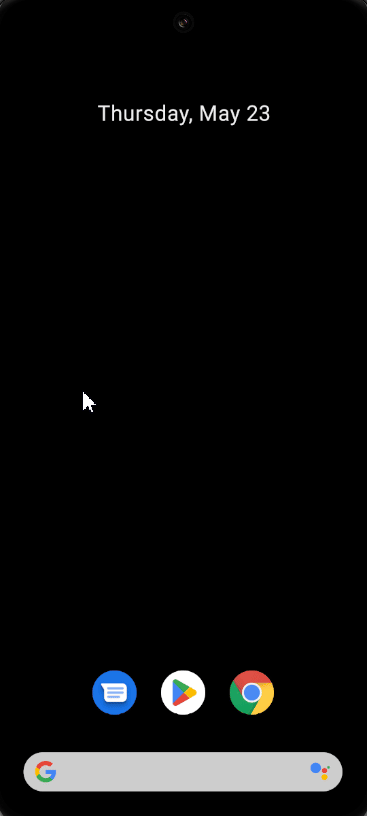

# Soal:

Buatlah pengujian integrasi untuk aplikasi Flutter yang memiliki dua halaman. Halaman pertama (`HomePage`) memiliki sebuah `TextField` dan sebuah `ElevatedButton` yang membawa teks dari `TextField` tersebut ke halaman kedua (`SecondPage`). Halaman kedua akan menampilkan teks yang dikirim dari `HomePage`. Tulis pengujian integrasi untuk memastikan bahwa teks yang dimasukkan di `HomePage` ditampilkan dengan benar di `SecondPage`.

