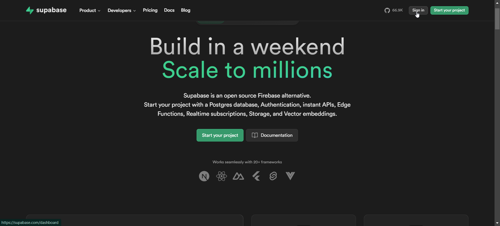
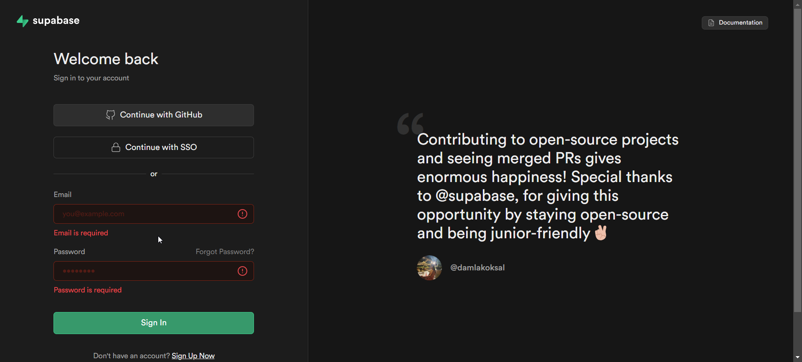
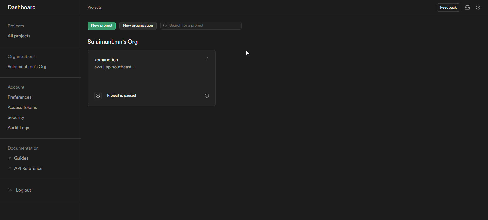
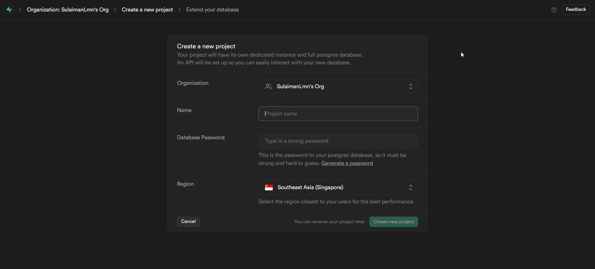
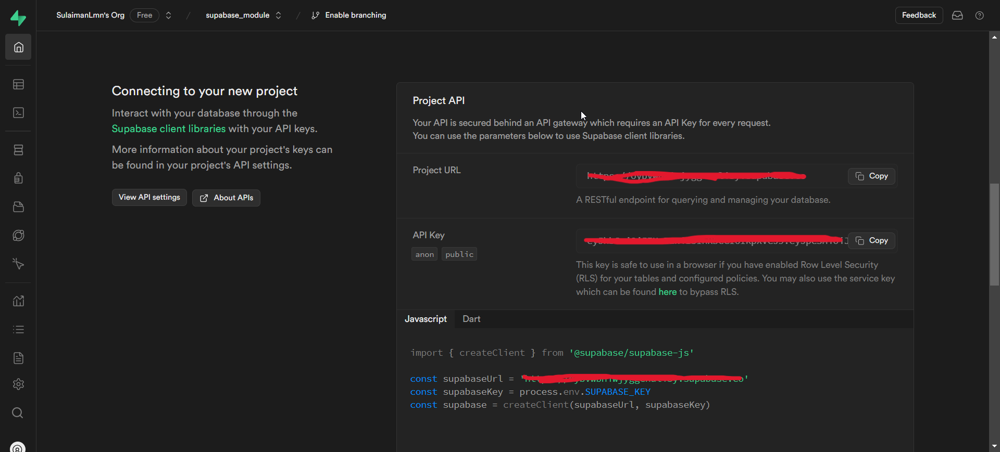
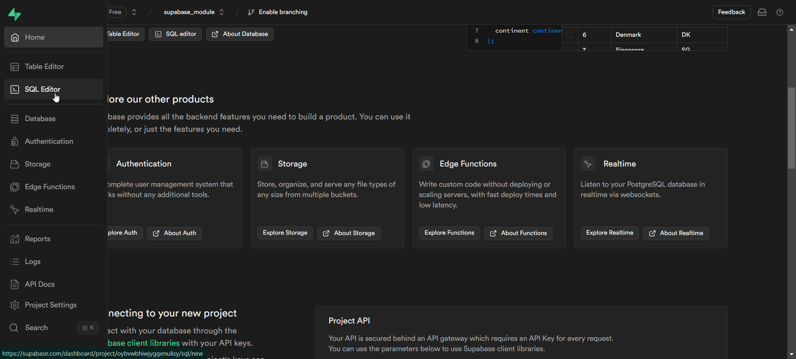
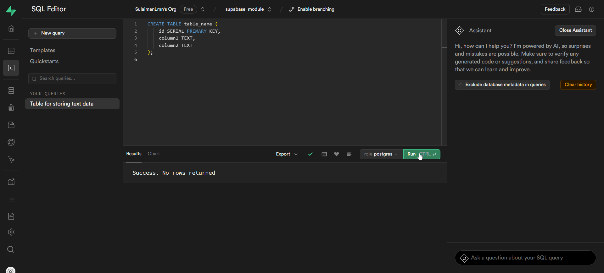
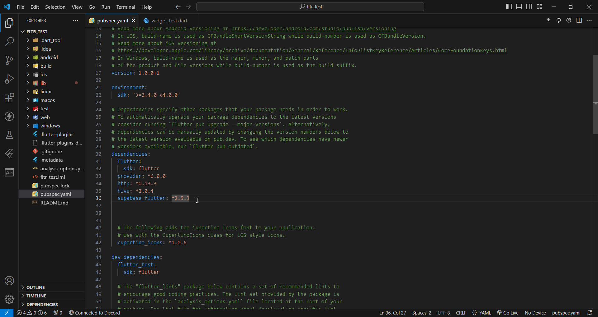
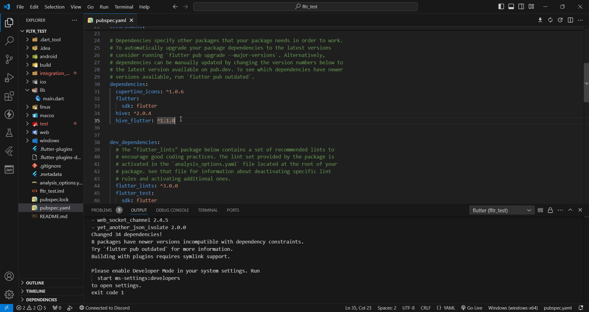

| Author                                        | Editor |
| --------------------------------------------- | ------ |
| [SulaimanLmn](https://github.com/SulaimanLmn) | Ifarra |

# Database dan Penyimpanan

- [Database dan Penyimpanan](#database-dan-penyimpanan)
  - [Pengertian Database](#pengertian-database)
  - [Perbedaan Database Lokal dengan Database Remote](#perbedaan-database-lokal-dengan-database-remote)
    - [Database Lokal](#database-lokal)
    - [Database Remote](#database-remote)
  - [CRUD](#crud)
  - [Supabase](#supabase)
    - [Setup Database dan Tabel di Supabase](#setup-database-dan-tabel-di-supabase)
    - [Buat Tabel di Supabase](#buat-tabel-di-supabase)
    - [Menambahkan Dependensi Supabase](#menambahkan-dependensi-supabase)
    - [CRUD dengan Supabase](#crud-dengan-supabase)
  - [Hive](#hive)
    - [Menambahkan Dependensi Hive](#menambahkan-dependensi-hive)
    - [CRUD dengan Hive](#crud-dengan-hive)

## Pengertian Database

Database adalah kumpulan data yang terorganisir dengan baik dan disimpan secara elektronik di dalam sebuah sistem komputer. Database memungkinkan pengguna untuk menyimpan, mengelola, dan mengambil data dengan cara yang efisien.

## Perbedaan Database Lokal dengan Database Remote

### Database Lokal

Database yang disimpan di perangkat lokal pengguna, misalnya di dalam memori atau penyimpanan internal perangkat. Contoh: SQLite, Hive.

### Database Remote

Database yang disimpan di server dan diakses melalui internet. Contoh: MySQL, PostgreSQL, Supabase.

## CRUD

CRUD adalah singkatan dari `Create`, `Read`, `Update`, dan `Delete`, yang merupakan operasi dasar untuk mengelola data di dalam database. Berikut penjelasannya:

- **Create:** Menambahkan data baru ke database.
- **Read:** Membaca atau mengambil data dari database.
- **Update:** Memperbarui data yang sudah ada di database.
- **Delete:** Menghapus data dari database.

## Supabase

Supabase adalah platform backend sebagai layanan yang menyediakan berbagai fitur seperti autentikasi, penyimpanan, dan database yang menggunakan PostgreSQL sebagai basisnya. Supabase memungkinkan pengembang untuk mengatur dan mengelola database dengan mudah tanpa harus mengurus infrastruktur server.

### Setup Database dan Tabel di Supabase

Sebelum menggunakan kode CRUD dengan Supabase, Anda perlu melakukan setup database dan membuat tabel di Supabase. Berikut langkah-langkahnya:

Buka halaman supabase.io dan klik tombol "Login" di bagian kanan atas.

<p align="center">

</p>

Masukkan alamat email dan kata sandi Anda untuk login atau buat akun baru jika belum memiliki akun.

<p align="center">

</p>

Setelah login, Anda akan diarahkan ke dashboard Supabase Anda.

Klik tombol "New Project" untuk membuat proyek baru.

<p align="center">

</p>

Beri nama proyek Anda dan pilih lokasi wilayah server yang tersedia.

<p align="center">

</p>

Setelah proyek dibuat, Anda akan diberikan URL proyek dan kunci akses publik. Simpan informasi ini dengan aman karena akan digunakan dalam kode Anda.

<p align="center">

</p>

### Buat Tabel di Supabase

Di dashboard Supabase, pilih proyek yang telah Anda buat.Pilih "SQL Editor" dari menu di sebelah kiri.

<p align="center">

</p>

Di SQL Editor, jalankan perintah SQL untuk membuat tabel.

```sql
CREATE TABLE table_name (
    id SERIAL PRIMARY KEY,
    column1 TEXT,
    column2 TEXT
);
```

<p align="center">

</p>

Pastikan untuk mengganti `table_name`, `column1`, dan `column2` sesuai dengan kebutuhan aplikasi Anda.

### Menambahkan Dependensi Supabase

Tambahkan `supabase_flutter` ke dalam `pubspec.yaml`

```yaml
dependencies:
  flutter:
    sdk: flutter
  supabase_flutter: ^2.5.3
```

<p align="center">

</p>

lalu tekan `CRTL` + `S` untuk save sekaligus update depedencies yang ada di `pubspec.yaml`.

### CRUD dengan Supabase

```dart
import 'package:supabase_flutter/supabase_flutter.dart';

final client = SupabaseClient('(ganti menjadi nama url project-mu)',
    '(ganti menjadi public anon key-mu)');

// Create
Future<void> createData() async {
  try {
    final response = await client
        .from('table_name')
        .insert({'column1': 'value1', 'column2': 'value2'});

    print('Data created: ${response}');
  } catch (e) {
    print('Error: ${e}');
  }
}

// Read
Future<void> readData() async {
  try {
    final response = await client.from('table_name').select();

    print('Data read: ${response}');
  } catch (e) {
    print('Error: ${e}');
  }
}

// Update
Future<void> updateData() async {
  try {
    final response = await client
        .from('table_name')
        .update({'column1': 'new_value'}).eq('id', 1);

    print('Data updated: ${response}');
  } catch (e) {
    print('Error: ${e}');
  }
}

// Delete
Future<void> deleteData() async {
  try {
    final response = await client.from('table_name').delete().eq('id', 1);

    print('Data deleted: ${response}');
  } catch (e) {
    print('Error: ${e}');
  }
}
```

## Hive

Hive adalah database NoSQL lokal yang ringan dan cepat untuk Flutter. Hive dirancang untuk menyimpan data dalam bentuk key-value dan cocok digunakan untuk aplikasi mobile karena performanya yang cepat dan mudah digunakan.

### Menambahkan Dependensi Hive

Tambahkan `hive` dan `hive_flutter` ke dalam `pubspec.yaml`

```yaml
dependencies:
  flutter:
    sdk: flutter
  hive: ^2.0.0
  hive_flutter: ^1.0.0
```

<p align="center">

</p>

lalu tekan `CRTL + S` untuk save sekaligus update depedencies yang ada di `pubspec.yaml`.

### CRUD dengan Hive

 ```dart
import 'package:hive/hive.dart';
import 'package:hive_flutter/adapters.dart';

// Initialize Hive
void main() async {
  await Hive.initFlutter();
  var box = await Hive.openBox('myBox');

  // Create
  box.put('key', 'value');
  print('Data created: ${box.get('key')}');

  // Read
  var value = box.get('key');
  print('Data read: $value');

  // Update
  box.put('key', 'new_value');
  print('Data updated: ${box.get('key')}');

  // Delete
  box.delete('key');
  print('Data deleted: ${box.get('key')}'); // should print null
}
```

Pada materi ini, kita telah mempelajari tentang pengertian database, CRUD, perbedaan antara database lokal dan database biasa, serta pengenalan dan contoh implementasi CRUD dengan Supabase dan Hive di Flutter. Dengan memahami konsep-konsep ini, Anda bisa mulai mengelola data dalam aplikasi Flutter dengan baik menggunakan kedua jenis database ini.

Jika kalian ingin tahu lebih lanjut tentang materi diatas kalian bisa check langsung dokumentasi [Supabase](https://supabase.com/docs) dan [Hive](https://pub.dev/documentation/hive/latest/).
