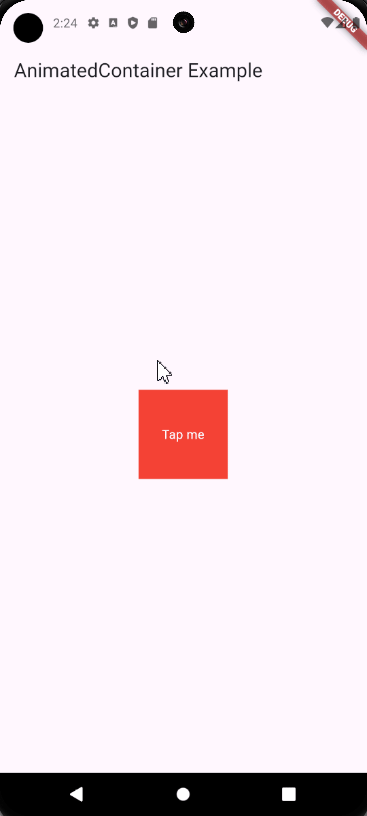
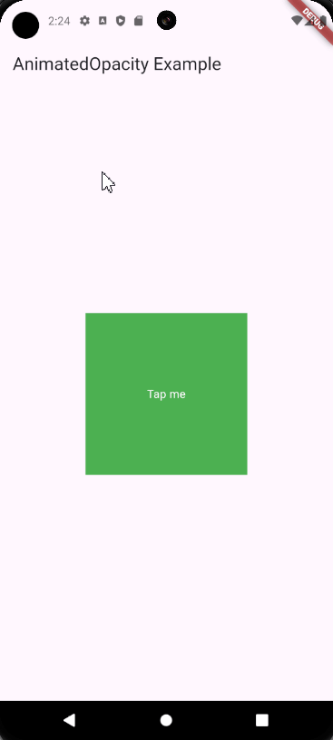

| Author                                        | Editor |
| --------------------------------------------- | ------ |
| [SulaimanLmn](https://github.com/SulaimanLmn) | Ifarra |

# Animasi

Animasi adalah salah satu aspek penting dalam pengembangan aplikasi mobile yang memberikan pengalaman pengguna yang halus dan interaktif. Flutter menyediakan beberapa cara untuk membuat animasi, mulai dari animasi dasar hingga animasi yang dikendalikan oleh controller. Dalam panduan ini, kita akan membahas dua jenis animasi utama di Flutter:

## Animasi Dasar

### AnimatedContainer

`AnimatedContainer` memungkinkan Anda membuat animasi dengan mudah dengan mengubah properti kontainer seperti ukuran, warna, dan margin.

```dart
import 'package:flutter/material.dart';

void main() => runApp(MyApp());

class MyApp extends StatelessWidget {
  @override
  Widget build(BuildContext context) {
    return MaterialApp(
      home: Scaffold(
        appBar: AppBar(title: Text('AnimatedContainer Example')),
        body: Center(child: AnimatedContainerExample()),
      ),
    );
  }
}

class AnimatedContainerExample extends StatefulWidget {
  @override
  _AnimatedContainerExampleState createState() => _AnimatedContainerExampleState();
}

class _AnimatedContainerExampleState extends State<AnimatedContainerExample> {
  bool _isExpanded = false;

  @override
  Widget build(BuildContext context) {
    return GestureDetector(
      onTap: () {
        setState(() {
          _isExpanded = !_isExpanded;
        });
      },
      child: AnimatedContainer(
        duration: Duration(seconds: 1),
        width: _isExpanded ? 200 : 100,
        height: _isExpanded ? 200 : 100,
        color: _isExpanded ? Colors.blue : Colors.red,
        alignment: Alignment.center,
        child: Text('Tap me', style: TextStyle(color: Colors.white)),
      ),
    );
  }
}
```

<p align="center">

</p>

Pada contoh di atas, ketika `_isExpanded` berubah, Flutter akan menganimasi perubahan properti `width`, `height`, dan `color` dari `AnimatedContainer`.

### AnimatedOpacity

`AnimatedOpacity` digunakan untuk mengubah tingkat opacity dari sebuah widget secara animasi.

```dart
import 'package:flutter/material.dart';

void main() => runApp(MyApp());

class MyApp extends StatelessWidget {
  @override
  Widget build(BuildContext context) {
    return MaterialApp(
      home: Scaffold(
        appBar: AppBar(title: Text('AnimatedOpacity Example')),
        body: Center(child: AnimatedOpacityExample()),
      ),
    );
  }
}

class AnimatedOpacityExample extends StatefulWidget {
  @override
  _AnimatedOpacityExampleState createState() => _AnimatedOpacityExampleState();
}

class _AnimatedOpacityExampleState extends State<AnimatedOpacityExample> {
  bool _visible = true;

  @override
  Widget build(BuildContext context) {
    return GestureDetector(
      onTap: () {
        setState(() {
          _visible = !_visible;
        });
      },
      child: AnimatedOpacity(
        opacity: _visible ? 1.0 : 0.0,
        duration: Duration(seconds: 1),
        child: Container(
          width: 200,
          height: 200,
          color: Colors.green,
          alignment: Alignment.center,
          child: Text('Tap me', style: TextStyle(color: Colors.white)),
        ),
      ),
    );
  }
}
```

<p align="center">

</p>

Pada contoh di atas, ketika `_visible` berubah, opacity dari `AnimatedOpacity` akan diubah dari 1.0 (sepenuhnya terlihat) menjadi 0.0 (sepenuhnya tidak terlihat) atau sebaliknya dalam 1 detik.

## Animasi Berbasis Controller

### AnimationController dan Tween

`AnimationController` dan `Tween` digunakan untuk membuat animasi yang lebih kompleks dan terperinci. `AnimationController` mengontrol durasi dan status animasi, sedangkan `Tween` mendefinisikan nilai awal dan akhir dari animasi.

```dart
import 'package:flutter/material.dart';

void main() => runApp(MyApp());

class MyApp extends StatelessWidget {
  @override
  Widget build(BuildContext context) {
    return MaterialApp(
      home: Scaffold(
        appBar: AppBar(title: Text('Controller-based Animation Example')),
        body: Center(child: ControllerBasedAnimationExample()),
      ),
    );
  }
}

class ControllerBasedAnimationExample extends StatefulWidget {
  @override
  _ControllerBasedAnimationExampleState createState() => _ControllerBasedAnimationExampleState();
}

class _ControllerBasedAnimationExampleState extends State<ControllerBasedAnimationExample> with SingleTickerProviderStateMixin {
  late AnimationController _controller;
  late Animation<double> _animation;

  @override
  void initState() {
    super.initState();
    _controller = AnimationController(
      duration: const Duration(seconds: 2),
      vsync: this,
    );
    _animation = Tween<double>(begin: 0, end: 300).animate(_controller)
      ..addListener(() {
        setState(() {});
      });
    _controller.forward();
  }

  @override
  void dispose() {
    _controller.dispose();
    super.dispose();
  }

  @override
  Widget build(BuildContext context) {
    return Container(
      width: _animation.value,
      height: _animation.value,
      color: Colors.blue,
    );
  }
}
```

<p align="center">

</p>

Pada contoh di atas, sebuah `AnimationController` dibuat dengan durasi 2 detik. `Tween` mendefinisikan bahwa nilai animasi akan berubah dari 0 ke 300. `addListener` digunakan untuk mendengarkan perubahan nilai animasi dan memperbarui UI dengan `setState`.

Animasi di Flutter dapat dibuat dengan mudah menggunakan widget seperti `AnimatedContainer` dan `AnimatedOpacity` untuk kebutuhan dasar, atau dengan `AnimationController` dan `Tween` untuk animasi yang lebih kompleks. Dengan memahami dasar-dasar ini, Anda dapat mulai membuat aplikasi yang interaktif dan menarik secara visual.

Jika kalian ingin tahu lebih lanjut tentang materi diatas kalian bisa check langsung dokumentasi [Animasi](https://docs.flutter.dev/ui/animations).