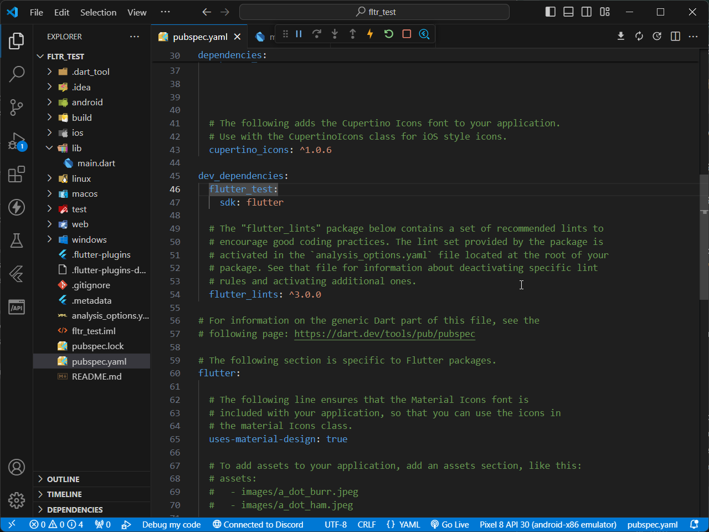
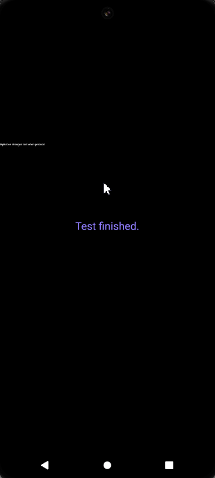
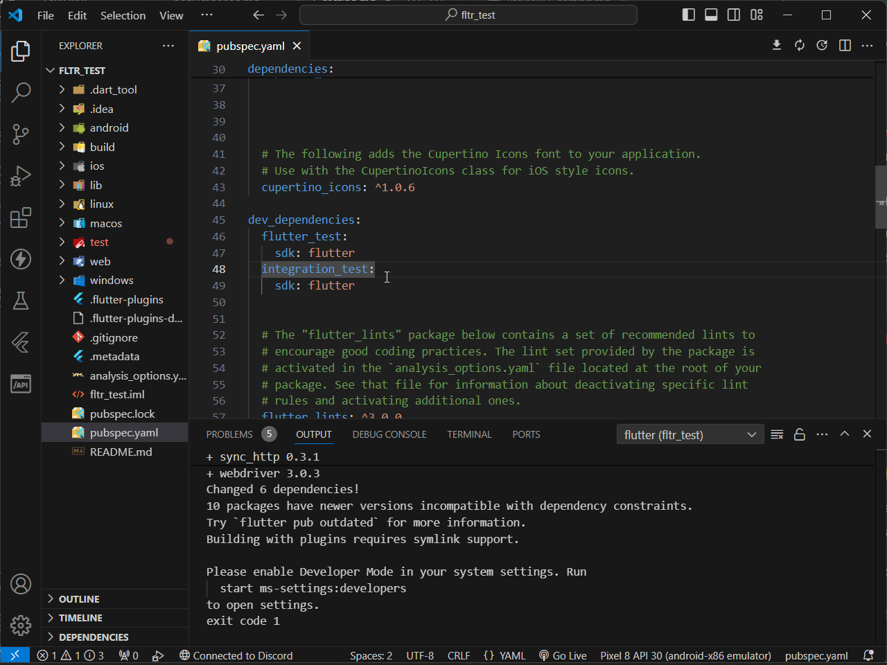
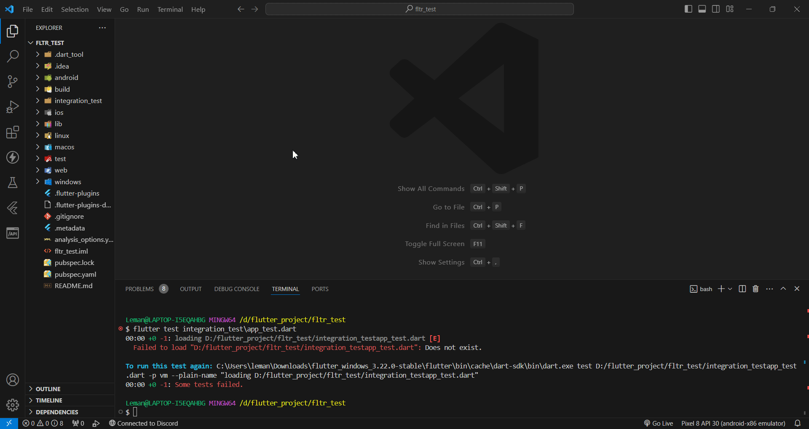
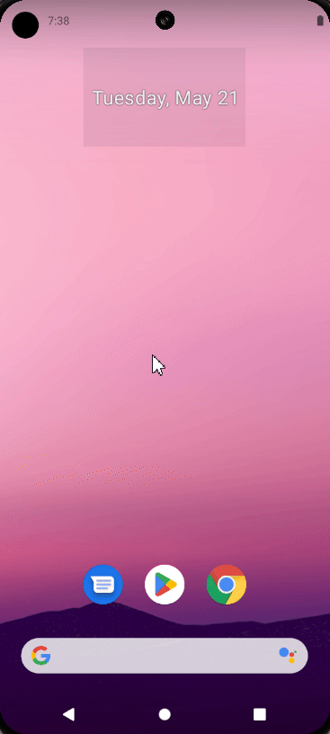

| Author                                        | Editor |
| --------------------------------------------- | ------ |
| [SulaimanLmn](https://github.com/SulaimanLmn) | Ifarra |

# Automation Testing

- [Automation Testing](#automation-testing)
  - [Widget Testing](#widget-testing)
    - [Menambahkan Dependency `flutter_test`](#menambahkan-dependency-flutter_test)
    - [Contoh Pengujian Widget](#contoh-pengujian-widget)
  - [Integration Testing](#integration-testing)
    - [Menambahkan Dependency `integration_test`](#menambahkan-dependency-integration_test)
    - [Contoh Pengujian Integrasi](#contoh-pengujian-integrasi)
    - [Menjalankan Pengujian Integrasi](#menjalankan-pengujian-integrasi)

Pengujian atau testing adalah aspek penting dalam pengembangan aplikasi untuk memastikan bahwa kode yang ditulis bekerja sesuai dengan yang diharapkan. Flutter menyediakan berbagai alat dan teknik untuk pengujian aplikasi, termasuk pengujian widget dan pengujian integrasi. Dalam panduan ini, kita akan membahas dua jenis pengujian utama di Flutter:

## Widget Testing

Pengujian widget fokus pada pengujian widget individu untuk memastikan bahwa mereka berperilaku dan ditampilkan dengan benar. Flutter menyediakan paket `flutter_test` yang berisi berbagai utilitas untuk menulis dan menjalankan pengujian widget.

### Menambahkan Dependency `flutter_test`

Tambahkan `flutter_test` ke dalam `pubspec.yaml`

```yaml
dev_dependencies:
  flutter_test:
    sdk: flutter
```

<p align="center">

</p>

lalu tekan `CRTL` + `S` untuk save sekaligus update depedencies yang ada di `pubspec.yaml`.

### Contoh Pengujian Widget

- Buatlah file baru dengan nama `my_button.dart` di lib lalu masukan kode di bawah ini :

```dart
import 'package:flutter/material.dart';

class MyButton extends StatefulWidget {
  @override
  _MyButtonState createState() => _MyButtonState();
}

class _MyButtonState extends State<MyButton> {
  String _buttonText = "Press me";

  void _updateText() {
    setState(() {
      _buttonText = "You pressed me!";
    });
  }

  @override
  Widget build(BuildContext context) {
    return ElevatedButton(
      onPressed: _updateText,
      child: Text(_buttonText),
    );
  }
}
```

Setelah itu pada file `main.dart` masukan kode dibawah ini, lalu jalankan.

```dart
import 'package:flutter_test/flutter_test.dart';
import 'package:flutter/material.dart';
import 'package:my_app/my_button.dart'; // Ganti dengan path yang sesuai

void main() {
  testWidgets('MyButton changes text when pressed',
      (WidgetTester tester) async {
    await tester.pumpWidget(MaterialApp(home: MyButton()));

    expect(find.text('Press me'), findsOneWidget);
    expect(find.text('You pressed me!'), findsNothing);

    await tester.tap(find.byType(ElevatedButton));
    await tester.pump();

    expect(find.text('Press me'), findsNothing);
    expect(find.text('You pressed me!'), findsOneWidget);
  });
}
```

<p align="center">

</p>

Tes ini memeriksa apakah teks pada tombol berubah dari "Press me" menjadi "You pressed me!" ketika tombol ditekan.

- **testWidgets**: Fungsi ini digunakan untuk mendefinisikan sebuah pengujian widget.
- **WidgetTester**: Kelas ini menyediakan metode untuk berinteraksi dengan widget dalam pengujian.
- **pumpWidget**: Metode ini digunakan untuk menampilkan widget dalam tes.
- **find**: Kelas ini menyediakan berbagai metode untuk menemukan widget dalam pohon widget.
- **expect**: Fungsi ini digunakan untuk memverifikasi bahwa suatu kondisi terpenuhi.

## Integration Testing

Pengujian integrasi (integration testing) memeriksa alur kerja aplikasi secara keseluruhan untuk memastikan bahwa semua bagian aplikasi bekerja bersama dengan benar. Flutter menyediakan paket `integration_test` untuk menulis dan menjalankan pengujian integrasi.

### Menambahkan Dependency `integration_test`

Tambahkan `integration_test` ke dalam `pubspec.yaml`

```yaml
dev_dependencies:
  flutter_test:
    sdk: flutter
  integration_test:
    sdk: flutter
```

<p align="center">

</p>

lalu tekan `CRTL` + `S` untuk save sekaligus update depedencies yang ada di `pubspec.yaml`.

### Contoh Pengujian Integrasi

Masukan kode ini ke dalam `main.dart`

```dart
import 'package:flutter/material.dart';

void main() {
  runApp(MyApp());
}

class MyApp extends StatelessWidget {
  @override
  Widget build(BuildContext context) {
    return MaterialApp(
      home: HomePage(),
    );
  }
}

class HomePage extends StatelessWidget {
  @override
  Widget build(BuildContext context) {
    return Scaffold(
      appBar: AppBar(title: Text('Home')),
      body: Center(
        child: ElevatedButton(
          onPressed: () {
            Navigator.push(
              context,
              MaterialPageRoute(builder: (context) => SecondPage()),
            );
          },
          child: Text('Go to Second Page'),
        ),
      ),
    );
  }
}

class SecondPage extends StatelessWidget {
  @override
  Widget build(BuildContext context) {
    return Scaffold(
      appBar: AppBar(title: Text('Second Page')),
      body: Center(
        child: Text('Welcome to Second Page'),
      ),
    );
  }
}
```

<p align="center">

</p>

Lalu buat file bernama `app_test.dart` di dalam direktori `integration_test`:

```dart
import 'package:flutter_test/flutter_test.dart';
import 'package:integration_test/integration_test.dart';
import 'package:my_app/main.dart'; // Ganti dengan path yang sesuai

void main() {
  IntegrationTestWidgetsFlutterBinding.ensureInitialized();

  testWidgets('Navigates to second page', (WidgetTester tester) async {
    await tester.pumpWidget(MyApp());

    expect(find.text('Home'), findsOneWidget);
    expect(find.text('Go to Second Page'), findsOneWidget);

    await tester.tap(find.text('Go to Second Page'));
    await tester.pumpAndSettle();

    expect(find.text('Second Page'), findsOneWidget);
    expect(find.text('Welcome to Second Page'), findsOneWidget);
  });
}
```

<p align="center">

</p>

Tes ini memeriksa apakah aplikasi dapat menavigasi dari halaman beranda ke halaman kedua dan menampilkan teks yang benar.

- `IntegrationTestWidgetsFlutterBinding.ensureInitialized()`: Metode ini menginisialisasi binding untuk pengujian integrasi.

- `pumpAndSettle()`: Metode ini menunggu semua animasi dan transisi selesai sebelum melanjutkan tes.

### Menjalankan Pengujian Integrasi

Untuk menjalankan pengujian integrasi, gunakan perintah berikut di terminal:

```sh
flutter test integration_test/app_test.dart
```

<p align="center">

</p>

Pengujian di Flutter dapat dilakukan dengan menggunakan `flutter_test` untuk pengujian widget dan `integration_test` untuk pengujian integrasi. Pengujian widget membantu memastikan bahwa widget individual berfungsi dengan benar, sedangkan pengujian integrasi memastikan bahwa seluruh alur kerja aplikasi berjalan sesuai yang diharapkan. Dengan memahami dan menerapkan teknik pengujian ini, Anda dapat meningkatkan kualitas dan stabilitas aplikasi Flutter Anda.

Jika kalian ingin tahu lebih lanjut tentang materi diatas kalian bisa check langsung dokumentasi [testing](https://docs.flutter.dev/testing/overview).
