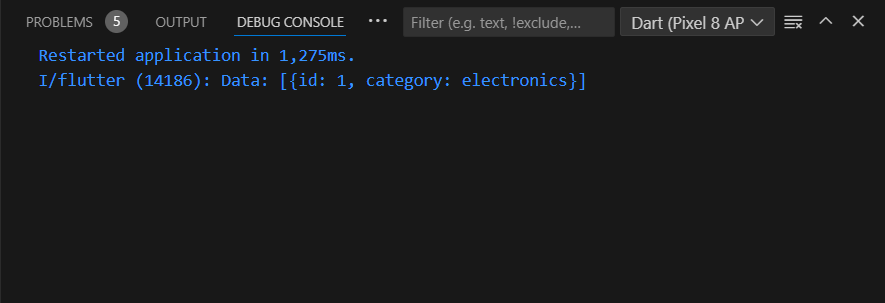
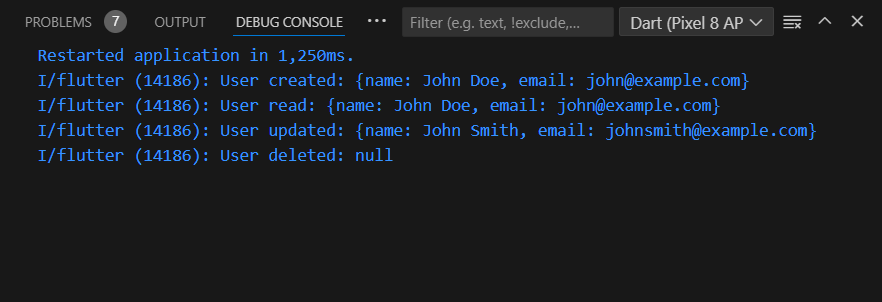

# Soal

 

# Soal 1: Supabase
Kamu memiliki aplikasi Flutter yang menggunakan Supabase sebagai database remote. Buatlah fungsi untuk mengambil data (Read) dari tabel `products` di mana kolom `category` memiliki nilai `"electronics"`. Kemudian, tampilkan data tersebut dalam format yang terbaca.

# Soal 2: Hive
Buatlah fungsi CRUD untuk aplikasi Flutter yang menggunakan Hive sebagai database lokal. Fungsi tersebut harus menyimpan (Create), mengambil (Read), memperbarui (Update), dan menghapus (Delete) data pengguna dengan `userId` sebagai kunci utama.

