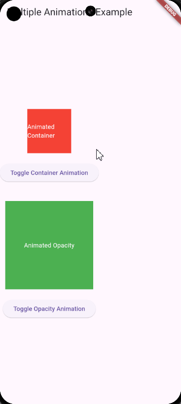

# Soal:

Buatlah aplikasi Flutter yang memiliki dua animasi berbeda menggunakan `AnimatedContainer` dan `AnimatedOpacity`. Aplikasi ini harus menampilkan dua tombol yang masing-masing akan mengontrol animasi dari satu widget. Ketika tombol pertama ditekan, animasi `AnimatedContainer` akan berjalan, dan ketika tombol kedua ditekan, animasi `AnimatedOpacity` akan berjalan.

