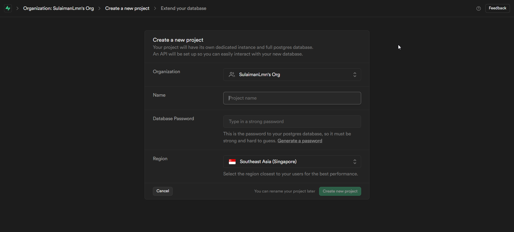

## Aplikasi Todo List dengan Autentikasi user

### Langkah 1 : Menyiapkan Basis Data dengan Supabase

1. Buat Akun Supabase :

   - Pergi ke [Supabase](https://supabase.com/dashboard/sign-in?returnTo=%2Fprojects) dan daftar untuk sebuah akun.
   <p align="center">
    
   </p>

2. Buat Proyek Baru :

   - Setelah masuk, buat proyek baru dan catat `URL` dan `anonKey` yang diberikan oleh Supabase, karena Anda akan membutuhkannya nanti.
   <p align="center">
    
   </p>

   <p align="center">
    
   </p>

3. Siapkan Tabel Basis Data :

   - Navigasikan ke SQL Editor di Supabase dan jalankan perintah SQL berikut untuk membuat tabel `tbl_user` dan `tbl_todo`:

   ```sql
   CREATE TABLE tbl_user (
   id serial PRIMARY KEY,
   username text NOT NULL UNIQUE,
   email text NOT NULL UNIQUE,
   password text NOT NULL
   );

   CREATE TABLE tbl_todo (
   id serial PRIMARY KEY,
   user_id integer REFERENCES tbl_user(id) ON DELETE CASCADE,
   body text NOT NULL
   );
   ```

   <p align="center">
    
   </p>

### Langkah 2 : Menyiapkan Proyek Flutter dan Menambahkan Dependensi

1. Buat Proyek Flutter Baru :

   - Buka visual Studio Code, lalu ikuti video dibawah ini :
   <p align="center">
    
   </p>

2. Tambahkan Dependensi :

   - Buka `pubspec.yaml` di proyek Flutter Anda dan tambahkan dependensi berikut :

   ```yaml
   dependencies:
   crypto: ^3.0.3
   flutter:
     sdk: flutter
   provider: ^6.1.2
   supabase_flutter: ^2.5.6
   ```

   <p align="center">
    
   </p>

   - Lalu tekan `CTRL` + `S` agar dependencies ditambahkan.

### Langkah 3: Inisialisasi Supabase

1. Inisialisasi Supabase :

   - Di file `main.dart`, inisialisasi Supabase sebelum menjalankan aplikasi :

   ```dart
   import 'package:flutter/material.dart';
   import 'package:supabase_flutter/supabase_flutter.dart';

   void main() async {
   WidgetsFlutterBinding.ensureInitialized();
   await Supabase.initialize(
      url: 'URL_SUPABASE_ANDA',
      anonKey: 'ANON_KEY_SUPABASE_ANDA',
   );
   runApp(const MyApp());
   }

   class MyApp extends StatelessWidget {
   const MyApp({Key? key}) : super(key: key);

   @override
   Widget build(BuildContext context) {
      return MaterialApp(
         debugShowCheckedModeBanner: false,
         title: 'TodoList dengan Auth',
         theme: ThemeData(primarySwatch: Colors.blue),
         home: const LoginPage(),
      );
   }
   }
   ```

### Langkah 4 : Buat Halaman Login

1. UI Halaman Login :

   - Buat file baru login_page.dart dan tambahkan kode berikut :

   ```dart
   import 'package:flutter/material.dart';
   import 'package:supabase_flutter/supabase_flutter.dart';
   import 'package:crypto/crypto.dart';
   import 'dart:convert';

   import 'signup_page.dart';
   import 'todo_page.dart';

   class LoginPage extends StatefulWidget {
   const LoginPage({Key? key}) : super(key: key);

   @override
   _LoginPageState createState() => _LoginPageState();
   }

   class _LoginPageState extends State<LoginPage> {
   final TextEditingController _usernameController = TextEditingController();
   final TextEditingController _passwordController = TextEditingController();
   final _formKey = GlobalKey<FormState>();

   String _hashPassword(String password) {
      final bytes = utf8.encode(password);
      final digest = sha256.convert(bytes);
      return digest.toString();
   }

   @override
   Widget build(BuildContext context) {
      return Scaffold(
         body: Padding(
         padding: const EdgeInsets.all(16.0),
         child: Form(
            key: _formKey,
            child: Column(
               mainAxisAlignment: MainAxisAlignment.center,
               children: <Widget>[
               const Text(
                  "Login",
                  style: TextStyle(fontSize: 30, fontWeight: FontWeight.bold),
               ),
               const SizedBox(height: 50),
               TextFormField(
                  controller: _usernameController,
                  decoration: const InputDecoration(
                     labelText: 'Username',
                     border: OutlineInputBorder(),
                  ),
                  validator: (value) => value!.isEmpty ? 'Username is required' : null,
               ),
               const SizedBox(height: 10),
               TextFormField(
                  controller: _passwordController,
                  decoration: const InputDecoration(
                     labelText: 'Password',
                     border: OutlineInputBorder(),
                  ),
                  obscureText: true,
                  validator: (value) => value!.isEmpty ? 'Password is required' : null,
               ),
               const SizedBox(height: 20),
               ElevatedButton(
                  onPressed: () async {
                     if (_formKey.currentState!.validate()) {
                     final username = _usernameController.text;
                     final password = _hashPassword(_passwordController.text);
                     try {
                        final response = await Supabase.instance.client
                           .from('tbl_user')
                           .select()
                           .eq('username', username)
                           .eq('password', password)
                           .single();

                        if (response.data != null) {
                           Navigator.pushReplacement(
                           context,
                           MaterialPageRoute(
                              builder: (context) => TodoPage(userId: response.data['id']),
                           ),
                           );
                        } else {
                           ScaffoldMessenger.of(context).showSnackBar(
                           const SnackBar(content: Text('Invalid username or password')),
                           );
                        }
                     } catch (error) {
                        ScaffoldMessenger.of(context).showSnackBar(
                           SnackBar(content: Text('Login failed: $error')),
                        );
                     }
                     }
                  },
                  child: const Text('Login'),
               ),
               TextButton(
                  onPressed: () {
                     Navigator.push(
                     context,
                     MaterialPageRoute(builder: (context) => const SignupPage()),
                     );
                  },
                  child: const Text("Don't have an account? Sign Up"),
               ),
               ],
            ),
         ),
         ),
      );
   }
   }
   ```

### Langkah 5 : Buat Halaman Signup

1. UI Halaman Signup :

   - Buat file baru `signup_page.dart` dan tambahkan kode berikut :

   ```dart
   import 'package:flutter/material.dart';
   import 'package:supabase_flutter/supabase_flutter.dart';
   import 'package:crypto/crypto.dart';
   import 'dart:convert';

   import 'login_page.dart';

   class SignupPage extends StatefulWidget {
   const SignupPage({Key? key}) : super(key: key);

   @override
   _SignupPageState createState() => _SignupPageState();
   }

   class _SignupPageState extends State<SignupPage> {
   final TextEditingController _emailController = TextEditingController();
   final TextEditingController _usernameController = TextEditingController();
   final TextEditingController _passwordController = TextEditingController();
   final _formKey = GlobalKey<FormState>();

   String _hashPassword(String password) {
      final bytes = utf8.encode(password);
      final digest = sha256.convert(bytes);
      return digest.toString();
   }

   Future<bool> _checkUsernameAvailability(String username) async {
      try {
         final response = await Supabase.instance.client
            .from('tbl_user')
            .select('id')
            .eq('username', username);
         return response.isEmpty;
      } catch (error) {
         print('Error checking username availability: $error');
         return false;
      }
   }

   @override
   Widget build(BuildContext context) {
      return Scaffold(
         body: Padding(
         padding: const EdgeInsets.all(8.0),
         child: Form(
            key: _formKey,
            child: Column(
               mainAxisAlignment: MainAxisAlignment.center,
               children: <Widget>[
               const Text(
                  "Sign Up",
                  style: TextStyle(fontSize: 30, fontWeight: FontWeight.bold),
               ),
               const SizedBox(height: 50),
               TextFormField(
                  controller: _emailController,
                  decoration: const InputDecoration(
                     labelText: 'Email',
                     border: OutlineInputBorder(),
                  ),
                  validator: (value) {
                     if (value!.isEmpty) {
                     return 'Email is required';
                     } else if (!value.contains('@')) {
                     return 'Email must be a valid email address';
                     }
                     return null;
                  },
               ),
               const SizedBox(height: 10),
               TextFormField(
                  controller: _usernameController,
                  decoration: const InputDecoration(
                     labelText: 'Username',
                     border: OutlineInputBorder(),
                  ),
                  validator: (value) {
                     if (value!.isEmpty) {
                     return 'Username is required';
                     } else if (value.length < 3 || value.length > 20) {
                     return 'Username must be between 3 and 20 characters';
                     }
                     return null;
                  },
               ),
               const SizedBox(height: 10),
               TextFormField(
                  controller: _passwordController,
                  decoration: const InputDecoration(
                     labelText: 'Password',
                     border: OutlineInputBorder(),
                  ),
                  obscureText: true,
                  validator: (value) {
                     if (value!.isEmpty) {
                     return 'Password is required';
                     } else if (value.length < 6) {
                     return 'Password must be at least 6 characters';
                     }
                     return null;
                  },
               ),
               const SizedBox(height: 20),
               ElevatedButton(
                  onPressed: () async {
                     if (_formKey.currentState!.validate()) {
                     final email = _emailController.text;
                     final username = _usernameController.text;
                     final password = _hashPassword(_passwordController.text);

                     final isUsernameAvailable = await _checkUsernameAvailability(username);
                     if (!isUsernameAvailable) {
                        ScaffoldMessenger.of(context).showSnackBar(
                           const SnackBar(content: Text('Username is already taken')),
                        );
                        return;
                     }

                     try {
                        await Supabase.instance.client.from('tbl_user').insert({
                           'email': email,
                           'username': username,
                           'password': password,
                        });
                        Navigator.pushReplacement(
                           context,
                           MaterialPageRoute(builder: (context) => const LoginPage()),
                        );
                     } catch (error) {
                        ScaffoldMessenger.of(context).showSnackBar(
                           SnackBar(content: Text('Signup failed: $error')),
                        );
                     }
                     }
                  },
                  child: const Text('Sign Up'),
               ),
               TextButton(
                  onPressed: () {
                     Navigator.pushReplacement(
                     context,
                     MaterialPageRoute(builder: (context) => const LoginPage()),
                     );
                  },
                  child: const Text("Already have an account? Login"),
               ),
               ],
            ),
         ),
         ),
      );
   }
   }
   ```

### Langkah 6 : Buat Halaman To-Do

1. UI Halaman To-Do :

   - Buat file baru `todo_page.dart` dan tambahkan kode berikut :

   ```dart
   import 'package:flutter/material.dart';
   import 'package:supabase_flutter/supabase_flutter.dart';

   class TodoPage extends StatefulWidget {
   final int userId;
   const TodoPage({Key? key, required this.userId}) : super(key: key);

   @override
   _TodoPageState createState() => _TodoPageState();
   }

   class _TodoPageState extends State<TodoPage> {
   final TextEditingController _todoController = TextEditingController();
   List<dynamic> _todos = [];

   @override
   void initState() {
      super.initState();
      _fetchTodos();
   }

   Future<void> _fetchTodos() async {
      try {
         final response = await Supabase.instance.client
            .from('tbl_todo')
            .select()
            .eq('user_id', widget.userId);
         setState(() {
         _todos = response.data;
         });
      } catch (error) {
         print('Error fetching todos: $error');
      }
   }

   Future<void> _addTodo() async {
      if (_todoController.text.isEmpty) return;
      try {
         await Supabase.instance.client.from('tbl_todo').insert({
         'user_id': widget.userId,
         'body': _todoController.text,
         });
         _todoController.clear();
         _fetchTodos();
      } catch (error) {
         print('Error adding todo: $error');
      }
   }

   Future<void> _deleteTodo(int id) async {
      try {
         await Supabase.instance.client.from('tbl_todo').delete().eq('id', id);
         _fetchTodos();
      } catch (error) {
         print('Error deleting todo: $error');
      }
   }

   Future<void> _editTodo(int id, String newBody) async {
      try {
         await Supabase.instance.client
            .from('tbl_todo')
            .update({'body': newBody})
            .eq('id', id);
         _fetchTodos();
      } catch (error) {
         print('Error editing todo: $error');
      }
   }

   @override
   Widget build(BuildContext context) {
      return Scaffold(
         appBar: AppBar(title: const Text('To-Do List')),
         body: Column(
         children: <Widget>[
            Padding(
               padding: const EdgeInsets.all(8.0),
               child: Row(
               children: <Widget>[
                  Expanded(
                     child: TextField(
                     controller: _todoController,
                     decoration: const InputDecoration(
                        labelText: 'New To-Do',
                        border: OutlineInputBorder(),
                     ),
                     ),
                  ),
                  const SizedBox(width: 8),
                  ElevatedButton(
                     onPressed: _addTodo,
                     child: const Text('Add'),
                  ),
               ],
               ),
            ),
            Expanded(
               child: ListView.builder(
               itemCount: _todos.length,
               itemBuilder: (context, index) {
                  final todo = _todos[index];
                  return ListTile(
                     title: Text(todo['body']),
                     trailing: Row(
                     mainAxisSize: MainAxisSize.min,
                     children: <Widget>[
                        IconButton(
                           icon: const Icon(Icons.edit),
                           onPressed: () {
                           _showEditDialog(todo['id'], todo['body']);
                           },
                        ),
                        IconButton(
                           icon: const Icon(Icons.delete),
                           onPressed: () => _deleteTodo(todo['id']),
                        ),
                     ],
                     ),
                  );
               },
               ),
            ),
         ],
         ),
      );
   }

   void _showEditDialog(int id, String currentBody) {
      final TextEditingController _editController = TextEditingController(text: currentBody);
      showDialog(
         context: context,
         builder: (context) {
         return AlertDialog(
            title: const Text('Edit To-Do'),
            content: TextField(
               controller: _editController,
               decoration: const InputDecoration(
               border: OutlineInputBorder(),
               ),
            ),
            actions: <Widget>[
               TextButton(
               onPressed: () => Navigator.pop(context),
               child: const Text('Cancel'),
               ),
               TextButton(
               onPressed: () {
                  _editTodo(id, _editController.text);
                  Navigator.pop(context);
               },
               child: const Text('Save'),
               ),
            ],
         );
         },
      );
   }
   }
   ```

### Langkah 7 : Perbarui File Utama untuk Menyertakan Rute

1. Perbarui `main.dart` :

   - Modifikasi `main.dart` untuk menyertakan import yang benar dan memperbarui rute halaman utama :

   ```dart
   import 'package:flutter/material.dart';
   import 'package:supabase_flutter/supabase_flutter.dart';
   import 'login_page.dart';

   void main() async {
   WidgetsFlutterBinding.ensureInitialized();
   await Supabase.initialize(
      url: 'URL supabase-mu',
      anonKey: 'AnonKey supabase-mu',
   );
   runApp(const MyApp());
   }

   class MyApp extends StatelessWidget {
   const MyApp({Key? key}) : super(key: key);

   @override
   Widget build(BuildContext context) {
      return MaterialApp(
         debugShowCheckedModeBanner: false,
         title: 'TodoList dengan Auth',
         theme: ThemeData(primarySwatch: Colors.blue),
         home: const LoginPage(),
      );
   }
   }
   ```

## Result

### Signup Page :


### Login Page :


### Todo Page :


Tidak masalah jika aplikasi yang Anda buat tidak mirip persis seperti ini. Yang terpenting adalah aplikasi yang Anda buat memenuhi kriteria yang telah ditentukan, seperti memiliki fungsi login, pendaftaran, dan pengelolaan daftar tugas dengan integrasi ke Supabase.
