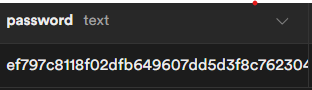

# Project Akhir: Aplikasi Todo List dengan Autentikasi user

### Deskripsi Project:

Buatlah aplikasi Flutter yang mencakup fitur autentikasi user dan todo list. Setiap user harus memiliki todo listnya sendiri. Gunakan Supabase untuk backend dan Provider untuk state management.

### Persyaratan Project:

### 1. Autentikasi user

- Implementasikan fungsionalitas login dan signup user.
- Validasi input user selama login dan signup.
- Hash kata sandi sebelum disimpan di database.

### Signup Page Example :

### Login Page Example :

### 2. Manajemen Todo List:

- Setiap user yang terautentikasi harus memiliki todo listnya sendiri.
- user harus dapat menambahkan, memperbarui, dan menghapus item tugas.
- todo list harus dapat memperbarui datanya ketika ada perubahan state.

### Todo Page Example :

### 3. Backend dengan Supabase:

- Gunakan Supabase untuk mengelola autentikasi user dan operasi database.
- Pastikan penyimpanan dan pengambilan data user dan todo list dilakukan dengan aman.

### 4. State management dengan Provider:

- Kelola state todo list menggunakan Provider.
- Pastikan perubahan state langsung tercermin di UI.

### 5. Skema Database:

- `tbl_user`: Tabel untuk menyimpan informasi pengguna (email, username, hashed password).
- `tbl_todo`: Tabel untuk menyimpan item tugas (user_id, body).

### Hashed Password Example :

