# Flutter

# Apa itu Flutter?
Flutter adalah framework open-source yang dikembangkan oleh Google untuk membangun antarmuka pengguna (UI) yang natively compiled dari satu basis kode (codebase) tunggal. Dengan Flutter, Anda dapat membuat aplikasi untuk berbagai platform seperti iOS, Android, web, dan desktop dengan cepat dan efisien. Flutter menggunakan bahasa pemrograman Dart, yang dirancang untuk memberikan kinerja tinggi dan produktivitas pengembang.

# Fitur Utama Flutter
- **Hot Reload**: Memungkinkan pengembang untuk melihat perubahan pada aplikasi secara langsung tanpa perlu memulai ulang aplikasi.

- **UI Modern dan Responsif**: Flutter menyediakan berbagai widget yang indah dan mudah disesuaikan untuk membuat antarmuka pengguna yang menarik dan responsif.

- **Performa Tinggi**: Flutter dikompilasi langsung ke kode asli ARM, yang membuatnya sangat cepat dan efisien.
Cross-Platform: Dengan satu basis kode, Anda dapat membuat aplikasi yang berjalan di berbagai platform tanpa perubahan signifikan.

# Instalasi Flutter
### 1. Instalasi Flutter SDK
   Unduh Flutter SDK dari situs resmi Flutter.
 <p align="center">
 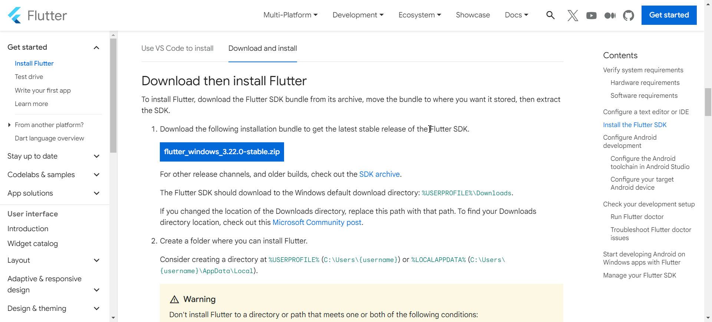 
 </p>

 ### 2. Ekstrak Flutter SDK
 Ekstrak file zip yang telah diunduh ke lokasi pilihan Anda.

 ### 3. Tambahkan Flutter ke Path
   - copy path `bin` pada flutter sdk yang sudah kamu extract
      <p align="center">
      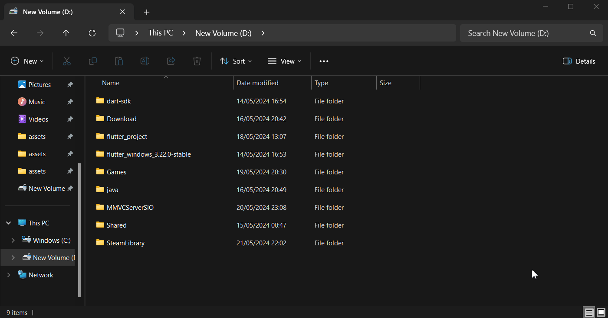 
      </p>

   - Buka Control Panel > System and Security > System > Advanced system settings.

      <p align="center">
      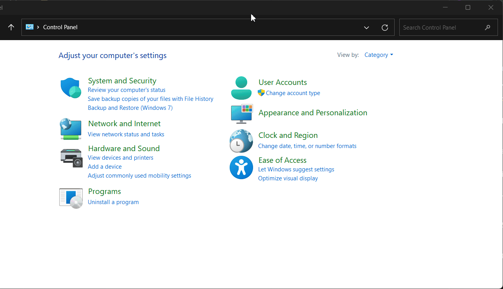 
      </p>

   - Klik Environment Variables, lalu pada bagian System variables, cari variabel Path, dan klik Edit( Jika kalian masih punya path seperti `dart-sdk/bin` kalian bisa hapus itu dan hanya pakai sdk dari flutter saja )

      <p align="center">
      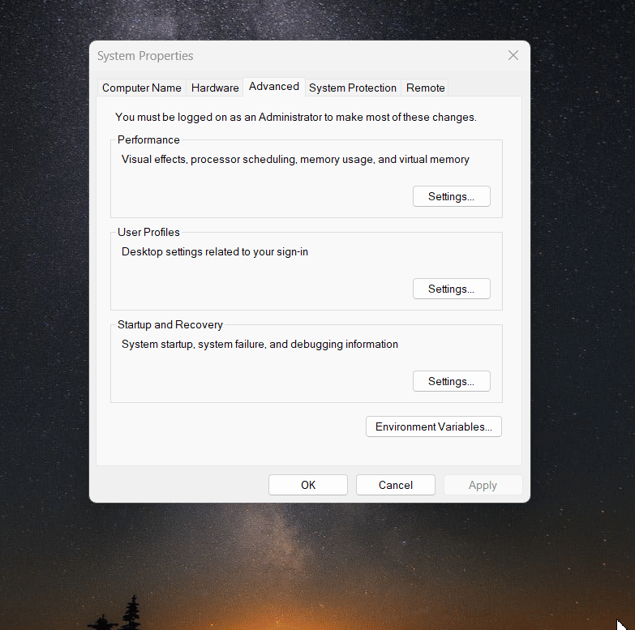 
      </p>
   

# Instalasi Android Studio
### 1. Unduh Android Studio:
   Unduh Android Studio dari situs resminya atau click [ini](https://developer.android.com/studio?gad_source=1&gclid=Cj0KCQjwjLGyBhCYARIsAPqTz1_EoFmucCBFbB7KhLIbgoxqgJrUXoNzorQHKm1BikB6G0fJaYYeGvYaAnPEEALw_wcB&gclsrc=aw.ds).

### 2. Install Android Studio
   Ikuti instruksi instalasi yang sesuai dengan sistem operasi.

   - Buka **AVD Manager** dari toolbar atau navigasikan ke **Tools** >**AVD Manager**.

      <p align="center">
      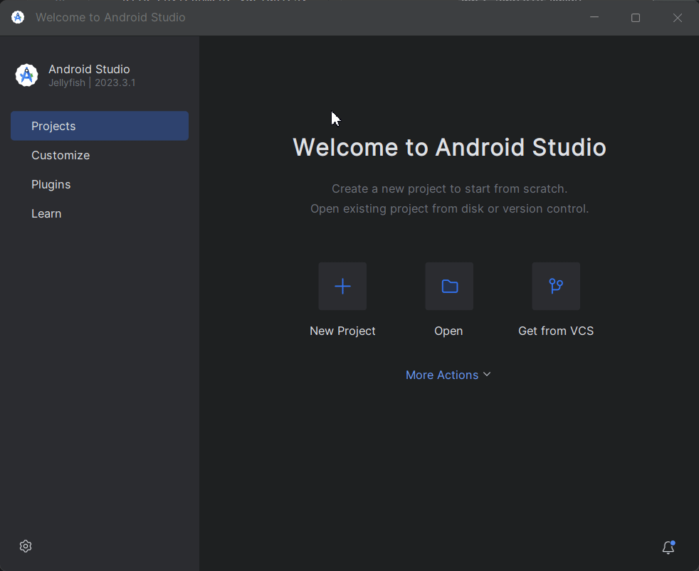 
      </p>

   - Buat virtual device baru dengan mengklik **Create Virtual Device** dan ikuti instruksi untuk memilih perangkat dan sistem operasi yang diinginkan.

      <p align="center">
      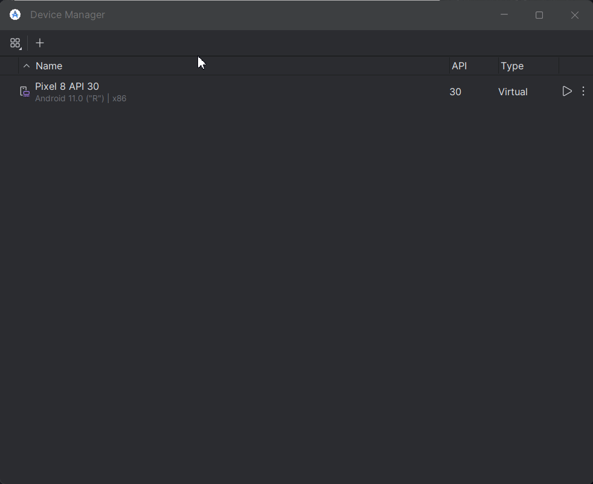 
      </p>

   - Setelah virtual device dibuat, Anda bisa menjalankannya dengan mengklik tombol Play di AVD Manager.
      <p align="center">
      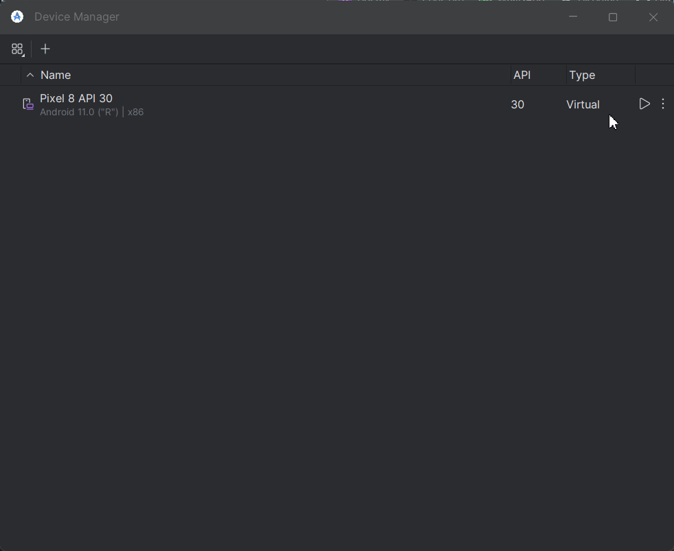 
      </p>

### 3. Verifikasi Instalasi Flutter
Buka terminal atau command prompt, dan jalankan perintah berikut untuk memverifikasi instalasi Flutter:
```sh
flutter doctor
```

# Instalasi Editor
Anda bisa menggunakan editor favorit Anda seperti Visual Studio Code atau Android Studio, tetapi kali ini saya akan menggunakan Visual Studio Code

### 1. Visual Studio Code
   - **Unduh dan Install**: Unduh dan install Visual Studio Code dari situs resminya. untuk bagian ini kita akan skip karena kita sudah mengunduh Visual Studio Code di materi dart.

### 2. Install Plugin Flutter dan Dart : 
   - Klik pada Extensions di sidebar (atau tekan `Ctrl+Shift+X`).

   - Cari dan install "Flutter" dan "Dart".

      <p align="center">
      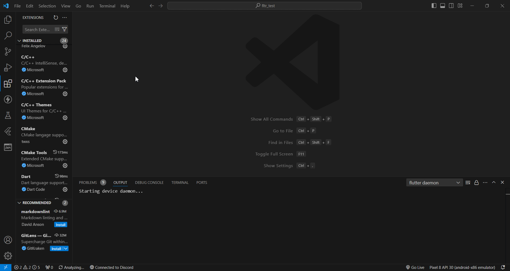 
      </p>

# Buat dan Jalankan Aplikasi Flutter

- click icon search pada Visual Studio Code dan search `>flutter: New Project` setelah itu click application.

<p align="center">
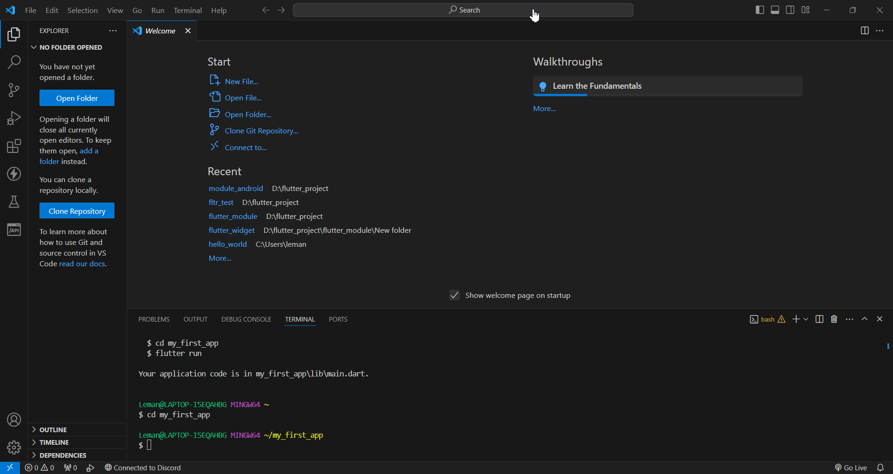 
</p>

- Pilih folder untuk menyimpan aplikasi flutter-mu
<p align="center">
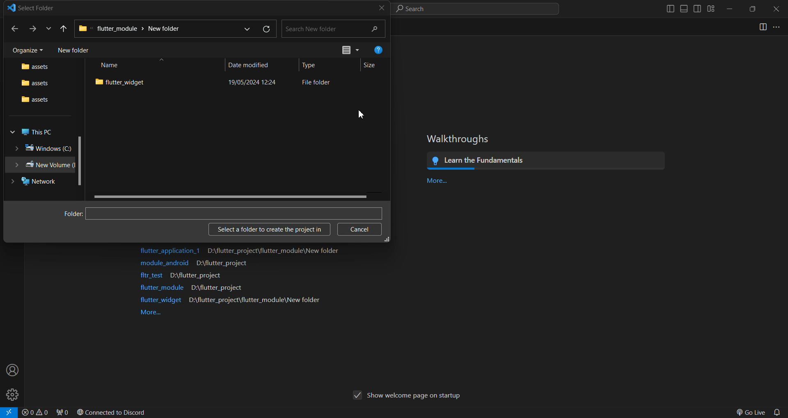 
</p>

- Pilih emulator yang sudah kamu install di Android Studio.
<p align="center">
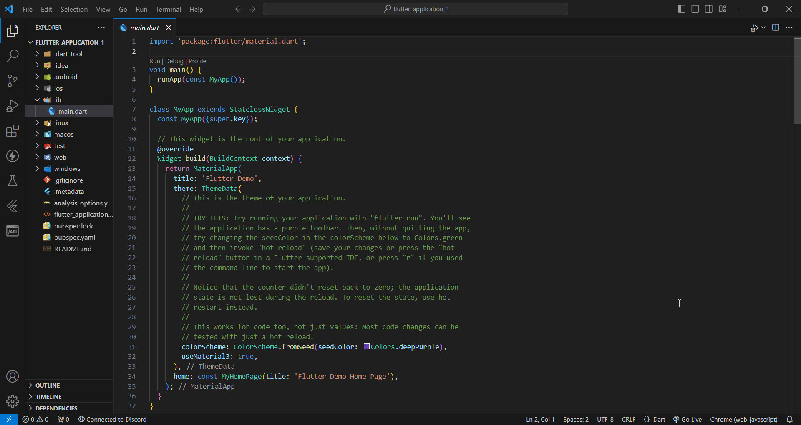 
</p>

- Jalankan aplikasi flutter dengan click icon `Run`.
<p align="center">
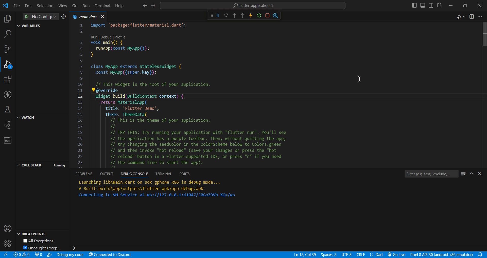 
</p>


 


   