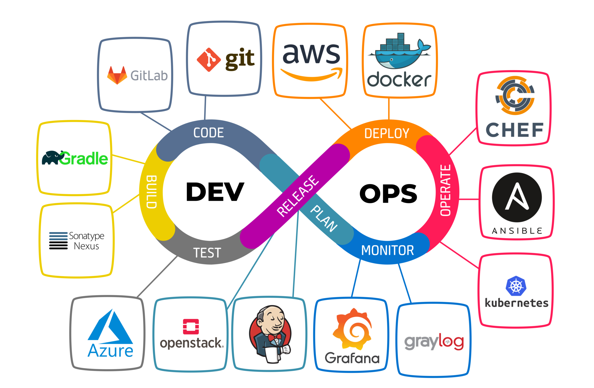
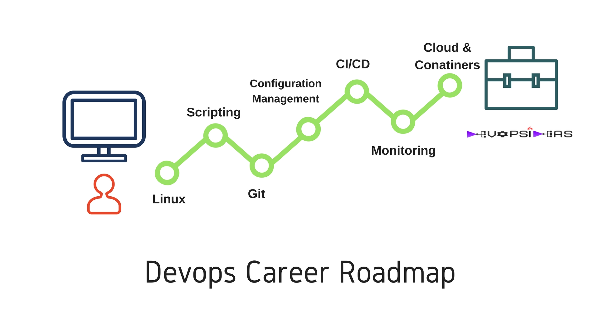

| Author  | Editor |
| ------- | ------ |
| Kheyral | Hudya  |

# Introduction

Salah satu bidang IT yang jarang terdengar bisa dikatakan adalah DevOps atau yang biasa Development Operational.

Berdasarkan pengertian google, DevOps adalah serangkaian praktik yang bertujuan untuk meningkatkan kolaborasi dan komunikasi antara tim pengembangan (Development) dan tim operasional (Operations) dalam proses pengembangan dan pengelolaan sistem perangkat lunak.

Bayangkan ada pabrik mobil yang ingin memproduksi mobil yang berkualitas tinggi dan sesuai dengan kebutuhan pelanggan. Dalam hal ini, tim pengembangan (Development) seperti tim desain yang merancang mobil, sedangkan tim operasional (Operations) seperti tim produksi yang memasang mobil.

Dalam model tradisional, tim desain dan tim produksi bekerja secara terpisah, sehingga mobil yang diproduksi mungkin tidak sesuai dengan kebutuhan pelanggan. Namun, dengan adanya DevOps, tim desain dan tim produksi bekerja sama untuk memastikan bahwa mobil yang diproduksi adalah yang terbaik dan sesuai dengan kebutuhan pelanggan.

> Terus gunanya DevOps hanya itu aja?

Tentunya tidak, ini adalah keuntungan sebuah perusahaan jika menggunakan DevOps:

- Komunikasi lebih baik antar tim
- Proses development yang lebih cepat dan efisien
- Output dengan kualitas yang tinggi
- Fleksibilitas dan Skalabilitas
- Dan masih banyak lainnya

DevOps juga memiliki [gaji](https://www.jobstreet.co.id/id/career-advice/role/devops-engineer/salary) diatas rata-rata pekerjaan IT yang lainnya loh, dari sini tertarik gak untuk belajar DevOps?

Tentunya gaji yang fantastis ini juga sejalan dengan resikonya ya, karena DevOps akan berurusan dengan server, maka sekali kesalahan juga dapat berakibat fatal terhadap cost infrastructure dari sebuah perusahaan.

High income, high risk!

## Roadmap Knowledge

Kalau kalian tertarik untuk belajar DevOps, kalian harus paham juga beberapa hal, mulai dari apa itu [Linux](https://opensource.com/resources/linux), [Version Control System](https://git-scm.com/book/id/v2/Memulai-Tentang-Version-Control#:~:text=Sistem%20Version%20Control%20Lokal,juga%20sangat%20rentan%20terkena%20galat.), [Virtualisasi](https://aws.amazon.com/id/what-is/virtualization/), [CI/CD](https://www.dicoding.com/blog/apa-itu-ci-cd/), dan hal lainnya.

> Kok banyak amat yang harus dipahami?

Santai, jangan kewalahan dulu, pada modul yang disediakan kita akan mempelajari semua hal yang telah dijelaskan satu per-satu.

Berikut modul - modul yang kalian akan pelajari:

- Introdcution to Linux & Virtualization
- Understanding Build & Deploy
- Introduction to Webserver
- Cloud Computing & Containerization
- Introduction to CI/CD
- Introduction to Infrastructure as a Code (IaC)
- Infrastructure as a Code Advanced
- Security Server Access

Untuk mengasah kemampuan kalian dari modul - modul di atas terdapat latihan dan study case juga loh.

Sebelum mulai saya ada quotes keren buat kalian:

> *Your value is not determined by what you are, it is determined by what you are capable of*

Apabila kalian ingin memiliki gaji yang besar, maka skill kalian juga harus berharga, makanya wajib tuntas untuk belajar DevOps 😉.