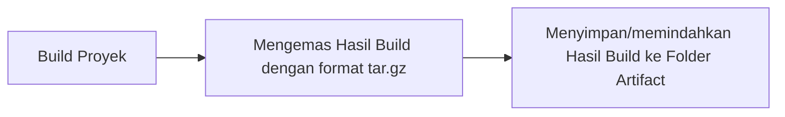
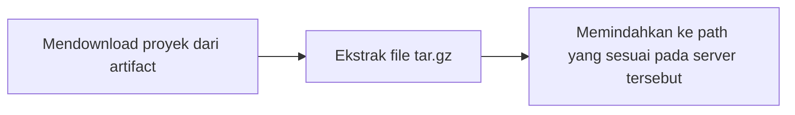
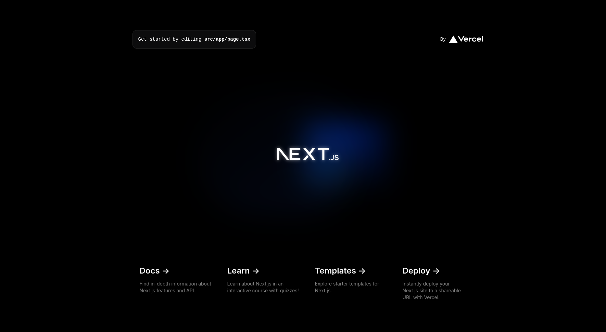

# 2 - Build and Deployment

Author: Hudya Ramadhana

## Overview

Pada materi kali ini kamu akan belajar mengenai proses build dan deploy pada lingkungan DevOps.

Proses build dan deploy kali ini dikemas dengan sangat sederhana, tujuannya untuk mempermudah kamu memahami dasar ilmu build dan deploy.

### Build

Proses build adalah tahap di mana kode sumber dari sebuah proyek diubah menjadi bentuk yang dapat dijalankan oleh komputer.

Dalam konteks aplikasi web, build biasanya melibatkan penggabungan dan minifikasi file JavaScript dan CSS, serta proses lain seperti transpiling (misalnya dari TypeScript ke JavaScript) dan bundling.

Hasil dari proses build adalah sebuah paket yang siap untuk di-deploy (diluncurkan).

Perhatikan diagram berikut:



<br />

Proses build sangat bergantung pada perintah proyek tersebut, sebagai contoh apabila kita ingin membangun proyek javascript kita dapat masukkan perintah `npm run build`. Sebagai seorang DevOps, kita perlu bertanya kepada developer bagaimana cara melakukan build terhadap proyek yang dikerjakannya. Kita juga dapat membaca dokumentasi terkait framework atau tools yang digunakan oleh tim developer.

Proses build ini sebenarnya sangat sederhana, karena pada akhirnya kita hanya perlu mengemas hasil proses ini pada sebuah file compress agar menghemat ruang.

Pada aplikasi backend, biasanya aplikasi yang dibangun akan menginstall dependencies tambahan atau melakukan update terhadap dependenciesnya, setelah dependency diinstall atau diperbarui kita akan mengemas satu folder tersebut pada sebuah file yang umumnya bertipe `tar.gz`. Tipe file ini biasanya tipe file yang umum pada sistem operasi linux.

Proses kompresi file build biasanya akan menjadi dua file:

- latest.tar.gz
- waktubuild.tar.gz

Format waktubuild.tar.gz adalah format yang biasanya berbentuk seperti 20240101-123455 yang artinya sama saja dengan 01-01-2024 12:34:55. Biasanya ini ditujukan untuk memudahkan kita mengetahui versi terakhir yang dibuild pada tanggal apa.

Jadi nanti filenya akan menjadi seperti ini `20240101-123455.tar.gz`. Kita juga dapat membangun proyek berdasarkan semantic version misalnya 1.1.1, tentunya terkait versioning ini perlu diskusi dengan tim developer terkait agar memahami aturannya.

File `latest.tar.gz` merupakan versi app terakhir yang dibangun baik itu menggunakan branch `development` atau `production`, tentunya versi ini bisa saja tidak stabil maka dari itu biasanya tim developer akan membantu tim DevOps terkait versi paling stabil berada pada versi apa.

Terakhir file yang telah dikompress akan disimpan pada `artifact`. Folder `artifact` ini biasanya disimpan pada cloud misalnya pada Google Cloud Drive, atau Amazon Web Service S3. Namun untuk mempermudah kalian memahaminya, kita akan menggunakan local folder saja.

### Deployment

Deployment adalah proses menempatkan hasil build dari folder `artifact` ke lingkungan server yang akan menjalankan aplikasi tersebut. Proses deployment akan melibatkan pemindahan file hasil build ke lokasi yang tepat di server, mengatur konfigurasi yang diperlukan, dan memastikan aplikasi berjalan dengan baik.

Perhatikan diagram berikut:



## Proses Build dan Deploy

Proses build dan deploy akan dipisah menggunakan dua file berbeda, yaitu `build.sh` untuk membangun proyek dan `deploy.sh` untuk mendeploy proyek.

Sebagai contoh coba lakukan clone [proyek berikut](https://github.com/Komandro-CCIT/sample-devops-frontend-project) di dalam server multipass kalian.

Perintah clone:

```bash
git clone https://github.com/Komandro-CCIT/sample-devops-frontend-project.git
```

Setelah itu masuk ke dalam folder proyeknya lalu ketik:

```bash
npm install
```

> [!NOTE]
> Jangan lupa menginstall NodeJS versi 20, atau kamu dapat menggunakan [Node Version Manager](https://www.freecodecamp.org/news/node-version-manager-nvm-install-guide/).

Setelah selesai silahkan ketik perintah berikut:

```bash
npm run build
```

Setelah berhasil kalian bisa tekan `ls` dan lihat hasilnya:

```bash
hudya@perogeremmer-pc:~/sample-devops-frontend-project$ ls
next.config.mjs  node_modules  package.json       postcss.config.mjs  README.md  tailwind.config.ts
next-env.d.ts    out           package-lock.json  public              src        tsconfig.json
hudya@perogeremmer-pc:~/sample-devops-frontend-project$ cd out/
hudya@perogeremmer-pc:~/sample-devops-frontend-project/out$ ls
404.html  favicon.ico  index.html  index.txt  _next  next.svg  vercel.svg
```

Hasil build proyek kita berada di folder `out`, untuk mengetesnya, masuk ke dalam folder `out` lalu jalankan perintah berikut:

```bash
python3 -m http.server

# Hasil
# Serving HTTP on 0.0.0.0 port 8000 (http://0.0.0.0:8000/) ...
```

Menggunakan python, kita bisa membuat server web sederhana untuk menguji coba file `index.html` yang ada di dalam folder tersebut.

Setelah dijalankan akses browser kamu menggunakan ip multipass kamu dan kamu akan melihat tampilan berikut:




Lanjutkan membuat proses automation dengan script build.sh dan deploy.sh