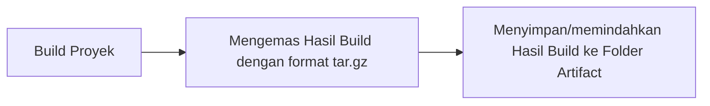
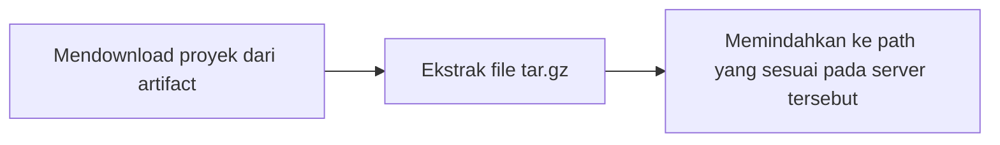

# 3 - Build and Deployment

Author: Hudya Ramadhana

- [**Overview**](#overview)
	- [Build](#build)
	- [Deployment](#deployment)
- [**Build and Deployment Process**](#build-and-deployment-process)
- [**Automate Build & Deployment Process**](#automate-build-&-deployment-process)
	- [Automating Building Process](#automating-building-process)
	- [Automating-Deploy Process](#automating-deploy-process)
	- [Deploying Another Project](#deploying-another-project)
- [**Summary**](#summary)

<br />

## Overview
***

Pada materi kali ini kamu akan belajar mengenai proses build dan deploy pada lingkungan DevOps.

Proses build dan deploy kali ini dikemas dengan sangat sederhana, tujuannya untuk mempermudah kamu memahami dasar ilmu build dan deploy.

### Build

Proses build adalah tahap di mana kode sumber dari sebuah proyek diubah menjadi bentuk yang dapat dijalankan oleh komputer.

Dalam konteks aplikasi web, build biasanya melibatkan penggabungan dan minifikasi file JavaScript dan CSS, serta proses lain seperti transpiling (misalnya dari TypeScript ke JavaScript) dan bundling.

Hasil dari proses build adalah sebuah paket yang siap untuk di-deploy (diluncurkan).

Perhatikan diagram berikut:



<br />

Proses build sangat bergantung pada perintah proyek tersebut, sebagai contoh apabila kita ingin membangun proyek javascript kita dapat masukkan perintah `npm run build`. Sebagai seorang DevOps, kita perlu bertanya kepada developer bagaimana cara melakukan build terhadap proyek yang dikerjakannya. Kita juga dapat membaca dokumentasi terkait framework atau tools yang digunakan oleh tim developer.

Proses build ini sebenarnya sangat sederhana, karena pada akhirnya kita hanya perlu mengemas hasil proses ini pada sebuah file compress agar menghemat ruang.

Pada aplikasi backend, biasanya aplikasi yang dibangun akan menginstall dependencies tambahan atau melakukan update terhadap dependenciesnya, setelah dependency diinstall atau diperbarui kita akan mengemas satu folder tersebut pada sebuah file yang umumnya bertipe `tar.gz`. Tipe file ini biasanya tipe file yang umum pada sistem operasi linux.

Proses kompresi file build biasanya akan menjadi dua file:

- latest.tar.gz
- waktubuild.tar.gz

Format waktubuild.tar.gz adalah format yang biasanya berbentuk seperti 20240101-123455 yang artinya sama saja dengan 01-01-2024 12:34:55. Biasanya ini ditujukan untuk memudahkan kita mengetahui versi terakhir yang dibuild pada tanggal apa.

Jadi nanti filenya akan menjadi seperti ini `20240101-123455.tar.gz`. Kita juga dapat membangun proyek berdasarkan semantic version misalnya 1.1.1, tentunya terkait versioning ini perlu diskusi dengan tim developer terkait agar memahami aturannya.

File `latest.tar.gz` merupakan versi app terakhir yang dibangun baik itu menggunakan branch `development` atau `production`, tentunya versi ini bisa saja tidak stabil maka dari itu biasanya tim developer akan membantu tim DevOps terkait versi paling stabil berada pada versi apa.

Terakhir file yang telah dikompress akan disimpan pada `artifact`. Folder `artifact` ini biasanya disimpan pada cloud misalnya pada Google Cloud Drive, atau Amazon Web Service S3. Namun untuk mempermudah kalian memahaminya, kita akan menggunakan local folder saja.

### Deployment

Deployment adalah proses menempatkan hasil build dari folder `artifact` ke lingkungan server yang akan menjalankan aplikasi tersebut. Proses deployment akan melibatkan pemindahan file hasil build ke lokasi yang tepat di server, mengatur konfigurasi yang diperlukan, dan memastikan aplikasi berjalan dengan baik.

Perhatikan diagram berikut:



<br />

## Build and Deployment Process
***

Proses build dan deploy akan dipisah menggunakan dua file berbeda, yaitu `build.sh` untuk membangun proyek dan `deploy.sh` untuk mendeploy proyek.

Sebagai contoh coba lakukan clone [proyek berikut](https://github.com/Komandro-CCIT/sample-devops-frontend-project) di dalam server multipass kalian.

Perintah clone:

```bash
git clone https://github.com/Komandro-CCIT/sample-devops-frontend-project.git
```

Setelah itu masuk ke dalam folder proyeknya lalu ketik:

```bash
npm install
```

> [!NOTE]
> Jangan lupa menginstall NodeJS versi 20, atau kamu dapat menggunakan [Node Version Manager](https://www.freecodecamp.org/news/node-version-manager-nvm-install-guide/).

Setelah selesai silahkan ketik perintah berikut:

```bash
npm run build
```

Setelah berhasil kalian bisa tekan `ls` dan lihat hasilnya:

```bash
hudya@perogeremmer-pc:~/sample-devops-frontend-project$ ls
next.config.mjs  node_modules  package.json       postcss.config.mjs  README.md  tailwind.config.ts
next-env.d.ts    out           package-lock.json  public              src        tsconfig.json
hudya@perogeremmer-pc:~/sample-devops-frontend-project$ cd out/
hudya@perogeremmer-pc:~/sample-devops-frontend-project/out$ ls
404.html  favicon.ico  index.html  index.txt  _next  next.svg  vercel.svg
```

Hasil build proyek kita berada di folder `out`, untuk mengetesnya, masuk ke dalam folder `out` lalu jalankan perintah berikut:

```bash
python3 -m http.server

# Hasil
# Serving HTTP on 0.0.0.0 port 8000 (http://0.0.0.0:8000/) ...
```

Menggunakan python, kita bisa membuat server web sederhana untuk menguji coba file `index.html` yang ada di dalam folder tersebut.

Setelah dijalankan akses browser kamu menggunakan ip multipass kamu dan kamu akan melihat tampilan berikut:


Lanjutkan membuat proses automation dengan script build dan deploy.

<br />

## Automate Build & Deploy Processes
***

Karena kalian sudah paham bagaimana proses dari Build & Deployment, Sekarang kita akan membuat script untuk melakukan automasi dalam proses Build & Deployment, proses ini penting untuk diautomatisasi agar proses lebih cepat dan efisien dalam masa development.

Bayangkan jika kalian bekerja dalam satu tim dan masing-masing developer meng-update kodenya dan ngepush kodenya ke repositori dan kalian yang bertanggung jawab atas proses Build & Deployment itu akan sangat merepotkan kalian, masa kita harus standby setiap saat hanya untuk update proses Build & Deploymentnya? repot kan maka dari itu masalah ini kita bisa membuat solusinya dengan cara automatisasi.

<br />

> [!WARNING]
> Disarankan mengikuti command dibawah untuk membuat struktur foldernya dan tidak membuat struktur folder sendiri agar scriptnya tidak error.

<br />

Langsung saja langkah-langkah untuk automatisasi dibawah ini.

### Automating Build Process

Pertama buat instance multipass baru di cmd/powershell kalian yang sudah diajarkan sebelumnya dichapter 1.

```powershell
multipass launch --name server-build-deploy --disk 20gb
```

```powershell
multipass shell server-build-deploy
```

Struktur foldernya akan seperti ini:

```css
projects/
├── automate-build.sh
├── automate-deploy.sh
├── build/
│   ├── project-folder/
│   │    └── source-code & etc
│   ├── another-project-folder/
│   │    └── source-code & etc
├── artifacts/
│   ├── project-artifact/ 
│	│    └── time.tar.gz & latest.tar.gz
│   ├── another-project-artifact/
│   │    └── time.tar.gz & latest.tar.gz
```

Perlu diingatkan seharusnya folder artifacts itu berada di cloud namun karena ini hanya untuk demonstrasi kita hanya akan menggunakan folder artifacts lokal yang dibuat nanti.

Pastikan posisi kalian di home

```bash
pwd

#result
#/home/ubuntu
```

Selanjutnya yaitu kita membuat folder `projects` serta sub-foldernya yaitu `build` & `artifacts`.

```bash
mkdir projects ; mkdir projects/build ; mkdir projects/artifacts
```

Kita clone ulang repositori yang diatas tadi kedalam folder build atau kalian bisa pindahkan saja yang tadi.

```bash
cd projects/build
```

```bash
git clone https://github.com/Komandro-CCIT/sample-devops-frontend-project.git
```

Cek apakah npm sudah terinstall atau belum.

```bash
npm -v
```

Jika belum cek note diatas untuk install npm nya.

Script ini berdasarkan proses Build & Deploy diatas copy dan paste script dibawah ini:

**automate-build.sh**

```bash
#!/bin/bash

BASE_DIR="/home/ubuntu/projects"
BUILD_DIR="$BASE_DIR/build"
ARTIFACT_DIR="$BASE_DIR/artifacts"

#Check for folder to be argument
if [ "$#" -ne 1 ]; then
  echo "Usage: ./automate-build.sh <project dir name>"
  echo "Ex: ./automate-build.sh sample-devops-frontend-project"
  exit 1
fi

#Assign the args to var
PROJECT_DIR="$1"

# Create separate artifacts folder for each projects
PROJECT_ARTIFACT_DIR="$ARTIFACT_DIR/$PROJECT_DIR"

#Check for the dir then install dependencies
if [ ! -d "$BUILD_DIR/$PROJECT_DIR" ]; then
  echo "Error: Project path $PROJECT_DIR does not exist in build path."
  exit 1
elif command -v npm &> /dev/null; then
  cd "$BUILD_DIR/$PROJECT_DIR"
  npm install 
  cd "$BASE_DIR"
else
  echo "Error: npm is not installed. Please install npm and try again."
  exit 1
fi

# Create a timestamp for the build
TIMESTAMP=$(date +"%Y%m%d-%H%M%S")

# Check if the project artifacts folder exists, create it if not
if [ ! -d "$PROJECT_ARTIFACT_DIR" ]; then
  mkdir -p "$PROJECT_ARTIFACT_DIR"
fi

# Creating artifacts
echo "Creating artifacts..."

cd "$BUILD_DIR"
tar -czf "$PROJECT_ARTIFACT_DIR/$TIMESTAMP.tar.gz" "$PROJECT_DIR" || { echo "Error: Failed to create tarball"; exit 1; }
cd "$BASE_DIR"
rm -f "$PROJECT_ARTIFACT_DIR/latest.tar.gz"  # Remove the old latest.tar.gz file
cd "$BUILD_DIR"
tar -czf "$PROJECT_ARTIFACT_DIR/latest.tar.gz" "$PROJECT_DIR" || { echo "Error: Failed to create tarball"; exit 1; }
cd "$BASE_DIR"

echo "Build Completed!"
```

Balik lagi ke direktori projects.

```bash
pwd
#result: /home/ubuntu/projects
```

Gunakan `vim` untuk membuat script `automate-build.sh`.

```bash
vim automate-build.sh
# press i
# right click to paste
# press shift + :
# type :wq + enter
```

Berikan execute permission untuk `automate-build.sh`.

```bash
chmod +x automate-build.sh
```

Sekarang coba untuk run scriptnya.

```bash
./automate-build.sh
#result:
#Usage: ./automate-build.sh <project dir name>
#Ex: ./automate-build.sh sample-devops-frontend-project
```

Masukan argumen dengan cara ketikan nama project foldernya.

```bash
./automate-build.sh sample-devops-frontend-project
```

Setelah proses build selesai kalian bisa lihat artifact nya di folder artifact.

```bash
cd /home/ubuntu/projects/artifacts/sample-devops-frontend-project
```

```bash
ls
#result: 20240820-105328.tar.gz  latest.tar.gz
```

Kurang lebih seperti itulah proses build dan membuat artifacts dari sebuah project, selanjutnya kita buat script automatisasi untuk deployment.

### Automating Deploy Process

Seharusnya skenario Build & Deploymentn itu memiliki server masing-masing jadi ada 3 server yaitu `server workstation` (server untuk development sebuah projects dari startup), `server deployment` (server yang hanya menjadi tempat untuk deploy & testing sebuah project) atau `server production` (server yang menjadi produk akhir yang akan dipublish ke publik), tapi kita hanya akan menggunakan satu server all in one di `server-build-deploy` dan seharusnya server deployment & production ini adalah sebuah server cloud, karena kita belum belajar tentang cloud maka kita membuat demo server sendiri dari multipass.

Sebelum copas scriptnya ada beberapa hal yang harus disiapkan terlebih dahulu:

Buat folder `/var/www/html` untuk menjadi destination deploymentnya.

```bash
sudo mkdir /var/www/html
```

Pastikan python terinstall di instance kalian.

```bash
dpkg -l python3
#result: python3 3.12.3-0ubuntu1 amd64 ....
```

Jika tidak install terlebih dahulu.

```bash
sudo apt install python3 -y
```

<br />


> [!NOTE]
> Perlu diketahui, seharusnya proses deployment ini menggunakan web server seperti `nginx`, tapi karena kita belum ke materinya kita gunakan modul `http.server` dari `python` aja agar lebih simple.

<br />

Script ini berdasarkan proses Build & Deploy diatas copy dan paste script dibawah ini:

**automate-deploy.sh**

```bash
#!/bin/bash

# Set the local artifacts directory
DEPLOY_DIR="/var/www/html"
ARTIFACTS_DIR="/home/ubuntu/projects/artifacts"

# Check if the artifact folder is provided as an argument
if [ -z "$1" ]; then
  echo "Error: Please provide the artifact folder to deploy."
  echo "Ex: ./automate-deploy.sh sample-devops-frontend-project"
  exit 1
fi

# Set the artifact folder
ARTIFACT_FOLDER="$1"

# Check if the artifact folder exists
if [ ! -d "$ARTIFACTS_DIR/$ARTIFACT_FOLDER" ]; then
  echo "Error: Artifact folder '$ARTIFACT_FOLDER' not found. Please run the build processes first."
  exit 1
fi

# Check if the tarball exists in the artifact folder
if [ ! -f "$ARTIFACTS_DIR/$ARTIFACT_FOLDER/latest.tar.gz" ]; then
  echo "Error: Tarball not found in artifact folder '$ARTIFACT_FOLDER'. Try to run build process again."
  exit 1
fi

# Deploy the tarball
echo "Deploying app..."

# Extract for artifact folder
errtar=$(sudo tar -xzf "$ARTIFACTS_DIR/$ARTIFACT_FOLDER/latest.tar.gz" -C "$DEPLOY_DIR" 2>&1)
if [ $? -ne 0 ]; then
  echo "Error: tar command failed with error $errtar"
  exit 1
fi

# Error handling for npm build
cd "$DEPLOY_DIR/$ARTIFACT_FOLDER"
errnpm=$(npm run build 2>&1)
if [ $? -ne 0 ]; then
  echo "Error: npm build process failed with error $errnpm"
  exit 1
fi

# Consensus destination 
cd out

# Prompt user to input port between 1 - 65535
while true; do
  read -p "Please specify port to deploy: " port
  if sudo lsof -i :$port | grep LISTEN > /dev/null; then
    echo "Port $port already in use. Either kill services running on $port or try another port."
  else
    sudo python3 -m http.server $port &
    echo "Deployment successful!"
    exit 0
  fi
done 
```

Seperti biasa silahkan copy paste script diatas dan namakan scriptnya `automate-deploy.sh` kemudian berikan `execute` permission.

```bash
chmod +x automate-deploy.sh
```

Setelah itu kalian bisa deploy projectnya secara otomatis dengan execute scriptnya.

```bash
./automate-deploy.sh sample-devops-frontend-project
```

Akses project yang sudah dideploy.
Pertama copas IP nya dengan command ini.

```bash
ip -4 a | grep -oP '(?<=inet )[\d\.]+' | grep -v 127.0.0.1
```

Lalu buka di browser kalian dengan `IP:PORT` contohnya `172.17.44.122:8080`, tidak usah masukan port jika kalian menentukan portnya 80 cukup masukan IP saja.


Dari sini pasti sudah kebayang gimana prosess Build & Deploy sebuah project, selanjutnya kita akan mencoba cloning project lagi tapi projectnya menggunakan framework lain yaitu `react.js` dan `vite.js` lalu di Build & Deploy secara automate dengan script yang sudah dibuat.


### Deploying Another Project 

 Perlu diingatkan juga didalam sebuah tim DevOps untuk membuat sebuah project mulai dari settingannya, infrastrukturnya, technologynya itu harus benar-benar butuh pertimbangan yang benar-benar matang dan kesepakatan konsensus bersama, maupun itu dari companynya langsung atau dari keputusan tim DevOps itu sendiri, jadi kalian tidak boleh asal pilih-pilih dan buat project tanpa aturannya, dengan adanya aturan konsensus ini membuat proses Build & Deploynya menjadi terstruktur, efisien, dan menghindari conflict antar developer.
 
 Di contoh deploy project yang lain ini kita tidak bisa langsung deploy project ini karena harus diubah beberapa setting agar tersinkronisasi dengan automate scriptnya, dalam contoh praktek ini kita harus setting beberapa config untuk bisa memenuhi aturan konsensusnya agar proses Build & Deployment berjalan dengan sukses.

Langsung saja kita praktikan dibawah ini.

Credit to user github Mif2006 saya menemukan contoh web app keren yang menggunakan framework `react.js` dan `vite.js`, langsung aja ikuti prosessnya dibawah ini.

Clone projectnya.

```bash
git clone https://github.com/Mif2006/MatrixWebsite.git
```

Lanjut, pindah ke project directorinya.

```bash
cd MatrixWebsite
```

Hapus file yang bernama `vite.config.js`, buat baru lagi dengan nama yang sama dan copas code dibawah ini atau kalian bisa edit filenya.

```bash
rm vite.config.js
```

```bash
vim vite.config.js
```

Copas code dibawah ini:

```bash
import { defineConfig } from 'vite'
import react from '@vitejs/plugin-react'

// https://vitejs.dev/config/
export default defineConfig({
  plugins: [react()],
  build: {
    outDir: 'out',
  },
})
```

Selanjutnya install dependenciesnya.

```
npm install
```

Next kita build artifactnya terlebih dahulu.

```bash
cd ~/projects
```

```bash
./automate-build.sh MatrixWebsite
```

Terakhir deploy artifact dan akses project yang sudah dideploy di browser.

```bash
./automate-deploy.sh MatrixWebsite
```


<br />

> Alasannya `vite.config.js` diganti itu kenapa?

Kalau kalian lihat di script `automate-deploy.sh` ada line code dimana tempat modul python `http.server` nya di deploy, yaitu di direktori `out`, dan kalau kalian lihat lagi di settingan `vite.config.js` ada line code yang menambahkan output direktori dari proses deploymentnya yaitu `outDir: 'out'`, ini bisa dijadikan salah satu contoh kesepakatan/konsensus bersama, yaitu setiap project yang dibuat harus memisahkan hasil build nya kedalam folder tersendiri agar terpisah dari product development dan product yang sudah jadi.

<br />

## Summary

- **Proses build adalah proses yang menjadikan sebuah project menjadi produk akhir.**
- **Setiap project build harus memilik artifact berbentuk tar.gz atau format lainnya agar mudah melakukan deployment, distribution, versioning, dan testing.**
- **Project yang sudah dijadikan artifact bisa langsung dideploy ke server testing atau server prodcution.**
- **Proses Build & Deployment bisa dibuat secara otomatis**
- **Kesepakatan konsensus harus dibuat agar proses Build & Deploy bisa berlajan dengan lancar.**
