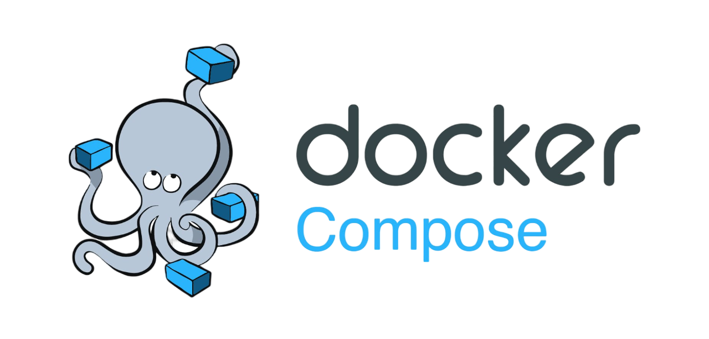

4.2 Docker Compose 
---

 

## Overview
Pada materi ini kita akan belajar lebih banyak tentang paus docker yang OP ini, sebelumnya kalian sudah belajar gimana sih cara menjalankan docker dengan command dasar seperti membuat container dan melakukan port forwarding pada container agar dapat diakses dari luar. Sekarang disini kalian akan diajarkan gimana caranya menggunakan fitur yang bernama **Docker Compose** untuk memudahkan kalian menjalankan docker. 

## Docker Compose

Docker compose adalah alat yang digunakan untuk kalian menjalankan aplikasi docker secara 