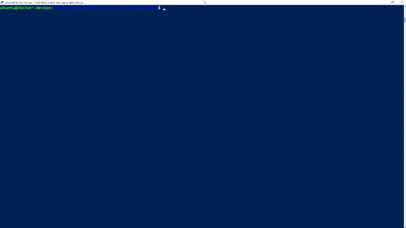

4.2 Docker Compose 
---

</br>

## Overview
Pada materi ini kita akan belajar lebih banyak tentang paus docker yang OP ini, sebelumnya kalian sudah belajar gimana sih cara menjalankan docker dengan command dasar seperti membuat container dan melakukan port forwarding pada container agar dapat diakses dari luar. Sekarang disini kalian akan diajarkan gimana caranya menggunakan fitur yang bernama **Docker Compose** untuk memudahkan kalian menjalankan docker. Selain belajar `Docker Compose` pada bab ini kalian akan belajar cara build dan juga push image buatan kalian sendiri ke 

## Docker Compose
[](https://docs.docker.com/compose/)
Docker compose adalah alat yang digunakan untuk kalian menjalankan satu atau lebih container docker yang saling terkait dengan menggunakan script. Untuk menggunakan fitur ini kalian dapat membuat file berkekstensi `.yml` atau `.yaml` 

## Kenapa Pakai Docker Compose?
Docker Compose ini sangat berguna kalau kamu punya aplikasi yang terdiri dari beberapa service/container. Misalnya aplikasi web yang butuh database, cache, atau bahkan worker buat background job. Daripada jalankan dan atur semuanya secara manual, Docker Compose bikin semua jadi gampang dan otomatis.

Beberapa situasi di mana Docker Compose berguna:

- <strong>Aplikasi web yang punya backend, frontend, dan database: </strong>
  
  Dengan Compose, semuanya bisa diatur dan jalan bareng dengan satu command.

- <strong>Lingkungan development multi-container: </strong>
  
  Buat development lokal, Docker Compose bikin kita bisa ngejalanin semua service yang dibutuhkan aplikasi dengan cepat.

- <strong>Testing environment multi-container: </strong>
  
  Sebelum deployment ke production, kita bisa testing semua service di environment lokal pakai Docker Compose.

## Command Docker Compose
1. `docker-compose up`
   
   Command ini adalah salah satu yang paling sering digunakan untuk menjalankan semua service yang didefinisikan di dalam file docker-compose.yml.

2. `docker-compose down`
   
   Command ini digunakan untuk menghentikan dan menghapus semua container, jaringan, dan volume yang dibuat oleh docker-compose up.

3. `docker-compose ps`

    Command ini digunakan untuk melihat status container yang sedang berjalan. Output dari command ini akan memberikan daftar container beserta statusnya, port yang sedang digunakan, dan nama service yang terhubung.

4. `docker-compose build`
   
    Command ini digunakan untuk membangun image dari Dockerfile yang didefinisikan dalam docker-compose.yml. Biasanya digunakan jika kita memiliki Dockerfile khusus untuk aplikasi kita. 
    
    Jika ada perubahan pada Dockerfile atau dependensi baru yang ingin dimasukkan, perintah ini harus dijalankan untuk membangun ulang image.


## How to Docker Compose
1. Buat Dockerfile terlebih dahulu
   
   Step Pertama adalah dengan membuat Dockerfile untuk membuat image baru

   ```Dockerfile
   FROM nginx:latest
   COPY ./index.html /usr/share/nginx/html/index.html
   ```
   
   Setelah itu buat file index.html untuk mengganti file default yang ada pada nginx

   ```
   vim index.html
   ```

   Lalu tuliskan bahasa html sesuka kalian. Contoh

   ```html
   <h1>AKU MAU GAJI 100JUTA</h1>
   ```

2. Buat file `docker-compose.yml`

    Lalu kalian bisa mulai buat file `docker-compose.yml` dengan memasukkan command

    ```vim
    vim docker-compose.yml
    ```
    
    Setelah itu kalian bisa memasukkan file script dari docker compose sesuai dengan yang ada dibawah.

    ```yml
    version: '3.8'

    services:
    web:
        build: .
        ports:
        - "8080:80"
        volumes:
        - ./html:/usr/share/nginx/html

    db:
        image: mysql:5.7
        environment:
        MYSQL_ROOT_PASSWORD: password123
        volumes:
        - db_data:/var/lib/mysql

    volumes:
    db_data:
    ```

    Oke sebelum lanjut kita bedah dulu script diatas agar kalian paham apa aja sih yang dimasukin tadi.

    - `version: '3.8'` : Ini menandakan versi docker-compose yang kalian pakai, setiap versi dapat memiliki syntax yang berbeda.
    - `services` : Berisi list dari service ataupun container yang akan dijalankan saat user menjalankan docker-compose. `web` dan `db` merupakan istilah yang digunakan untuk menandakan container yang memiliki service yang berbeda
    - `volumes` : ini tempat kita simpan data di luar container, jadi kalau container dimatikan atau dihapus, datanya nggak hilang. Di sini kita pakai db_data buat simpan data MySQL.
       
3. Build dan Jalankan Aplikasi
   
   Jalankan aplikasi dengan menggunakan command

   ```bash
   docker-compose up -d
   ```

   `-d` artinya menjalankan container dalam mode detach, alias di background, jadi kita bisa tetap ngelakuin hal lain di terminal.
4. Lihat Log dari Dockercompose
   
   Selanjutnya untuk memastikan container hasil docker-compose sudah berjalan kalian bisa menggunakan command ini :
   ```bash
   docker-compose ps
   ```
   Ini akan ngasih info soal container-container yang lagi jalan, port-port yang di-forward, dan statusnya.

5. Stop Docker Compose
   
   Kalau udah selesai dan mau matiin semuanya, tinggal pakai command ini:
   ```bash
   docker-compose down
   ```

   Dengan ini, semua container, network, dan volume yang dibuat akan dihentikan dan dihapus.

##  Real Case Practice
Sekarang kalian akan belajar bagaimana cara menggunakan `docker-compose` untuk project yang sedikit lebih kompleks menggunakan project yang berbasis adonis.js, pada praktek ini kalian akan membuat 2 kontainer berupa kontainer untuk web-nya dan satu lagi untuk database, selain kontainer kalian juga akan membuat network untuk menghubungkan kedua kontainer itu. Yuk kita langsung aja ke prakteknya 

1. Clone project dari repository
   
   Sebelum membuat file konfigurasi DockerFile dan `docker-compose.yml` kalian harus mendapatkan folder projectnya terlebih dahulu di Multipass kalian, lakukan git clone menggunakan comman dibawah

   ```bash
   git clone https://github.com/Komandro-CCIT/sample-web-app-project-devops.git
   ```

   Setelah kalian melakukan clone masuk kedalam folder hasil clone kalian dengan cara

   ```bash
   cd sample-web-app-project-devops/
   ```

2. Buat DockerFile
   
   Setelah masuk ke dalam folder project kalian bisa mulai membuat file konfigurasi DockerFile untuk menyiapkan image yang akan digunakan saat deployment. Ikuti langkah dibawah :

   Buat DockerFile
   ```bash
   vim DockerFile
   ```

   Lalu konfigurasi DockerFile seperti di bawah

   ```vim
    # Menggunakan image Node.js 
    FROM node:18

    # Set up working directiory untuk container
    WORKDIR /app

    # Copy package.json dan package-lock.json ke dalam working directory
    COPY package*.json ./

    # Install dependencies
    RUN npm install

    # Copy keseluruhan project kedalam working directory
    COPY . .

    # Build the project
    RUN npm run build -- --ignore-ts-errors

    # Expose port untuk menjalankan website
    EXPOSE 3333

    # Start the application
    CMD ["npm", "start"]
   ```

3. Buat file `.env`
   
   Sebelum melanjutkan membuat file `docker-compose` kalian harus membuat file .env terlebih dahulu untuk menyiapkan environtment untuk aplikasinya berjalan.

   ```vim
   vim .env
   ```

   Setelah itu kita akan buat contoh file .env seperti di bawah ini

   ```vim
   TZ=UTC
   PORT=3333
   HOST=0.0.0.0
   LOG_LEVEL=info
   APP_KEY=OOEM9clhqcOD0h2d43T5Gnd0jIzO7Jnd
   NODE_ENV=development
   SESSION_DRIVER=cookie
   DB_HOST=0.0.0.0
   DB_PORT=3306
   DB_USER=root
   DB_PASSWORD=rootpassword
   DB_DATABASE=adonis
   ```

   Setelah membuat file .env kita bisa lanjut ke proses pembuatan `docker-compose.yml`
4. Buat `docker-compose.yml`
   
   Sekarang kita akan membuat file compose untuk menjalankan image yang sudah kita siapkan pada DockerFile dan menyesuaikannya dengan environtment yang sudah kita buat.

   ```vim
   vim docker-compose.yml
   ```
   
   Setelah itu gunakan file konfigurasi di bawah

   ```vim
   version: '3.8'

   services:
     app:
       build: .
       container_name: adonis-app
       ports:
         - '3333:3333'
       environment:
         - NODE_ENV=development
       env_file:
         - .env
       depends_on:
         - db
       volumes:
         - .:/app
         - /app/node_modules
       networks:
         - mysql_network
   
   
     db:
       image: mysql:8.0
       container_name: mysql-db
       environment:
         MYSQL_ROOT_PASSWORD: 123
         MYSQL_DATABASE: adonis
         MYSQL_USER: adonis
         MYSQL_PASSWORD: 123
         MYSQL_HOST: 0.0.0.0
       ports:
         - '3306:3306'
       volumes:
         - db_data:/var/lib/mysql
       networks:
         - mysql_network
   
   volumes:
     db_data:
   
   networks:
     mysql_network:
   ```

5. Jalankan Docker Compose
   
   Sekarang kalian bisa menjalankan containernya seperti pada uji coba sebelumnya masukan command baris per baris

   ```bash
   docker-compose build

   docker-compose up -d
   ```

6. Cek Website
   
   Setelah itu kalian bisa melakukan pengecekan website-nya apakah sudah berjalan atau belum dengan mengikuti gif dibawah ini.
   


## Summary

Pada materi ini, kita sudah belajar cara menggunakan Docker Compose untuk menjalankan aplikasi multi-container dengan mudah. Docker Compose memungkinkan kita mengatur dan menjalankan beberapa container sekaligus, seperti aplikasi web dan database, hanya dengan satu file konfigurasi .yml. Kita juga sudah melihat bagaimana cara membuat Dockerfile, file .env untuk environment, dan tentu saja, file docker-compose.yml.

Dengan Docker Compose, kita bisa:

- Menjalankan beberapa container sekaligus, misalnya web app dan database.
- Memetakan port container ke host agar aplikasi bisa diakses dari luar.
- Menyimpan data secara persisten menggunakan volume, jadi data tetap aman meski container dihapus.
- Memanfaatkan network agar container dapat saling berkomunikasi secara internal.
- Command-command seperti `docker-compose up -d`, ``docker-compose down``, dan `docker-compose ps` membuat hidup kita lebih mudah dalam hal menjalankan, menghentikan, dan memonitor container.

Secara garis besar, dengan memanfaatkan Docker Compose, kita bisa fokus ke pengembangan aplikasi tanpa perlu repot mengatur dan menjalankan container satu per satu. Sangat membantu, kan?