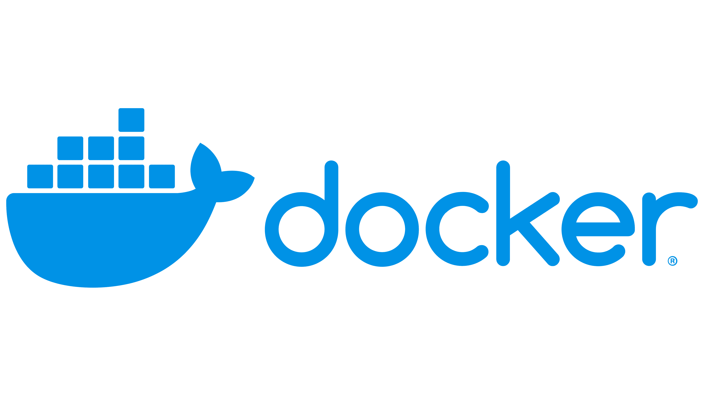
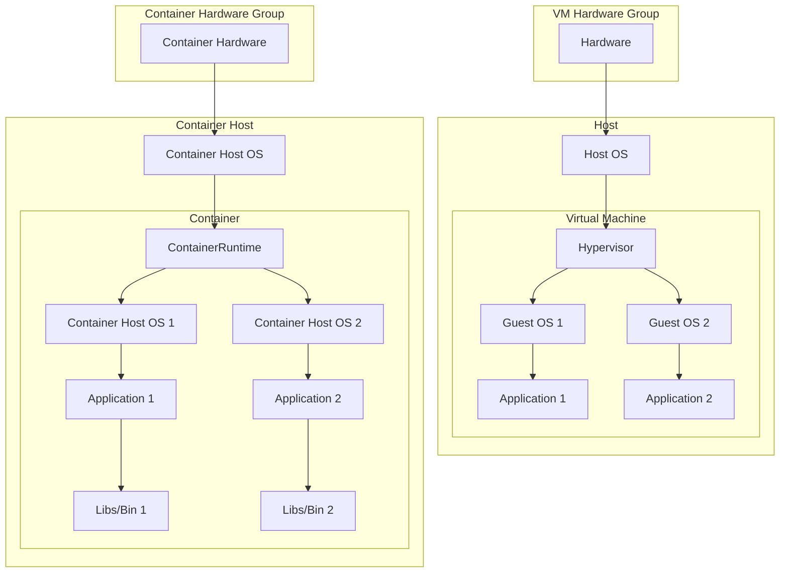
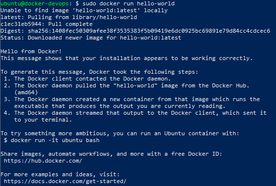

4.1 - Docker Introduction
---


<br/>

## Overview


Setelah kalian mempelajari bagaimana cara build dan deploy aplikasi pada materi sebelumnya, pada materi kali ini kalian akan belajar bagaimana cara mengemas, mendistribusikan dan menjalankan suatu aplikasi menggunakan docker.

<br/>

## Docker
[](https://docker.com)

Docker merupakan sebuah platform open-source yang memungkinkan developer untuk mengemas dan menjalankan aplikasi di dalam environment yang terisolasi bernama container. 

Nah container ini bagaikan "wadah" yang menampung suatu aplikasi sehingga tidak tumpah ke "wadah" lain dalam suatu sistem. Kurang lebih konsep container ini mirip seperti virtual machine atau VM, serupa tapi tidak sama ya.

>Bedanya container dan VM itu apa ?

Walau keduanya bisa dibilang "wadah" tapi mereka berbeda. Titik perbedaan mereka terdapat pada cara mereka melakukan virtualisasi.

Virtual machine menjalankan sistem operasi terpisah dari host untuk setiap instance yang dijalankan, jadi saat ada 2 instances yang berjalan maka masing-masing dari instance tersebut akan menjalankan sistem operasi tersendiri lengkap berserta kernel dari sistem operasi. 

Sedangkan container ketika menjalankan instances tidak memerlukan sistem operasi terpisah dari host karena instance yang dijalankan berbagi dengan kernel yang ada pada sistem operasi host.

#### Diagram struktur virtual machine dan container

<br />



#### Penjelasan Diagram 
---

#### VM Hardware Group
- **Hardware**: Komponen perangkat keras yang mendasari semua sistem virtualisasi dan containerisasi.

#### Host
- **Host OS**: Sistem operasi yang berjalan langsung di atas perangkat keras.
- **Hypervisor**: Lapisan virtualisasi yang mengelola mesin-mesin virtual (VM). Contoh: VMware, Hyper-V.

#### Virtual Machine
- **Guest OS 1**: Sistem operasi yang berjalan di dalam VM pertama.
  - **Application 1**: Aplikasi yang berjalan di atas Guest OS 1.
- **Guest OS 2**: Sistem operasi yang berjalan di dalam VM kedua.
  - **Application 2**: Aplikasi yang berjalan di atas Guest OS 2.

---

#### Container Hardware Group
- **Container Hardware**: Perangkat keras yang mendasari sistem containerization.

#### Container Host
- **Container Host OS**: Sistem operasi host yang mendukung runtime container. Kernel dari Host OS ini dibagi dan digunakan bersama dengan Container Host OS.
- **Container Runtime**: Lapisan yang mengelola container, seperti Docker.

#### Container
- **Container Host OS 1**: Sistem operasi yang berjalan dalam container pertama. Berbagi kernel dengan Container Host OS.
  - **Application 1**: Aplikasi yang berjalan di atas Container Host OS 1.
  - **Libs/Bin 1**: Library dan biner yang dibutuhkan oleh Application 1.
- **Container Host OS 2**: Sistem operasi yang berjalan dalam container kedua. Berbagi kernel dengan Container Host OS.
  - **Application 2**: Aplikasi yang berjalan di atas Container Host OS 2.
  - **Libs/Bin 2**: Library dan biner yang dibutuhkan oleh Application 2.

<br/>

## Arsitektur Docker

Docker menggunakan arsitektur client-server. Docker client akan mengirimkan request ke Docker daemon untuk menjalankan request tersebut, Docker daemon dapat berjalan di mesin yang sama atau secara remote tergantung preferensi dari developer.

[](https://docs.docker.com/guides/docker-overview/)


Diagram ini menggambarkan arsitektur Docker yang terdiri dari tiga komponen utama: Klien, Host Docker, dan Registry. Berikut adalah penjelasan singkat masing-masing komponen dan aliran kerja Docker:

#### 1. Client

Client adalah antarmuka baris perintah yang memungkinkan pengguna berkomunikasi dengan Docker.
#### 2. Docker Host

Docker Host adalah server tempat perintah Docker yang dihasilkan oleh pengguna berjalan.
#### 3. Registry

Registry adalah lokasi penyimpanan images Docker di mana docker daemon dapat mengaksesnya.

<br/>

## Alasan Menggunakan Docker
>Kenapa sih pas development aplikasi pakai docker?
<br/>

Docker menawarkan kelebihan dalam melakukan proses pengembangan aplikasi, contohnya :
- Standarisasi Environment Aplikasi : Dengan menggunakan docker environment untuk menjalankan dapat distandarisasi untuk semua developer, sehingga mengurangi masalah "Di punyaku jalan kok".
- Mempermudah distribusi dan deployment : Aplikasi yang dikemas menggunakan docker dapat dijalankan dimana saja asal ada docker.
- Container lebih ringan dibanding virtual machine : Karena container tidak memerlukan sistem operasi tersendiri untuk setiap instances yang dijalankan, dibanding VM yang memerlukan sistem operasi tersendiri untuk setiap instance.

<br/>

## Instalasi Docker Engine

Pada tahap ini kita akan melakukan instalasi docker engine pada server multipass. Docker memiliki 2 versi, yang pertama adalah Docker Desktop yang menggunakan GUI, yang satunya lagi adalah Docker Engine yang menggunakan CLI. 

Pada materi sebelumnya kita sudah belajar cara instalasi OS Ubuntu melalui Mulitpass Virtual Machine dan melakukan remote kedalam server. Pada tahap ini kita akan melakukan instalasi Docker Engine didalam instance OS Ubuntu yang telah kita buat sebelumnya.

#### Persiapan Sebelum Instalasi
Untuk masuk kedalam Ubuntu, lakukan remote dengan instance Multipass sesuai dengan materi yang sudah diajarkan sebelumnya.

Jika sudah terhubung masukan command dibawah untuk memastikan tidak terjadi konflik antar paket saat proses instalasi.

```sh
for pkg in docker.io docker-doc docker-compose docker-compose-v2 podman-docker containerd runc; do sudo apt-get remove $pkg; done
```

> [!NOTE]
> Untuk memasukan command dengan mudah, copy command yang ada lalu klik kanan mouse pada terminal.

#### 1. Setup Repository Docker

Sebelum Anda menginstal Docker Engine untuk pertama kali pada mesin host baru, Anda perlu menyiapkan repository Docker. Setelah itu, Anda dapat menginstal dan memperbarui Docker dari repository tersebut.

Masukan command dibawah dari per baris ke terminal

```bash
sudo apt-get update

sudo apt-get install ca-certificates curl

sudo install -m 0755 -d /etc/apt/keyrings

sudo curl -fsSL https://download.docker.com/linux/ubuntu/gpg -o /etc/apt/keyrings/docker.asc

sudo chmod a+r /etc/apt/keyrings/docker.asc
```

Setelah itu tambahkan repository dengan cara menuliskan command dibawah pada terminal

```bash
echo \
  "deb [arch=$(dpkg --print-architecture) signed-by=/etc/apt/keyrings/docker.asc] https://download.docker.com/linux/ubuntu \
  $(. /etc/os-release && echo "$VERSION_CODENAME") stable" | \
  sudo tee /etc/apt/sources.list.d/docker.list > /dev/null
```

Lalu lakukan update pada sistem

```bash
sudo apt-get update
```

#### 2. Instalasi Paket Docker Engine

Untuk melakukan instalasi jalankan command dibawah pada terminal.

```bash
sudo apt-get install docker-ce docker-ce-cli containerd.io docker-buildx-plugin docker-compose-plugin
```
<br/>

> [!NOTE]
> Jika nantinya diminta persetujuan [Y/n], ketik 'y' lalu enter.

#### 3. Konfirmasi apakah proses instal berhasil
Untuk melakukan verifikasi bahwa Docker Engine sudah berhasil di instal jalankan command dibawah

```bash
sudo docker run hello-world
```

Jika proses instalasi berhasil maka terminal akan memunculkan pesan seperti pada gambar dibawah.



<br/>

## Docker Command Introduction

**WIP**