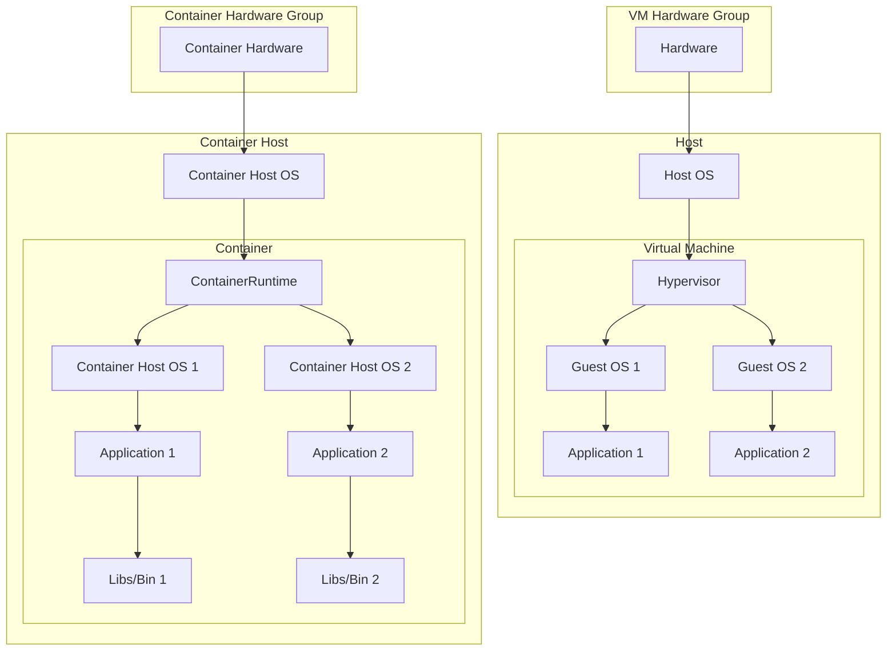
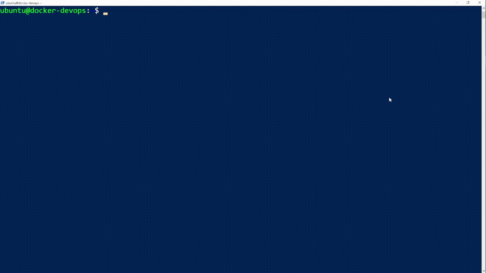
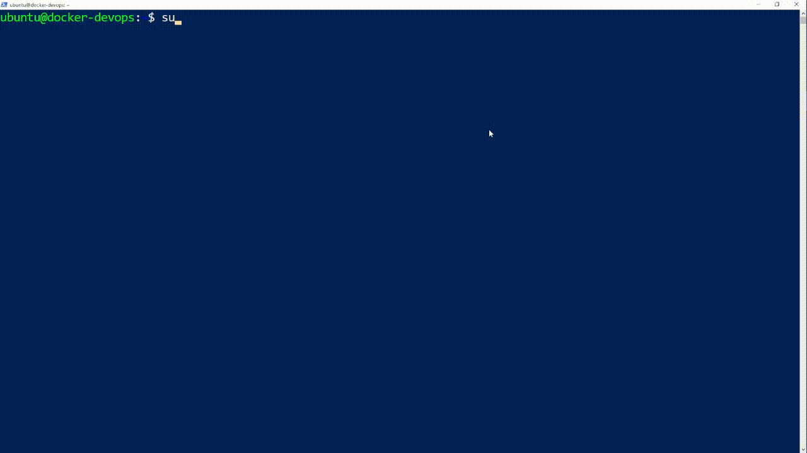
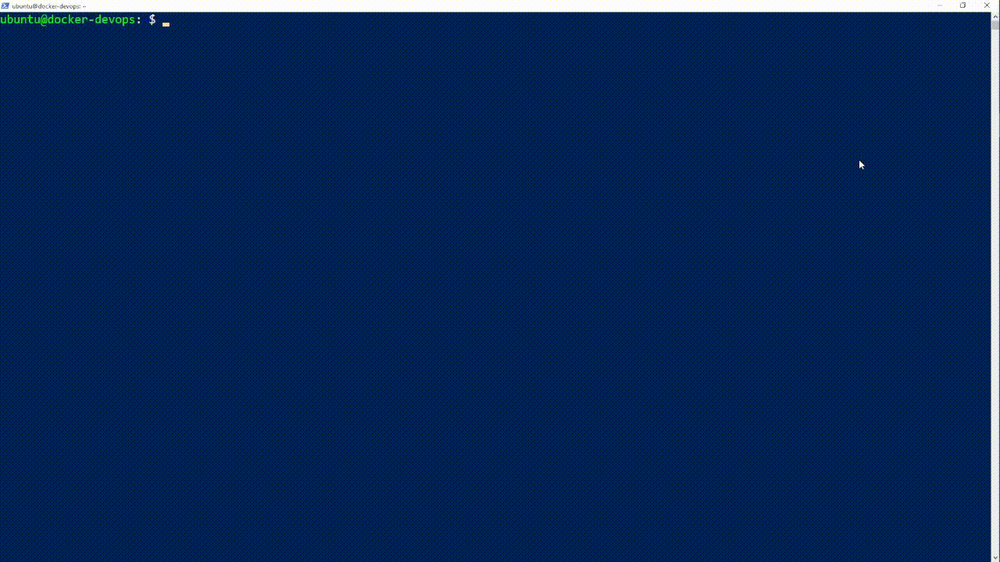
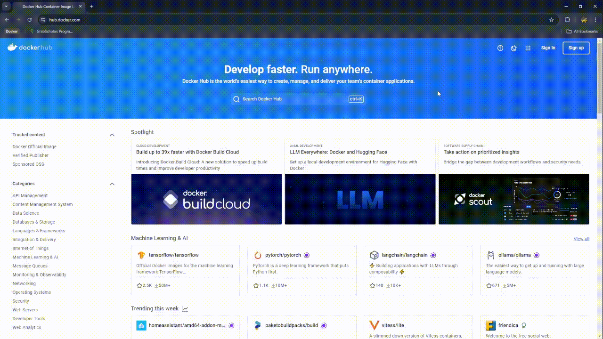
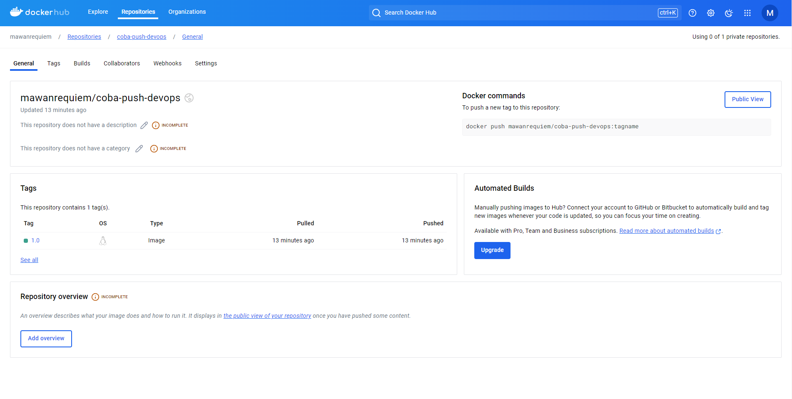

4.1 - Docker Introduction
---


<br/>

## Overview

Setelah kalian mempelajari bagaimana cara build dan deploy aplikasi pada materi sebelumnya, pada materi kali ini kalian akan belajar bagaimana cara mengemas, mendistribusikan dan menjalankan suatu aplikasi menggunakan docker.

<br/>

## Docker
[](https://docker.com)

Docker merupakan sebuah platform open-source yang memungkinkan developer untuk mengemas dan menjalankan aplikasi di dalam environment yang terisolasi bernama container. 

Nah container ini bagaikan "wadah" yang menampung suatu aplikasi sehingga tidak tumpah ke "wadah" lain dalam suatu sistem. Kurang lebih konsep container ini mirip seperti virtual machine atau VM, serupa tapi tidak sama ya.

>Bedanya container dan VM itu apa ?

Walau keduanya bisa dibilang "wadah" tapi mereka berbeda. Titik perbedaan mereka terdapat pada cara mereka melakukan virtualisasi.

Virtual machine menjalankan sistem operasi terpisah dari host untuk setiap instance yang dijalankan, jadi saat ada 2 instances yang berjalan maka masing-masing dari instance tersebut akan menjalankan sistem operasi tersendiri lengkap berserta kernel dari sistem operasi. 

Sedangkan container ketika menjalankan instances tidak memerlukan sistem operasi terpisah dari host karena instance yang dijalankan berbagi dengan kernel yang ada pada sistem operasi host.

#### Diagram struktur virtual machine dan container

<br />



#### Penjelasan Diagram 
---

#### VM Hardware Group
- **Hardware**: Komponen perangkat keras yang mendasari semua sistem virtualisasi dan containerisasi.

#### Host
- **Host OS**: Sistem operasi yang berjalan langsung di atas perangkat keras.
- **Hypervisor**: Lapisan virtualisasi yang mengelola mesin-mesin virtual (VM). Contoh: VMware, Hyper-V.

#### Virtual Machine
- **Guest OS 1**: Sistem operasi yang berjalan di dalam VM pertama.
  - **Application 1**: Aplikasi yang berjalan di atas Guest OS 1.
- **Guest OS 2**: Sistem operasi yang berjalan di dalam VM kedua.
  - **Application 2**: Aplikasi yang berjalan di atas Guest OS 2.

---

#### Container Hardware Group
- **Container Hardware**: Perangkat keras yang mendasari sistem containerization.

#### Container Host
- **Container Host OS**: Sistem operasi host yang mendukung runtime container. Kernel dari Host OS ini dibagi dan digunakan bersama dengan Container Host OS.
- **Container Runtime**: Lapisan yang mengelola container, seperti Docker.

#### Container
- **Container Host OS 1**: Sistem operasi yang berjalan dalam container pertama. Berbagi kernel dengan Container Host OS.
  - **Application 1**: Aplikasi yang berjalan di atas Container Host OS 1.
  - **Libs/Bin 1**: Library dan biner yang dibutuhkan oleh Application 1.
- **Container Host OS 2**: Sistem operasi yang berjalan dalam container kedua. Berbagi kernel dengan Container Host OS.
  - **Application 2**: Aplikasi yang berjalan di atas Container Host OS 2.
  - **Libs/Bin 2**: Library dan biner yang dibutuhkan oleh Application 2.

<br/>

## Arsitektur Docker

Docker menggunakan arsitektur client-server. Docker client akan mengirimkan request ke Docker daemon untuk menjalankan request tersebut, Docker daemon dapat berjalan di mesin yang sama atau secara remote tergantung preferensi dari developer.

[](https://docs.docker.com/guides/docker-overview/)


Diagram ini menggambarkan arsitektur Docker yang terdiri dari tiga komponen utama: Klien, Host Docker, dan Registry. Berikut adalah penjelasan singkat masing-masing komponen dan aliran kerja Docker:

#### 1. Client

Client adalah antarmuka baris perintah yang memungkinkan pengguna berkomunikasi dengan Docker.
#### 2. Docker Host

Docker Host adalah server tempat perintah Docker yang dihasilkan oleh pengguna berjalan.
#### 3. Registry

Registry adalah lokasi penyimpanan images Docker di mana docker daemon dapat mengaksesnya.

<br/>

## Alasan Menggunakan Docker
>Kenapa sih pas development aplikasi pakai docker?
<br/>

Docker menawarkan kelebihan dalam melakukan proses pengembangan aplikasi, contohnya :
- Standarisasi Environment Aplikasi : Dengan menggunakan docker environment untuk menjalankan dapat distandarisasi untuk semua developer, sehingga mengurangi masalah "Di punyaku jalan kok".
- Mempermudah distribusi dan deployment : Aplikasi yang dikemas menggunakan docker dapat dijalankan dimana saja asal ada docker.
- Container lebih ringan dibanding virtual machine : Karena container tidak memerlukan sistem operasi tersendiri untuk setiap instances yang dijalankan, dibanding VM yang memerlukan sistem operasi tersendiri untuk setiap instance.

<br/>

## Instalasi Docker Engine

Pada tahap ini kita akan melakukan instalasi docker engine pada server multipass. Docker memiliki 2 versi, yang pertama adalah Docker Desktop yang menggunakan GUI, yang satunya lagi adalah Docker Engine yang menggunakan CLI. 

Pada materi sebelumnya kita sudah belajar cara instalasi OS Ubuntu melalui Mulitpass Virtual Machine dan melakukan remote kedalam server. Pada tahap ini kita akan melakukan instalasi Docker Engine didalam instance OS Ubuntu yang telah kita buat sebelumnya.

#### Persiapan Sebelum Instalasi
Untuk masuk kedalam Ubuntu, lakukan remote dengan instance Multipass sesuai dengan materi yang sudah diajarkan sebelumnya.

Jika sudah terhubung masukan command dibawah untuk memastikan tidak terjadi konflik antar paket saat proses instalasi.

```sh
for pkg in docker.io docker-doc docker-compose docker-compose-v2 podman-docker containerd runc; do sudo apt-get remove $pkg; done
```

> [!NOTE]
> Untuk memasukan command dengan mudah, copy command yang ingin dimasukan lalu klik kanan mouse pada terminal.

#### 1. Setup Repository Docker

Sebelum Anda menginstal Docker Engine untuk pertama kali pada mesin host baru, Anda perlu menyiapkan repository Docker. Setelah itu, Anda dapat menginstal dan memperbarui Docker dari repository tersebut.


Masukan command dibawah dari per baris ke terminal

```bash
sudo apt-get update

sudo apt-get install ca-certificates curl

sudo install -m 0755 -d /etc/apt/keyrings

sudo curl -fsSL https://download.docker.com/linux/ubuntu/gpg -o /etc/apt/keyrings/docker.asc

sudo chmod a+r /etc/apt/keyrings/docker.asc
```

Setelah itu tambahkan repository dengan cara menuliskan command dibawah pada terminal

```bash
echo \
  "deb [arch=$(dpkg --print-architecture) signed-by=/etc/apt/keyrings/docker.asc] https://download.docker.com/linux/ubuntu \
  $(. /etc/os-release && echo "$VERSION_CODENAME") stable" | \
  sudo tee /etc/apt/sources.list.d/docker.list > /dev/null
```

Lalu lakukan update pada sistem

```bash
sudo apt-get update
```

#### 2. Instalasi Paket Docker Engine

Untuk melakukan instalasi jalankan command dibawah pada terminal.

```bash
sudo apt-get install docker-ce docker-ce-cli containerd.io docker-buildx-plugin docker-compose-plugin
```
<br/>

> [!NOTE]
> Jika nantinya diminta persetujuan [Y/n], ketik 'y' lalu enter.

#### 3. Konfirmasi apakah proses instal berhasil
Untuk melakukan verifikasi bahwa Docker Engine sudah berhasil di instal jalankan command dibawah

```bash
sudo docker run hello-world
```

Jika proses instalasi berhasil maka terminal akan memunculkan pesan seperti pada gambar dibawah.


<br/>

## Docker Command Introduction

Nah sekarang docker engine sudah terinstal didalam multipass kalian tentu itu gak akan berguna kalau kalian gak tahu cara mengoperasikannya. Disini kita akan belajar syntax dan basic command dari Docker ini, jadi siapkan mental kalian kita akan terjun lebih dalam ke materi Docker ini 🔥🔥🔥.

> [!NOTE]
> Untuk menjalankan command docker kalian perlu akses sudo, jadi setiap menjalankan command pastikan gunakan sudo atau masuk ke akun root kalian.

### 1. `docker pull`

```bash
docker pull NAME:TAG
```

Command ini digunakan untuk mendownload image kedalam sistem host kalian, command ini biasanya bersifat opsional karena command `docker run` yang akan kalian pelajari selanjutnya akan otomatis melakukan download pada image yang kalian ingin jalankan. Nama image dan tag image yang dapat kalian download ada pada website [docker hub](https://hub.docker.com/).

- **NAME** adalah nama  dari image yang ingin kalian download. 
- **TAG** adalah versi atau jenis spesifik dari image.
  

> [!NOTE]
> Image merupakan sebuah paket yang berisi semua hal yang dibutuhkan oleh suatu aplikasi untuk berjalan didalam suatu container

Contoh penggunaan command diatas bisa dilihat dibawah :
```
sudo docker pull httpd:latest
```
Pada command diatas kita melakukan pull atau download image bernama httpd dengan tag latest, setelah kalian melakukan pull diatas saat kalian mau menjalankan image httpd:latest kalian gak perlu download lagi karena sudah tersimpan di sistem lokal kalian.

> Kalau pas pull kita lupa gak masukin tag-nya bakal masalah gak ya?

Nah kalau kalian lupa tenang aja soalnya docker bakal otomatis nyariin image dengan versi yang paling baru buat kalian download jadi kalau kalian gak butuh image dengan versi yang spesifik bakal aman azaaa.

### 2. `docker run`
**Syntax**
```bash
docker run [OPTIONS/FLAG] [COMMAND] [ARG...] [IMAGE:TAG]
```
Selanjutnya adalah command `docker run`, command ini bagaikan jantung dari docker karena untuk menjalankan dan membuat container kalian akan menggunakan command ini, container akan otomatis berjalan setelah kalian menggunakan `docker run`. Nah sekarang ayo kita pahami syntax-nya karena lumayan banyak hal yang dapat dilakukan di command ini.

- **`OPTIONS/FLAG`** 
  <br/>
  Disini kalian bisa mengatur bagaimana kalian ingin menjalankan container. Untuk option yang sering digunakan itu seperti:
  <br/>
  <br/>
  `-d` : digunakan untuk langsung menjalankan container setelah dibuat, biasanya dipakai kalau kalian langsung memasukan command saat melakukan `docker run` 


  ```bash
  docker run -d --name webnginx nginx:latest
  ```
    
  Nah command diatas berarti kita menjalankan container bernama `webnginx` dengan opsi detach maka container tersebut akan langsung berjalan di background.
  

  `-p` : Digunakan untuk melakukan port forwarding dari host ke container dengan format `host_port:container_port`. Contohnya seperti `-p 8080:80` artinya kita meneruskan port 8080 dari host ke port 80 yang ada di container.

  ```bash
  docker run -d -p 8080:80 --name mynginx nginx
  ```

  Dapat dilihat pada command diatas dilakukan port forwarding saat menjalankan container nginx, dengan port forwarding ini kita akan bisa melakukan akses secara langsung kedalam container melalui host tanpa lewat docker terlebih dahulu. 

  Contoh saat kalian sudah menjalankan command diatas dan melakukan akses kedalam ip host dengan port 8080 maka kalian bisa tampilan default nginx. Semisal kalian mau coba akses bisa lihat gif dibawah ya.

  

  `--name`: Untuk menamai container kalian. 

  Kalau kalian tidak menamai container kalian maka docker akan memberikan nama secara otomatis namun pasti kalian bakal lupa karena namanya bakal random banget dari docker, makanya dengan option ini kalian bisa menamai container kalian sendiri sehingga jika kalian ingin melakukan manajemen akan lebih mudah.

  ```bash
  docker run --name mynginx nginx
  ```

  pada command diatas container bernama `mynginx` akan dijalankan dengan image nginx.


  Sebenarnya masih banyak banget loh flag atau option yang bisa kalian pakai di command `docker run` ini, kalau kalian mau tahu lebih lanjut kalian bisa cek di [dokumentasi docker](https://docs.docker.com/reference/cli/docker/container/run/) kalau ingin tahu lebih lanjut apa aja option yang bisa kalian pakai.

- **`COMMAND` dan `ARG...`**
  <br/>
  Bagian `COMMAND` akan berisi perintah yang akan di eksekusikan langsung kedalam container ketika container tersebut dijalankan. Sedangkan `ARG..` adalah argumen untuk `COMMAND` yang akan dimasukan.

  ```bash
  docker run ubuntu echo "Hello, Docker!"
  ```

  

  Contoh simpelnya bisa dilihat diatas, pada line diatas container ubuntu akan eksekusi command echo dengan argumen "Hello, World!" dan print teks tersebut didalam container dan akan menunjukan ke terminal saat kalian menjalankan command diatas.

- **`IMAGE:TAG`**
  <br/>
  Sama seperti penjelsannya sebelumnya kalian bisa mengisikan nama image dan tag-nya untuk dijalankan docker.


### 3. Docker container management command

Setelah kalian membuat container kalian pasti pengen tau dong gimana sih cara mengelolanya, kalian bisa manage container kalian dengan command yang ada disini mulai dari start, stop, remove dan masih banyak lagi. Berikut command yang bisa kalian pakai :

#### - `docker start`
Command `docker start` bisa kalian gunakan jika kalian sudah punya container sebelumnya tapi dalam status **stop**.

```bash
docker start [OPTIONS] [CONTAINER]
```

- `OPTIONS`: Sama seperti sebelumnya ini merupakan pilihan opsional saat menjalankan command
- `CONTAINER`: Nama atau ID dari container kalian.



`docker start` juga bisa menjalankan lebih dari 1 container dengan cara

```bash
docker start [NAMA-CONTAINER_1] [NAMA-CONTAINER_2] [NAMA-CONTAINER_...]
```

Contohnya ada dibawah yang dimaana ada container mynginx, mydebian dan myubuntu yang akan di-start bersamaan.

```bash
docker start mynginx mydebian myubuntu
```


#### - `docker stop`
Kalau ada command untuk start pasti ada juga dong untuk stop, `docker stop` digunakan untuk menghentikan container yang sedang berada dalam status aktif atau berjalan.

```bash
docker stop [OPTIONS] [CONTAINER]
```


> [!NOTE]
> Untuk docker stop syntax-nya kurang lebih sama seperti `docker start`, hanya berbeda pada option.

#### - `docker ps`
Pada command sebelumnya ada status dari container dan pada demonstrasi ada command `docker ps`

Pasti kalian bingung.

>Cara biar tau status jalan dan berhenti nya gimana?

>`docker ps -a` di demo sebelumnya buat apaan dah?

Nah `docker ps` memungkinkan kalian bisa melihat container berjalan yang ada di host kalian dan juga seluruh container yang ada di host tanpa memandang status "UP" atau "EXITED" kalau pakai option `-a`

```bash
docker ps
```

```bash
docker ps -a
```




#### - `docker build`
Di command sebelumnya kalian belajar cara membuat container dari image yang sudah ada dari docker hub, sekarang kalian bakal belajar cara untuk membuat image kalian sendiri didalam docker menggunakan command `docker build`.

```
docker build [OPTIONS] PATH
```

Parameter utama :

`-t`: Memberikan tag atau nama pada image yang akan dibuat.

`PATH`: Lokasi direktori yang berisi Dockerfile.

>Dockerfile itu buat apa? Perasaan gak ada dari awal

Jadi Dockerfile itu isinya adalah script sederhana yang isinya itu instruksi untuk docker saat sedang membuat Docker image. Ini buat contohnya

```Dockerfile
# Menggunakan image Ubuntu sebagai base
FROM ubuntu:20.04

# Menginstal Nginx
RUN apt-get update && apt-get install -y nginx

# Menyalin file HTML ke dalam image
COPY ./index.html /var/www/html/index.html

# Mengekspos port 80
EXPOSE 80

# Menjalankan Nginx saat container dimulai
CMD ["nginx", "-g", "daemon off;"]
```

Instruski yang digunakan pada script Dockerfile diatas adalah berikut:

`FROM`: Menentukan image dasar untuk image yang akan kalian gunakan.

`RUN`: Menjalankan perintah di dalam image.

`COPY`: Menyalin file atau direktori dari host kedalam image.

`CMD`: Menentukan perintah default yang akan dijalankan saat container berjalan.

`EXPOSE`: Mendeklarasikan port yang akan digunakan oleh container.

Sekarang waktunya praktek nih gimana caranya bikin image kalian sendiri, perhatikan baik baik ya karena ini bakal kepake untuk materi selanjutnya.

1. Buat folder untuk project
   
   Buat direktori baru agar projek kalian tertata lebih rapih.
   
   Masukan command dibawah perbaris
   ```bash
   mkdir test-build

   cd test-build
   ```
   
   untuk nama folder kalian bisa menamaminya bebas ya
   
2. Buat file `index.html`
   
   Lalu kalian buat file `index.html` untuk menggantikan yang ada di dalam image nanti

   Masukan command :
   ```bash
   vim index.html
   ```

   lalu isikan dengan bahasa HTML, kalian bisa berkreasi disini untuk tulisan didalam file-nya.

   ```html
   <h1>Yo Yo Yo i am Testing the build</h1>
   ```

3. Buat Dockerfile
   
   Sekarang kalian harus membuat Dockerfile seperti yang sudah dijelaskan diatas. Berikut caranya:

   ```bash
   vim Dockerfile
   ```
   Lalu kalian isikan script Dockerfile seperti dibawah.
   ```Dockerfile
   # Menggunakan image Ubuntu sebagai base
   FROM ubuntu:20.04
   # Menginstal Nginx
   RUN apt-get update && apt-get install -y nginx
   # Menyalin file HTML ke dalam image
   COPY ./index.html /var/www/html/index.html
   # Mengekspos port 80
   EXPOSE 80
   # Menjalankan Nginx saat container dimulai
   CMD ["nginx", "-g", "daemon off;"]
   ```

4. Lakukan Build !
   
   Sekarang semua bahan sudah terkumpul waktunya memasak image ini, kita sudah bisa melakukan build sekarang, langsung saja masukan command dibawah. Nama image kalian bisa kreasikan sesuka kalian.

   ```bash
   docker build -t image-test-build:1.0 .
   ```

   Jika sudah kalian bisa cek apakah image kalian sudah terbuat atau belum dengan cek list image dengan command

   ```bash
   docker images
   ```

   Kalau sudah terkonfirmasi ada kalian bisa langsung run image-nya !!!

   ```bash
   docker run -d --name Test-Build -p 8080:80 image-test-build:1.0 
   ```
   
   Kalau sudah selesai langsung saja cus ke browser untuk check apakah container berjalan dan content di index.html terganti sesuai tulisan kalian atau tidak. Kalau berhasil tampilannya akan sesuai dengan index.html yang kalian tulis.


#### - `docker push`
Sekarang setelah image kalian sudah jadi kita akan coba untuk menyimpan image tersebut ke repository docker hub dengan cara di push, kurang lebih sama seperti saat kalian melakukan push dengan git ke github.

> [!WARNING]
> Pastikan kalian sudah memiliki akun docker di dockerhub sebelum melakukan push.

```bash
docker push [OPTIONS] NAME[:TAG]
```

`NAME`: Nama dari image yang ingin di push ke dalam repository yang diikuti dengan username akun docker kalian dan nama repository

`TAG`: Tag dari image yang ingin di push

`OPTIONS`: Ada beberapa opsi uang bisa kalian pakai saat melakukan push, langsung cek [disini](https://docs.docker.com/reference/cli/docker/image/push/#options) kalau kalian penaran opsi apa aja sih yang bisa dipakai.

Sekarang kalian akan praktek untuk melakukan push image yang sebelumnya sudah kalian buat.

1. Buat repositori di Docker Hub
   
   Sebelum melakukan push kalian harus menyiapkan repository terlebih dahulu didalam akun Docker Hub kalian, kalian bisa ikuti step by step dibawah jika sudah membuat akun.

   
2. Login ke Docker Hub
   
   Agar image dapat di upload kedalam repo kalian di Docker Hub kalian harus login dulu ke akun docker kalian didalam VM-nya

   ```bash
   docker login
   ```

   Setelah kalian memasukan command diatas, kalian harus memasukan username dan password akun Docker Hub kalian.

3. Tagging image
   
   Sebelum melakukan push, kalian harus memberikan tag pada image yang akan kalian push. Tag ini berfungsi untuk mengkoneksikan image dengan repositori yang ada di Docker Hub
   
   ```bash
   docker tag local-image:tagname username/repository:tagname
   ```
   
   `local-image:tagname`: Nama dan tag dari image lokal yang kalian buat sebelumnya

   `username/repository:tagname`: Username di Docker Hub dan nama repository yang sudah kalian siapkan, serta tagname yang ingin kalian gunakan.

   Contoh jika ingin push image sebelumnya

   ```bash
   docker tag image-test-build:1.0 mawanrequiem/coba-push-devops:1.0
   ```
   Sekarang ayo bedah command diatas

   `image-test-build:1.0`: Merupakan image dengan tag 1.0 yang di build secara lokal sebelumnya 

   `mawanrequiem/`: Username yang ada pada akun Docker Hub

   `/coba-push-devops:1.0`: Nama repositori yang sudah disiapkan diawal untuk menyimpan image dengan tag 1.0

4. Push Image ke Docker Hub !

   Sekarang tahap terakhir kalian langsung push image yang sebelumnya kalian sudah buat dengan

   ```bash
   docker push mawanrequiem/coba-push-devops:1.0
   ```

   Jika sudah kalian cek repo kalian apakah ada image kalian atau belum, kalau sudah selamat kalian sudah bisa melakukan push kedalam Docker Hub !!!

   

</br>

---
Oke kalian barusan sudah belajar gimana sih cara pakai docker dengan command yang dasar banget. Sebenernya masih banyak banget command Docker yang bisa kalian pakai kayak `docker rm` untuk remove container, kalian bisa googling atau langsung baca [dokumentasinya](https://docs.docker.com/reference/cli/docker/) (kalau kuat ya 💀). 

## Summary

- Docker merupakan sebuah platform untuk melakukan containerization.
- Containerization merupakan sebuah konsep membuat sebuah "wadah" untuk menyimpan aplikasi dan dependencies-nya secara terisolasi.