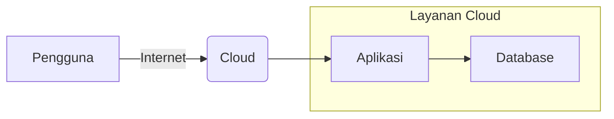
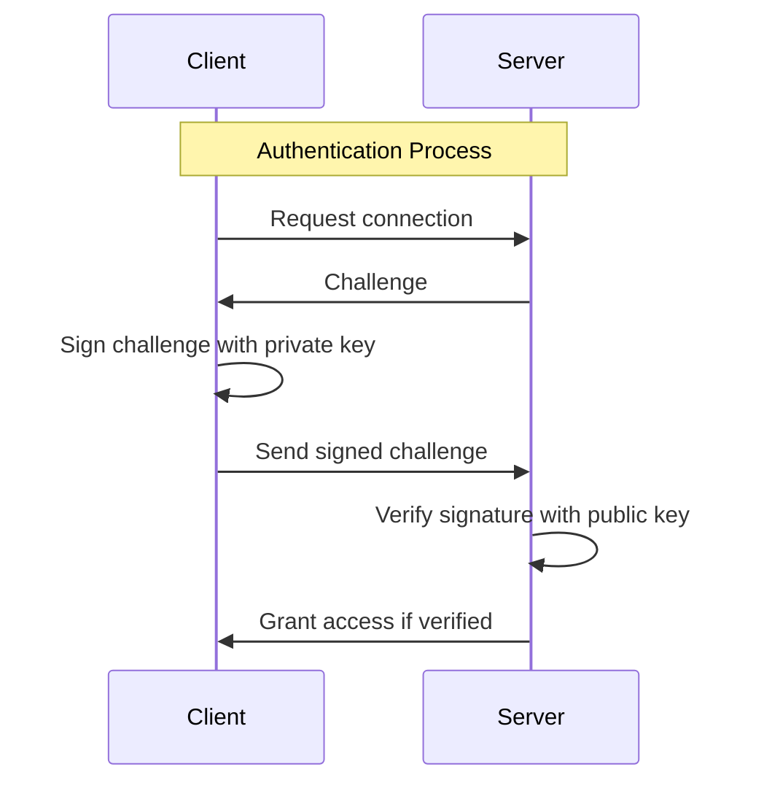

# 6. Introduction to Cloud Computing

Author: Hudya

---

## Overview

Setelah mempelajari tools demi tools, sekarang kamu akan mempelajari sedikit teori tentang cloud computing.

Cloud computing pada dasarnya adalah penggunaan sumber daya komputasi (seperti server, penyimpanan, database, jaringan, perangkat lunak, dan layanan lainnya) melalui internet, tanpa perlu mengakses atau mengelola infrastruktur fisik secara langsung.

Mungkin kamu pernah mendengar, atau kenal dengan orang yang bekerja di bidang IT dan dekat dengan server. Tentu pernah mendengar betapa dinginnya ruang server.

Nah ruang server yang berada di dekat orang IT tersebut belum tentu dikatakan sebagai cloud computing, karena akses ke server harus melalui internet. Artinya orang IT yang mengakses server secara langsung melalui jaringan yang sama tidak dapat dikatakan dengan Cloud Computing.

Ada banyak penyedia layanan cloud computing dari perusahaan besar seperti Amazon Web Service, Google Cloud Computing, Microsoft Azure, Alibaba Cloud.

Provider lokal juga menyediakan layanan cloud computing seperti DewaWeb, IDCloudhost, Niagahoster, dan lainnya.

## Keuntungan

Penggunaan Cloud Computing sangat menguntungkan, terutama untuk para startup yang baru membuat produk secara online.

Kamu sebagai indiehacker atau bahkan programmer yang sedang belajar juga dapat menggunakan cloud computing.

Nah mengapa sebagian perusahaan menggunakan cloud computing?

- **Skalabilitas**: Cloud computing memungkinkan pengguna untuk dengan mudah meningkatkan atau menurunkan kapasitas server sesuai kebutuhan.
- **Pay-as-you-go**: Pengguna hanya membayar untuk sumber daya yang mereka gunakan tanpa memikirkan listriknya.
- **Aksesibilitas**: Sumber daya dapat diakses dari mana saja dengan koneksi internet.
- **Keandalan**: Penyedia layanan cloud biasanya menjamin bahwa server tidak akan down.
- **Keamanan**: Penyedia layanan cloud umumnya memiliki sistem keamanan yang canggih salah satunya adalah pencegahan serangan DDoS.
- **Jenis layanan**: Ada berbagai jenis layanan cloud, seperti Infrastructure as a Service (IaaS), Platform as a Service (PaaS), dan Software as a Service (SaaS).
- **Shared resources**: Sumber daya biasanya dibagi di antara banyak pengguna, meskipun secara logis terpisah.

## Diagram Cloud Computing

Teori bagaimana menggambarkan akses pengguna ke cloud computing itu sederhana. Perhatikan diagram di bawah ini.

Pengguna akan mengakses layanan cloud melalui internet dimana layanan cloud yang kita bisa anggap server (Virtual machine) berisi aplikasi atau database.

## Latihan

Sebenarnya untuk berlatih Cloud Computing, secara tidak langsung kamu sudah melakukannya, yaitu dengan **Multipass**.

Multipass kita simulasikan sebagai sebuah server agar dapat kalian akses secara langsung, meskipun tidak dapat dikatakan sebagai cloud computing, namun experience yang kalian dapatkan akan sama saja.

Kalian bisa mengakses server melalui IP Address pada saat menampilkannya melalui perintah `multipass list`.

Menggunakan perintah `sudo ssh username@ip-address` kalian akan diminta memasukkan password. 

Selanjutnya, kamu dapat menggunakan public key dan private key.

