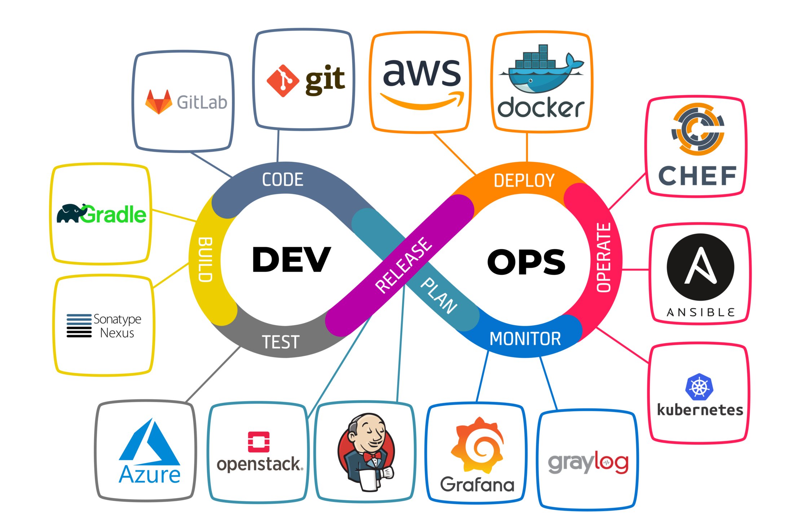
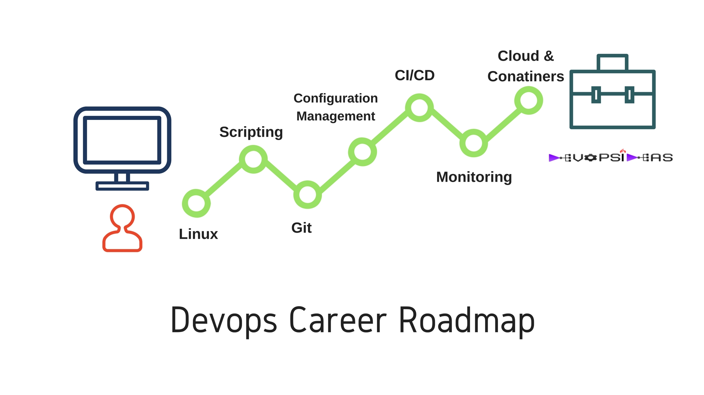

# Overview
---

Kalian anak IT? udah pernah denger yang namanya Development Operational belum? kalau belum sini saya jelaskan. Berdasarkan pengertian google DevOps adalah serangkaian praktik yang bertujuan untuk meningkatkan kolaborasi dan komunikasi antara tim pengembangan (Development) dan tim operasional (Operations) dalam proses pengembangan dan pengelolaan sistem perangkat lunak.

Masih bingung? mari kita ambil contoh dibidang manufaktur. Bayangkan ada pabrik mobil yang ingin memproduksi mobil yang berkualitas tinggi dan sesuai dengan kebutuhan pelanggan. Dalam hal ini, tim pengembangan (Development) seperti tim desain yang merancang mobil, sedangkan tim operasional (Operations) seperti tim produksi yang memasang mobil.

Dalam model tradisional, tim desain dan tim produksi bekerja secara terpisah, sehingga mobil yang diproduksi mungkin tidak sesuai dengan kebutuhan pelanggan. Namun, dengan adanya DevOps, tim desain dan tim produksi bekerja sama untuk memastikan bahwa mobil yang diproduksi adalah yang terbaik dan sesuai dengan kebutuhan pelanggan.

> Terus gunanya DevOps cuman itu aja?

Tentunya tidak, ini adalah keuntungan sebuah perusahaan jika menggunakan DevOps:

- Komunikasi lebih baik antar team
- Proses development yang lebih cepat dan efisien
- Output dengan kualitas yang tinggi
- Fleksibilitas dan Skalabilitas
- Dan masih banyak lainnya

DevOps juga punya [gaji](https://www.jobstreet.co.id/id/career-advice/role/devops-engineer/salary) diatas rata-rata pekerjaan IT yang lainnya loh, dari sini tertarik gak untuk belajar DevOps?

###### 

Kalau kalian tertarik untuk belajar DevOps, kalian harus paham juga beberapa hal, mulai dari apa itu [Linux](https://opensource.com/resources/linux), [Version Control System](https://git-scm.com/book/id/v2/Memulai-Tentang-Version-Control#:~:text=Sistem%20Version%20Control%20Lokal,juga%20sangat%20rentan%20terkena%20galat.), [Virtualisasi](https://aws.amazon.com/id/what-is/virtualization/), [CI/CD](https://www.dicoding.com/blog/apa-itu-ci-cd/), dan lain lainnya.

> Kok banyak amat yang harus dipahami?

Santai dulu jangan kewalahan dulu, dimodul kali ini kita akan belajar semua itu tapi kita fokusin materi nya satu per-satu, team komandro juga sudah perkirakan akan hal ini kok, jadi kita bakalan buat modul yang bener bener straight line, yang artinya kalian bisa ikuti dari awal hingga akhir tanpa harus pusing mau belajar yang mana dulu.

Berikut modul - modul yang kalian akan pelajari:

- Introdcution to Linux & Virtualization
- Understanding Build & Deploy
- Introduction to Webserver
- Cloud Computing & Containerization
- Introduction to CI/CD
- Introduction to Infrastructure as a Code (IaC)
- IaC Advanced
- Security Server Access

Untuk mengasah kemampuan kalian dari modul - modul diatas terdapat latihan & project nya juga loh.

Sebelum mulai saya ada quotes keren buat kalian,

"*Your value is not determined by what you are, it is determined by what you are capable of*"

Yang artinya kalau kalian ingin gaji besar skill kalian juga harus berharga, makanya wajib tuntas untuk belajar DevOps 😉.

Jadi langsung kita mulai aja yuk ke modul pertama.
