Contributor : 
- snickerdoodless
- mawlibrahim
- mawanx

> Learning with visual representation is easier than reading only-theoretical materials - snickerdoodles

Author: snickerdoodles
# Chapter 1. Linux and Virtualization
***
- [Introcution to Linux](#introduction-to-linux)
- [Virtualization](#virtualization)
	- [Multipass](#multipass)
		- [Installing Multipass](#installing-multipass)
	    - [Launching Multipass](#launching-multipass)
- [Command Line Interface](#command-line-interface)
	- [Basic Commands](#basic_commands)
		- [Navigating Linux System](#navigating-linux-system)
		- [Managing File & Folder](#managing-file-&-folder)
		- [Linux Manpages](#linux-manpages)
	- [Command Line Expansions](#command-line-expansions)
		- [Redirection](#redirection)
		- [Pattern, Brace & Tilde Expansions](#pattern,-Brace-&-Tilde-Expansions)
		- [Pipes & Command Separator](#pipes-&-command-separator)
- [Multipass Mounting](#multipass-mounting)
- VIM
	- How to Master VIM
	- VIM Pro & Cons
- Bash Scripting
	- Syntax
		- Variable
		- Condition
		- Loops
	- Making Function
	- Receiving Bash Input File
- Practice 1
- Practice 2
- Summary

<br />

# Introduction to Linux
***
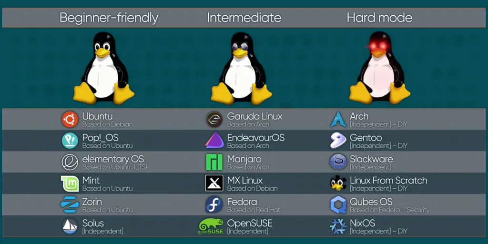

Sedikit perkenalan untuk Operting System Linux untuk kalian yang belum tahu apa itu Linux. Jadi intinya sama seperti Windows yang kalian pake, Linux itu salah satu dari banyaknya OS. Dibandingkan dengan Windows yang bayar, Linux itu gratis (kecuali yang untuk enterprise seperti redhat) dan Linux juga opensource, yang artinya siapapun bisa buat Linux versinya sendiri. Linux itu banyak gak cuman 1 kalau kalian penasaran bisa lihat di URL berikut:

[Linux Distribution](https://upload.wikimedia.org/wikipedia/commons/1/1b/Linux_Distribution_Timeline.svg).

Tapi jangan pusing, dari segitu banyaknya versi dari Linux modul ini bakalan fokus pake yang versi Ubuntu aja.

Ada satu hal yang membedakan user Linux dan Windows yaitu penggunaan Terminal atau bisa disebut juga dengan Bash kalau di Windows itu sama seperti CMD/Powershell user Linux sudah pasti bisa pakai Windows tapi belum tentu sebaliknya.

Tapi kalian tau gak kalo di komputer itu bisa di install komputer lagi?

Ayo kita kenalan dengan Virtualisasi! 🤖


<br />

# Virtualization
***
Pernah kebayang gak? Install Linux didalam Windows? Keren kan! Itulah gunanya Virtualisasi, dengan adanya teknologi ini jadi kita gak perlu tuh beli banyak banyak komputer untuk dijadikan environment.

Contoh, misalkan suatu perusahaan mau membuat websitenya sendiri otomatis yang dia butuhkan environment komputer khusus untuk server, database, dan komponen lainnya, coba kalian bayangin dari segitu banyaknya requirements untuk membuat suatu website, masa perusahaan tersebut harus beli banyak komputer? Gak efisien kan? Mahal pula 🥴.

Disinilah Virtualisasi masuk, untuk lebih memahami Virtualisasi mari kita analogikan, bayangkan kamu memiliki sebuah bangunan besar yang dapat menampung banyak apartemen. Setiap apartemen memiliki ruangannya sendiri, tetapi mereka semua berbagi infrastruktur yang sama, seperti listrik, air, dan jaringan.

Dalam konteks Virtualisasi, bangunan apartement tersebut dapat diibaratkan sebagai sebuah server host kalian, sedangkan apartemen-apartemen di dalamnya dapat diibaratkan sebagai mesin virtual (VM). Setiap VM memiliki sistem operasi dan aplikasinya sendiri, tetapi mereka semua berjalan di atas infrastruktur yang sama, yaitu server host. Dengan demikian, Resource server host kalian (Hardware) dapat dibagi dan digunakan secara efisien oleh banyak VM.

Coba lihat gambar berikut:


Simpelnya gini,

Operating System pada umumnya
```
Hardware > OS Host > Application
```

Operating System pada virtualisasi
```
Hardware > OS Host > Virtualization > Sharing Resource Hardware > OS VM > Application 
```

Jadi intinya kalau mau install OS seperti pada umumnya caranya cuman install OS pada Hardware kalian, sedangkan Virtualisasi sama seperti yang sudah dianalogikan diatas untuk menjalankan Virtualisasi di komputer kalian Hardware kalian akan sharing resource (Hardwarenya) dengan OS host untuk membuat mesin Virtualisasi baru, begitu jadinya.😊

Berikut adalah keuntungan utama menggunakan virtualisasi:

-  **Penghematan Biaya**: Hemat karena gak usah beli komputer yang banyak.
-  **Efisiensi Resources**: Manageable CPU, memori, dan storage.
-  **Skalabilitas dan Fleksibilitas**: Mudah menambah atau mengurangi kapasitas environment.
-  **Manajemen Mudah**: Administrasi, backup, dan pemulihan lebih efisien.
-  **Keamanan dan Isolasi**: Mesin virtual terisolasi dan meningkatkan keamanan.
-  **Disaster Recovery**: Snapshot dan backup mudah dalam pemulihan data.
-  **Testing dan Development**: Testing environment yang fleksibel tanpa ganggu sistem utama.
-  **Mobilitas dan Migrasi**: Mudah buat bermigrasi dan minimalisirkan downtime.

Sekarang, karena kalian sudah paham tentang Virtualisasi, ayo kita praktekan dengan mencoba membuat VM ubuntu di Multipass, let's goo!

<br />

## Multipass

Sekarang kita akan belajar Ubuntu dengan menggunakan Multipass, jadi pada umumnya Multipass ini adalah sebuah software yang khusus digunakan untuk Virtualisasi operating system khusus untuk Ubuntu.

<br />

> Kenapa pake Multipass? Kan ada yang lain kayak Vbox dan kawan-kawan.

Karena kita hanya pakai Ubuntu aja jadi Multipass solusinya, lagipula Multipass itu lebih ringan, cepat, mudah dan fleksibel jadi kita memutuskan untuk memakai Multipass untuk modul kali ini, misalkan ingin menggunakan Hypervisor maka akan lebih ribet karena kita harus download OS nya terlebih dahulu dalam bentuk CD, ISO, ataupun VM yang sudah jadi, langsung aja cara install Multipass dibawah ini.

<br />

### Installing Multipass

Klik link [ini](https://multipass.run/install) dan pilih Windows untuk download.
Setelah terdownload buka Multipass installernya lalu klik next aja terus hingga selesai.

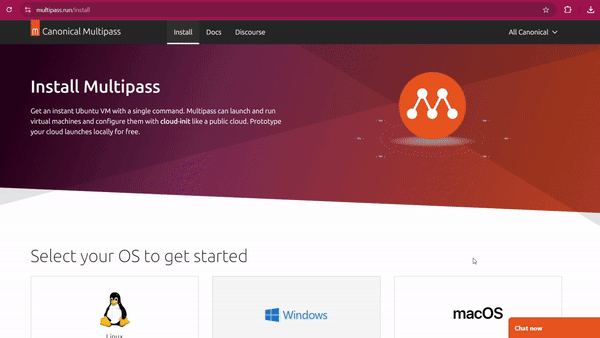

Next buka Windows terminal dengan cara pencet logo Windows + R terus ketik (CMD/Powershell).

<br />

### Launching Multipass

Buat kalian yang masih belum biasa dengan Terminal cukup ikutin aja, nanti lama lama terbiasa 😉.

Untuk membuat Virtual Machine baru
```bash
multipass launch --name ubuntu-instance
```

Untuk melihat Virtual Machine yang sudah dibuat
```bash
multipass ls
```

Untuk remote execution command
```bash
multipass exec ubuntu-instance whoami
```

<br />

> [!NOTE]
> Disini saya menggunakan CMD, kalian bebas bisa gunakan Terminal lain.

<br />

Kalian juga bisa melihat command-command lainnya dari Multipass dengan cara dibawah ini.


Seperti yang kalian lihat untuk mengetahui command-command dimultipass itu buat apa saja tinggal tambahkan `--help` di belakang command

Nah, sekarang multipass kita sudah siap dipakai selanjutnya kita akan belajar tentang command-line let's go to next section!

<br />

# Command Line Interface
***
"Command Line Interface atau biasa disebut CLI adalah interface yang memungkinkan user untuk berinteraksi dengan komputer atau sistem operasi melalui teks perintah. Pengguna mengetikkan perintah di baris perintah (command line) dan sistem akan mengeksekusi perintah tersebut serta menampilkan hasilnya di layar" - Google (2k24).

Seperti yang kalian gunakan untuk Multipass diatas itu salah satu contoh dari CLI. Biasanya CLI umumnya dipakai oleh user yang lebih berpengalaman karena memerlukan pengetahuan tentang perintah-perintah yang tersedia dan sintaksnya. 

Dan di Section kali ini kamu juga akan menjadi salah satu user yang berpengalaman untuk belajar sedikit tentang CLI ini. Jadi CLI itu terstruktur dari 2 hal yaitu Command dan Argument.

Sebagai contoh:
```bash
ping google.com 

# ping = perintah utama
# google.com = argument yang diinginkan
```

Contoh lain:
```bash
ipconfig --all

# ipconfig = perintah utama
# -- all = flag, flag juga dianggap sebagai argument
```

<br />

> [!NOTE]
> Buat kalian yang bingung flag itu apa jadi disetiap command itu pasti punya flag, flag itu bakal diketik dengan character `-` atau `--` contohnya seperti `--help` di section Multipass

<br />

Argumen juga tidak terbatas asalkan kalian mengetikan command yang masuk akal serta menyesuaikan dengan flag yang diberikan command tersebut contohnya seperti ini:
```bash
ping -4 192.168.18.1 -s 100 -c 5 -T tsonly > reportping.txt
```

<br />

> Waduh kok banyak amat flag nya itu buat apa aja?

Santai dulu kalian gak usah pahamin dulu perintah diatas buat apa nanti kita bahas yah sabar sekarang kita lanjut belajar basic command Linux dulu skuy 😄.

<br />

## Basic Commands

Semua pasti berawal dari basic, disection ini kita bakal belajar perintah-perintah dasar Linux mulai dari bagaimana caranya navigasi di Linux sistem, membuat file atau folder, menghapus file & folder, dan juga membaca manual tentang perintah perintah dasar di Linux, langsung aja yang pertama kita akan belajar cara navigasi di Linux System.

Untuk mempraktekan command-command yang akan kita pelajari, kita bakalan menggunakan Multipass yang sudah di install, langsung aja ketik command dibawah ini.

```bash
multipass shell ubuntu-instance
```

<br />

### Navigating Linux System

Untuk berpindah - pindah tempat pada Linux System itu menggunakan perintah cd yaitu alias dari change directory, ikuti perintah dibawah ini dari awal agar kalian tidak bingung.

```bash
# Pindah ke folder Home user
cd /home/ubuntu

# Pindah ke folder tmp
cd /tmp

# Melihat posisi kita didalam Linux System
pwd
# result: /tmp

# Pindah ke folder terakhir kali kita berada
cd -
# result: /home/ubuntu

# Pindah mundur satu folder kebelakang
cd ..
# result: /home

# Pindah ke /etc/opt folder dari posisi kita saat ini (yaitu /home)
cd ../etc/opt
pwd
# result: /etc/opt

# Pindah mundur dua folder kebelakang
cd ../..
pwd
# result: /

# Menggunakan perintah cd untuk muter muter folder dari home ke home lagi
cd /home
pwd
# result: /home

cd /home/ubuntu/../../etc/opt/../../tmp/../home
pwd
# result: /home
```

Gimana? paham nggak? gampang kan, itu adalah perintah basic Linux buat navigasi atau berpindah pindah folder/direktori, kalau di Windows itu tinggal pencet ⬅️ atau ➡️ arrow untuk berpindah pindah tempat direktori kalian. Next kita bakal belajar cara membuat direktori dan file.

<br />

### Managing Files & Folder

Untuk manage file atau folder pada Linux System bisa menggunakan perintah `mkdir`, `touch`, `file`, `cat`, `grep` dan `nano`, tanpa basa - basi kalian bisa ikuti perintahnya dibawah ini.

<br />

> [!NOTE]
>  Untuk cara menggunakan `vim` akan dibahas di next section, sekarang kita hanya menggunakan `nano`.

<br />

```bash
#Membuat file kosong dengan touch
touch testfile.txt
````

```bash
# Melihat file dilokasi saat ini
ls 
# result: reportping.txt testfile.txt
```

```bash
# Mengidentifikasi tipe file
file testfile.txt
# resutl: testfile.txt: ASCII text
```

```bash
#Mengedit file testfile.txt dengan nano
nano testfile.txt
```

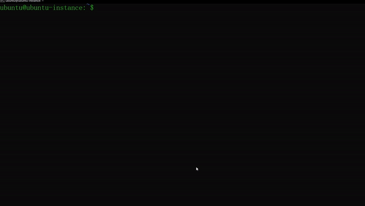

CTRL + X ENTER Y TO SAVE & EXIT

```bash
# Melihat isi konten sebuah file
cat testfile.txt
# result: Hello World!
```

Dan kalian bisa langsung membuat file langsung dengan nano tanpa `touch` command terlebih dahulu.

```bash
# Mengambil kata spesifik dari sebuah file
grep "World!" testfile.txt
# result: hello World! < diterminal hasilnya akan terhighlight 
```

```bash
# Membuat folder kosong
mkdir testfolder
ls -p
# result: reportping.txt testfile.txt testfolder/
```

Kalian notice tanda `/` di Linux System itu menandakan bahwa itu adalah sebuah folder, untuk mengkonfirmasi nya kalian bisa melihat peritah dibawah ini.

```bash
ls -la
# result:
total 48
drwxr-x--- 6 ubuntu ubuntu 4096 Aug  2 09:05 .
drwxr-xr-x 3 root   root   4096 Jul 31 19:55 ..
-rw------- 1 ubuntu ubuntu 1390 Aug  1 20:59 .bash_history
-rw-r--r-- 1 ubuntu ubuntu  220 Mar 31 15:41 .bash_logout
-rw-r--r-- 1 ubuntu ubuntu 3771 Mar 31 15:41 .bashrc
drwx------ 2 ubuntu ubuntu 4096 Jul 31 19:56 .cache
drwxrwxr-x 3 ubuntu ubuntu 4096 Aug  2 08:47 .local
-rw-r--r-- 1 ubuntu ubuntu  807 Mar 31 15:41 .profile
drwx------ 2 ubuntu ubuntu 4096 Jul 31 19:55 .ssh
-rw-r--r-- 1 ubuntu ubuntu    0 Jul 31 21:19 .sudo_as_admin_successful
-rw-rw-r-- 1 ubuntu ubuntu  518 Aug  1 09:27 reportping.txt
-rw-rw-r-- 1 ubuntu ubuntu   13 Aug  2 08:47 testfile.txt
drwxrwxr-x 2 ubuntu ubuntu 4096 Aug  2 09:05 testfolder
```

Kalian bisa abaikan saja yang lain dan fokus hanya pada testfolder, bisa kalian lihat dipaling awal kiri testfolder itu terdapat character `d` di Linux System itu menandakan bahwa itu adalah sebuah directory/folder.

<br />

> [!NOTE]
>  Just a quick note, buat kalian yang bingung apa tuh rwxrwxrwx ini sebenernya berkaitan dengan Linux File Permission dan ini akan panjang jika dibahas, simplenya gini `r = read`, `w = write`, `x = execute` dan character `-` itu menandakan no permission alias tidak ada izin, also as you can see ada nama ubuntu di testfolder dan testfile yang artinya mereka berdua punya user ubuntu.

<br />

Kalian juga bisa identifikasi folder menggunakan perintah `file` seperti file diatas.

```bash
# Memindahkan file ke dalam folder
mv testfile testfolder/

ls testfolder/
# result: testfile.txt
```

```bash
# Copy file dari direktori testfolder/ ke /home/ubuntu
cp testfolder/testfile.txt /home/ubuntu

# atau

cp testfolder/testfile.txt . # titik melambangkan posisi folder saat ini
ls -R

# result:
reportping.txt  testfile.txt  testfolder

./testfolder:
testfile.txt
```

```bash
# Mengspesifikan pembuatan file difolder tertentu
nano /tmp/tempfile.txt
```

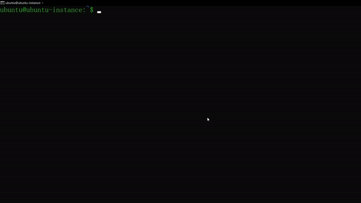

```bash
# Menghapus file 
rm reportping.txt
ls
# result: testfile.txt testfolder
```

```bash
# Menghapus folder
rmdir testfolder/
# result: rmdir: failed to remove 'testfolder/': Directory not empty
```

Bisa kalian lihat kalau menghapus folder menggunakan `rmdir` itu tidak bisa, karena `rmdir` hanya untuk menghapus folder/directory kosong.

```bash
# Menghapus folder dengan paksa
rm -rf testfolder/
ls
# result: testfile.txt
```

```bash
# Menghapus folder dan file bersamaan
mkdir testfolder/
ls
# result: testfile.txt testfolder

rm -rf testfolder/ testfile.txt
ls
# result: 
```

Sampai sini paham? kalau belum paham santai next section kita bakal bahas tentang dokuentasi dari sebuah perintah agar kalian bisa lebih paham tapi kalau kalian sudah paham, selamat kalian adalah calon-calon Linux System Administrator dan satu langkah maju menuju seorang DevOps, horee!! 🥳. 

<br />

## Linux Manpages

Kalau kalian merasa kurang mengerti gunanya berbagai flag dalam sebuah command walaupun sudah pakai trick `--help` kalian jangan bingung, Linux sendiri punya official documentation untuk masing masing command yang kalian ingin ketahui, jadi section kali ini gak akan panjang-panjang karena yang akan dibahas sangat simple yaitu gimana caranya membaca dokumentasi dari sebuah command di Linux System, langsung aja dibawah ini.

```bash
# Untuk melihat manual pada sebuah command
man (command yang ingin dipelajari)

#contoh
man apt # manual untuk perintah install di linux
```


Seperti gambar diatas kalian juga bisa berinteraksi dan navigasi saat membaca manual dari `man` command pencet `q` untuk quit dan pencet `h` untuk guide cara berinteraksi di man interface. Selain dari `man` command kalian juga bisa gunakan `man` lewat google, caranya klik [disini](https://man7.org/linux/man-pages/) dan cari command apa yang kalian mau lihat.

Table lengkap cara navigasi man interface:

| Command     | Result                                  |
| ----------- | --------------------------------------- |
| `Spacebar`  | Scroll kebawah dengan melompat selayar  |
| `DownArrow` | Scroll kebawah satu persatu             |
| `UpArrow`   | Scroll keatas satu persatu              |
| `D`         | Scroll kebawah melompat setengah layar  |
| `U`         | Scroll keatas melompat setengah layar   |
| `/string`   | Untuk mencari suatu kata atau paragraph |
| `N`         | Kembali ke pencarian sebelumnya         |
| `Shift+N`   | Kembali ke pencarian semula             |
| `G`         | Pergi ke start manpage                  |
| `Shift+G`   | Pergi ke end manpage                    |
| `Q`         | Keluar dari manpage interface           |

<br />

> [!NOTE]
> Ada alternative man command yaitu `info` command, bedanya `info` itu lebih complete dan lengkapp hingga penjelasan dan contoh dari setiap flag intinya seperti full documentation dari sebuah command, tapi `info` command sudah tidak dimaintain lagi dikarenakan sudah tidak terlalu relevan dan digantikan dengan `man` command.

<br />

## Command Line Expansions
***

Command line expansions yaitu fitur shell bawaan dari Linux System yang memungkinkan kalian bisa manipulate and expanding sebuah command, file names, dan directory di CLI kalian, fitur ini bisa digunakan untuk shortcut, patterns, variables untuk men-spesifikan sebuah files, directory atau commands lainnya. 

Bingung kan? gapapa kita langsung masuk ke contoh disection berikutnya.

<br />

### Redirection

Kalian sadar gak disection atas yang membahas CLI dan Argument disalah satu contoh command nya ada yang menggunakan character `>`, ternyata itu ada guna nya lohh, seperti judul section yaitu redirection kegunaan character seperti `>` (output redirection), `<` (input redirection) dan terakhir`&` (both redirection), adalah fitur Linux yang keren buat mempermudah seorang Sysadmin, sebelum mulai ke contoh kalian harus paham dulu konsep standard input (stdin), standard output (stdout) dan standard error (stderr) di Linux System.

<br />

> [!NOTE]
> Sedikit perkenalan sama yang namanya file descriptor, intinya begini `0` itu melambangkan stdin, `1` stdout, dan `2` stderr, gak usah bingung cukup tau ini aja.

<br />

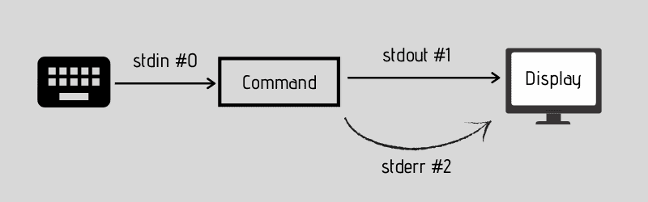

**STDIN, STDOUT, & STDERR** 

Simplenya gini ketika kalian mengetikan command di Terminal di background Linux System akan memproses command tersebut kedalam `stdin #0`, dan `stdout #1` akan melakan tugasnya untuk menampilkan hasil dari command kalian ke layar, jika input kalian asal asal, tidak sesuai atau tidak logis, maka tugasnya si `stderr #2` buat menampilkan message error nya ke kalian.

Jadi flow nya gini:
```
Kalian input command di terminal > stdin menerima input > diforward ke stdout jika sukses atau ke stderr jika error.
```

Langsung aja kita ke contoh - contoh command dibawah ini.

**Output Redirection**

```bash
# Redirect command menjadi sebuah file
whoami > profile.txt
cat profile.txt
# result: ubuntu
```

```bash
# Membuat teks langsung di CLI tanpa teks editor seperti nano/vim
echo "Hello World!" > hello-world.txt
cat hello-world.txt
# result: Hello World!
```

```bash
# Menambahkan teks ke paling belakang dan membuat newline di file (appending)
echo "My name is John Doe!" >> hello-world.txt
cat hello-world.txt
# result: 
# Hello World! 
# My name is John Doe!
```

```bash
# Sama seperti diatas tapi tidak dengan newline
echo -n " Nice to meet you!" >> hello-world.txt
# result: 
# Hello World!
# My name is John Doe! Nice to meet you!
```

<br />

> [!NOTE]
> Ada alternative `echo` command yaitu `printf`

<br />

```bash
# Redirect error message ke file
mkdir testerror
rm testerror/ 2> error.txt
cat error.txt
# result: rm: cannot remove 'testerror/': Is a directory
```

```bash
# Redirect both stdout and stderr
cat nonexistingfile &> example.txt
# result: cat: example.txt: No such file or directory
```

Command satu yang diatas ini agak tricky karena kalian gak bisa bedainnya, kalau kalian ketik command `cat nonexistingfile` hasilnya akan sama, bedanya outputnya diredirect ke file `example.txt`, tapi yang terjadi di background itu seperti ini:

What `&>` do:

Redirection `&>` melakukan dua hal ini:

1. **Redirected stdout**: Redirect `stdout` command ke file `example.txt`, tapi karena commadnya tidak menghasilkan output apapun (hanya error) stdoutnya jadi kosong.
2. **Redirected stderr**: `stderr` nya keredirect ke file `example.txt`, makanya ada message `cat: example.txt: No such file or directory`

**Input Redirection**

Input redirection tidak memiliki banyak utilitas dalam perintah dasar Linux. Perintah-perintah dasar lebih sering menerima input langsung dari pengguna atau dari file yang diberikan sebagai argument tanpa harus menggunakan `<`. Tapi, redirection input biasanya ditemukan dalam bash scripting (yang akan dibahas nanti). Dalam konteks ini, input redirection digunakan untuk mengotomatisasi proses dengan mengambil input dari file bash script.

Contoh input redirection itu tidak banyak utility dalam command biasa:

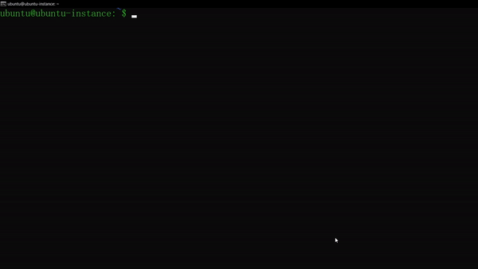

Bisa dilihat tanpa menggunakan `<` hasilnya masih tetap sama.

<br />

### Pattern, Brace & Tilde Expansions

**Pattern Matching**

"Pattern matching di Linux adalah konsep yang digunakan untuk mencocokkan pola teks dalam file atau output perintah. Ini sangat berguna saat kita ingin mencari atau memfilter data berdasarkan pola tertentu." --chatgpt 2k24.

Simple nya gini sesuai dengan namanya yaitu Pattern dan Matching, fitur Linux System ini sangat sangat berguna buat para Sysadmin supaya bisa meringankan tugas mereka, langsung aja kita praktekan dibawah ini.

Table Wildcards:

| Pattern | Matches                                |
| :-----: | -------------------------------------- |
|   `*`   | Semua string, integer atau characters. |
|   `?`   | Hanya single character.                |
|  `!()`  | Tidak termasuk didalam bracket         |


Petama kita buat dulu beberapa random files untuk dijadikan contoh output ketika menggunakan Pattern Matching, biar gak ribet copas aja codenya dibawah ini kemudian paste di Terminal dengan klik kanan.


```bash
touch file1.txt file2.txt file0.txt report.txt revshell.php notes.txt data.xlsx suratcintauntuknya.eml
```

Contoh penggunaan pattern match:

```bash
# List semua file yang berakhiran .txt
ls *.txt
# result: file0.txt  file1.txt  file2.txt  notes.txt  report.txt
```

```bash
# List semua files yang ada huruf o nya
ls *o*.txt
# result: notes.txt report.txt
```

```bash
# List semua files yang salah satu characternya tidak diketahui
ls f?le?.txt # length characternya harus sama kalau mau pake ?
# result: file0.txt  file1.txt  file2.txt
# ls f?le? ⬅️ tidak akan bisa
```

```bash
# Mengecualikan file .txt
ls !(*.txt)
# result: data.xlsx  revshell.php  suratcintauntuknya.eml
```


**Brace Expansions**

Brace expansion adalah fitur di bash shell yang memungkinkan kalian untuk membuat sebuah list strings dengan cara pattern expanding, intinya shortcut untuk list suatu strings, contohnya seperti ini `{a,b,c}`, dikonteks Linux command biasanya brace expansion digunakan buat managing huge amount of files or some bash scripting stuff.

```bash
# Membuat list file kosong dari 1 - 5
touch file{1,2,3,4,5}

# atau

touch file{1..5} # .. hanya berlaku untuk angka dan alphabet
ls
# result: file1 file2 file3 file4 file5
```

```bash
# Membuat folder berdasarkan tahun
mkdir report{2020..2025}
ls
# result: 
report2020/ report2021/ report2022/ report2023/ report2024/ report2025/
```

```bash
# Membuat file dengan nama dan nomor
touch client_{Abdur,Baim,KS}{1..3}.txt
# result: client_Abdur1.txt client_Baim2.txt client_KS3.txt
```

```bash
# Membuat file nested recursive
touch file{a{1..2},b,c}.txt
# result: filea1.txt filea2.txt fileb.txt filec.txt
```


**Tilde Expansions**

Karakter tilde `~`, matching sama direktori home user saat ini.

Lihat gambar dibawah ini:

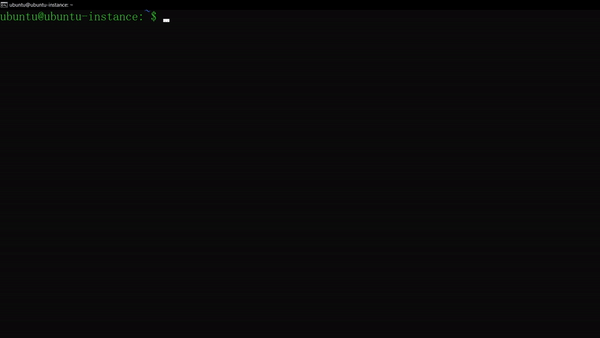

Seperti yang kalian lihat character `~` melambangkan home directory dari user ubuntu.

<br />

### Pipes & Command Separator

Oke untuk last section Command Line Interface akan membahas fitur keren Linux ini yaitu semacam seperti escaping command, intinya nanti kalian bisa menjalankan berbagai command (multiple command) dalam sekali tekan tombol enter, langsung aja contohnya dibawah ini.

**Pipes**

```bash
# Menggunakan pipes untuk execute multiple commands
cd /tmp | touch tempfile.txt | ls
# result: tempfile.txt

cat /etc/passwd | grep ubuntu > profile.txt | ls
# result: tempfile.txt profile.txt
```

```bash
# Menggunakan double pipes untuk execute salah satu command
mkdir /tmp || mkdir ~/tmp
# result: mkdir: cannot create directory ‘/tmp’: File exists
ls
# result: tmp/
```

<br />

> [!NOTE]
>  Double pipes `||` sebenernya di Linux itu adalah OR logical operator 

<br />

**Command Separator**

```bash
# Menggunakan command separator untuk execute multiple command juga
mkdir /tmp/notes/ ; touch notes.txt ; mv notes.txt /tmp/notes ; ls /tmp/notes/
# result: notes.txt
```

<br />

> Bedanya sama pipes apa?

Jadi bedanya pipes dan command separator yaitu pipes biasanya digunakan untuk passing output dari sebuah command untuk dijadikan input ke command lainnya, sedangkan command separator itu mengeksekusi command secara sequential atau berurutan. lihat command dibawah untuk bedainnnya.

```bash
# Pipes
echo -e "line1\nline2\nline3" | wc -l
# result: 3
```

```bash
# Command separator
echo -e "line1\nline2\nline3"; wc -l
# result:
line1
line2
line3
0
```

Gimana? sampai sini sudah paham dan terbiasa tentang CLI & Command Linux gak? kalo sudah horee! kalian resmi gabung menjadi Linux nerds 🤓 dan sekali lagi maju satu langkah menjadi seorang DevOps, Mungkin untuk cara penggunaan command-command di Linux sampai sini aja karena kita selanjutnya akan membahas bagaimana cara mounting di Multipass.

<br />

> Apa tuh mounting?

Santai di next section bakal dijelaskan dan kegunaannya juga buat apa, tanpa basa-basi let's goo!

<br />

# Multipass Mounting
***

Kalian tau gak walaupun virtualization itu sharing resource antar host dan virtual machine, tapi mereka itu gak sharing data dan informasi lohh kayak files & folder, nah ini tuh menjadi masalah utama kalau seandainya kita butuh data atau informasi penting entah dari host ke vm atau sebaliknya, makanya kali ini team komandro bakalan ngajarin caranya sharing data di multipass dengan cara mounting storage kalian dari host ke vm agar bisa sharing data, tanpa lama-lama let's go ke tutorialnya dibawah ini.

**1. Pastikan multipass instance nya running seperti digambar ini.**
 
 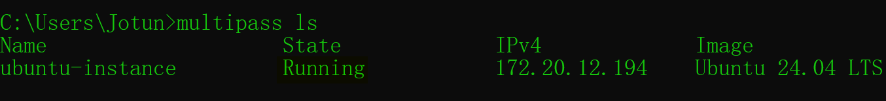

**2. Tentukan folder yang akan dibuat untuk sharing data kalian di host.**
**3. Buat foldernya dan berikan namanya tanpa spasi untuk memudahkan kalian.**

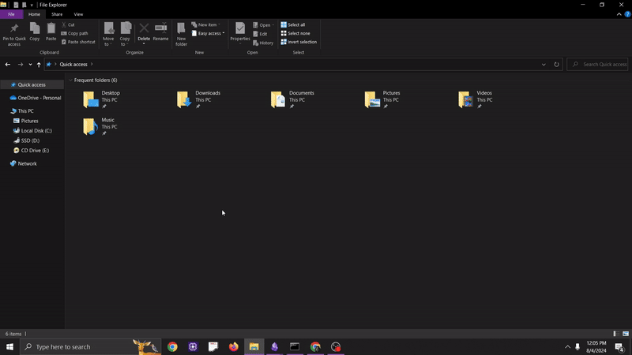

**4. Jika sudah balik lagi ke CMD/Powershell dan ketikan command dibawah ini.**

```cmd
multipass set local.privileged-mounts=true
```

> [!WARNING]
> Command `multipass set local.privileged-mounts=true` rentan terhadap teknik priviledge escalation, dalam sebuah company pakai mounting jika kalian butuh saja dan jika sudah selesai disable mounting kalian.

<br />

**5. Next, jalankan perintah dibawah ini untuk mount folder share kalian ke instance kalian (sesuaikan path folder kalian).**

```cmd
multipass mount D:\Sharing ubuntu-instance:/home/ubuntu/shares
```

**6. Cek status mounting seperti dibawah ini.**

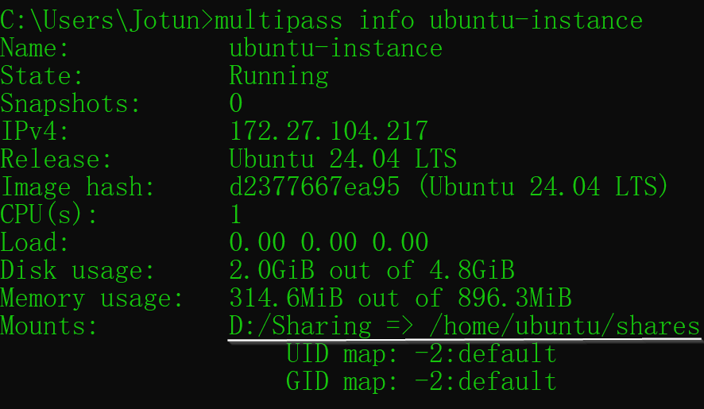

**7. Test mountingnya dengan cara buat/copy file di folder mounting kalian seperti dibawah ini.**

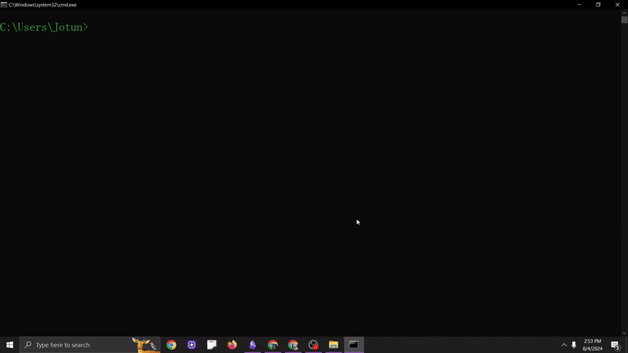

**8. Jika kalian sudah selesai untuk mountingnya silahkankan unmount kembali folder nya dengan ikuti command dibawah ini.**

```bash
multipass unmount ubuntu-instance
multipass set local.privileged-mounts=false
```

Selamat kalian sudah sejauh ini belajar dan sekali lagi maju satu langkah untuk menjadi seorang DevOps 🥳, saya harap kalian semangatnya nya masih membakar dan ingin terus berkembang lagi karena di section selanjutnya kalian akan belajar cara ngoding dengan menggunakan bash scripting language di vim, LET'S GOO!!

<br />

Author: mawlibrahim
# VIM
