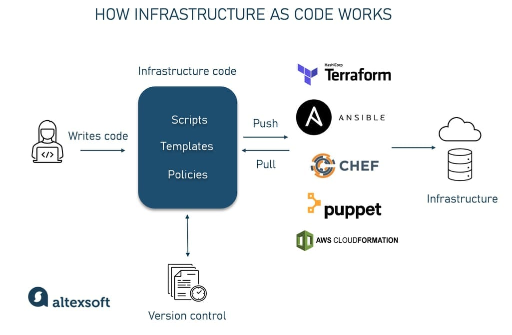

| Author | Editor |
| ------ | ------ |
| Daffa  | Hudya  |

# Introduction to Infrastructure as Code

Infrastructure as Code adalah salah satu cara pendekatan untuk kita mengaplikasikan devops (developer operational) yang ssudah dijelasakan pada pengenalan materi ini. Sebelum kita masuk ke penjelasan yang lebih teknikal, kita akan melihat analogi _Lego City_ yang dapat membantu kita untuk memahami konsep IaC. Bahkan anak 5 tahun saja bisa memahaminya. Mari kita lihat penjelasan dibawah.

#### Lego City

Bayangin kita lagi bikin kota Lego yang gede banget. Ada rumah-rumah, jalan, pohon, rumah, dll. Pokoknya lengkap.
Nah, biasanya kan kita susun satu-satu tuh lego bricknya. Capek kan kalau misal kita harus buat itu berulang kali? Sekarang, coba bayangin kalo kita bisa nulis petunjuk di kertas aja. Kayak "taruh rumah merah di sini", "bikin jalan lurus di sana", gitu-gitu.
Nah, Infrastructure as Code tuh mirip kayak gitu, tapi buat ngatur infrastructure teknologi yang kita ingin buat. Jadi bukannya kita atur server, jaringan, sama database satu-satu pake tangan, kita cuma nulis petunjuknya aja. Terus komputer yang bakal bikin semuanya sendiri, persis kayak yang kita mau.
Jadi intinya:

Kita bisa bikin "kota" yang sama berkali-kali tanpa salah-salah.
Bisa kasih "petunjuk bikin kota" ke temen buat dipakai juga
Mau ganti-ganti? Tinggal ubah petunjuknya, gampang!

Ibaratnya kayak kita punya robot ajaib yang bisa baca petunjuk Lego kamu terus bikin kotanya sendiri!
Gimana? sudah lebih ngerti nggak pake cerita Lego-nya?

Nah setelah kita lihat penjelasan IaC dengan analogi _lego city_, kita akan lihat IaC dari segi yang sedikit lebih teknikal.

### Apa itu IaC?

- IaC adalah praktik di mana infrastruktur disediakan dan dikelola menggunakan kode **(buku petunjuk lego)** dan teknik pengembangan perangkat lunak.

- Pendekatan otomatisasi ini memungkinkan kita untuk menggambarkan infrastruktur kita menggunakan bahasa konfigurasi tingkat tinggi, mengontrol versinya, dan menerapkannya secara konsisten. Jadi kita bisa menggunakannya berulang kali tanpa harus drag and drop, click sana click sini untuk bikin infrastructure yang sudah pernah kita buat sebelumnya. Tinggal jalanin script yang sudah kita buat dan kalo gaada error, jadi deh infrastructure yang kita mau. Enak kan?

- Dengan mengadopsi IaC, kita bisa menghilangkan kebutuhan untuk konfigurasi manual server, penyimpanan, dan jaringan. Sebagai gantinya, **kita mendefinisikan sumber daya ini dalam file kode** yang bisa diterapkan dan diterapkan kembali untuk mengelola infrastruktur kita dengan efisien.

### Pentingnya IaC pada IT Modern

- Mengurangi kesalahan manual
- Mendapatkan hasil yang konsisten
- Memungkinkan pengembangan yang cepat
- Meningkatkan kolaborasi di antara tim DevOps
- Mengurangi risiko kesalahan manusia, meningkatkan keandalan, dan mempercepat proses pengembangan

### Prinsip-prinsip utama IaC

- Konfigurasi Deklaratif vs Imperatif :
  **Pendekatan Deklaratif** menentukan seperti apa infrastruktur yang diinginkan.
  **Pendekatan Imperatif** menjelaskan bagaimana mencapai kondisi tersebut.

- Version Control :
  Memudahkan pelacakan perubahan dan kolaborasi (seperti GitHub).

- Idempotensi :
  Menerapkan konfigurasi berkali-kali seharusnya menghasilkan kondisi infrastruktur yang sama, menghindari konsekuensi atau perubahan yang tidak diinginkan.

- Konsistensi dan Prediktabilitas
  Dengan menggunakan IaC, setiap lingkungan (dev, test, prod) bisa dikonfigurasi secara identik, memastikan konsistensi dan prediktabilitas di semua tempat.

### Manfaat Menggunakan IaC

- **Kecepatan dan Efisiensi**
  IaC mempercepat proses dan mengurangi beban kerja tim operasi dengan mengotomatisasi tugas-tugas.

- **Reproduksibilitas**
  Karena konfigurasi IaC bisa digunakan kembali, lingkungan bisa direplikasi dengan mudah untuk pengujian atau penskalaan.

- **Skalabilitas (Scalability)**
  Memungkinkan kita mengelola dan menaikan skala server dan sumber daya lain dengan efisien sesuai kebutuhan.

- **Mitigasi Risiko**
  Dengan menguji perubahan infrastruktur di lingkungan yang terkendali, kita bisa mengurangi risiko yang terkait dengan perubahan manual.

- **Penghematan Biaya**
  Efisiensi yang meningkat dan pengurangan kesalahan bisa secara signifikan menurunkan biaya operasional.

### Best Pratices untuk IaC

- **Version Control**
  Selalu simpan file IaC kita dalam sistem kontrol versi (git, gitlab, github, dll).

- **Modularisasi**
  Pecah konfigurasi yang kompleks menjadi modul-modul yang lebih kecil agar bisa digunakan kembali (reusability).

- **Pengujian Otomatis (Automated Testing)**
  Terapkan pengujian otomatis untuk memvalidasi konfigurasi infrastruktur sebelum deployment.

- **Konvensi Penamaan yang Konsisten**
  Gunakan konvensi penamaan yang konsisten untuk meningkatkan keterbacaan dan kemudahan pengelolaan.
