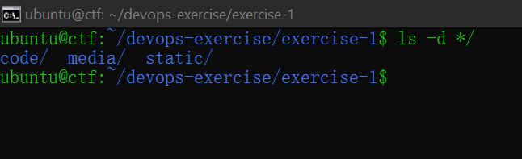
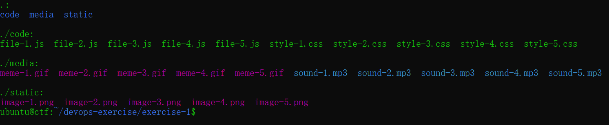

# Excercise 1: Creating and Managing Files and Folder Based on Their Extension

<br />

## Overview

Dalam latihan ini, Kalian akan mengatur folder dan file berdasarkan ekstensinya menggunakan perintah Linux.

<br />

## Goal

Mempelajari cara mengelola dan mengimplementasikan struktur direktori dengan mengelompokkan file dan subfolder berdasarkan ekstensi ke dalam folder terpisah sesuai jenis file.

## Outcomes

Peserta akan mampu mengelola file dan folder berdasarkan ekstensi, termasuk memindahkan dan mengatur file secara efisien ke dalam direktori yang sesuai menggunakan perintah Linux.

<br />

## How to

1.  Di Multipass, buat instance dengan `launch` atau buka `shell` instance yang sudah ada.


2.  Pastikan kalian di `home` dan clone repository [berikut](https://github.com/Komandro-CCIT/devops-exercise.git). Untuk melakukan clone kalian bisa menggunakan cara di bawah ini:

```bash
git clone https://github.com/Komandro-CCIT/devops-exercise.git
```

3. Masuk ke folder `exercise-1` fokuskan untuk selesaikan exercise ini terlebih dahulu sebelum yang ke-2.

4. Kemudian buat folder baru bernama `static`, `media` dan `code`.

## Steps to Solve




1.  Pindahkan `semua` file yang berekstensikan `.js` dan `.css` kedalam folder `code`.


2. Sama seperti tadi, sekarang pindahkan dan semua file yang berekstensikan `.png` kedalam folder `static`.

3. Terakhir pindahkan sisa file yang ada ke dalam folder `media`.

4. List semua folder agar terlihat secara terstruktur dan terorganisir berdasarkan ekstensinya.

## Expected Output:




<br />

## Summary

Reason Why You Should Organize Your File Based On Extension:

### Easier Navigation and Location

Lebih mudah untuk navigasi direktori project dan mencari file tertentu. Misalnya, kalau kalian perlu cari file JavaScript, mereka hanya mencarinya di folder code, js, source atau javascript folder.

### Better Collaboration

Anggota tim dapat dengan cepat dan paham struktur project dan mencari file yang mereka butuhkan untuk bekerja. Ini mengurangi kebingungan dan misskomunikasi.

### Enhanced Security

Organize file berdasarkan ekstensi juga dapat meningkatkan keamanan. Contohnya memisahkan file sensitif, file konfigurasi atau encryption key ke dalam folder khusus mereka, developer dapat lebih mudah kontrol akses dan mengurangi resiko unauthorized access.

### Simplified Build and Deployment

Banyak tools build and deployment scripts bergantung pada file extensionya untuk menentukan proses packaging files. Organizing files by extension lebih mudah untuk konfigurasikan toolsnya dan memastikan files lancar pada saat proses build and deployment.


### Reduced Errors and Conflicts

Organizing files by extension meminimalisirkan resiko error dan konflik antar files, Contohnya ketika files tidak terorganize anggota tim terkadang tidak sengaja mengubah file yang salah membuat project error tidak karuan dan sulit untuk di identifikasi.

<br />

Selamat kalian sudah bisa menguasai bagaimana caranya mengatur file dan folder berdasarkan ekstensi 🥳.

> [!NOTE]
> Kalau kalian masih bingung dan ingin mendapatkan jawabannya, kalian bisa klik jawabannya [disini](./exercise-answer.md) 
