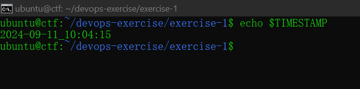
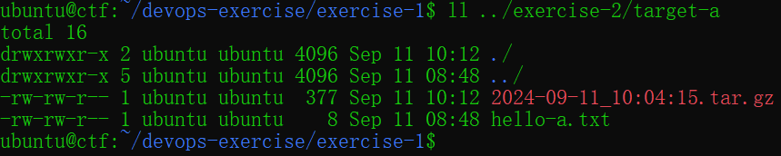
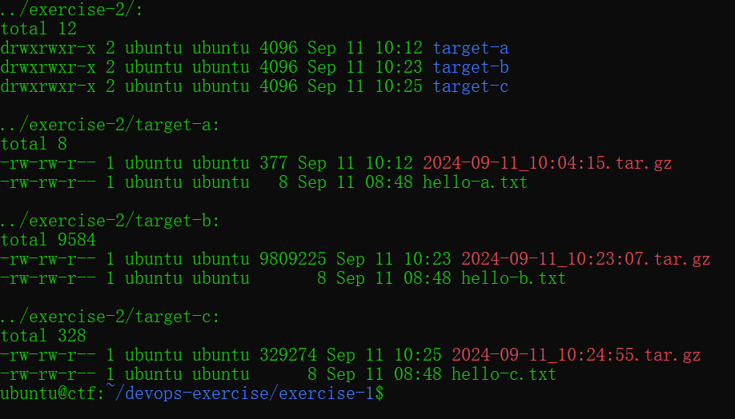
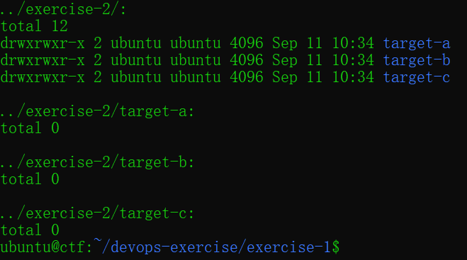
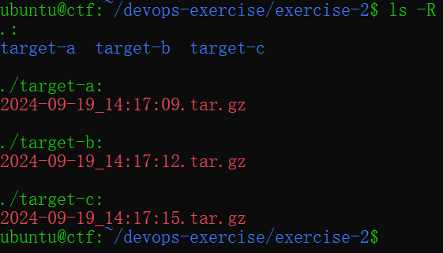

# Excercise 2: Creating Backup Files with Timestamp Along With Source and Destination Folder

 

## Overview

Dalam latihan ini, Kalian akan mencoba membuat file menggunakan stempel waktu, serta menentukan folder source dan destination menggunakan perintah Linux.

 

## Objective

Memahami dan mempraktikkan pembuatan file cadangan dengan stempel waktu menggunakan perintah Linux, serta mengatur folder sumber (source) dan tujuan (destination) untuk menyimpan file tersebut.

## Outcomes

Peserta akan dapat membuat file cadangan dengan stempel waktu yang unik, menentukan dan menggunakan direktori sumber dan tujuan yang berbeda, serta mengembangkan pemahaman yang lebih baik tentang manajemen file dan direktori di lingkungan Linux.

 

## How to

1.  Di Multipass, buka `shell` instance kalian, lalu pastikan kalian berada di direktori `home`.

2. Melanjutkan `exercise-1` sekarang `exercise-2` akan menggunakan file yang berada di `exercise-1` untuk sebagai source foldernya.

3. Masuk ke folder `exercise-1` untuk memulai latihan yang ke-2.

4. Buat variabel global bernama `TIMESTAMP` di commandline interface, beri valuenya dengan command `date` dan spesifikan waktunya berdasarkan `YYYY-MM-DD_hh:mm:ss` gunakan man untuk melihat formatnya lalu pastikan variabelnya terbuat.  

Expected Output:

5. Sekarang backup folder `code` yang ada didalam `exercise-1` dengan folder `exercise-2/target-a` sebagai destination dan beri ekstensi `tar.gz` menggunakan perintah `tar` linux, gunakan `man` untuk caranya, dan untuk nama file backup tersebut yaitu variabel `TIMESTAMP` yang baru dibuat.

Expected Output:

6. Lakukan hal yang sama untuk folder `media` dan `static` ke folder `exercise-2/target-b` dan `exercise-2/target-c`, tapi sebelum backup menggunakan `tar` jalankan command membuat variable global `TIMESTAMP` secara bergantian dengan `media` kemudian backup dan `static` dan backup juga, ini dilakukan agar waktu di variabelnya terupdate, kemudian tampilkan semua backup secara terstruktur.

Expected Output:

7. Sekarang hapus semua file yang ada di `target-a`, `target-b`, `target-c`.

Expected Output:

8. Pindah 1 direktori ke belakang dan buatlah `bash script` bernama `backup.sh` dengan command-command yang kalian sudah gunakan untuk backup file dari `step-step sebelumnya`.

9. Berikan `execute permission` pada scriptnya dan jalankan scriptnya.

10. List lagi hasil backup yang menggunakan script

Expected Output:

 

## Summary

Reason Why You Should Backup Your File & Folder Frequently:

### Data Loss Prevention

Untuk alasan ini sudah pasti sangat wajib dan mutlak, agar kejadian seperti yang dialami kementrian teknologi dan komunikasi itu tidak terjadi pada kalian.

### Version Control and Rollback

Terkadang update yang dilakukan pada suatu project itu tidak sesuai ekspektasi, dengan adanya backup kita bisa rollback ke versi sebelumnya.

### Knowledge Archiving

File & Folder backup saat sudah tidak bisa dipakai bisa menjadi archive untuk kebutuhan masa mendatang

 

Selamat kalian sudah bisa menguasai bagaimana caranya backup file dan folder dengan `tar` command di linux 🥳.

> [!NOTE]
> Kalau kalian masih bingung dan ingin mendapatkan jawabannya, kalian bisa klik jawabannya [disini](./exercise-answer.md) 
