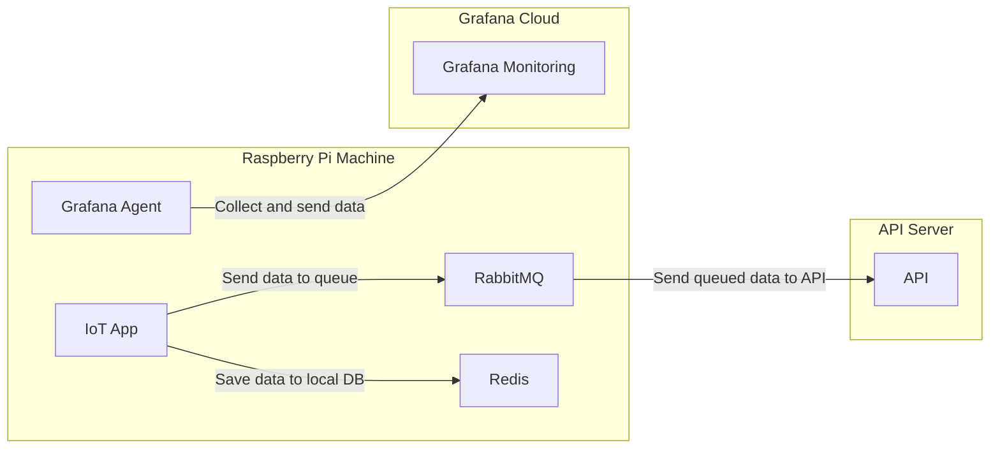
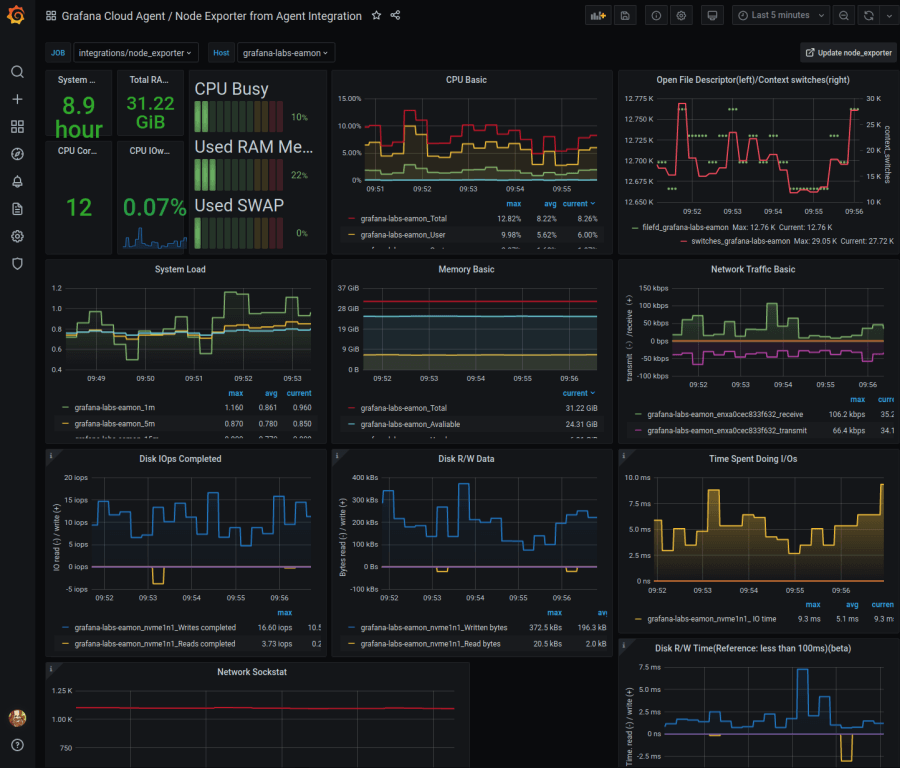
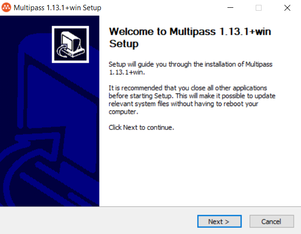
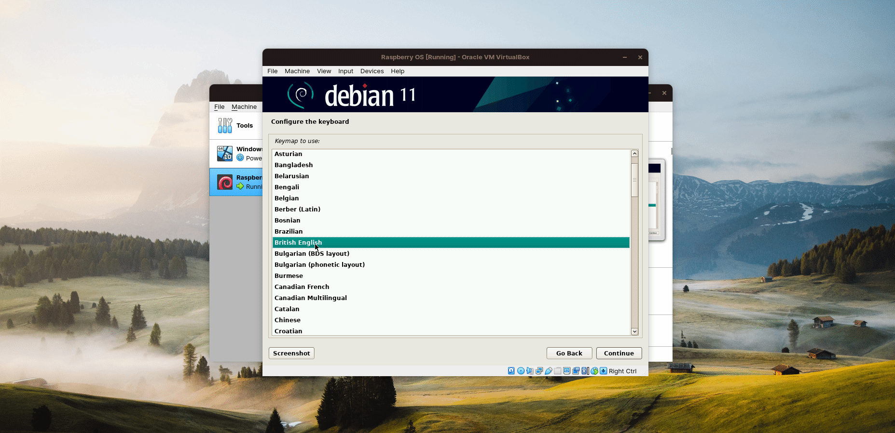
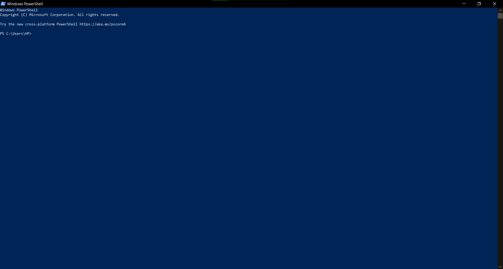
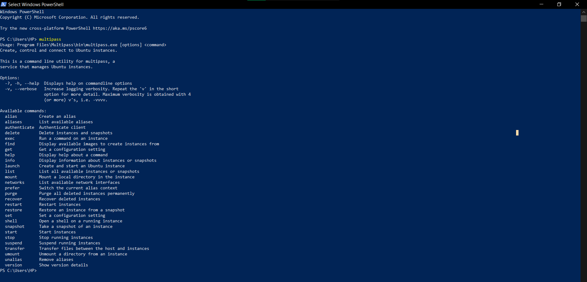
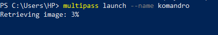
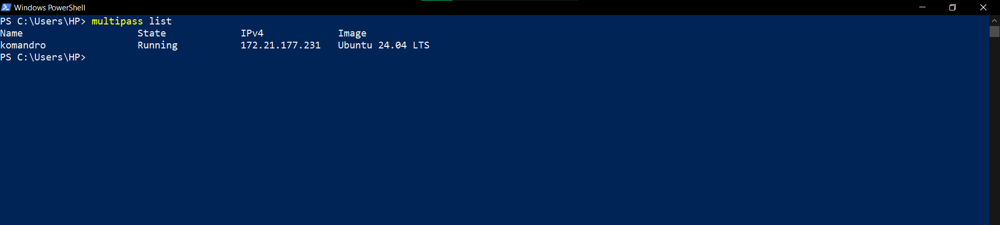
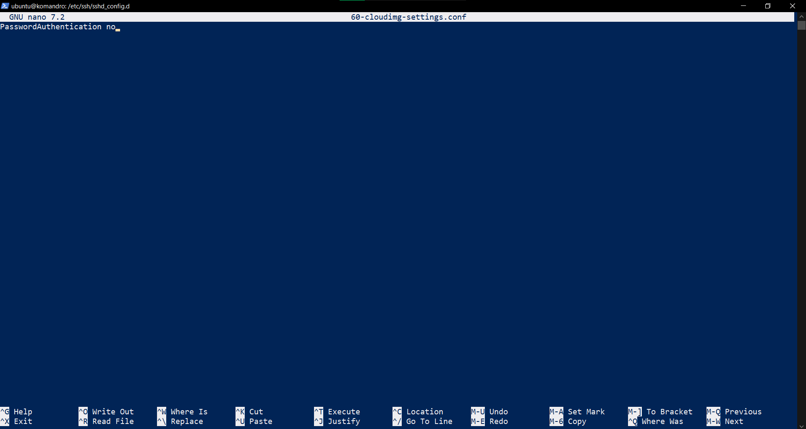

1 - Event Pattern

---

Author: Hudya (@perogeremmer)

<br />

# Overview

Ketika mendengar kata IoT, kamu pasti berpikir tentang bagaimana sebuah alat terhubung ke internet.
Pernyataan tersebut benar, namun tidak sepenuhnya benar. Mengapa? Hal ini dikarenakan untuk mencapai aplikasi yang terhubung penuh ke internet, membutuhkan koneksi internet yang stabil.

Kenyataanya, kondisi internet di Indonesia membuat pengembangan IoT yang terhubung dengan internet secara penuh. Pada materi IoT yang dikembangkan oleh Komandro CCIT - FTUI, kami mengenalkan materi IoT yang menjelaskan konseptual pembuatan aplikasi IoT yang mendukung sistem secara Hybrid. Artinya, aplikasi yang kita bangun tidak akan bergantung kepada internet sepenuhnya, dan akan menggunakan sistem lokal.

<br />

Lalu, bagaimana nanti struktur aplikasi yang akan kita bangun? Perhatikan diagram berikut:



<br/>

Dapat diperhatikan dari diagram di atas, kita melihat bahwa sistem akan menyimpan data lokal menggunakan Redis. Redis sendiri adalah in-memory database yang menyimpan data pada memori (RAM). Kita juga menyimpan data pada RabbitMQ (Broker Message) yang akan berfungsi sebagai Queue, artinya apabila ada proses yang dapat berjalan di belakang, maka dapat diproses oleh RabbitMQ.

Selanjutnya kamu lihat ada grafana agent, tools ini digunakan untuk melakukan monitoring. Monitoring ini berfungsi untuk memahami keadaan pada mesin IoT yang kita gunakan, seperti:

- Berapa RAM yang tersisa
- Berapa CPU yang digunakan
- Berapa Memory Disk yang tersisa
- Penggunaan RAM, CPU, Memory Disk setiap 15 menit
- Log dari aplikasi yang berjalan

Hal ini ditujukan untuk mempermudah tracking apabila terjadi masalah, atau memahami keadaan mesin sebelum terjadinya masalah.

<br />

Berikut adalah contoh monitoring pada Grafana



<br />

Sebenarnya selain grafana ada juga tools lainnya, namun Grafana menawarkan free-tier yang dapat digunakan oleh kamu khususnya para mahasiswa untuk belajar dan memahami konsep dasar monitoring.

<br />

# Requirements

Pada aplikasi IoT yang kita bangun kita akan menggunakan tools sebagai berikut:

- Python 3: Bahasa pemrograman yang digunakan untuk membangun app (Minimal versi 3.7)
- Redis: Database lokal in-memory DB
- RabbitMQ: Broker message yang digunakan sebagai Queue
- Pytest: Software unit testing
- Grafana: Tools Monitoring
- Raspbian: OS Raspberry yang akan diinstall

<br />

# How we learn

Meskipun IoT sangat dekat dengan raspberry / arduino, namun keterbatasan yang ada membuat kita bergerak tidak akan mudah. Oleh karena itu, kita mengakali keterbatasan ini dengan minimal menggunakan environment yang sama. Sehingga, kita tidak perlu menggunakan raspberry secara fisik, namun mengakalinya dengan virtual box.

<br />

> Loh bukannya kalau pake virtual box kita jadi gak bisa pakai sensor-sensornya?

Betul, memang adanya keterbatasan dari Vbox ini membuat kita tidak dapat belajar penggunaan GPIO dari raspberry, tapi ketahuilah, ini bukanlah masalah utama. Masalah utama dari pembelajaran IoT adalah pemahaman terkait bagaimana algoritma dari sistem berjalan, hingga pemahaman terkait bagaimana mengelola data yang tersimpan di lokal hingga mengirim ke API.

Jadi, daripada kita tidak sama sekali belajar untuk membuat aplikasi IoT, lebih baik belajar hal-hal yang kita dapat pelajari dengan keterbatasan yang ada. Namun tenang saja, materi yang akan kamu pelajari ini sangat worth it dan sudah standar dengan kebutuhan industri.

<br />

> [!NOTE]
> Materi ini di-supervisi oleh pak [Hudya](https://linkedin.com/in/perogeremmer), lead backend developer di [Soul Parking](https://soulparking.co.id) sekaligus pengajar di [CCIT - FTUI](https://ccit.eng.ui.ac.id).

<br />

Untuk instalasi dapat kamu baca melalui [URL berikut](https://roboticsbackend.com/install-raspbian-desktop-on-a-virtual-machine-virtualbox/). Pastikan kamu sudah menginstall raspbian di virtual box ya agar pembelajaranmu dapat maksimal 😃.

# Material Planning

Pada materi pembelajaran IoT ini kamu akan mempelajari beberapa materi sebagai berikut:

- Pengenalan dasar Python
- Introduction to Redis with Python
- Introduction to RabbitMQ with Python
- Introduction to Event Pattern with Python
- Introduction to Logging with Python
- Introduction to Automation Testing with Python
- Connecting our machine to Grafana
- Creating dashboard in Grafana
- Building our first app: Simple Vending Machine

Pada akhir materi IoT ini, kamu akan membuat simple vending machine dengan tampilan HTML yang akan disambungkan dengan websocket dan terhubung sistem yang kita bangun.

Selamat Belajar! 🔥

<br />

> [!NOTE]
> Perlu diketahui bahwa materi ini tidak akan menjelaskan Python dari awal hingga akhir, sehingga bagi kamu yang belum pernah belajar bahasa pemrograman kami tidak sarankan untuk mengikuti materi ini.


---

# Instalasi Raspbian

Sebelum memulai semua ini, ada baiknya kita belajar melakukan instalasi terlebih dahulu. Pada materi IoT yang akan dibagikan ini, kita akan melakukan simulasi dengan menggunakan raspberry.

> Kenapa raspberry?

Karena pada dasarnya, raspberry digunakan sebagai mini-computer yang akan digunakan sebagai server dan menerima maupaun memberi perintah kepada para micon (Micro-controller) yang ada di lapangan, baik itu arduino, ESP-32, dan lainnya.

Raspberry dipilih dan digunakan karena board-nya yang lengkap, dan kekuatannya yang *robust* untuk digunakan pada lapangan. Selain itu, Raspberry juga dapat di-custom agar lebih powerful, misalnya mengganti SD Card dengan SSD External.

Raspberry ini sebenarnya dapat digunakan untuk berbagai kebutuhan seperti:

- Local (LAN) server
- VPN Server
- Storage Server

Saking ajaibnya raspberry ini, banyak sekali yang menggunakannya untuk membuat berbagai mesin otomatis yang biasa kita temui, misalnya mesin beli kopi otomatis, mesin parkir, mesin pencetak dokumen, dan lainnya. Umumnya, kita tidak perlu komputer yang besar hanya untuk membuat mesin yang ringkas, gunakan raspberry, and you get the things done! 😆

<br/>

Kami dari Komunitas Android CCIT - FTUI akan membagikan langkah-langkah dasar dalam pembelajaran IoT menggunakan raspberry, namun kamu jangan khawatir apabila kamu tidak memiliki raspberry, selalu ada solusi pembelajaran. Pada materi ini, kamu akan mensimulasikan raspberry dengan Raspbian, Raspbian sendiri adalah Raspbbery PI OS yang berbasis Debian. Dulunya memang namanya Raspbian.

Pertama, kamu butuh VirtualBox. Pergi saja ke website [resminya](https://www.virtualbox.org/wiki/Downloads) dan download sesuai OS kamu.

Kedua, kamu butuh OS Raspberry itu sendiri, pergi ke website [resminya](https://www.raspberrypi.com/software/raspberry-pi-desktop/) dan klik download. Kamu akan mendownload iso-nya terlebih dahulu.



Setelah mendownload ISO Raspberry OS, sekarang buka Virtualbox dan coba buat OS baru, perhatikan GIF berikut:


Ringkasan:
- Masukkan nama Raspberry OS
- Pilih OS Linux - Other Linux 32-bit
- Masukkan Memory sesuka kalian, umumnya akan lebih baik kalau: 2048 (2 GB), 4096 (4 GB).
- Masukkan disk size sesuka kalian, agar tidak lag, masukkan minimal 30 GB,tapi 16 GB saja sudah cukup untuk belajar.

> [!NOTE]
> Jangan memilih Debian 32-bit karena nanti kamu akan mengalami corrupt. Tested by Pak Hudya

Sekarang waktunya booting, tapi kita perlu memilih ISO pada saat melakukan booting, perhatikan GIF berikut:


Setelah muncul layar instalasi, saatnya melakukan instalasi:



Ringkasan:
- Pilih Keyboard American English
- Klik iya untuk recommended users, supaya tidak bingung untuk pemilihan disk
- Klik iya untuk perubahan

Kalau sudah begini, kamu harus menunggu terlebih dahulu ya:


Sekarang kamu akan ditanya soal grub, tinggal pilih saja yes, dan pilih disk yang kamu punya:





> [!NOTE]
> GNU GRUB (singkatan dari GNU GRand Unified Bootloader, yang biasa disebut GRUB) adalah boot loader default untuk sebagian besar sistem operasi Linux. Pada kasus ini kita cukup yes saja biar cepat. Kalau no, ya tidak mengapa juga sih sebenarnya.

<br />


Kalau sudah selesai maka akan muncul seperti ini:




Lalu gambar ini:




Setelahnya tinggal set country dan pilih zona waktu:


Setup selesai, tinggal restart aja :)



---

Setelah restart, kamu akan melihat GNU GRUB Loader apabila kamu tadi memilih yes, klik saja yang paling atas dengan menekan tombol `enter` atau diamkan saja beberapa detik.

Setelah berhasil booting kamu akan melihat layar desktop Raspberry OS.


Sekarang kita akan melakukan update terhadap library OS ini, agar up to date dan memudahkan development. Sekarang coba klik terminal pada logo bagian atas lalu ketik:

```bash
sudo apt update
```

Dilanjutkan dengan:

```bash
sudo apt upgrade -Y
```

> [!NOTE]
> Mohon jangan lakukan ini apabila kamu masih menggunakan internet kuota.

Perhatikan GIF berikut:


Dua perintah di atas digunakan untuk mendapatkan library terbaru dari raspberry, perlu diperhatikan karena ini akan mendownload banyak library terbaru agar up to date, **diperlukan koneksi internet yang stabil dan tidak dibatasi (kuota).**

Viola! Kamu baru saja berhasil menyelesaikan instalasi Raspberry OS versi desktop yang nantinya kita gunakan untuk development di tutorial IoT ini.