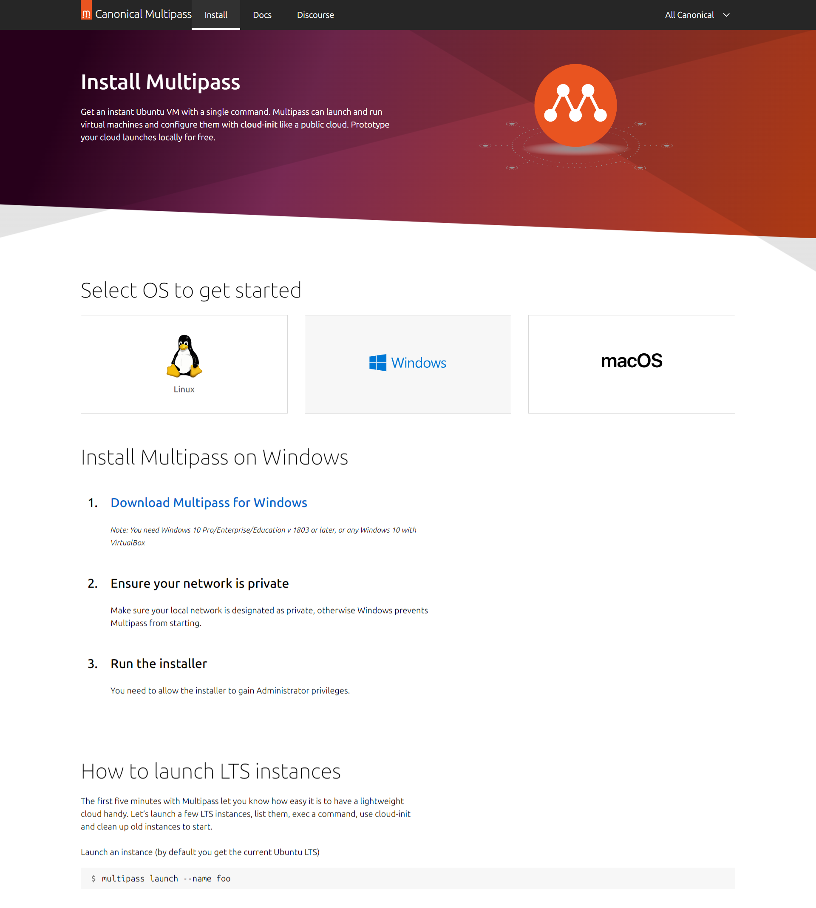
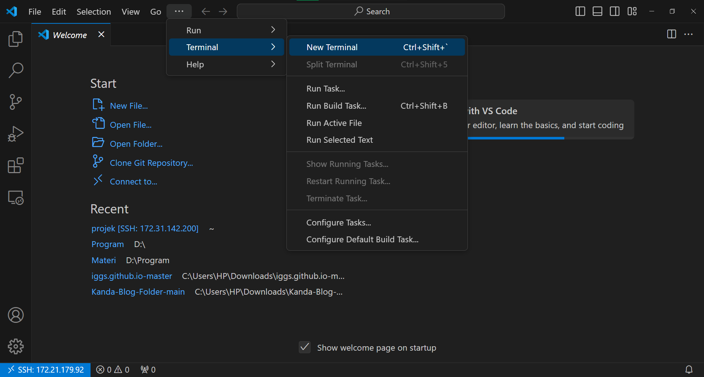

# 1 - Event Pattern

---

Author: Hudya (@perogeremmer)

<br />

## Overview

Ketika mendengar kata IoT, kamu pasti berpikir tentang bagaimana sebuah alat terhubung ke internet.
Pernyataan tersebut benar, namun tidak sepenuhnya benar. Mengapa? Hal ini dikarenakan untuk mencapai aplikasi yang terhubung penuh ke internet, membutuhkan koneksi internet yang stabil.

Kenyataanya, kondisi internet di Indonesia membuat pengembangan IoT yang terhubung dengan internet secara penuh. Pada materi IoT yang dikembangkan oleh Komandro CCIT - FTUI, kami mengenalkan materi IoT yang menjelaskan konseptual pembuatan aplikasi IoT yang mendukung sistem secara Hybrid. Artinya, aplikasi yang kita bangun tidak akan bergantung kepada internet sepenuhnya, dan akan menggunakan sistem lokal.

<br />

Lalu, bagaimana nanti struktur aplikasi yang akan kita bangun? Perhatikan diagram berikut:


<br/>

Dapat diperhatikan dari diagram di atas, kita melihat bahwa sistem akan menyimpan data lokal menggunakan Redis. Redis sendiri adalah in-memory database yang menyimpan data pada memori (RAM). Kita juga menyimpan data pada RabbitMQ (Broker Message) yang akan berfungsi sebagai Queue, artinya apabila ada proses yang dapat berjalan di belakang, maka dapat diproses oleh RabbitMQ.

Selanjutnya kamu lihat ada grafana agent, tools ini digunakan untuk melakukan monitoring. Monitoring ini berfungsi untuk memahami keadaan pada mesin IoT yang kita gunakan, seperti:

- Berapa RAM yang tersisa
- Berapa CPU yang digunakan
- Berapa Memory Disk yang tersisa
- Penggunaan RAM, CPU, Memory Disk setiap 15 menit
- Log dari aplikasi yang berjalan

Hal ini ditujukan untuk mempermudah tracking apabila terjadi masalah, atau memahami keadaan mesin sebelum terjadinya masalah.

<br />

Berikut adalah contoh monitoring pada Grafana


<br />

Sebenarnya selain grafana ada juga tools lainnya, namun Grafana menawarkan free-tier yang dapat digunakan oleh kamu khususnya para mahasiswa untuk belajar dan memahami konsep dasar monitoring.

<br />

## Requirements

Pada aplikasi IoT yang kita bangun kita akan menggunakan tools sebagai berikut:

- Python 3: Bahasa pemrograman yang digunakan untuk membangun app (Minimal versi 3.7)
- Redis: Database lokal in-memory DB
- RabbitMQ: Broker message yang digunakan sebagai Queue
- Pytest: Software unit testing
- Grafana: Tools Monitoring
- Raspbian: OS Raspberry yang akan diinstall

<br />

## How we learn

Meskipun IoT sangat dekat dengan raspberry / arduino, namun keterbatasan yang ada membuat kita bergerak tidak akan mudah. Oleh karena itu, kita mengakali keterbatasan ini dengan minimal menggunakan environment yang sama. Sehingga, kita tidak perlu menggunakan raspberry secara fisik, namun mengakalinya dengan virtual box.

<br />

> Loh bukannya kalau pake virtual box kita jadi gak bisa pakai sensor-sensornya?

Betul, memang adanya keterbatasan dari Vbox ini membuat kita tidak dapat belajar penggunaan GPIO dari raspberry, tapi ketahuilah, ini bukanlah masalah utama. Masalah utama dari pembelajaran IoT adalah pemahaman terkait bagaimana algoritma dari sistem berjalan, hingga pemahaman terkait bagaimana mengelola data yang tersimpan di lokal hingga mengirim ke API.

Jadi, daripada kita tidak sama sekali belajar untuk membuat aplikasi IoT, lebih baik belajar hal-hal yang kita dapat pelajari dengan keterbatasan yang ada. Namun tenang saja, materi yang akan kamu pelajari ini sangat worth it dan sudah standar dengan kebutuhan industri.

<br />

> [!NOTE]
> Materi ini di-supervisi oleh pak [Hudya](https://linkedin.com/in/perogeremmer), lead backend developer di [Soul Parking](https://soulparking.co.id) sekaligus pengajar di [CCIT - FTUI](https://ccit.eng.ui.ac.id).

<br />

Untuk instalasi dapat kamu baca melalui [URL berikut](https://roboticsbackend.com/install-raspbian-desktop-on-a-virtual-machine-virtualbox/). Pastikan kamu sudah menginstall raspbian di virtual box ya agar pembelajaranmu dapat maksimal 😃.

## Material Planning

Pada materi pembelajaran IoT ini kamu akan mempelajari beberapa materi sebagai berikut:

- Pengenalan dasar Python
- Introduction to Redis with Python
- Introduction to RabbitMQ with Python
- Introduction to Event Pattern with Python
- Introduction to Logging with Python
- Introduction to Automation Testing with Python
- Connecting our machine to Grafana
- Creating dashboard in Grafana
- Building our first app: Simple Vending Machine

Pada akhir materi IoT ini, kamu akan membuat simple vending machine dengan tampilan HTML yang akan disambungkan dengan websocket dan terhubung sistem yang kita bangun.

Selamat Belajar! 🔥

<br />

> [!NOTE]
> Perlu diketahui bahwa materi ini tidak akan menjelaskan Python dari awal hingga akhir, sehingga bagi kamu yang belum pernah belajar bahasa pemrograman kami tidak sarankan untuk mengikuti materi ini.


---

## Raspberry PI

Pada materi IoT yang akan dibagikan ini, kita akan melakukan simulasi dengan menggunakan raspberry.

> Kenapa raspberry?

Karena pada dasarnya, raspberry digunakan sebagai mini-computer yang akan digunakan sebagai server dan menerima maupaun memberi perintah kepada para micon (Micro-controller) yang ada di lapangan, baik itu arduino, ESP-32, dan lainnya.

Raspberry dipilih dan digunakan karena board-nya yang lengkap, dan kekuatannya yang *robust* untuk digunakan pada lapangan. Selain itu, Raspberry juga dapat di-custom agar lebih powerful, misalnya mengganti SD Card dengan SSD External.

Raspberry ini sebenarnya dapat digunakan untuk berbagai kebutuhan seperti:

- Local (LAN) server
- VPN Server
- Storage Server

Saking ajaibnya raspberry ini, banyak sekali yang menggunakannya untuk membuat berbagai mesin otomatis yang biasa kita temui, misalnya mesin beli kopi otomatis, mesin parkir, mesin pencetak dokumen, dan lainnya. Umumnya, kita tidak perlu komputer yang besar hanya untuk membuat mesin yang ringkas, gunakan raspberry, and you get the things done! 😆

<br/>

Kami dari Komunitas Android CCIT - FTUI akan membagikan langkah-langkah dasar dalam pembelajaran IoT menggunakan raspberry, namun kamu jangan khawatir apabila kamu tidak memiliki raspberry, selalu ada solusi pembelajaran. Pada materi ini, kamu akan mensimulasikan raspberry dengan Ubuntu.

## Instalasi Ubuntu melalui Multipass

Sebelum kita menjelajah Internet of Things menggunakan Raspbian OS, mari kita fokus untuk mempelajari logika dari Internet of Things itu sendiri menggunakan **Ubuntu OS dibantu dengan Multipass dan Visual Studio Code.**
>Kenapa kita gak langsung menggunakan Raspbian OS saja?
Ada beberapa alasan mengapa saat ini kita lebih baik menggunakan Ubuntu OS melalui Multipass dibanding langsung menggunakan Raspbian OS :
- Beginner Friendly. Jadi sangat cocok untuk kita yang baru mulai belajar tentang struktur logika Internet of Things
- Multipass lebih ringan dibanding virtual maching lainnya (seperti virtual box, etc)
- Praktis. Kita bisa bulak balik buka browser dan Visual Studio agar dapat melihat dokumentasi/tutorial sekalian kita mempraktekannya

> [!NOTE]
> Kalian harus mempunyai Visual Studio Code terlebih dahulu sebelum kita mulai install multipassnya.[klik disini untuk download Visual Studio code](https://code.visualstudio.com/download).

Pertama, pastinya kalian wajib download multipass di website resminya. [klik disini untuk langsung menuju website resminya](https://multipass.run/install).
Jika sudah berada diwebsitenya, pilih OS kalian (pada kasus ini kita memakai OS Windows) dan klik "Download Multipass for Windows"



Setelah kalian download, buka file setup multipassnya hingga tampilan awalnya akan seperti dibawah ini


Kalian pencet next saja terus sampai finish install. Setelah selesai install multipass, lalu restart komputer kalian.
Setelah restart, kalian cari "powershell" pada menu start kalian dan pilih "Run as Administrator" seperti gambar yang ada dibawah ini.


Habis itu kalian klik "yes" dan akan muncul tampilan seperti dibawah ini


Setelah itu coba kalian ketik "multipass" pada powershell tersebut dan pencet tombol enter, nantinya akan muncul menu yang bisa digunakan di multipass.
Selamat kalian sudah mencoba multipass untuk pertama kalinya!


<br/>
Selanjutnya kita akan membuat instance sebagai wadah dari Ubuntu.

```bash
multipass launch --name [nama instance kalian]
```
Kita akan coba menamai instance kita dengan nama "komandro", kodenya akan menjadi seperti ini

```bash
multipass launch --name komandro
```

Setelah itu, multipass akan otomatis membuat instance baru lalu download dan install ubuntunya, disini kalian tunggu saja sampai selesai download semuanya.
**Pastikan koneksi internet kalian lancar!**


> [!NOTE]
> Jika kalian mengalami error "launch failed: Remote "" is unknown or unreachable", masukkan kode dibawah ini pada powershall
>```bash
Get-HNSNetwork | ? Name -Like "Default Switch" | Remove-HNSNetwork```
>Setelah itu restart komputer kalian lalu buka powershall as administrator dan launch kembali seperti cara diatas

Jika sudah selesai launchnya, kita akan lihat apakah instance 'komandro' sudah berjalan atau belum. Coba kalian masukkan kode ini pada powershell

```bash
multipass list
```


Jika instance 'komandro' sudah running dan ada alamat IP nya, berarti kalian sudah berhasil untuk membuat instance pertama kalian! ^^
<br/>

Next, kita akan membuka shell dengan instance kita yang bernama 'komandro'

```bash
multipass shell komandro
```
Jika sudah masukkan kode tersebut, powershell akan menampilkan shell dari instance 'komandro' seperti gambar dibawah ini


Habis itu, kita akan melakukan konfigurasi. Masukan perintah dibawah ini :

```bash
cd /etc/ssh/sshd_config.d
```

Dilanjutkan dengan :

```bash
sudo nano 60-cloudimg-settings.conf
```

Setelah itu akan muncul tampilan seperti dibawah ini


Jika sudah seperti itu, ikuti langkah berikut (lihat gif dibawah ini untuk lebih jelasnya) :
1. Ganti kata 'no' menjadi 'yes'
2. Pencet CTRL+SHIFT+X
3. Ketik 'y' lalu pencet Enter 2 kali


Jika kalian sudah kembali ke halaman utama lagi, sekarang kita akan membuat password baru untuk ubuntu kita dengan perintah berikut ini :

```bash
sudo passwd ubuntu
```
Lalu kalian akan diminta untuk memasukkan password baru. Mari kita buat passwordnya itu '123456' (opsional, biar simpel wkwk). 

>[!NOTE]
>Jika saat kalian masukkan passwordnya tapi tidak muncul di powershellnya, tenang itu fitur agar password tersebut jadi rahasia. Jadi, coba kalian masukkan passwordnya saja lalu tekan enter

Setelah itu kalian akan diminta untuk masukkan password tadi lagi (Untuk konfirmasi). Voilaa! akhirnya kamu sudah selesai membuat akun Ubuntu kalian di Multipass ^^


<br/>

Sekarang kalian reboot server instance kalian dengan menggunakan perintah :

```bash
sudo reboot
```

Kalian akan dibawa ke tampilan powershell seperti awal lagi, disini kita akan cek lagi apakah instance kita sudah berjalan dan ada alamat IP nya atau belum dengan menggunakan perintah :

```bash
multipass list
```

Jika sudah running dan ada alamat IPnya, kita akan menjalankan ubuntu kita dengan perintah :

```bash
ssh ubuntu@ip
```

Di setelah simbol '@', masukkan alamat IP kalian yang sudah kita lihat di list tadi. Pada kasus ini, alamat IP instance pada powershell saya yaitu '172.21.179.92'. Berarti saya memasukan perintah seperti ini :

```bash
ssh ubuntu@172.21.179.92
```

Selanjutnya, kalian ketik 'yes' lalu enter, dan masukkan password yang telah kita buat tadi yaitu '123456'. 


Jika sudah masukkan password, akan muncul tampilan jadi seperti ini


Setelah itu kita keluar dari servernya dengan cara masukkan perintah "exit". Sekarang kita buka Visual Studio Code untuk remote Ubuntu melalui VS Code

## Menghubungkan Instance Multipass di VSCode

Sebelumnya kita sudah coba install dan setting Multipass pada perangkat kita. Sekarangm kita akan menghubungkan multipass dengan VSCode agar dapat menggunakan OS Ubuntu melalui VSCode.

> [!WARNING]
> Sebelum kalian mulaiastikan kalian memiliki ekstensi Remote SSH seperti gambar dibawah ini!
> 

Selanjutnya, ikuti langkah dibawah ini (lihat gif dibawah yang lebih jelasnya) :

1. Pencet tombol warna biru dipojok kiri bawah pada window Visual Studio Code 
2. klik opsi "Connect to Host"
3. Ketik ```ubuntu@[ip]```. Masukkan IP instance kalian seperti yang ada di powershell. Misalnya kalau saya yaitu ```ubuntu@172.21.179.92```
4. Lalu kita akan dibawa ke window baru (windows sebelumnya diclose saja), setelah itu kalian pilih opsi "Linux"
5. Masukkan password yang telah kita bikin tadi, yaitu '123456' 
6. Tunggu beberapa menit dikarenakan sedang download dan install beberapa data


Yeyy! kita sudah selesai menghubungkan Multipass dengan Visual Studio Code ^^

> [!NOTE]
> Jika disebelah kiri bawah ada tulisan "SSH : (IP Kalian)" berarti Window Visual Studio Code tersebut sedang remote Instance Multipass kita


## Membuat Program Python Pertama pada Ubuntu yang telah dibuat

Sekarang kita coba buat program python pertama kita di Ubuntu ini. 
Pertama kita akan membuat direktori baru untuk menyimpan file python kalian. Coba kalian buka terminal di VS Code dengan cara pencet titik tiga di tab atas > Terminal > New Terminal



Selanjutnya kita akan membuat direktori/folder baru dengan nama 'projek1' dengan perintah :

```bash
mkdir projek1
```

Kalau sudah, kita buka folder 'projek1' tadi. Lalu masukkan passwordnya. Perhatikan GIF dibawah ini :


Dan selamat kamu sudah masuk ke dalam instance multipass yang telah kamu buat. Setelah itu, buatlah file python dan isi kode sederhana didalam file python tersebut. Misalnya :

```python
print("Hello World!")
```

Lalu save file tersebut dengan menekan tombol CTRL + S. Lalu buka terminal dan masukkan kode dibawah ini untuk menjalankan file python yang telah kita buat sebelumnya.

```bash
python [Nama file kamu]
```

Kalau error, coba kode dibawah ini (sesuai dengan perintah):

```bash
python3 [Nama file kamu]
```

Perhatikan gif dibawah ini :


Hasil/Outputnya akan terlihat di terminal seperti yang terdapat di gif tersebut.
Selamatt kamu sudah membuat python pertama kamu di multipass. ^^