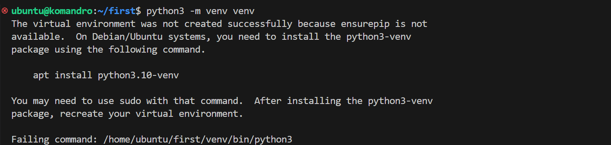

# 2 - In Memory Database

- [2 - In Memory Database](#2---in-memory-database)
  - [Overview](#overview)
  - [In-Memory Database](#in-memory-database)
    - [Contoh In-Memory Database](#contoh-in-memory-database)
    - [Contoh Penggunaan](#contoh-penggunaan)
  - [Perbedaan IMDB dan RDBMS](#perbedaan-imdb-dan-rdbms)
  - [Redis](#redis)
    - [Hubungan IMDB dan Redis](#hubungan-imdb-dan-redis)
    - [Kapan dan Mengapa Butuh Redis?](#kapan-dan-mengapa-butuh-redis)
    - [Install Redis](#install-redis)
    - [Menghubungkan Redis](#menghubungkan-redis)
    - [Dasar Syntax Redis](#dasar-syntax-redis)
      - [Key-Value](#key-value)
      - [Databases](#databases)
      - [Menghubungkan Python dengan server Redis](#menghubungkan-python-dengan-server-redis)
      - [Menambah Key+value dan mengubah value yang ada](#menambah-keyvalue-dan-mengubah-value-yang-ada)
      - [Mendapatkan Nilai dari Sebuah Kunci](#mendapatkan-nilai-dari-sebuah-kunci)
      - [Menghapus data](#menghapus-data)
      - [Expiration](#expiration)

## Overview

Setelah kalian membaca [pengenalan IoT](1-introduction.md) pada bab sebelumnya, next step adalahmempelajari di materi In-memory database.

## In-Memory Database

In-Memory database adalah sistem manajemen basis data yang menyimpan data secara eksklusif di memori utama komputer. Ini berbeda dengan sistem manajemen basis data tradisional, yang menyimpan data di disk. In-memory database menawarkan sejumlah keunggulan dibandingkan sistem manajemen basis data tradisional, mulai dari:

- Performa yang lebih cepat: Data yang disimpan di memori dapat diakses jauh lebih cepat daripada data yang disimpan di disk. Ini karena memori memiliki waktu akses yang jauh lebih cepat daripada disk.

- Efisiensi yang lebih tinggi: In-memory database dapat menggunakan memori lebih efisien daripada sistem manajemen basis data tradisional. Ini karena in-memory database tidak perlu mem-buffer data di disk.
- Scalability yang lebih baik: In-memory database dapat menskala dengan lebih baik daripada sistem manajemen basis data tradisional. Ini karena in-memory database dapat didistribusikan ke sejumlah server.

### Contoh In-Memory Database

Berikut adalah beberapa contoh in-memory database:

- **Couchbase** adalah in-memory NoSQL database yang mendukung berbagai jenis data, termasuk dokumen, kunci-nilai, dan array. Couchbase digunakan oleh berbagai perusahaan, termasuk IBM, Cisco, dan PayPal.

- **MemSQ**L adalah in-memory SQL database yang menawarkan performa yang sangat tinggi untuk transaksi dan analisis. MemSQL digunakan oleh berbagai perusahaan, termasuk Netflix, Spotify, dan Amazon.

- **Redis** adalah in-memory key-value store yang sangat populer. Redis digunakan oleh berbagai perusahaan, termasuk Twitter, GitHub, dan Stack Overflow.

### Contoh Penggunaan

Berikut adalah beberapa contoh penggunaan in-memory database:

- Fraud detection. In-memory database dapat digunakan untuk mendeteksi penipuan secara real-time dengan menganalisis data transaksi secara cepat.

- Online trading. In-memory database dapat digunakan untuk menyediakan data harga saham secara real-time kepada para trader.

- Chat rooms. In-memory database dapat digunakan untuk menyimpan pesan chat secara real-time agar dapat diakses dengan cepat oleh para pengguna.

- Shopping carts. In-memory database dapat digunakan untuk menyimpan informasi tentang produk yang dipilih oleh pengguna dalam sebuah shopping cart.

In-memory database adalah teknologi yang sangat powerful untuk aplikasi yang membutuhkan akses data yang cepat dan real-time. Namun, in-memory database juga memiliki beberapa keterbatasan, seperti kapasitas yang terbatas dan biaya yang lebih tinggi.In-memory database masih merupakan teknologi yang relatif baru. Namun, popularitasnya meningkat karena semakin banyak aplikasi yang membutuhkan kinerja yang tinggi.

## Perbedaan IMDB dan RDBMS

In-memory database (IMDB) dan Relational Database Management System (RDBMS), yang sering dikenal dengan SQL, adalah dua teknologi berbeda yang digunakan untuk menyimpan dan mengelola data. IMDB menyimpan data langsung di memori utama komputer, sementara SQL adalah bahasa pemrograman yang digunakan untuk mengakses dan memanipulasi data dalam basis data relasional. Secara umum, IMDB menawarkan kinerja yang lebih cepat dan efisiensi memori yang lebih tinggi dibandingkan dengan sistem berbasis SQL. Namun, IMDB juga lebih kompleks dan mungkin memiliki tingkat konsistensi data yang lebih rendah.

Berikut adalah beberapa contoh penggunaan IMDB dan SQL:

- IMDB cocok untuk aplikasi yang membutuhkan kinerja yang tinggi, seperti aplikasi transaksional dan analisis. Misalnya, IMDB dapat digunakan untuk menyimpan data transaksi e-commerce atau data *analytics* untuk data warehouse.
- RDBMS cocok untuk aplikasi yang membutuhkan skalabilitas dan konsistensi data yang tinggi, seperti aplikasi data warehouse dan manajemen dokumen. Misalnya, SQL dapat digunakan untuk menyimpan data dokumen atau data transaksional untuk aplikasi perbankan.

Pada akhirnya, pilihan antara IMDB dan RDBMS tergantung pada kebutuhan spesifik aplikasi.

## Redis

<p align="center">

</p>

Redis adalah database NoSQL yang menggunakan memori utama. Redis adalah singkatan dari "Remote Dictionary Server". Redis sendiri merupakan system data key-value berbasis memory (RAM) yang diriilis pada tahun 2009 sebagai project open source.

Mengapa redis tidak dipakai sebagai database utama? Dikarenakan apabila redis mati, data otomatis akan hilang.

Note:

- Redis juga bisa menyimpan data di disk, tetapi hanya sebagai back up ketika redis sedang berjalan.
- Redis hanya akan memanipulasi data ke memory (RAM) ketika berjalan.

Berikut adalah beberapa fitur utama Redis:

- Penyimpanan cache: Redis dapat digunakan untuk menyimpan data yang sering diakses, seperti data produk atau data pengguna. Hal ini dapat meningkatkan kinerja aplikasi web.

s- Database nilai-kunci: Redis dapat digunakan untuk menyimpan data dalam format nilai-kunci. Hal ini dapat digunakan untuk menyimpan data seperti token otentikasi atau data konfigurasi.

- Publisher/subscriber: Redis dapat digunakan untuk mengirim pesan dari satu proses ke proses lain. Hal ini dapat digunakan untuk membangun sistem real-time, seperti sistem notifikasi atau sistem obrolan.

- Streaming: Redis dapat digunakan untuk mengalirkan data dari satu proses ke proses lain. Hal ini dapat digunakan untuk membangun sistem real-time, seperti sistem analisis data atau sistem streaming media.

Redis adalah database yang serbaguna dan dapat digunakan untuk berbagai aplikasi. Redis adalah pilihan yang baik untuk aplikasi yang membutuhkan kinerja yang tinggi dan fleksibilitas.

### Hubungan IMDB dan Redis

In-memory database (IMDB) dan Redis adalah dua teknologi yang berbeda yang dapat digunakan untuk menyimpan dan mengelola data. IMDB menyimpan data di memori utama komputer, sedangkan Redis adalah database NoSQL yang menggunakan memori utama.Redis dapat digunakan sebagai IMDB, tetapi ada beberapa perbedaan penting antara keduanya.

IMDB biasanya dirancang untuk aplikasi transaksional dan analitik, sedangkan Redis lebih umum digunakan untuk aplikasi yang membutuhkan kinerja yang tinggi untuk operasi tertentu, seperti penyimpanan cache atau kunci-nilai.

### Kapan dan Mengapa Butuh Redis?

Redis seringkali menjadi pilihan utama dalam pengembangan aplikasi Internet of Things (IoT) karena sejumlah alasan yang membuatnya sangat sesuai dengan kebutuhan dan karakteristik unik dari lingkungan IoT. Berikut adalah beberapa alasan utama:

- Ketika database utama lambat: Redis akan membantu ketika traffic dari user sangat banyak dan akan membebani database utama, dan disini redis berfungsi menyimpan data sementara sehingga ketika ada ada user lain request hal yang sama maka tidak harus ke database utama.

- Kinerja Tinggi dan Responsif: Redis dirancang untuk memberikan kinerja tinggi dan responsif. Dengan menyimpan data di dalam memori utama (in-memory storage), Redis dapat memberikan latensi yang rendah dalam mengakses dan menyimpan data. Hal ini sangat penting dalam skenario IoT di mana kecepatan respons sistem adalah faktor kunci.

- Skema Data Sederhana dan Fleksibel: Redis menggunakan struktur data sederhana seperti string, hash, list, set, dan sorted set. Ini memberikan fleksibilitas dalam menyimpan dan mengambil data, yang dapat sesuai dengan kebutuhan variasi data yang mungkin ditemui dalam aplikasi IoT.

- Pub/Sub (Publish/Subscribe) untuk Komunikasi Real-Time: Redis memiliki fitur pub/sub yang memungkinkan komunikasi real-time antara berbagai komponen dalam sistem IoT. Ini sangat berguna untuk mendukung sinkronisasi dan peringatan yang cepat berdasarkan perubahan status atau peristiwa tertentu.

- Data Caching: Redis dapat digunakan sebagai sistem caching untuk menyimpan sementara data yang sering diakses. Dalam konteks IoT, di mana data seringkali dihasilkan dengan cepat dan perlu diakses secara instan, mekanisme caching ini sangat bermanfaat untuk mengurangi beban pada sistem dan meningkatkan responsifitas.

- Persistensi Opsi yang Dapat Dikonfigurasi: Meskipun Redis secara umum adalah basis data in-memory, ia juga menyediakan opsi persistensi yang dapat dikonfigurasi. Hal ini memungkinkan pengguna untuk memilih apakah data harus disimpan hanya di dalam memori atau juga di disk, sesuai dengan kebutuhan aplikasi IoT tertentu.

- Ringan dan Mudah Dikonfigurasi: Redis memiliki overhead yang rendah dan mudah dikonfigurasi, membuatnya cocok untuk perangkat IoT dengan sumber daya terbatas. Kemudahan konfigurasi ini juga memudahkan integrasi dengan aplikasi IoT yang beragam.

Dukungan Komunitas yang Kuat: Redis memiliki komunitas pengguna yang besar dan aktif. Ini berarti ada banyak sumber daya, dokumentasi, dan dukungan komunitas yang dapat diandalkan untuk membantu pengembang IoT saat menghadapi masalah atau mencari solusi. Ketika membangun aplikasi IoT, pengembang sering mencari solusi yang dapat menangani volume data tinggi dengan latensi rendah, dan Redis memenuhi kriteria tersebut dengan baik.

### Install Redis

Redis merupakan aplikasi yang dibuat menggunakan Bahasa pemrograman C, untuk menggunakan Redis kita harus kompilasi kode program redisnya. Oleh karena itu disarankan menggunakan OS Linux atau Mac karena sudah ada compiler C. Jika menggunakan Windows kalian bisa pakai Docker yang sudah menyediakan distribusi bawaan untuk Bahasa pemrograman C.

Sebelumnya kita telah menginstall OS Ubuntu melalui Multipass Virtual Machine dan menghubungkannya ke Visual Studio Code. Jadi, pada kesempatan kali ini kita akan menginstall Redis didalam OS Ubuntu yang telah kita buat pada instance Multipass dengan mudah dan simpel melalui Visual Studio Code.

Pertama, hubungkan VSCode kalian dengan instance multipass yang telah kita buat sebelumnya. (Cek bab sebelumnya jika kalian lupa cara untuk menghubungkan instance multipass ke VSCode)

Jika sudah terhubung, buka terminal pada VSCode dengan cara pencet titik tiga di tab atas > Terminal > New Terminal

Sebelum kita install redis, mari kita install redis-server dan venv.

> [!NOTE]
> Virtualenv (venv) adalah alat yang digunakan untuk membuat lingkungan Python yang terisolasi. Lingkungan ini memiliki direktori instalasinya sendiri yang tidak berbagi pustaka dengan lingkungan virtualenv lainnya (dan secara opsional juga tidak mengakses pustaka yang diinstal secara global).

Silahkan masukkan kode dibawah ini satu persatu setiap barisnya:

```bash
sudo su

apt-get update

apt-get install redis-server

python3 -m venv venv
```
Jika ada perintah seperti dibawah ini, silahkan install terlebih dahulu sesuai yang diperintahkan



Misalnya, pada gambar diatas kita diperintahkan untuk menginstall "python3.10-venv" terlebih dahulu. Setelah install, kita akan mengaktifkan venvnya dan install redis didalamnya. Ikuti kode dibawah ini satu persatu setiap barisnya :

```bash
apt install python3.10-venv

source venv/bin/activate

pip install redis

apt install redis-tools
```

Sekarang kalian sudah selesai menginstall Redis pada venv di Ubuntu kalian. Sangat mudah dan cepat bukan? Setelah itu mari kita coba apakah Redis sudah terhubung atau belum.

### Menghubungkan Redis

Pertama, kalian ketik kode dibawah ini pada terminal **setiap kalian ingin membuka redis di terminal Ubuntu kalian** :

```bash
redis-cli
```

Setelah itu akan muncul IP Address kalian serta tempat untuk kalian input perintah Redisnya. Coba kalian beri perintah `PING`. Apabila Redis memberi output `PONG` tandanya Ubuntu kita sudah terhubung dengan Redis.

Contohnya seperti ini:

```bash
hudya@perogeremmer-pc:~$ redis-cli
127.0.0.1:6379> PING
PONG
127.0.0.1:6379> 
```

Kali ini, kita akan install redis-py agar kita dapat menggunakan redis dengan melalui Python. Jika kalian masih dalam redis-cli, pencet CTRL+C untuk keluar dari redis di terminal dan kembali ke shellnya. Jika kalian sudah di terminal utamanya (shell), masukkan perintah dibawah ini :

```bash
sudo apt -y install python3-redis
```

Selamatt, kalian sudah install redis di Ubuntu kalian ^^
Sekarang, mari kita mempelajari tentang Redis lebih lanjut lagi ~~

### Dasar Syntax Redis

#### Key-Value

Kalau temen temen masih ingat tadi redis adalah system basis data key- value berbasis memory.

Dalam Redis, "key-value" merujuk pada struktur data dasar yang digunakan untuk menyimpan dan mengambil data. Redis adalah basis data yang memanfaatkan model key-value ini, di mana setiap nilai (value) disimpan dengan menggunakan kunci (key) yang unik.

Dalam Redis, kunci **(key)** adalah string yang digunakan untuk mengidentifikasi dan mengakses nilai (value) terkait. Kunci dapat berupa string apa pun, termasuk teks, angka, atau kombinasi keduanya. Penting untuk memilih kunci yang deskriptif dan unik agar memudahkan dalam mengelola dan mencari data.

Nilai **(value)** dalam Redis dapat berbagai jenis data, termasuk string, angka, daftar (list), himpunan (set), hash, dan struktur data lainnya. Redis mendukung berbagai jenis operasi pada nilai-nilai ini, seperti menetapkan nilai baru untuk kunci, mengambil nilai yang terkait dengan kunci, dan melakukan manipulasi data terperinci berdasarkan jenis nilai yang digunakan.

#### Databases

Kita dapat membuat/memakai lebih dari 1 database didalam Redis. Pada Redis, kita menggunakan angka untuk memberi identitas/nama pada database-databasenya.  Secara default, Redis menyediakan 16 database kosong (database ke 0-15 karena memakai nomor indeks) dan akan otomatis memakai database ke 0. Lantas bagaimana caranya agar kita dapat memakai database yang kita ingin? Coba kalian buka redis-cli pada terminal kalian (Caranya telah dijelaskan di subbab sebelumnya) lalu masukkan perintah dibawah ini :

```bash
select [nomor database]
```

Misalnya kalian ingin memakai database indeks ke-2 :

```bash
select 2
```

Nah begitulah cara untuk memilih database yang kita mau. Ingat, kita hanya bisa memilih hanya sampai database ke 15 dikarenakan memakai sistem nomor indeks (0-(database tertinggi-1)).

#### Menghubungkan Python dengan server Redis

Jika kita ingin menggunakan Redis pada file Python kita, kita harus memanggil Redisnya terlebih dahulu dengan perintah :

```python
import redis
```

Setelah itu, kita panggil Server redisnya dengan memasukkan perintah :

```python
r = redis.Redis(host='127.0.0.1', port=6379, db=0)
```

Dalam perintah tersebut, kita akan membuat variabel 'r' untuk memanggil server redis untuk memberinya perintah dari Python. Didalam parameternya, terdapat host, port dan db. Untuk host dan portnya kita biarkan begitu saja karna host dan port yang itu merupakan host dan port default dari Redis. Lalu di bagian db, kalian bisa mengubah angka '0' dengan nomor database yang ingin kalian panggil. Kita akan menggunakan 2 perintah ini untuk perjalanan kita selanjutnya.

#### Menambah Key+value dan mengubah value yang ada

Sintaks yang akan kita pelajari itu bakal terbagi menjadi 2 tempat, yaitu melalui terminal dan melalui Python.

**Terminal**

Untuk menambahkan 1 key+value kalian bisa menggunakan perintah dibawah ini :

```bash
set [key] [value]
```

Contoh, kita akan membuat kunci 'Komandro' dengan nilai 'CCIT' :

```bash
set Komandro CCIT
```

> [!NOTE]
> Key dan Value di Redis bersifat Case-Sensitive atau memperlakukan kepekaan huruf, yakni apakah dalam bentuk huruf besar (kapital besar) atau huruf kecil. Jadi hati hati saat kalian memberi Kunci atau nilai karena itu sangat berpengaruh untuk kedepannya.

Jika Redis memberi output "OK" berarti key-value kalian sudah ditambahkan. Kalian juga bisa mengubah nilai pada key yang sudah ada dengan sintaks SET ini. Misalnya kalian ingin mengubah nilai 'CCIT' menjadi 'CCIT FTUI' pada kunci 'Komandro' yang telah kita buat tadi :

```bash
set Komandro "CCIT FTUI"
```

Dan sekarang nilai pada kunci "Komandro" tadi sudah berubah. Jika kalian ingin menambahkan spasi pada kunci atau nilai, jangan lupa sertakan tanda petik agar tidak terjadi sintaks error.

Begitulah cara untuk menambahkan key-value di terminal Redis. Sekarang kita akan mengimplementasi Redis pada Python

**Python**

Sintaks yang dipakai disaat ingin menambahkan key-value atau mengubah valuenya sama dengan sebelumnya, memakai SET. Hanya saja, cara penulisannya yang agak berbeda :

```python
set([key],[value])
```

Misalnya kita ingin menambahkan kunci "CCIT" dan "FTUI" :

```python
import redis
r = redis.Redis(host='127.0.0.1', port=6379, db=0)

r.set('CCIT','FTUI')
```

Seperti yang telah kita pelajari sebelumnya, kita harus memastikan agar Python kita terhubung dengan Server Redis dengan cara Import library redis dan membuat variabel untuk memanggil server redis. Setelah itu, semua sintaks redis diletakan sebagai objek (setelah titik) yang artinya kita memanggil server redis terlebih dahulu, habis itu kita beri perintah kepada server redis kita. Dalam kasus ini, kita memakai sintaks SET.

>[!WARNING]
>Jangan lupa untuk memberi tanda petik saat kita menginput kunci dan nilai pada Python agar tidak terjadi Sintaks Error

Setelah program dijalankan, maka kunci "CCIT" dengan nilai "FTUI" akan disimpan ke dalam server redis kita.

>[!WARNING]
>
>- Jangan lupa save file py nya terlebih dahulu sebelum dijalankan.
>- Jangan lupa keluar dari terminal redis-cli nya terlebih dahulu sebelum program python dijalankan menggunakan perintah "exit"
>- Jika kalian lupa cara untuk menjalankan Python pada VSCode, bisa kalian cek ulang di chapter 1 di paling bawah

Kita telah mempelajari bagaimana caranya menambah key-value kedalama server redis kita. Lantas bagaimana caranya untuk mendapatkan nilai sesuai dengan kuncinya? kita akan pelajari setelah ini.

#### Mendapatkan Nilai dari Sebuah Kunci

**Terminal**

Sebelumnya kita telah membuat 2 kunci, yaitu "Komandro" dan "CCIT". Sekarang kita akan mempelajari cara agar kita mengetahui/mendapatkan nilai dari salahsatu kunci itu. Sebelum itu, kita akan mempelajar bagaimana cara agar kita dapat mengetahui kunci apasaja yang telah tersedia/telah kita buat sebelumnya. Kalian bisa menggunakan perintah ini pada terminal :

```bash
keys *
```

Nantinya, terminal akan memberi tahu kita kunci apa saja yang tersedia dalam bentuk list.

>[!WARNING]
>Saya tidak merekomendasikan menggunakan cara ini jika kita mempunyai keys yang sangat banyak/besar

Sekarang, kita akan mempelajari cara untuk mendapatkan/mengetahui sebuah nilai dari sebuah kunci yang telah tersedia. Berikut sintaksnya :

```bash
get [key]
```

Misalnya kita ingin mendapatkan nilai dari kunci "Komandro" :

```bash
get Komandro
```

Saat perintah dijalankan, maka akan muncul nilai dari kunci "Komandro" yaitu "CCIT"

**Python**

Untuk mendapatkan nilai pada kunci tertentu di Python, kita menggunakan perintah dibawah ini :

```python
get([key])
```

Misalnya kita ingin mendapatkan nilai dari kunci "CCIT" :

```python
import redis
r = redis.Redis(host='127.0.0.1', port=6379, db=0)

print(r.get('CCIT'))
```

Pada kode diatas, kita menggunakan perintah print() untuk mengubahnya menjadi output Python.
Setelah program dijalankan, maka akan muncul nilai dari kunci "CCIT" yaitu "FTUI" pada terminal kalian.

#### Menghapus data

**Terminal**

Jika kalian ingin menghapus salahsatu kunci, kalian bisa menggunakan sintaks ini :

```bash
del [key]
```

Misalnya kalian ingin menghapus kunci "CCIT" :

```bash
del CCIT
```

Saat dijalankan, maka kunci "CCIT" serta nilainya tidak ada di database redis kita lagi. Bisa kalian cek menggunakan sintaks GET ataupun perintah KEYS *. Bagaimana jika kita ingin menghapus semua data dari sebuah database? Kalian bisa menggunakan sintaks dibawah ini :

```bash
flushdb
```

Saat dijalankan, maka semua data yang terdapat di database yang kita pakai saat ini akan terhapus rata. Tetapi, data di database lain masih tetap ada. Nah sekarang bagaimana caranya biar semua data di semua database itu dihapus? Kalian bisa menggunakan printah dibawah ini :

```bash
flushall
```

Saat dijalankan, maka semua data di semua database akan hilang. Jadi, bijaklah dalam menggunakan perintah ini yaa! ^^

**Python**

Untuk menghapus sebuah kunci, kalian bisa menggunakan sintaks python dibawah ini :

```python
del([key])
```

Misalnya kalian ingin menghapus data kunci "Komandro" :

```python
import redis
r = redis.Redis(host='127.0.0.1', port=6379, db=0)

r.del('Komandro')
```

Saat dijalankan, maka data kunci "Komandro" akan dihapus (Jika kunci tersebut ada). Lalu bagaimana kalau kita mau mengimplementasi FLUSHDB dan FLUSHALL di Python? Kalian cukup memanggil redis kalian setelah itu beri salahsatu dari kedua sintaks tersebut. Misalnya :

```python
r.flushdb
r.flushall
```

#### Expiration

Seperti namanya, Expiration itu Kadaluarsa. Maksud kadaluarsa disini yaitu memberi batas waktu pada kunci di Redis. Saat sebuah kunci sudah pada batas waktunya, maka kunci tersebut akan otomatis dihapus oleh Redis. Redis akan menyimpan permanen sampai kita menghapusnya (biasanya kita menghapus sesuai waktu yg kita mau). Kenapa kita harus melakukan expiration? karena memori kita itu terbatas dan agar datanya tidak terlalu lama di Redis yang menyebabkan proses semakin melambat.

**Terminal**

Untuk memberi batas waktu pada sebuah kunci, kita bisa menggunakan perintah dibawah ini pada terminal :

```bash
expire [key] [seconds]
```

Misalnya, kita mempunyai kunci "Satu" dan ingin memberi batas waktu selama 10 detik :

```bash
expire Satu 10
```

Jika redis memberi pesan "(integer)1" maka perintah tersebut sudah sukses dijalankan dan kunci "Satu" akan otomatis terhapus setelah 10 detik perintah itu dijalankan. Coba kalian pakai perintah GET atau KEYS * untuk mengeceknya sebelum 10 detik dan sesudah 10 detik.
Lalu Kalian bisa banget untuk membuat key-value + batas waktunya menggunakan sintaks ini :

```bash
setex [key] [seconds] [value]
```

Misalnya, kalian ingin membuat kunci "mahasiswa" dengan nilai "ccit" dan memberi batas waktu sampai 10 detik :

```bash
setex mahasiswa 10 ccit
```

Setelah perintah dijalankan, maka kunci "mahasiswa" akan otomatis dibuat dengan nilainya yaitu "ccit" dan akan bertahan hanya selama 10 detik setelah itu kunci tersebut akan menghilang.
Bagaimana jika kita memberi waktu yang sangat lama pada sebuah kunci, dan kita ingin tahu berapa lama lagi kunci tersebut menghilang? Tenang, kalian bisa menggunakan sintaks dibawah ini untuk mengetahuinya :

```bash
ttl [key]
```

TTL itu singkatan dari Time to Live. Misalnya kalian ingin mengetahui sisa waktu dari kunci "Dua" :

```bash
ttl Dua
```

Nantinya terminal akan memberi tahu kita berapa lama lagi kunci tersebut ada **dalam satuan detik**

**Python**

Bagaimanaa caranya menggunakan 3 sintaks itu dalam python? Berikut sintaks-sintaksnya :

```python
expire([key], [seconds]) #EXPIRE
setex([key], [seconds], [value]) #SETEX
ttl([key]) #TTL
```

Misalnya jika ada kasus seperti ini :

- Berilah bataswaktu/expire untuk kunci "CCIT" selama 1 menit
- Buatlah kunci "Komunitas" dengan nilai "Android" dan berilah batas waktu/expire selama 2 menit
- Berapa lama lagi kunci "Komunitas" akan otomatis dihapus?

Maka pengimplementasian pada python jadi seperti ini :

```python
import redis
r = redis.Redis(host='127.0.0.1', port=6379, db=0)

r.expire("CCIT", 60) #EXPIRE
r.setex("Komunitas", 120, "Android") #SETEX
print(r.ttl("Komunitas") + " Detik lagi") #TTL
```

Maka semua kasus tersebut akan diimplementasikan oleh Python serta akan mengeluarkan output sisa waktunya. Jangan lupa menggunakan sintaks `print()` untuk mengubahnya menjadi output python.

Keep your head high! 😋
