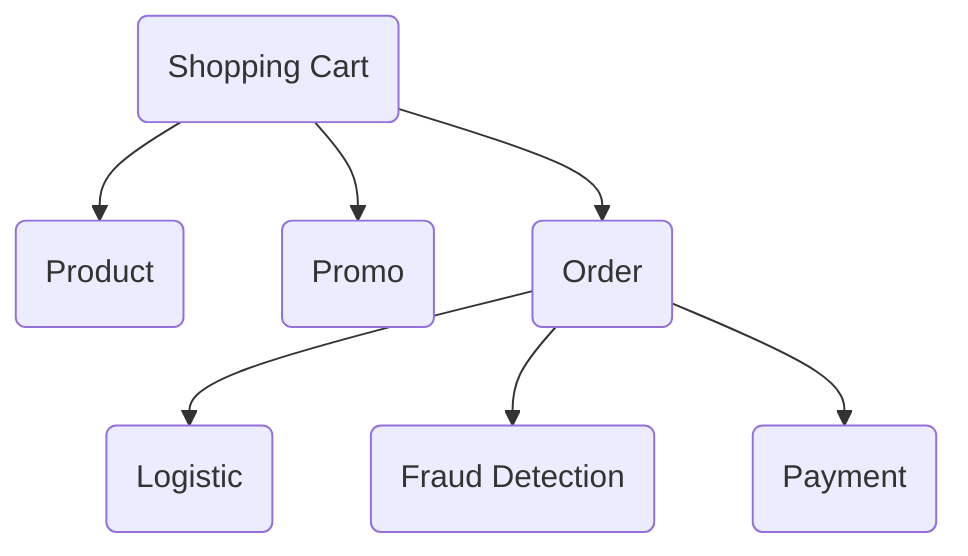
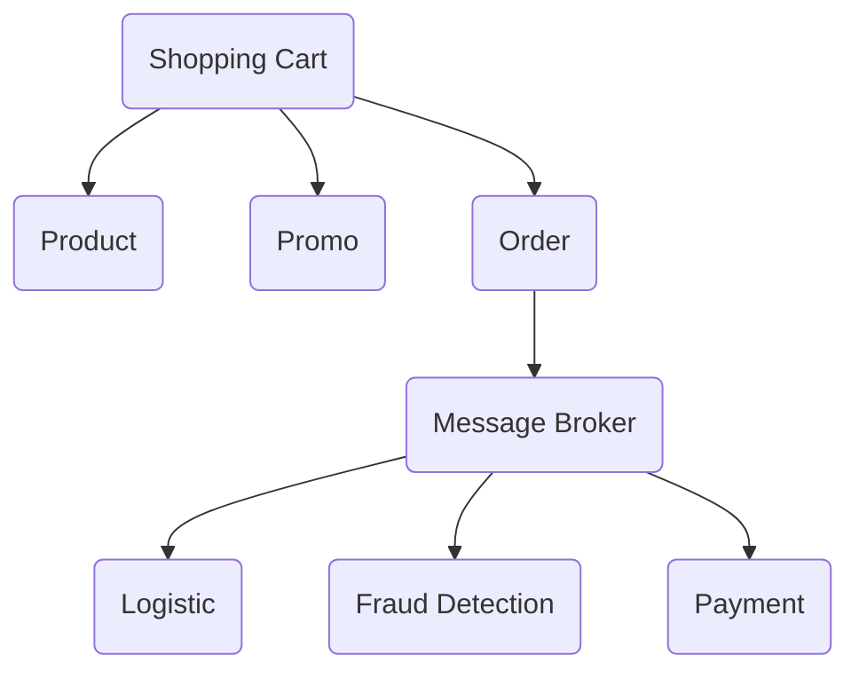
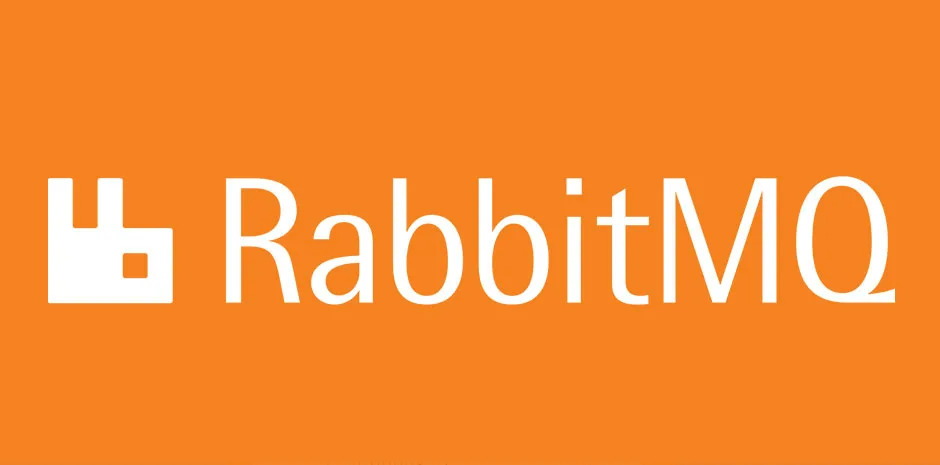
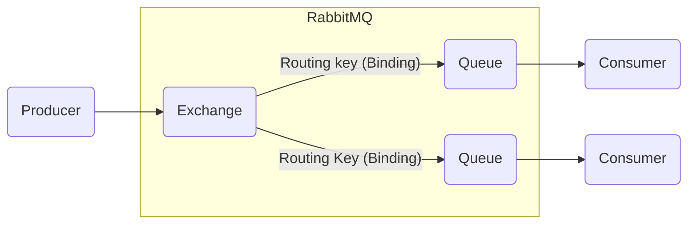
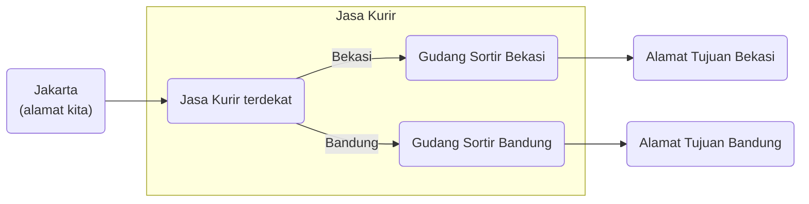
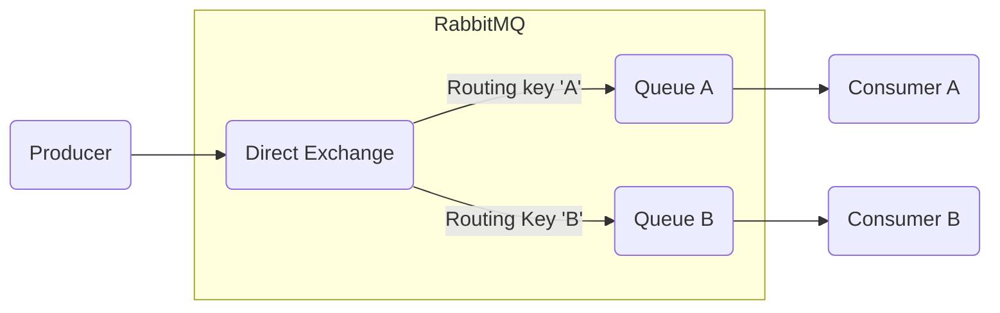
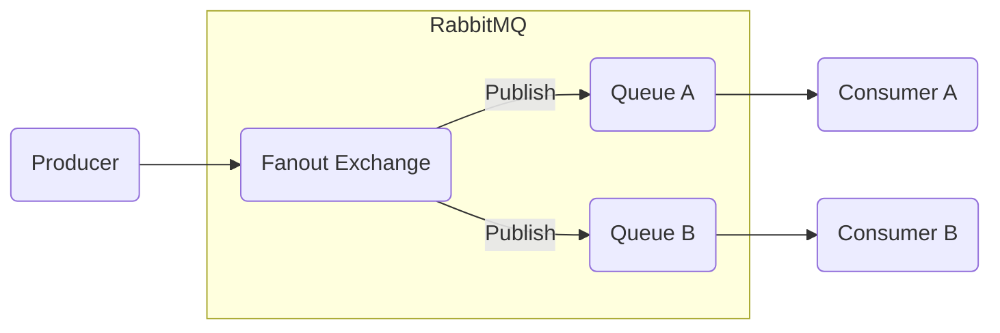
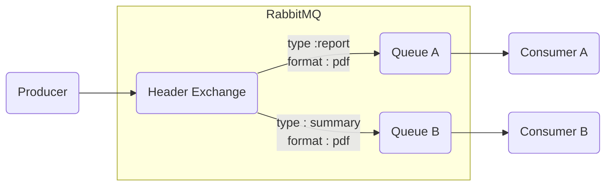
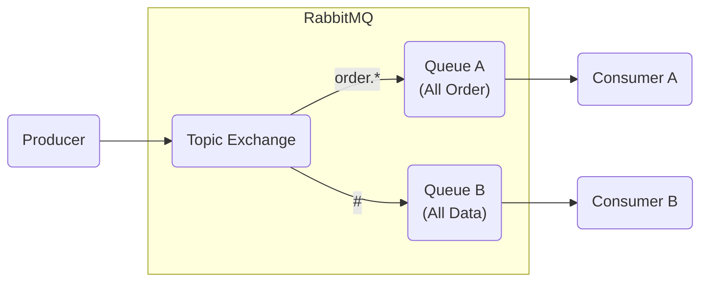

3- Message Broker
---
 = Ali Ikhwan Habibie (@al_ikhwan.h)

# Overview
Message Broker adalah perangkat lunak yang memungkinkan aplikasi, sistem, dan layanan berkomunikasi satu sama lain dan bertukar informasi. Dengan adanya Message Broker, kita dapat mengirim data dari suatu aplikasi/sistem ke beberapa aplikasi/sistem lainnya yang kompleks dengan aman dan andal.

## Benefit
- Memungkinkan integrasi sistem yang lebih mudah dan fleksibel,
- Meningkatkan skalabilitas sistem,
- Meningkatkan toleransi kesalahan,
- Memungkinkan sistem untuk beroperasi dalam Realtime.

## Cons
- Terdapat delay (jeda waktu) data yang tidak konsisten dari pengirim data sampai ke penerima data,
- Saat data gagal dikirim, pengirim data tidak tahu kalau data yang dikirim itu mengalami kegagalan.

# Design System'
Mari kita lihat contoh alur sistem toko online dan mempunyai aplikasi pada diagram dibawah ini :

Pada aplikasi 'order' di diagram diatas merupakan aplikasi yang masih menggunakan protokol RPC (Remote Procedure Call). Memang salahsatu keuntungan menggunakan RPC yaitu Synchronous dan Realtime, tetapi kekurangan terbesarnya yaitu **ketergantungan** jika dalam 1 aplikasi terhubung dengan banyak aplikasi lainnya.

Jika kita lihat aplikasi 'order' pada diagram diatas, dia terhubung dengan 3 aplikasi yaitu "Logistic", "Fraud Detection", dan "Payment". Jika salahsatu aplikasi itu tidak berjalan, maka aplikasi "Order" otomatis tidak bisa dijalankan juga. Itulah salahsatu kelemahan dari RPC dalam kasus ini. Maka dari itu, kita pakai konsep messaging agar menghindari kasus seperti itu. 

Jika kita menggunakan message broker pada aplikasi 'order', alur diagram sistem toko onlinenya berubah seperti dibawah ini :

Jadi, data-data yang ingin dikirim aplikasi 'Order' ke 3 aplikasi yang terhubung dengannya("Logistic", "Fraud Detection", dan "Payment"), akan dikirim ke message broker terlebih dahulu. Setelah itu, data data tersebut akan disimpan di message broker untuk disebarkan ke 3 aplikasi tersebut. Aplikasi 'order' mengerahkan data sepenuhnya ke message broker, setelah itu data-data tersebut bukan tanggung jawab aplikasi 'order' lagi, melainkan menjadi tanggung jawab message broker. Setelah itu, data-data yang disimpan di message broker akan dikirim ke 3 aplikasi tersebut. Kita bisa mengatur arah kirim data-data tersebut di software message brokernya.

# RabbitMQ

RabbitMQ merupakan salahsatu perangkat lunak Message Broker yang open-source untuk komunikasi Messaging. RabbitMQ merupakan perangkat lunak yang sangat ringan sehingga cocok digunakan di semua sistem operasi seperti Windows, Linux, dan MAC. 

Sebenarnya perangkat lunak Message Broker itu banyak, tetapi RabbitMQ mempunyai kelebihan yang cocok untuk kita pakai saat ini, diantaranya :
- Sangat ringan, sehingga tidak butuh banyak resource hardware yang digunakan,
- Fleksibel, RabbitMQ memberikan banyak opsi untuk kita gunakan dalam memberikan data ke banyak client. Kita dapat menggunakan RabbitMQ untuk routing, filtering, streaming, federation, dll,
- Didukung oleh ekosistem yang besar, sehingga dapat kita implementasi ke banyak teknologi dan bahasa pemrograman seperti Python, Java, Ruby, PHP, .NET, Javascript, Golang, Swift, dll,
- Interoperabilitas, RabbitMQ mendukung beberapa protokol standar terbuka, termasuk AMQP 1.0 dan MQTT5,
- High availability, sehingga dapat dijalankan di berbagai cluster. Jadi kita tidak perlu khawatir akan terjadinya down. Bahkan RabbitMQ juga mendukung cross ke beberapa zone/region datacenter

RabbitMQ mempunyai 3 komponen utama, yaitu :
1. Exchange
2. Binding
3. Queue

Jika kita analogikan, sistem RabbitMQ ini sama seperti kita mengirimkan barang menggunakan jasa kurir. 

Sebagai contoh, kita ingin mengirimkan 2 barang ke tempat yang berbeda. Alamat kita di Jakarta, sedangkan barang pertama ingin dikirimkan ke Bekasi dan barang kedua akan dikirimkan ke Bandung. Maka alurnya akan seperti berikut :

## Binding
Binding merupakan koneksi yang merelasikan antara 1 atau lebih dari 1 Exchange dan Queue. Jika kita analogikan, binding itu sama dengan rute jalan untuk mengirimkan paket ke tempat sortirnya. Dalam binding, terdapat 2 opsi yang dapat digunakan untuk merutekan koneksi antara Exchange dan Queue :
1. Routing Key => Yaitu nama dari rutenya atau jalannya. Routing key bertipe string.
2. Arguments => yaitu detail dari nama rutenya. Arguments bertipe key & value.

## Exchange
Exchange merupakan tempat untuk mengirim data sesuai tujuan/bind yang ditentukan. Sama seperti jasa kurir, exchange berfungsi untuk mengirimkan data yang telah diterima dari producer ke tujuan atau bind yang telah ditentukan oleh exchange. Exchange itu seperti gerbang untuk menerima data, Exchange nanti akan meneruskan data yang diterima ke Queue. Jika kita membuat Exchange yang tidak memiliki Queue, maka data akan hilang di Exchange, karena **Exchange bukan untuk menyimpan data**.Exchange mempunyai beberapa tipe, diantaranya :
- Direct Exchange => Tipe exchange yang mengirimkan data dengan cara merutekan data tersebut ke Queue yang sesuai dengan routing key (kunci tujuan binding) saat proses binding. Jika kita mengirim data data ke Direct Exchange dengan routing key yang tidak ada di Binding ke Queue, maka secara otomatis data akan dikirim ke Alternate-Exchange, jika tidak ada Alternate Exchange, maka data akan hilang secara otomatis

- Fanout Exchange => Tipe exchange yang mengirimkan data ke seluruh Queue tanpa melihat routing key-nya. Sama seperti Broadcast, semua Queue akan menerima data yang sama.

- Header Exchange => Tipe Exchange yang melalukan perutean data ke Queue sesuai Attribute di Binding.

- Topic Exchange => Tipe exchange sama seperti Direct Exchange tetapi perbedaannya yaitu routing keynya menggunakan titik "." sebagai pemisah kata. Misalnya "order.logistic", "order.payment", "order.fraud". Kita bisa juga menggunakan beberapa tanda berikut :
    - Tanda bintang digunakan untuk mewakili 1 kata. Misal "order.*", artinya bisa untuk routing key "order.logistic", "order.payment", "order.fraud".
    - Tanda Hash digunakan untuk mewakili 1 atau lebih kata. Misal "order.#", artinya bisa untuk "order.a", "order.a.b", "order.a.b.c". Jika "#", artinya bisa untuk semua routing.

## Queue
Queue (antrian) adalah tempat untuk menyimpan data yang diterima oleh Exchange. Queue akan digunakan oleh Consumer. Sama seperti gudang sortir, jadi paket/data akan disimpan disini setelah itu dikirim ke alamat tujuan/consumer. Seperti namanya, Queue ini menggunakan algoritma antrian (Queue) dan metode FIFO (First In First Out). Jadi, data akan dikirim ke consumer berdasarkan data yang terlebih dahulu masuk ke queue dari exchange. Ada 3 tipe queue yang tersedia :
- Classic, jenis antrean serbaguna yang cocok untuk kasus penggunaan di mana keamanan data bukan prioritas karena data yang disimpan dalam antrean klasik tidak direplikasi. Antrean klasik menggunakan implementasi antrean FIFO yang tidak direplikasi.Jika keamanan data menjadi prioritas, rekomendasinya adalah menggunakan antrean dan aliran Quorum , bukan antrean Classic.
- Quorum, jenis antrean modern, yang menerapkan antrean FIFO yang tahan lama dan tereplikasi berdasarkan algoritma konsensus Raft . Antrean kuorum dirancang agar lebih aman dan menyediakan semantik penanganan kegagalan yang lebih sederhana dan terdefinisi dengan baik yang seharusnya lebih mudah dipahami pengguna saat merancang dan mengoperasikan sistem mereka.
- Streams, queue yangdigunakan untuk kebutuhan data streaming. Stream memodelkan log pesan yang hanya dapat ditambahkan dan dapat dibaca berulang kali hingga kedaluwarsa. Stream selalu persisten dan direplikasi. Deskripsi yang lebih teknis tentang perilaku stream ini adalah "semantik konsumen yang tidak merusak".