# 3 - Message Broker

- [3 - Message Broker](#3---message-broker)
  - [Overview](#overview)
    - [Benefit](#benefit)
    - [Cons](#cons)
  - [Design System](#design-system)
  - [RabbitMQ](#rabbitmq)
    - [Binding](#binding)
    - [Exchange](#exchange)
  - [Queue](#queue)
  - [Install RabbitMQ di Python](#install-rabbitmq-di-python)
  - [Membuat program RabbitMQ dengan Python](#membuat-program-rabbitmq-dengan-python)
  - [Sending](#sending)
    - [Menghubungkan file python dengan server RabbitMQ](#menghubungkan-file-python-dengan-server-rabbitmq)
    - [Deklarasi Exchange](#deklarasi-exchange)
    - [Deklarasi Queue](#deklarasi-queue)
    - [Mengirim pesan ke Queue 'email'](#mengirim-pesan-ke-queue-email)
    - [Mengirim pesan ke Queue 'whatsapp'](#mengirim-pesan-ke-queue-whatsapp)
    - [Menutup Koneksi](#menutup-koneksi)
    - [Keseluruhan Kode](#keseluruhan-kode)
  - [Receive (email.py)](#receive-emailpy)
    - [Menghubungkan file python dengan server RabbitMQ](#menghubungkan-file-python-dengan-server-rabbitmq-1)
    - [Deklarasi Exchange dan Queue](#deklarasi-exchange-dan-queue)
    - [Binding Queue dengan Exchange](#binding-queue-dengan-exchange)
    - [Membuat Fungsi untuk menerima pesan](#membuat-fungsi-untuk-menerima-pesan)
    - [Menerima(consume) pesan dari Queue 'email'](#menerimaconsume-pesan-dari-queue-email)
    - [Proses menerima pesan](#proses-menerima-pesan)
    - [Hasil Kode](#hasil-kode)
  - [Receive (whatsapp.py)](#receive-whatsapppy)
  - [Menjalankan proses RabbitMQ](#menjalankan-proses-rabbitmq)

Author: Ali Ikhwan Habibie (@al_ikhwan.h)

## Overview

Message Broker adalah perangkat lunak yang memungkinkan aplikasi, sistem, dan layanan berkomunikasi satu sama lain dan bertukar informasi. Dengan adanya Message Broker, kita dapat mengirim data dari suatu aplikasi/sistem ke beberapa aplikasi/sistem lainnya yang kompleks dengan aman dan andal.

### Benefit

- Memungkinkan integrasi sistem yang lebih mudah dan fleksibel,
- Meningkatkan skalabilitas sistem,
- Meningkatkan toleransi kesalahan,
- Memungkinkan sistem untuk beroperasi dalam Realtime.

### Cons

- Terdapat delay (jeda waktu) data yang tidak konsisten dari pengirim data sampai ke penerima data,
- Saat data gagal dikirim, pengirim data tidak tahu kalau data yang dikirim itu mengalami kegagalan.

## Design System

Mari kita lihat contoh alur sistem toko ouline dan mempunyai aplikasi pada diagram dibawah ini:

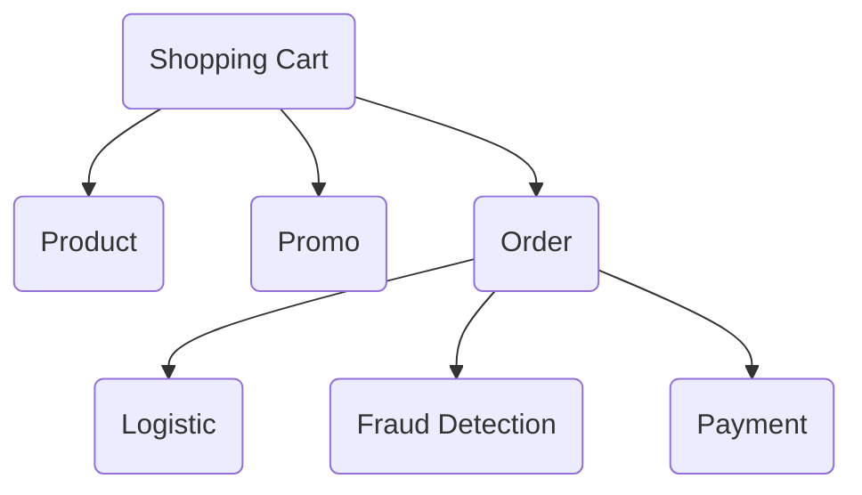

Pada aplikasi `order` di diagram diatas merupakan aplikasi yang masih menggunakan protokol RPC (Remote Procedure Call). Memang salahsatu keuntungan menggunakan RPC yaitu Synchronous dan Realtime, tetapi kekurangan terbesarnya yaitu **ketergantungan** jika dalam 1 aplikasi terhubung dengan banyak aplikasi lainnya.

Jika kita lihat aplikasi `order` pada diagram diatas, dia terhubung dengan 3 aplikasi yaitu `Logistic`, `Fraud Detection`, dan `Payment`. Jika salahsatu aplikasi itu tidak berjalan, maka aplikasi `Order` otomatis tidak bisa dijalankan juga. Itulah salahsatu kelemahan dari RPC dalam kasus ini. Maka dari itu, kita pakai konsep messaging agar menghindari kasus seperti itu.

Jika kita menggunakan message broker pada aplikasi `order`, alur diagram sistem toko onlinenya berubah seperti dibawah ini:

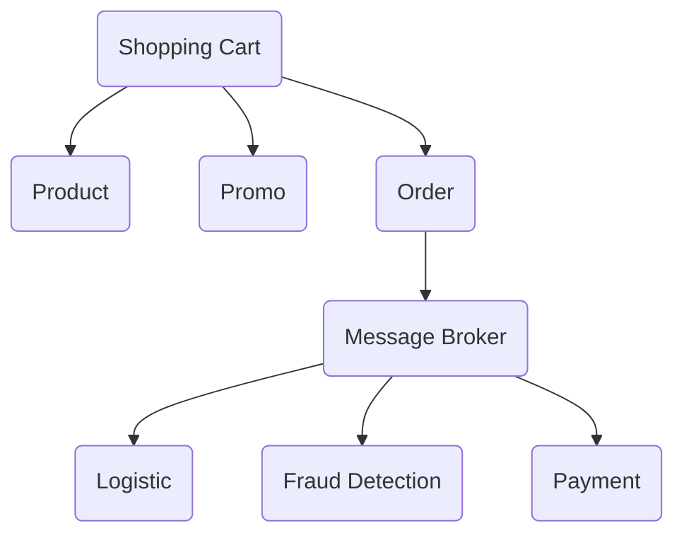

Jadi, data-data yang ingin dikirim aplikasi `Order` ketiga aplikasi yang terhubung dengannya(`Logistic`, `Fraud Detection`, dan `Payment`), akan dikirim ke message broker terlebih dahulu. Setelah itu, data data tersebut akan disimpan di message broker untuk disebarkan ketiga aplikasi tersebut. Aplikasi `order` mengerahkan data sepenuhnya ke message broker, setelah itu data-data tersebut bukan tanggung jawab aplikasi `order` lagi, melainkan menjadi tanggung jawab message broker. Setelah itu, data-data yang disimpan di message broker akan dikirim ketiga aplikasi tersebut. Kita bisa mengatur arah kirim data-data tersebut di software message brokernya.

## RabbitMQ

<p align="center">

</p>

RabbitMQ merupakan salah satu perangkat lunak Message Broker yang open-source untuk komunikasi Messaging. RabbitMQ merupakan perangkat lunak yang sangat ringan sehingga cocok digunakan di semua sistem operasi seperti Windows, Linux, dan MAC.

Sebenarnya perangkat lunak Message Broker itu banyak, tetapi RabbitMQ mempunyai kelebihan yang cocok untuk kita pakai saat ini, diantaranya:

- Sangat ringan, sehingga tidak butuh banyak resource hardware yang digunakan,
- Fleksibel, RabbitMQ memberikan banyak opsi untuk kita gunakan dalam memberikan data ke banyak client. Kita dapat menggunakan RabbitMQ untuk routing, filtering, streaming, federation, dll,
- Didukung oleh ekosistem yang besar, sehingga dapat kita implementasi ke banyak teknologi dan bahasa pemrograman seperti Python, Java, Ruby, PHP, .NET, Javascript, Golang, Swift, dll,
- Interoperabilitas, RabbitMQ mendukung beberapa protokol standar terbuka, termasuk AMQP 1.0 dan MQTT5,
- High availability, sehingga dapat dijalankan di berbagai cluster. Jadi kita tidak perlu khawatir akan terjadinya down. Bahkan RabbitMQ juga mendukung cross ke beberapa zone/region datacenter

RabbitMQ mempunyai 3 komponen utama, yaitu:

1. Exchange
2. Binding
3. Queue

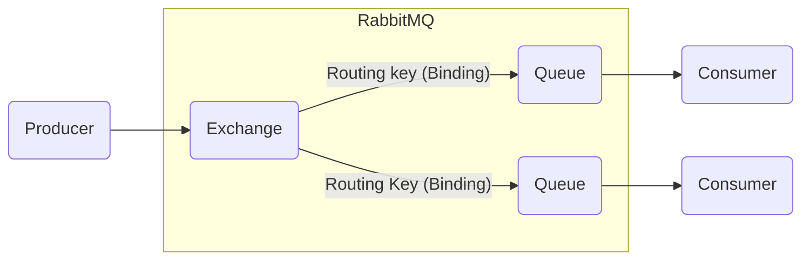

Jika kita analogikan, sistem RabbitMQ ini sama seperti kita mengirimkan barang menggunakan jasa kurir.

<p align="center">

</p>

Sebagai contoh, kita ingin mengirimkan 2 barang ke tempat yang berbeda. Alamat kita di Jakarta, sedangkan barang pertama ingin dikirimkan ke Bekasi dan barang kedua akan dikirimkan ke Bandung. Maka alurnya akan seperti berikut:

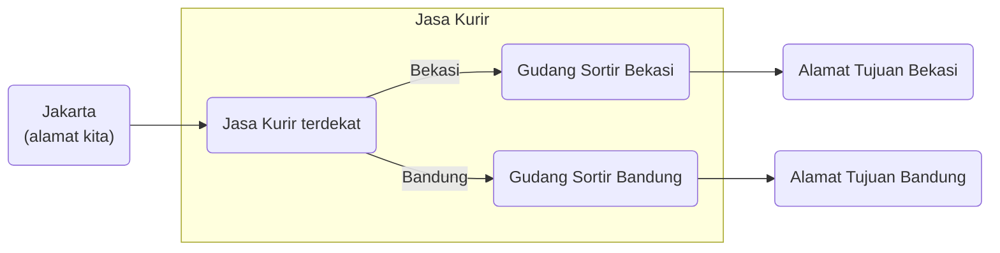

### Binding

Binding merupakan koneksi yang merelasikan antara 1 atau lebih dari 1 Exchange dan Queue. Jika kita analogikan, binding itu sama dengan rute jalan untuk mengirimkan paket ke tempat sortirnya. Dalam binding, terdapat 2 opsi yang dapat digunakan untuk merutekan koneksi antara Exchange dan Queue:

1. Routing Key: Yaitu nama dari rutenya atau jalannya. Routing key bertipe string.
2. Arguments: Yaitu detail dari nama rutenya. Arguments bertipe key & value.

### Exchange

Exchange merupakan tempat untuk mengirim data sesuai tujuan/bind yang ditentukan. Sama seperti jasa kurir, exchange berfungsi untuk mengirimkan data yang telah diterima dari producer ke tujuan atau bind yang telah ditentukan oleh exchange. Exchange itu seperti gerbang untuk menerima data, Exchange nanti akan meneruskan data yang diterima ke Queue. Jika kita membuat Exchange yang tidak memiliki Queue, maka data akan hilang di Exchange, karena **Exchange bukan untuk menyimpan data**.Exchange mempunyai beberapa tipe, diantaranya:

- Direct Exchange: Tipe exchange yang mengirimkan data dengan cara merutekan data tersebut ke Queue yang sesuai dengan routing key (kunci tujuan binding) saat proses binding. Jika kita mengirim data data ke Direct Exchange dengan routing key yang tidak ada di Binding ke Queue, maka secara otomatis data akan dikirim ke Alternate-Exchange, jika tidak ada Alternate Exchange, maka data akan hilang secara otomatis

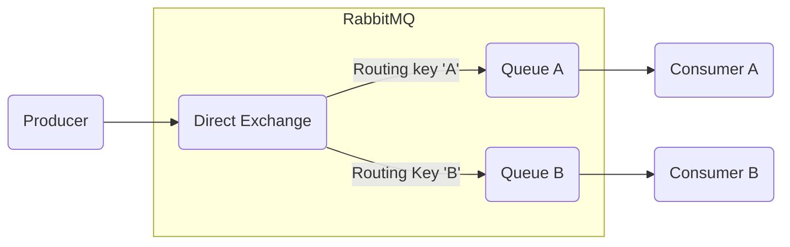

- Fanout Exchange: Tipe exchange yang mengirimkan data ke seluruh Queue tanpa melihat routing key-nya. Sama seperti Broadcast, semua Queue akan menerima data yang sama.

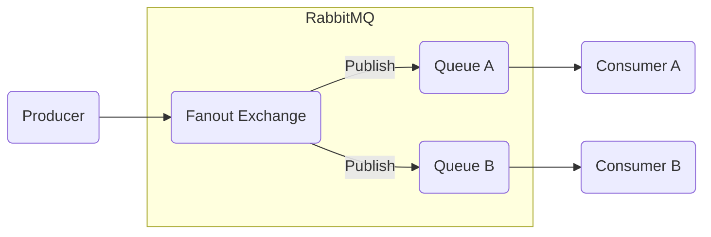

- Header Exchange: Tipe Exchange yang melalukan perutean data ke Queue sesuai Attribute di Binding.

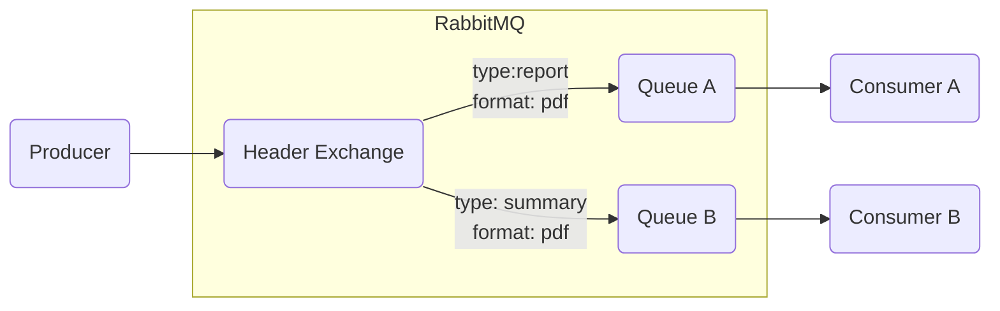

- Topic Exchange: Tipe exchange sama seperti Direct Exchange tetapi perbedaannya yaitu routing keynya menggunakan titik (.) sebagai pemisah kata. Misalnya `order.logistic`, `order.payment`, `order.fraud`. Kita bisa juga menggunakan beberapa tanda berikut:
  - Tanda bintang digunakan untuk mewakili 1 kata. Misal `order.*`, artinya bisa untuk routing key `order.logistic`, `order.payment`, `order.fraud`.
  - Tanda Hash digunakan untuk mewakili 1 atau lebih kata. Misal `order.#`, artinya bisa untuk `order.a`, `order.a.b`, `order.a.b.c`. Jika `#`, artinya bisa untuk semua routing.

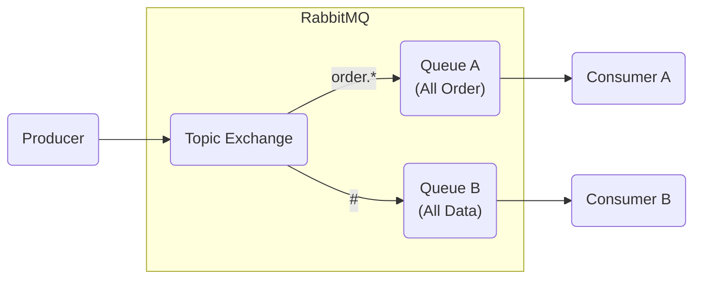

## Queue

Queue (antrian) adalah tempat untuk menyimpan data yang diterima oleh Exchange. Queue akan digunakan oleh Consumer. Sama seperti gudang sortir, jadi paket/data akan disimpan disini setelah itu dikirim ke alamat tujuan/consumer. Seperti namanya, Queue ini menggunakan algoritma antrian (Queue) dan metode FIFO (First In First Out). Jadi, data akan dikirim ke consumer berdasarkan data yang terlebih dahulu masuk ke queue dari exchange. Ada 3 tipe queue yang tersedia:

- `Classic`, jenis antrean serbaguna yang cocok untuk kasus penggunaan di mana keamanan data bukan prioritas karena data yang disimpan dalam antrean klasik tidak direplikasi. Antrean klasik menggunakan implementasi antrean FIFO yang tidak direplikasi.Jika keamanan data menjadi prioritas, rekomendasinya adalah menggunakan antrean dan aliran Quorum , bukan antrean Classic.
- `Quorum`, jenis antrean modern, yang menerapkan antrean FIFO yang tahan lama dan tereplikasi berdasarkan algoritma konsensus Raft . Antrean kuorum dirancang agar lebih aman dan menyediakan semantik penanganan kegagalan yang lebih sederhana dan terdefinisi dengan baik yang seharusnya lebih mudah dipahami pengguna saat merancang dan mengoperasikan sistem mereka.
- `Streams`, queue yangdigunakan untuk kebutuhan data streaming. Stream memodelkan log pesan yang hanya dapat ditambahkan dan dapat dibaca berulang kali hingga kedaluwarsa. Stream selalu persisten dan direplikasi. Deskripsi yang lebih teknis tentang perilaku stream ini adalah "semantik konsumen yang tidak merusak".

## Install RabbitMQ di Python

Pertama, hubungkan VSCode kalian dengan instance multipass yang telah kita buat sebelumnya. Berikut langkah langkahnya (Lihat GIF dibawah untuk lebih jelasnya) :

1. Buka PowerShell kalian lalu ketik `multipass list`
2. Copy Alamat IP instance kalian (Jika instance Stopped, jalankan dengan perintah `multipass start [nama instance]`)

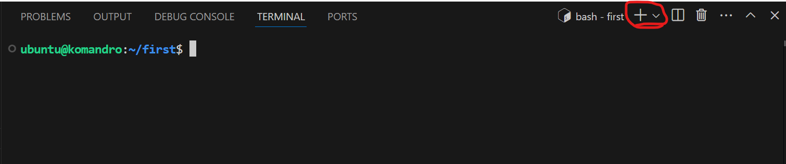

3. Buka VSCode, lalu klik tombol warna biru di pojok kiri bawah
4. Pilih `Connect to Host`
5. Ketik `ubuntu@[Alamat IP Instance kalian]` misalnya : `ubuntu@172.17.138.199`. Lalu pencet tombol Enter.
6. Pilih `Linux`
7. Masukkan password instance Ubuntu kalian
8. Berhasil (Ditandai dengan ditampilkannya alamat IP instance kamu di pojok kiri bawah)

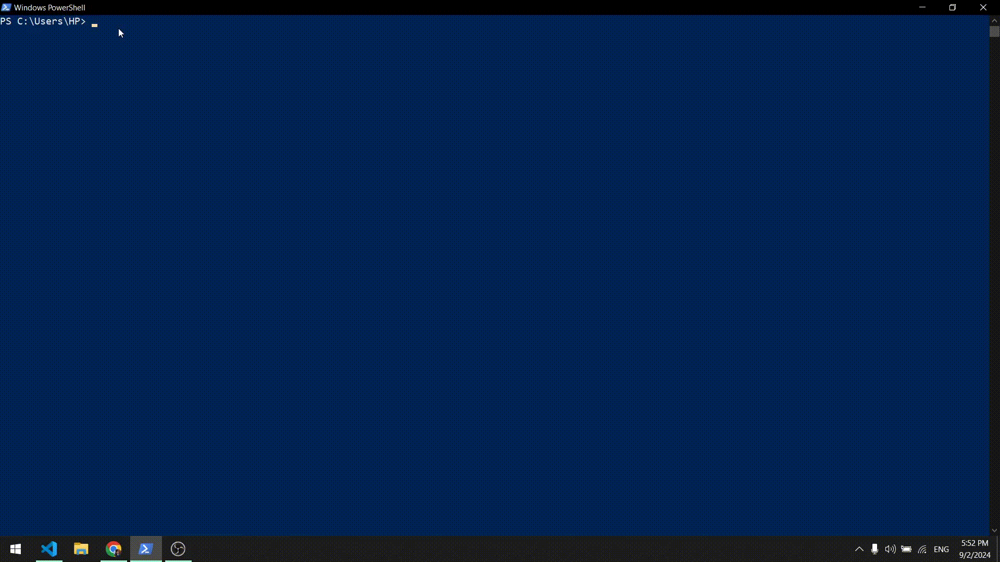

Jika sudah terhubung, buka terminal pada VSCode dengan cara pencet titik tiga di tab atas > Terminal > New Terminal

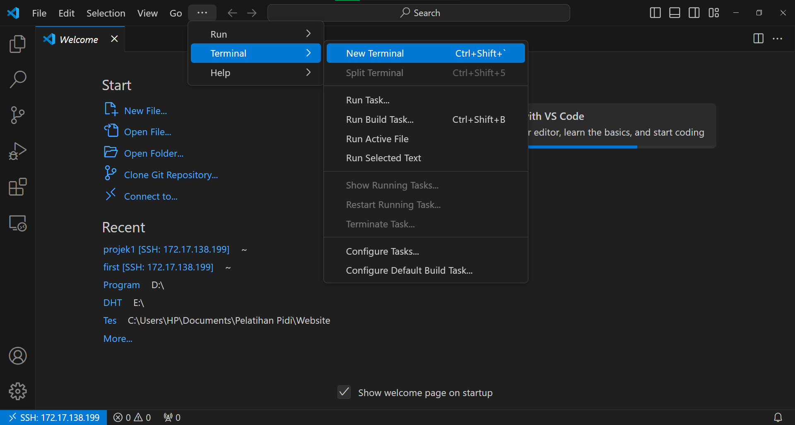

Sekarang kita akan install library server untuk menjalankan rabbitmq di instance kita, masukkan kode dibawah ini satu persatu setiap barisnya:

```bash
sudo apt-get update
sudo apt install rabbitmq-server
```

Sekarang kita buka folder yang telah kita buat sebelumnya, yaitu `projek1`. Berikut langkah-langkah untuk membuka folder kita sebelumnya (Lihat GIF dibawah untuk lebih jelasnya) :
1. Klik tombol tulisan `Open Folder`
2. Pilih folder yang ingin kita pakai, yaitu `projek1`. Lalu pencet tombol biru tulisan `OK` disampingnya
3. Masukkan password instance kalian
4. Jika ada popup peringatan `Do you trust the authors of the files in this folder?`, Cekliskan opsi "Trust the authors of all files in the parent folder", lalu klik tombol biru "Yes, I trust the authors"
5. Berhasil (Ditandai dengan adanya file-file disebelah kiri)

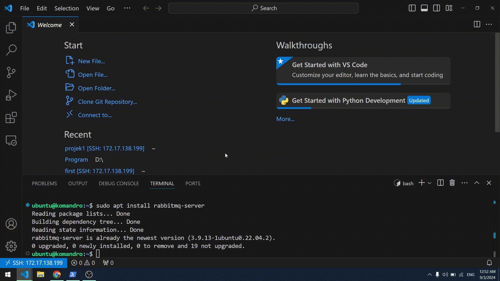

Jika sudah berada di dalam folder kalian yaitu `projek1`, buka terminal pada VSCode dengan cara pencet titik tiga di tab atas > Terminal > New Terminal

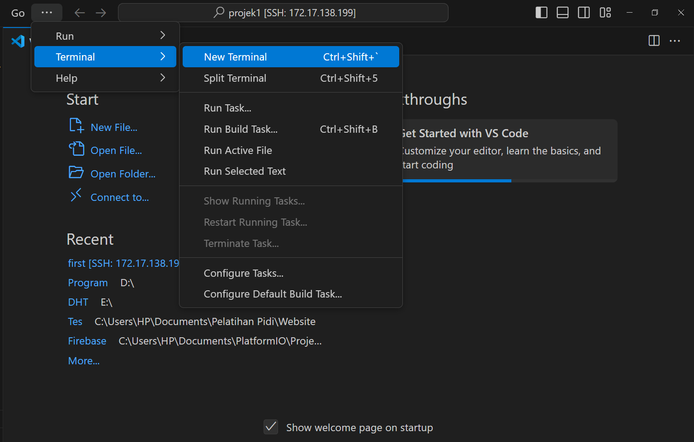

Kita akan install library RabbitMQ yang bernama `pika` di dalam `venv` yang telah kita buat pada bab sebelumnya. Sebelum kita install `pika`, kita perlu mengaktifkan `venv` terlebih dahulu. Masukkan kode dibawah ini pada terminal untuk mengaktifkan `venv`:

```bash
source venv/bin/activate
```

Jika sudah, pastikan kamu melihat tulisan venv di samping host kamu, contoh:

```bash
(venv) ubuntu@komandro:~/projek1$
```

Kita sudah masuk ke Virtual Environment kita. Sekarang, waktunya kita install library RabbitMQ yang bernama `pika` untuk kita pakai di file projek Python kita. Masukkan kode dibawah ini untuk install `pika` :

```bash
python -m pip install pika
```

Sekarang kamu sudah menginstall semua dependency yang dibutuhkan. Silahkan lanjut ke materi selanjutnyaa ^^

## Membuat program RabbitMQ dengan Python

Kita akan membuat program dengan alur seperti diagram dibawah ini:

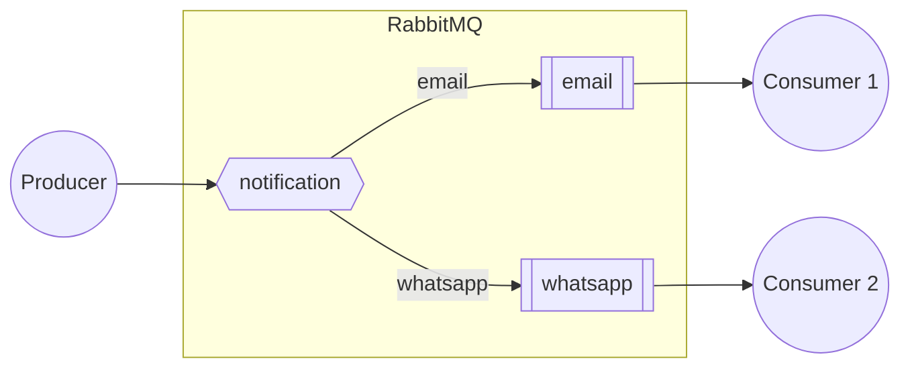

Sebelum itu, kita akan buat 3 file yang masing masing bernama:

1. sending.py (untuk mengirim data dari producer)
2. email.py (untuk menerima data melalui queue email)
3. whatsapp.py (untuk menerima data melalui queue whatsapp)

## Sending

### Menghubungkan file python dengan server RabbitMQ

Hal pertama yang perlu kita lakukan adalah membuat koneksi dengan server RabbitMQ. kita akan mengoneksikannya ke mesin lokal kita yaitu `localhost`. Buat file baru bernama `sending.py` lalu masukkan perlahan-lahan kode di bawah ini:

```python
import pika

connection = pika.BlockingConnection(pika.ConnectionParameters('localhost'))
channel = connection.channel()
```

### Deklarasi Exchange

Pada pembahasan sebelumnya, kita sudah mempelajari pentingnya Exchange dan Queue. Maka dari itu, sekarang kita akan membuat/mendeklarasikan exchange terlebih dahulu.

```python
channel.exchange_declare(exchange='notification', exchange_type='direct')
```

Perhatikan Kode diatas:

- Kita memanggil channel pada server rabbitmq lalu disusul dengan `exchange_declare` untuk mendeklarasikan sebuah exchange.
- Parameter `exchange = 'notification'` gunanya untuk memberi nama 'notification' pada exchange yang ingin kita buat.
- Parameter `exchange_type='direct'` gunanya untuk menandakan tipe 'direct exchange' pada exchange yang ingin kita buat.

### Deklarasi Queue

Setelah kita mendeklarasikan/membuat exchange, kita akan membuat 2 queue agar dapat menyimpan masing masing data notifikasi.

```python
channel.queue_declare(queue='email')
channel.queue_declare(queue='whatsapp')
```

Perhatikan Kode diatas:

- Kita memanggil channel pada server rabbitmq lalu disusul dengan `queue_declare` untuk mendeklarasikan sebuah queue.
- Parameter `queue = 'email'`  dan `queue='whatsapp'` gunanya untuk memberi nama 'email' dan 'whatsapp' pada 2 queue yang ingin kita buat.

### Mengirim pesan ke Queue 'email'

Sekarang kita akan mengirim pesan dari producer ke Queue yang telah kita buat. Pertama, kita akan mengirim pesan ke queue 'email' terlebih dahulu.

```python
pesan1 = 'Halo, Ali! Selamat anda diterima untuk bekerja di perusahaan kami!'
channel.basic_publish(exchange='notification', routing_key='email', body=pesan1)
```

Perhatikan Kode diatas:

- Kita akan membuat variabel 'pesan1' untuk menyimpan sebuah data pesan email.
- Memanggil channel pada server rabbitmq lalu disusul dengan `basic_publish` untuk mengirimkan sebuah data.
- Parameter `exchange = 'notification'` gunanya untuk mengetahui data dikirim dari exchange 'notification'
- Parameter `routing_key='email'` gunanya untuk mengetahui data akan dikirim ke routing key 'email'
- Parameter `body=pesan1` gunanya untuk memanggil variabel 'pesan1' agar menjadi pesan email yang akan dikirimkan.

### Mengirim pesan ke Queue 'whatsapp'

Sekarang kita akan mengirim ke Queue 'whatsapp'.

```python
pesan2 = 'Halo sayangg ><'
channel.basic_publish(exchange='notification', routing_key='whatsapp', body=pesan2)
```

Sama seperti sebelumnya, tetapi ada beberapa yang berbeda:

- Kita akan membuat variabel 'pesan2' untuk menyimpan sebuah data pesan whatsapp.
- Parameter `routing_key='whatsapp'` gunanya untuk menandakan bahwa data akan dikirim ke routing key 'whatsapp'
- Parameter `body=pesan2` gunanya untuk memanggil variabel 'pesan2' agar menjadi pesan whatsapp yang akan dikirimkan.

### Menutup Koneksi

Setelah program dijalankan dan data telah dikirim, akan ada pemberitahuan kalau data terkirim dan koneksi akan ditutup.

```python
print('Pesan terkirim!')

connection.close()
```

Perhatikan Kode diatas:

- Pertama kita akan membuat sebuah output 'Pesan terkirim!' agar sender mengetahui bahwa pesan telah terkirim
- `connection.close()` gunanya untuk menutup koneksi server rabbitmq

### Keseluruhan Kode

Keseluruhan kode `sending.py` akan menjadi seperti ini:

```python
import pika

# Koneksi ke RabbitMQ
connection = pika.BlockingConnection(pika.ConnectionParameters('localhost'))
channel = connection.channel()

# Deklarasi exchange dan queue
channel.exchange_declare(exchange='notification', exchange_type='direct')
channel.queue_declare(queue='email')
channel.queue_declare(queue='whatsapp')

# Mengirim pesan ke queue1
pesan1 = 'Halo, Ali! Selamat anda diterima untuk bekerja di perusahaan kami!'
channel.basic_publish(exchange='notification', routing_key='email', body=pesan1)

# Mengirim pesan ke queue2
pesan2 = 'Halo sayangg ><'
channel.basic_publish(exchange='notification', routing_key='whatsapp', body=pesan2)

print('Pesan terkirim!')

# Menutup koneksi
connection.close()
```

## Receive (email.py)

### Menghubungkan file python dengan server RabbitMQ

Sama seperti saat mengirim data, hal pertama yang perlu kita lakukan adalah membuat koneksi dengan server RabbitMQ. kita akan mengoneksikannya ke mesin lokal kita yaitu 'localhost' karna sama degnan server untuk mengirim data:

```python
import pika

connection = pika.BlockingConnection(pika.ConnectionParameters('localhost'))
channel = connection.channel()
```

### Deklarasi Exchange dan Queue

Kita akan mendeklarasikan Exchange dan Queue yang telah kita buat sebelumnya. Bedanya, kita hanya mendeklarasikan queue 'email' disini karena kita hanya fokus mengirimkan data ke queue email saja.

```python
channel.exchange_declare(exchange='notification', exchange_type='direct')
channel.queue_declare(queue='email')
```

### Binding Queue dengan Exchange

Pastinya kita harus menghubungkan/binding queue 'email' dengan exchange 'notification' dan memberi routing key diantara queue dan exchange tersebut.

```python
channel.queue_bind(exchange='notification', queue='email', routing_key='email')
```

Perhatikan kode diatas:

- Kita memanggil channel pada server rabbitmq lalu disusul dengan `queue_bind` untuk binding queue dengan exchange.
- Parameter `exchange='notification'` gunanya untuk menandakan exchange 'notification' yang akan kita binding.
- Parameter `queue='email'` gunanya untuk menandakan queue 'email' untuk dihubungkan dengan exchange yang telah kita tandai sebelumnya (exchange 'notification')
- Parameter `routing_key='email'` gunanya untuk mmberi routing key 'email' diantara queue dan exchange yang telah kita tandai sebelumnya.

### Membuat Fungsi untuk menerima pesan

Setelah itu, kita akan membuat fungsi bawaan  `callback` untuk menerima pesan yang telah dikirim 'sending.py'.

```python
def callback(ch, method, properties, body):
    print('Pesan diterima:', body)
```

Perhatikan kode berikut:

- Fungsi dan parameter `callback(ch, method, properties, body)` dipanggil dari library pika. jadi itu adalah sebuah fungsi bawaan RabbitMQ.
- Saat pesan telah diterima, akan muncul output `Pesan diterima:` lalu ditambah dengan pesan yang dikirim oleh sender.

### Menerima(consume) pesan dari Queue 'email'

Sekarang kita akan menerima pesan dari queue 'email' sebagai sebuah 'consumer'.

```python
channel.basic_consume(queue='email', on_message_callback=callback, auto_ack=True)
```

Perhatikan kode diatas:

- Kita memanggil channel pada server rabbitmq lalu disusul dengan `basic_consume` untuk menerima data pesan dari queue sebagai consumer.
- Parameter `queue='email'` gunanya untuk menandai kalau kita ingin menerima data dari queue 'email'.
- Parameter `on_message_callback=callback` gunanya untuk memanggil perintah didalam fungsi 'callback' agar terdapat output yang telah tersedia di fungsi 'callback'
- Parameter `auto_ack=True` gunanya agar consumer melaporkan ke rabbitmq kalau pesan itu telah diterima consumer. Setelah rabbitmq menerima laporan, data didalam queue rabbitmq akan segera dihapus

### Proses menerima pesan

Terakhir, kita akan menjalankan proses menerima pesan secara terus-menerus serta memberi output agar receiver dapat mengetahui kalau sedang dalam proses menerima pesan.

```python
print('Menerima pesan email...')

channel.start_consuming()
```

Perhatikan kode diatas:

- Kita akan print output "Menerima pesan email..." agar receiver dapat mengetahui kalau proses menerima pesan sedang berjalan.
- Kita memanggil channel pada server rabbitmq lalu disusul dengan `start_consuming` untuk memulai menerima data pesan.

### Hasil Kode

Keseluruhan kode `receive.py` akan menjadi seperti ini:

```python
import pika

# Koneksi ke RabbitMQ
connection = pika.BlockingConnection(pika.ConnectionParameters('localhost'))
channel = connection.channel()

# Deklarasi exchange dan queue
channel.exchange_declare(exchange='notification', exchange_type='direct')
channel.queue_declare(queue='email')
channel.queue_bind(exchange='notification',
                   queue='email',
                   routing_key='email')

# Fungsi callback untuk menerima pesan
def callback(ch, method, properties, body):
    print('Pesan diterima:', body)

# Menerima pesan dari queue1
channel.basic_consume(queue='email', on_message_callback=callback, auto_ack=True)

print('Menerima pesan email...')

# Menjalankan proses menerima pesan
channel.start_consuming()
```

## Receive (whatsapp.py)

Kode pada `whatsapp.py` tidak jauh berbeda dengan `email.py`. Hanya terdapat beberapa perbedaan seperti pada nama queue dan routing key-nya. berikut hasil kode dari `whatsapp.py`.

```python
import pika

connection = pika.BlockingConnection(pika.ConnectionParameters('localhost'))
channel = connection.channel()

# Deklarasi exchange dan queue
channel.exchange_declare(exchange='notification', exchange_type='direct')
channel.queue_declare(queue='whatsapp')
channel.queue_bind(exchange='notification',
                   queue='whatsapp',
                   routing_key='whatsapp')

# Fungsi callback untuk menerima pesan
def callback(ch, method, properties, body):
    print('Pesan diterima:', body)

# Menerima pesan dari queue2
channel.basic_consume(queue='whatsapp', on_message_callback=callback, auto_ack=True)

print('Menerima pesan whatsapp...')

# Menjalankan proses menerima pesan
channel.start_consuming()
```

## Menjalankan proses RabbitMQ

Sekarang kita akan coba menjalankan proses RabbitMQ pada python yang telah kita buat sebelumnya.
Pertama tama, kalian buka terminal dahulu dengan cara pencet titik tiga di `tab atas > Terminal > New Terminal`. Dikarenakan kita akan menjalankan 3 proses yang berbeda, maka kita akan membuka 3 terminal pada VSCode kita. Klik tanda `+` pada kanan atas terminal.


Setelah kalian buat 3 terminal, beri nama masing masing terminal agar lebih mudah diakses. Klik kanan pada salashatu terminal lalu pencet rename, setelah itu berilah nama terminal sesuai dengan prosesnya.

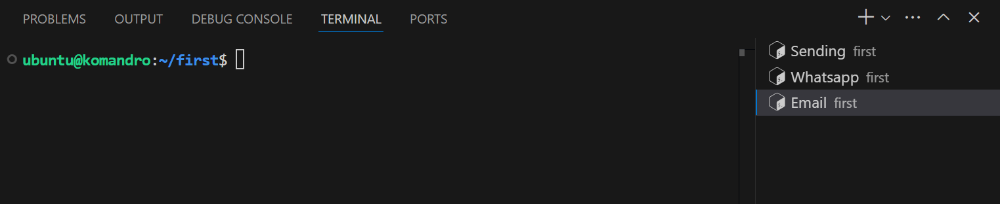

Jika sudah, aktifkan venv di **semua terminal** dengan cara masukkan kode dibawah ini:

```bash
source venv/bin/activate
```

Jalankan file python untuk menerima data terlebih dahulu di masing masing terminal. Dikasus ini yaitu `whatsapp.py` dan `email.py`:

- Pada terminal `Email`, masukkan perintah `python3 email.py`
- Pada terminal `Whatsapp`, masukkan perintah `python3 whatsapp.py`

Setelah kalian menjalankan kedua file tersebut, maka proses consume data akan dimulai secara terus menerus. Jika kalian ingin keluar dari proses menerima datanya, pencet CTRL + C.

Setelah itu, jalankan file `sending.py` di terminal `Sending` dengan cara masukkan perintah `python3 sending.py`. Maka pesan akan dikirim. Setelah itu, lihat kembali terminal `whatsapp` dan `email`. Kalian akan lihat pesan yang telah dikirim dari `sending.py`.

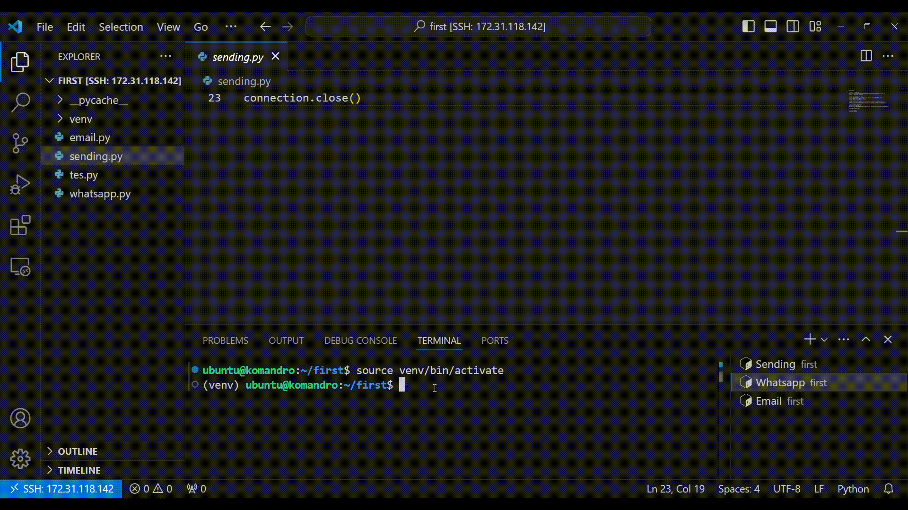