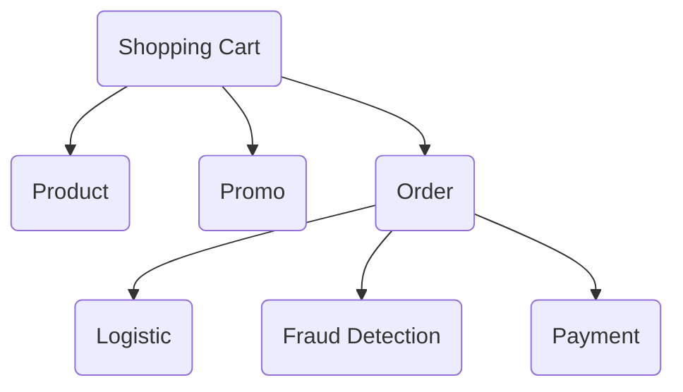
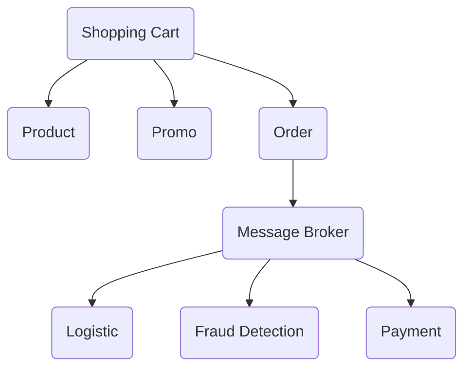

3- Message Broker
---
by = Ali Ikhwan Habibie

# Overview
Message Broker adalah perangkat lunak yang memungkinkan aplikasi, sistem, dan layanan berkomunikasi satu sama lain dan bertukar informasi. Dengan adanya Message Broker, kita dapat mengirim data dari suatu aplikasi/sistem ke beberapa aplikasi/sistem lainnya yang kompleks dengan aman dan andal.

## Benefit
- Memungkinkan integrasi sistem yang lebih mudah dan fleksibel,
- Meningkatkan skalabilitas sistem,
- Meningkatkan toleransi kesalahan,
- Memungkinkan sistem untuk beroperasi dalam Realtime.

## Cons
- Terdapat delay (jeda waktu) data yang tidak konsisten dari pengirim data sampai ke penerima data,
- Saat data gagal dikirim, pengirim data tidak tahu kalau data yang dikirim itu mengalami kegagalan.

# Design System'
Mari kita lihat contoh alur sistem toko online dan mempunyai aplikasi pada diagram dibawah ini :

Pada aplikasi 'order' di diagram diatas merupakan aplikasi yang masih menggunakan protokol RPC (Remote Procedure Call). Memang salahsatu keuntungan menggunakan RPC yaitu Synchronous dan Realtime, tetapi kekurangan terbesarnya yaitu **ketergantungan** jika dalam 1 aplikasi terhubung dengan banyak aplikasi lainnya.
Jika kita lihat aplikasi 'order' pada diagram diatas, dia terhubung dengan 3 aplikasi yaitu "Logistic", "Fraud Detection", dan "Payment". Jika salahsatu aplikasi itu tidak berjalan, maka aplikasi "Order" otomatis tidak bisa dijalankan juga. Itulah salahsatu kelemahan dari RPC dalam kasus ini. Maka dari itu, kita pakai konsep messaging agar menghindari kasus seperti itu. 
Jika kita menggunakan message broker pada aplikasi 'order', alur diagram sistem toko onlinenya berubah seperti dibawah ini :

Jadi, data-data yang ingin dikirim aplikasi 'Order' ke 3 aplikasi yang terhubung dengannya("Logistic", "Fraud Detection", dan "Payment"), akan dikirim ke message broker terlebih dahulu. Setelah itu, data data tersebut akan disimpan di message broker untuk disebarkan ke 3 aplikasi tersebut. Aplikasi 'order' mengerahkan data sepenuhnya ke message broker, setelah itu data-data tersebut bukan tanggung jawab aplikasi 'order' lagi melainkan menjadi tanggung jawab message broker.