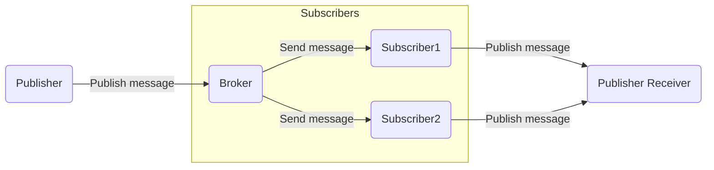
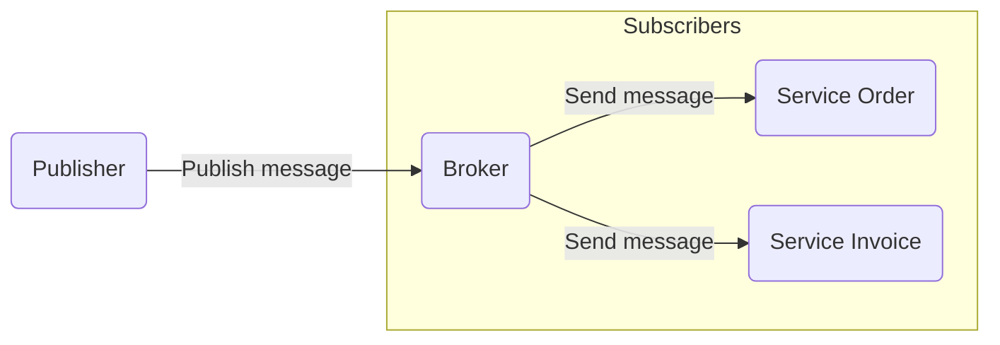
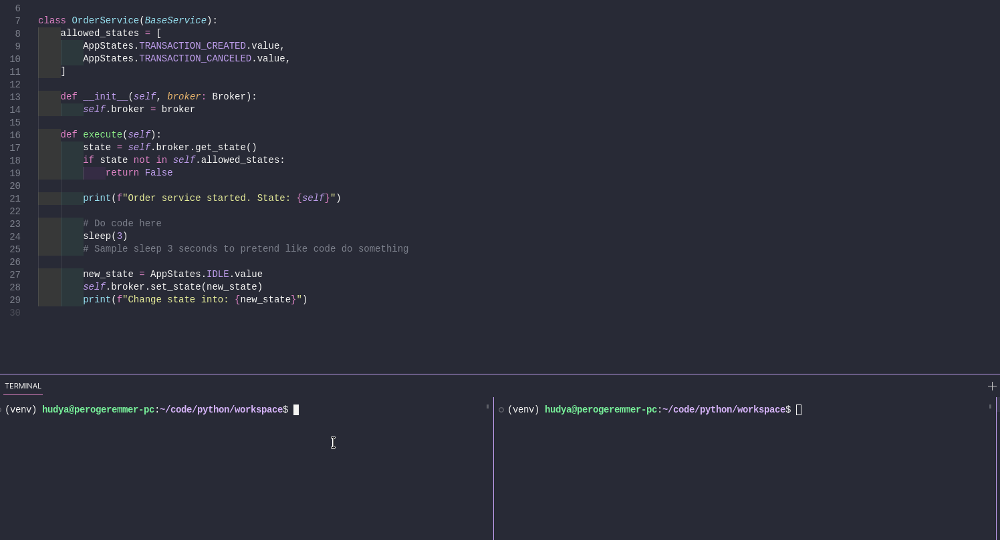
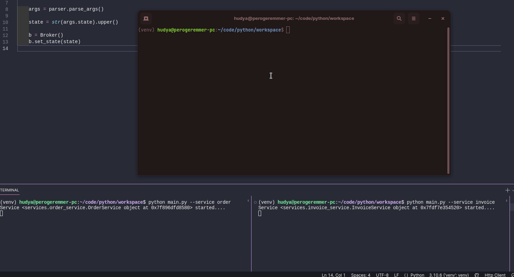
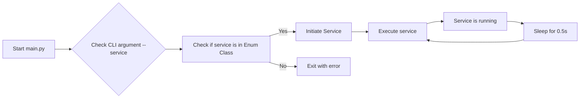

4 - Event Pattern
---

Author: Hudya (@perogeremmer)

<br />

# Overview

Event pattern adalah salah satu desain pattern yang dirancang untuk membuat aplikasi mendengarkan perubahan secara *realtime*. Biasanya, aplikasi yang menggunakan event pattern akan menjalankan beberapa servis (layanan) secara bersamaan.

Dapat dikatakan juga bahwa event pattern adalah event yang menggambarkan layanan *asynchronous*, atau dapat berjalan secara bersamaan.

## Benefit

- **Perubahan *realtime***: Perubahan yang terjadi dapat diakses secara realtime atau dengan jeda yang sangat minim.
- **Layanan pararel**: Apabila ada salah satu servis yang bermasalah, tidak akan merusak servis lainnya, karena masing-masing servis berjalan secara pararel.

## Cons

- **Membutuhkan *resource* yang lebih**: Resource yang dibutuhkan tentu saja akan lebih banyak dibandingkan servis sinkronus (satu servis yang berjalan).

# Design System

Pada dasarnya event pattern dapat digambarkan seperti berikut:



<br />

Terdapat subscriber atau pendengar yang dapat mendengarkan pesan (state / perintah) yang dikirim oleh broker. Masing-masing subscriber akan bekerja apabila state-nya telah sesuai dengan yang telah ditugaskan.

Ini sama saja seperti tugas kelompok, Andi mengerjakan bagian A, Budi mengerjakan bagian B. Budi hanya akan mengerjakan bagian B, dan begitu pula dengan Andi, Andi hanya akan mengerjakan bagian A saja.

<br />

Berikut adalah gambaran kedua dari event pattern :



<br/>

Service order hanya akan bekerja apabila state (perintah) yang dikirimkan adalah:

- `TRANSACTION_PAID`
- `TRANSACTION_CANCELED`

Begitu pula dengan invoice, hanya akan bekerja apabila state perintah yang dikirimkan adalah:

- `ORDER_COMPLETED`
- `ORDER_CANCELED`

Untuk memahami lebih lanjut, silahkan ikuti latihan di bawah ini.

# Exercise

Pertama, kita membutuhkan redis, pastikan kamu sudah memahami apa itu redis, termasuk cara menggunakannya.

Kedua, buat struktur folder seperti ini:

```plain
├── constants
├── cores
└── services
```

<br />

Selanjutnya, di dalam folder `cores`, buat file baru bernama `broker.py` lalu masukkan kode di bawah ini:

```python
from redis import Redis


class Broker:
    def __init__(self, host="localhost", port=6379):
        self.host = host
        self.port = port
        self.redis_client = Redis(host=self.host, port=self.port)
        
        self.prefix: str = "app:state"
        self.decoding: str = "utf-8"

    def get_state(self):
        state = self.redis_client.get(self.prefix)
        
        if not state:
            return ""
        
        state = state.decode(self.decoding)
        return state
    
    def set_state(self, state: str):
        state = self.redis_client.set(
            name=self.prefix, 
            value=state
        )
    
        return state
```

File ini bertujuan untuk menjadi pintu broker yang akan memeriksa state saat ini dan juga dapat melakukan publish state (pergantian state baru).

<br />

Selanjutnya buat file baru bernama `base_service.py` pada folder `services`.

```python
from abc import ABC, abstractmethod


class BaseService(ABC):
    @abstractmethod
    def execute(self):
        pass
```

Kita akan menerapkan Abstraction dari Object-oriented programming, dimana setiap service harus memiliki method bernama `execute`.

Lanjut, kita buat file baru lagi bernaam `invoice_service.py` pada folder `services`.

```python
from services.base_service import BaseService
from cores.broker import Broker
from constants.states import AppStates
from time import sleep


class InvoiceService(BaseService):
    allowed_states = [AppStates.ORDER_CANCELED.value, AppStates.ORDER_PAID.value]

    def __init__(self, broker: Broker):
        self.broker = broker

    def execute(self):
        state = self.broker.get_state()
        if state not in self.allowed_states:
            return False

        print(f"Invoice service started. State: {self}")

        # Do code here
        sleep(3)
        # Sample sleep 3 seconds to pretend like code do something

        new_state = AppStates.IDLE.value
        self.broker.set_state(new_state)
        print(f"Change state into: {new_state}")
```

Masih pada folder yang sama, kita buat file baru lagi bernama `order_service.py`.

```python
from services.base_service import BaseService
from cores.broker import Broker
from constants.states import AppStates
from time import sleep


class InvoiceService(BaseService):
    allowed_states = [AppStates.ORDER_CANCELED.value, AppStates.ORDER_PAID.value]

    def __init__(self, broker: Broker):
        self.broker = broker

    def execute(self):
        state = self.broker.get_state()
        if state not in self.allowed_states:
            return False

        print(f"Invoice service started. State: {self}")

        # Do code here
        sleep(3)
        # Sample sleep 3 seconds to pretend like code do something

        new_state = AppStates.IDLE.value
        self.broker.set_state(new_state)
        print(f"Change state into: {new_state}")
```

Kedua service di atas merupakan service layanan dari sample aplikasi yang ingin kita bangun, nantinya kedua service tersebut akan memeriksa state saat ini. Apabila statenya sesuai pada states yang diizinkan pada service tersebut, maka service tersebut dapat dijalankan, otherwise, service tersebut hanya akan mengembalikan `False`.

<br />

Kita bedah sedikit codenya:

```python
allowed_states = [AppStates.ORDER_CANCELED.value, AppStates.ORDER_PAID.value]
```

Baris di atas bertujuan untuk membuat array baru berisi nilai enum yang kita dapat dari `AppStates` yang sesuai dengan `Invoice`.

<br />

```python
state = self.broker.get_state()
if state not in self.allowed_states:
    return False
```

Baris ini ditujukan untuk memeriksa state yang didapat dari broker, apabila state tidak sesuai dengan array states yang diizinkan, maka akan mengembalikan nilai `False`.

```python
# Do code here
sleep(3)
# Sample sleep 3 seconds to pretend like code do something
```

Kita beri jeda agar seolah-olah kode melakukan sesuatu, pada aplikasi yang nyata, code ditulis pada bagian ini.

<br />

```python
new_state = AppStates.IDLE.value
self.broker.set_state(new_state)
print(f"Change state into: {new_state}")
```

Terakhir, state kita kembalikan menjadi `IDLE`. Kita asumsikan bahwa apabila sudah selesai, maka state harus menjadi `IDLE` kembali. Namun, dalam real-case, bisa jadi statusnya tidak `IDLE`.

<br />

---

Sekarang pindah ke folder `constants`, dan buat file baru bernama `states.py`:

```python
from enum import Enum

class AppStates(Enum):
    ORDER_PAID = "ORDER_PAID"
    ORDER_CANCELED = "ORDER_CANCELED"
    TRANSACTION_CREATED = "TRANSACTION_CREATED"
    TRANSACTION_CANCELED = "TRANSACTION_CANCELED"
    IDLE = "IDLE"
```

File di atas bertujuan untuk membuat standarisasi terhadap state yang diizinkan pada aplikasi yang akan kita bangun. Kita menggunakan tipe data `Enum` pada Python.

Masih pada folder yang sama, buat lagi satu file bernama services.py, lalu masukkan kode berikut:

```python
from enum import Enum

class Services(Enum):
    ORDER_SERVICE = "ORDER"
    INVOICE_SERVICE = "INVOICE"
    
all_services = [i.value for i in Services]
```

Hal ini juga berlaku seperti standarisasi terhadap input service yang akan kita terima nantinya.

Sekarang masuk ke tahap akhir, buat file baru bernama main.py sejajar dengan semua folder seperti ini:

```plain
├── constants
├── cores
├── services
└── main.py
```

<br />

Lalu masukkan kode berikut:

```python
import argparse

from cores.broker import Broker
from constants.services import Services, all_services
from services.order_service import OrderService
from services.invoice_service import InvoiceService
from time import sleep


class Main:
    def __init__(self):
        self.redis = Broker()

    def execute(self, service: str):
        try:
            service = service.upper()
            if service not in all_services:
                print(f"Service is not found. Input: {service}")

            app = None
            if service == Services.ORDER_SERVICE.value:
                app = OrderService(broker=self.redis)
            elif service == Services.INVOICE_SERVICE.value:
                app = InvoiceService(broker=self.redis)

            print(f"Service {app} started....")
            while True:
                app.execute()
                sleep(0.5)
        except Exception as e:
            print(e)


if __name__ == "__main__":
    parser = argparse.ArgumentParser(description="Processing app service.")
    parser.add_argument("--service", type=str, required=True, help="Service of app")

    args = parser.parse_args()
    m = Main()
    m.execute(args.service)
```

Aplikasi main.py akan digunakan untuk menjalankan service aplikasi yang kita bangun berdasarkan input yang ada.

Sebentar kita bedah codenya:

```python
if __name__ == "__main__":
    parser = argparse.ArgumentParser(description="Processing app service.")
    parser.add_argument("--service", type=str, required=True, help="Service of app")

    args = parser.parse_args()
    m = Main()
    m.execute(args.service)
```

Menerima parameter `--service` pada saat aplikasi ingin dijalankan, jadi nanti saat dijalankan harus seperti ini:

```bash
python main.py --service order
```

Lalu bagian class Main:

```python
class Main:
    def __init__(self):
        self.redis = Broker()

    def execute(self, service: str):
        try:
            service = service.upper()
            if service not in all_services:
                print(f"Service is not found. Input: {service}")

            app = None
            if service == Services.ORDER_SERVICE.value:
                app = OrderService(broker=self.redis)
            elif service == Services.INVOICE_SERVICE.value:
                app = InvoiceService(broker=self.redis)

            print(f"Service {app} started....")
            while True:
                app.execute()
                sleep(0.5)
        except Exception as e:
            print(e)
```

Class Main akan memiliki atribut `redis` dari class constructor dan memiliki satu method `execute` yang mana menerima parameter `service` berupa `string`. Kemudian kode kita bungkus pada try catch yang mana pada bagian pertama, diperiksa apakah argumen yang dikirimkan sesuai atau tidak pada constants `service`.

Perhatikan service.py pada folder constants terdapat baris kode:

```python
all_services = [i.value for i in Services]
```

Artinya, semua nilai enum kita kumpulkan pada sebuah array.

<br />

```python
app = None
if service == Services.ORDER_SERVICE.value:
    app = OrderService(broker=self.redis)
elif service == Services.INVOICE_SERVICE.value:
    app = InvoiceService(broker=self.redis)
```

Selanjutnya terdapat dua kondisi, apabila service sesuai dengan string `ORDER_SERVICE`, maka objek yang di-inisiasi adalah `OrderService`.  Sebaliknya, apabila service sesuai dengan nilai string InvoiceService dari enum Service, maka objek yang di-inisiasi adalah `InvoiceService`.

<br />

```python
print(f"Service {app} started....")
while True:
    app.execute()
    sleep(0.5)
```

Selanjutnya, apabila objek sudah di-inisasi, maka kita bisa memanggil method `execute`, hal ini dikarenakan `OrderService` dan `InvoiceService` memang memiliki method `execute`.

Kemudian aplikasi akan diberi jeda selama 0.5 detik dan kembali memanggil fungsi execute.

# Jalankan Aplikasi

Sekarang coba jalankan aplikasi dengan perintah berikut:

```bash
python main.py --service <service>
```

Contoh:

```bash
python main.py --service order
```



Sudah bisa berjalan namun tidak bisa melihat apapun? Tentu, hal ini dikarenakan tidak ada perintah state yang dikirimkan.

Kalau kamu perhatikan, pada setiap service terdapat kode baris ini:

```python
state = self.broker.get_state()
if state not in self.allowed_states:
    return False
```

Artinya apabila state dari broker saat ini tidak sesuai, maka aplikasi tidak berjalan.

Bagaimana cara membuatnya berjalan? Oke, sekarang pergi buat file `publisher.py` sejajar dengan `main.py`.

```python
import argparse
from cores.broker import Broker

if __name__ == "__main__":
    parser = argparse.ArgumentParser(description="Processing app state.")
    parser.add_argument("--state", type=str, required=True, help="State of app")

    args = parser.parse_args()
    
    state = str(args.state).upper()
    
    b = Broker()
    b.set_state(state)
```

Sekarang kamu bisa menjalankan publisher dengan state yang kamu inginkan, perlu diingat bahwa agar state berubah, harus sesuai dengan state yang berada pada `constants/state.py`.

Misalnya coba jalankan state berikut:

```python
python publisher.py --state transaction_created
```

Lihat hasilnya:




# Cara Aplikasi Bekerja

Untuk memahami bagaimana cara event pattern pada contoh di atas bekerja, simak flowchart berikut:

