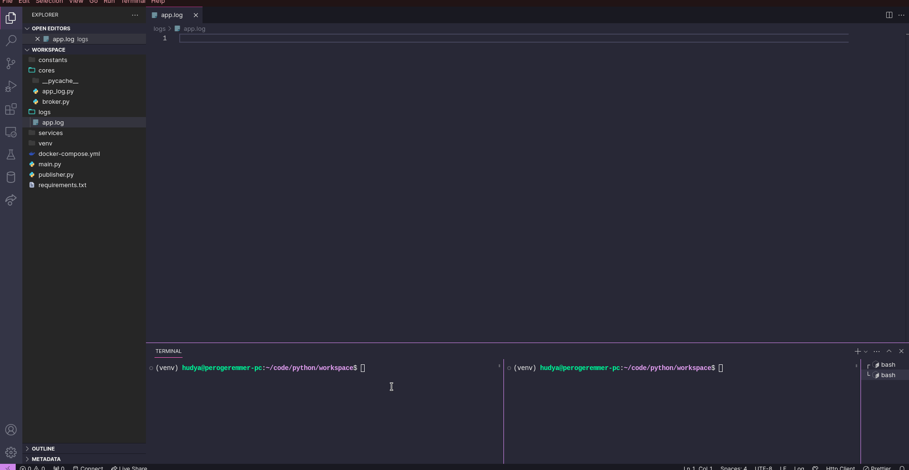

5 - Logging
---

Author: Hudya (@perogeremmer)

<br />

# Overview

Ketika membicarakan logging, masih banyak yang tidak merasa bahwa logging itu penting. Padahal kenyataannya, logging itu merupakan proses untuk memahami keadaan aplikasi atau sistem yang dibangun.

Dengan membuat logging yang baik, kita dapat memahami alur dari aplikasi yang kita bangun termasuk mencatat kejadian dari aplikasi kita.

Contoh output logging:

```log
2022-01-09 12:34:32.123456 [INFO] - This is an info message
2022-01-09 12:34:32.123456 [WARNING] - This is a warning message
2022-01-09 12:34:32.123456 [ERROR] - This is an error message
2022-01-09 12:34:32.123456 [CRITICAL] - This is a critical message
```

<br />

Inilah output dari aplikasi yang kita bangun:

```log
2023-02-20 15:00:00.000000 [INFO] - User requesting menu
2023-02-20 15:02:30.250000 [INFO] - User pick menu (Root Beer)
2023-02-20 15:04:10.670000 [INFO] - Waiting user payment for Rp. 15,000.00
2023-02-20 15:07:40.130000 [INFO] - Payment accepted, payment method: QRIS
2023-02-20 15:09:50.340000 [INFO] - Sending order, giving Root Beer
2023-02-20 15:10:55.980000 [INFO] - Transaction closed, back to idle
```

Dapat dilihat bahwa dengan melihat logging, kita dapat memahami keadaan dari aplikasi kita secara berurut, dimulai dari saat pengguna membuka menu, memilih menu, hingga melakukan pembayaran dan menutup transaksi. Pada kasus di atas, sample log yang ditulis adalah contoh aplikasi vending machine dimana ketika pengguna memilih minuman, menunggu pembayaran, lalu melakukan pembayaran dengan metode QRIS, hingga ketika menutup transaksi yang mana pada kasus realnya adalah mengeluarkan minuman.

Dengan membaca log, kita juga dapat melakukan tracking bahwa sebenarnya seberapa lama pengguna melakukan aktivitas dari meminta menu, hingga memilih menu, serta seberapa lama user melakukan pembayaran, hingga mesin tersebut mengeluarkan minuman.

Hal-hal kecil ini seringkali dianggap remeh, padahal kita bisa menghasilkan knowledge untuk sisi bisnis dengan memahami log dari aplikasi yang kita bangun.

Selain itu, biasanya log juga akan digabung dengan payload dari aplikasi agar tim developer dapat memahami sebenarnya nilai yang sedang dikirimkan itu berbentuk seperti apa. Contoh:

```log
2023-02-20 15:00:00.000000 [INFO] - User requesting menu
2023-02-20 15:02:30.250000 [INFO] - User pick menu (Root Beer)
2023-02-20 15:04:10.670000 [INFO] - Waiting user payment for Rp. 15,000.00
                                    Payload: {"user_id": 123, "order_id": 999, "menu": "Root Beer", "payment_due": "15000.00"}
2023-02-20 15:07:40.130000 [INFO] - Payment accepted, payment method: midtrans
                                    Payload: {"user_id": 123, "order_id": 999, "payment_method": "midtrans", "payment_status": "accepted"}
2023-02-20 15:09:50.340000 [INFO] - Sending order, giving Root Beer
                                    Payload: {"order_id": 999, "status": "preparing", "menu": "Root Beer"}
2023-02-20 15:10:55.980000 [INFO] - Transaction closed, back to idle
                                    Payload: {"order_id": 999, "status": "closed"}
```

# Exercise

Secara sederhana, kita dapat membuat log pada python dengan code sebagai berikut:

```python
import logging

class AppLogger:
    def __init__(self, log_file="app.log"):
        self.__log_file = f"logs/{log_file}"
        self.__logger = logging.getLogger(__name__)
        
        if not self.__logger.handlers:
            self.__logger.setLevel(logging.INFO)
            self.file_handler = logging.FileHandler(self.__log_file)
            self.file_handler.setLevel(logging.INFO)
            self.formatter = logging.Formatter('%(asctime)s - %(levelname)s - %(message)s', '%Y-%m-%d %H:%M:%S.%s')
            self.file_handler.setFormatter(self.formatter)
            self.__logger.addHandler(self.file_handler)

    def info(self, message):
        self.__logger.info(message)

    def warning(self, message):
        self.__logger.warning(message)

    def error(self, message):
        self.__logger.error(message)

    def critical(self, message):
        self.__logger.critical(message)

app_log = AppLogger()
app_log.info('User requesting menu')
app_log.info('User pick menu (Root Beer)')
app_log.info('Waiting user payment for Rp. 15,000.00')
app_log.info('Payment accepted, payment method: midtrans')
app_log.info('Sending order, giving Root Beer')
app_log.info('Transaction closed, back to idle')
```

> [!NOTE]
> Jangan lupa untuk membuat folder bernama `logs` sejajar dengan cores dan lainnya.

Struktur foldernya akan seperti ini:

```plain
├── constants
├── cores
├── logs
```

<br />

Menggunakan proyek pada materi [4 - event pattern](./4-event-pattern.md), cobalah buat satu file baru bernama `app_log.py` sejajar dengan `main.py`, sekarang jalankan file `app_log.py` dan kamu akan melihat file `app.log` dengan konten sebagai berikut:

```log
2023-12-12 13:22:39.1702362159 [INFO] - User requesting menu
2023-12-12 13:22:40.1702362160 [INFO] - User pick menu (Root Beer)
2023-12-12 13:22:40.1702362160 [INFO] - Waiting user payment for Rp. 15,000.00
2023-12-12 13:22:40.1702362160 [INFO] - Payment accepted, payment method: midtrans
2023-12-12 13:22:40.1702362160 [INFO] - Sending order, giving Root Beer
2023-12-12 13:22:40.1702362160 [INFO] - Transaction closed, back to idle
```

That's it, kita berhasil membuat file log! Sekarang saatnya kita coba integrasikan dengan konteks yang lebih baik.

Pindahkan file `app_log.py` yang awalnya sejajar dengan `main.py` ke dalam folder `cores` lalu ubah sedikit kodenya agar menjadi seperti ini:

```python
import logging

class AppLogger:
    def __init__(self, log_file="app.log"):
        self.__log_file = f"logs/{log_file}"
        self.__logger = logging.getLogger(__name__)
        
        if not self.__logger.handlers:
            self.__logger.setLevel(logging.INFO)
            self.file_handler = logging.FileHandler(self.__log_file)
            self.file_handler.setLevel(logging.INFO)
            self.formatter = logging.Formatter('%(asctime)s - %(levelname)s - %(message)s', '%Y-%m-%d %H:%M:%S.%s')
            self.file_handler.setFormatter(self.formatter)
            self.__logger.addHandler(self.file_handler)

    def info(self, message):
        self.__logger.info(message)

    def warning(self, message):
        self.__logger.warning(message)

    def error(self, message):
        self.__logger.error(message)

    def critical(self, message):
        self.__logger.critical(message)
```

Kita hilangkan kode yang tidak perlu, terutama pada bagian bawah yang menginisiasi `AppLogger`.

Sekarang kita akan mengubah tiga file dengan logger, ubah beberapa file berikut:

`main.py`

```python
import argparse

from cores.broker import Broker
from constants.services import Services, all_services
from services.order_service import OrderService
from services.invoice_service import InvoiceService
from time import sleep
from cores.app_log import AppLogger


class Main:
    def __init__(self):
        self.redis = Broker()
        self.logger = AppLogger()

    def execute(self, service: str):
        try:
            service = service.upper()
            if service not in all_services:
                self.logger.info(f"Service is not found. Input: {service}")

            app = None
            if service == Services.ORDER_SERVICE.value:
                app = OrderService(broker=self.redis)
            elif service == Services.INVOICE_SERVICE.value:
                app = InvoiceService(broker=self.redis)

            self.logger.info(f"Service {app} started....")
            print(f"Service {app} started....")
            while True:
                app.execute()
                sleep(0.5)
        except Exception as e:
            self.logger.error(e)


if __name__ == "__main__":
    parser = argparse.ArgumentParser(description="Processing app service.")
    parser.add_argument("--service", type=str, required=True, help="Service of app")

    args = parser.parse_args()
    m = Main()
    m.execute(args.service)
```

<br />

`invoice_service.py`

```python
from services.base_service import BaseService
from cores.broker import Broker
from constants.states import AppStates
from time import sleep
from cores.app_log import AppLogger

class InvoiceService(BaseService):
    allowed_states = [AppStates.ORDER_CANCELED.value, AppStates.ORDER_PAID.value]

    def __init__(self, broker: Broker):
        self.broker = broker
        self.logger = AppLogger()

    def execute(self):
        state = self.broker.get_state()
        if state not in self.allowed_states:
            return False

        self.logger.info(f"Invoice service started. State: {self}")

        # Do code here
        sleep(3)
        # Sample sleep 3 seconds to pretend like code do something

        new_state = AppStates.IDLE.value
        self.broker.set_state(new_state)
        self.logger.info(f"Change state into: {new_state}")
```

<br />

`order_service.py`

```python
from services.base_service import BaseService
from cores.broker import Broker
from constants.states import AppStates
from time import sleep
from cores.app_log import AppLogger


class OrderService(BaseService):
    allowed_states = [
        AppStates.TRANSACTION_CREATED.value,
        AppStates.TRANSACTION_CANCELED.value,
    ]

    def __init__(self, broker: Broker):
        self.broker = broker
        self.logger = AppLogger()

    def execute(self):
        state = self.broker.get_state()
        if state not in self.allowed_states:
            return False

        self.logger.info(f"Order service started. State: {self}")

        # Do code here
        sleep(3)
        # Sample sleep 3 seconds to pretend like code do something

        new_state = AppStates.IDLE.value
        self.broker.set_state(new_state)
        self.logger.info(f"Change state into: {new_state}")
```

Sekarang cek hasilnya ketika dijalankan:



> [!NOTE]
> File `app.log` pada folder logs akan mengisi setiap kali kita melakukan logging terhadap data aplikasi yang kita miliki