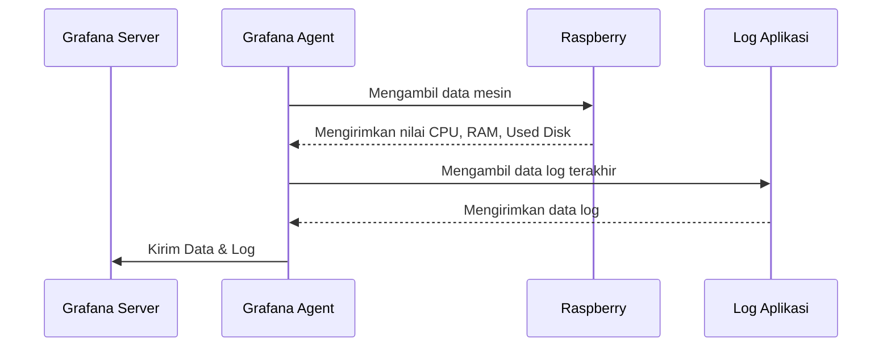
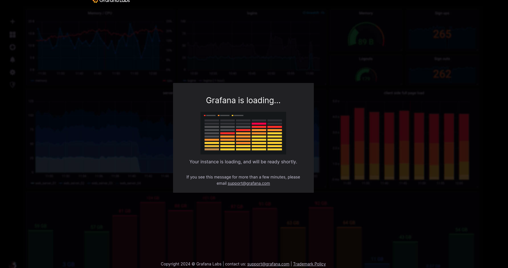
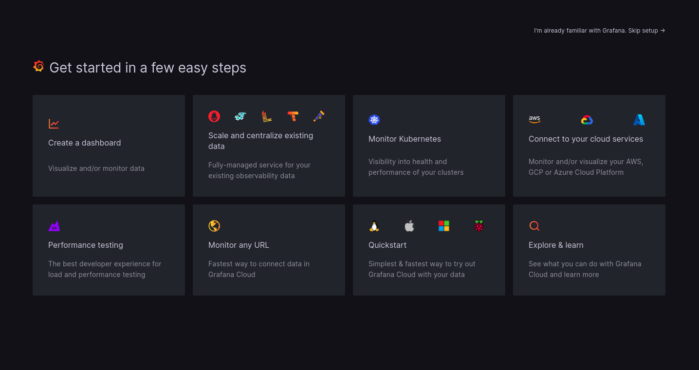
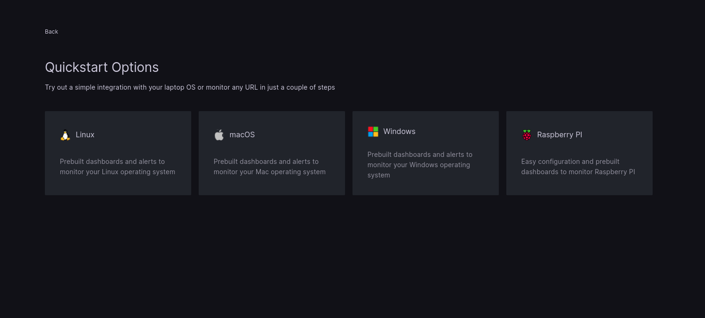
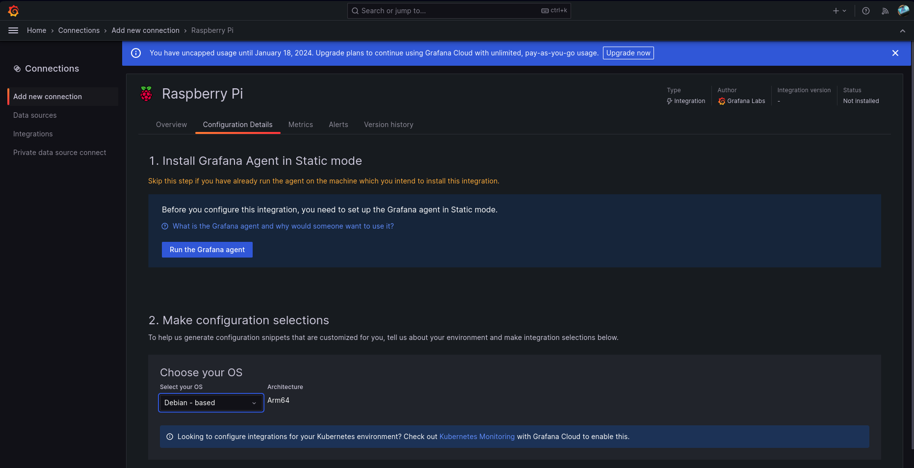
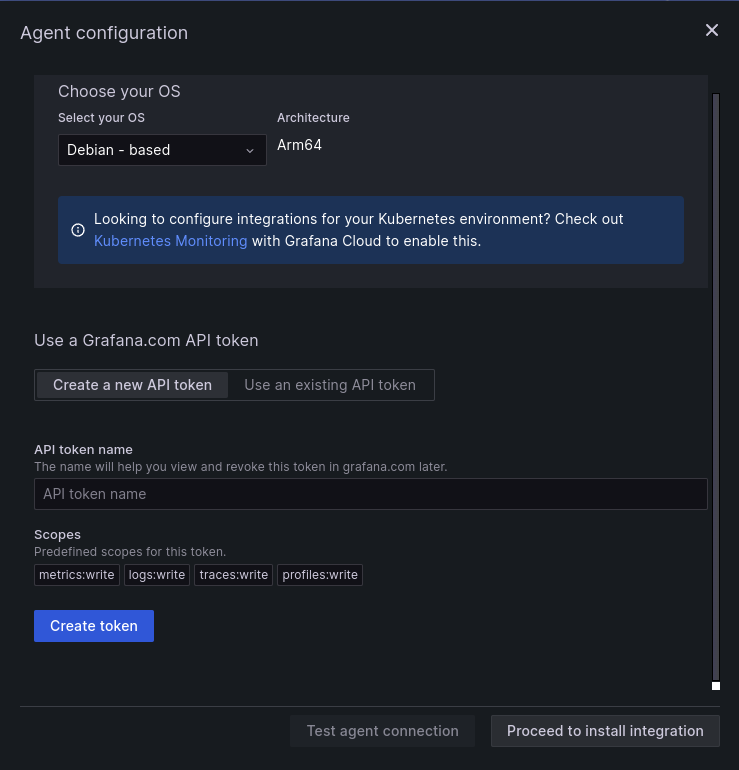
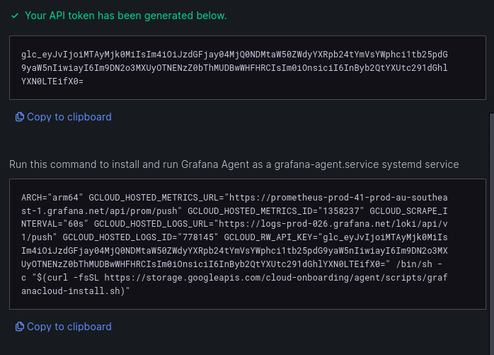
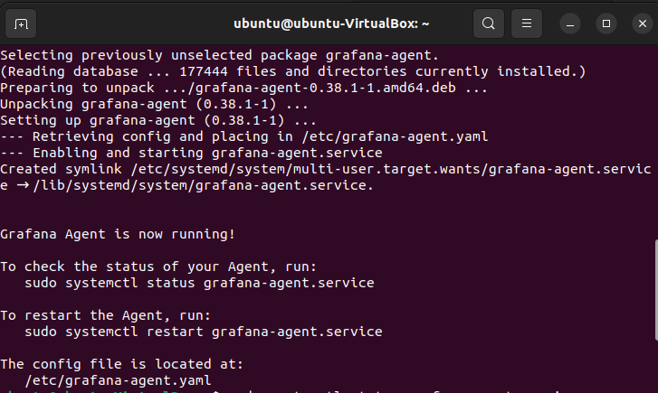
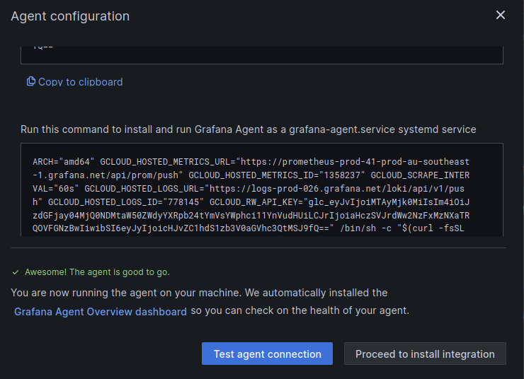

7 - Monitoring
---

Author: Hudya (@perogeremmer)

<br />

# Overview

Setelah membuat aplikasi, kita perlu melakukan monitoring. Apa itu monitoring? Monitoring adalah proses memperhatikan apa yang terjadi pada sistem yang sedang berjalan, ketika kita berbicara memperhatikan, kita tidak hanya memperhatikan log saja, namun juga memperhatikan bagaimana keadaan CPU, RAM, maupun Disk yan ada pada mesin kita.

Hal ini untuk mempermudah proses observasi untuk memahami apa yang terjadi. Pada aplikasi IoT (Internet of Things), komputer mini cenderung dipasang di lokasi yang memiliki bandiwdth internet yang buruk, atau dengan kondisi yang jarang dikunjungi. Hal ini dikarenakan tidak mungkin kita selalu mengontrol mesin kita sesering mungkin secara offline.

Lalu, bagaimana solusi agar kita dapat memahami keadaan mesin kita di lapangan? Dengan bantuan tools monitoring, salah satunya bernama **Grafana**.

---

[Grafana](https://grafana.com) adalah tools monitoring yang dapat melakukan scraping terhadap data yang ada di mesin / komputer kita.

Terdapat dua tools yang ada:

- Grafana Server: Berfungsi sebagai pusat server yang menyimpan data
- Grafana Agent: Berfungsi sebgai tools scrapping yang berjalan pada komputer / mesin.

Grafana Agent secara default akan melakukan scrapping dan mengirimkan data pada mesin kita ke grafana server melalui autentikasi yang telah dibuat.

Berikut gambarannya:



# Exercise

Pertama, pergi ke https://grafana.com dan buatlah akun baru, kamu bisa membuat akun dengan Google Account biar cepat.

Apabila setelah masuk kamu ngeliat gambar ini, tungguin aja. Ini biasanya terjadi karena akun kamu udah lama gak buka grafana, jadi server kamu sedang di-reaktivasi sama si grafana. Yah maklum, namanya juga gratisan.



Kalau sudah register kalian akan diminta tulis team URL dan deployment region, pilih saja team url dengan nama yang kalian mau lalu deployment regionnya pilih singapore.



Klik Quickstart, lalu pilih Raspberry PI



Hasilnya begini:



Klik Run the grafana agent, lalu tampilannya seperti ini:



Lalu ketik saja `belajar-monitoring` pada API token name, klik create token. Kalau selesai kamu akna melihat perubahan pada tampilan seperti ini:




Selanjutnya, kita hanya perlu klik copy to clipboard pada bagian `Run this command to install and run Grafana Agent as a grafana-agent.service systemd service`

Pergi ke terminal lalu paste

Kalau berhasil akan seperti ini tampilannya:



Kalau sudah kamu bisa cek sudah berjalan atau belum dengan cara menuliskan ini di terminal:

```bash
sudo systemctl status grafana-agent.service
```

Kalau dia berjalan, maka akan muncul status hijau.

Sekarang kamu kembali ke grafana, lalu klik test agent connection, kita mencoba apakah sudah nyambung atau belum. Kalau sudah nyambung akan seperti ini:




Sekarang lanjut ke proceed to install integration