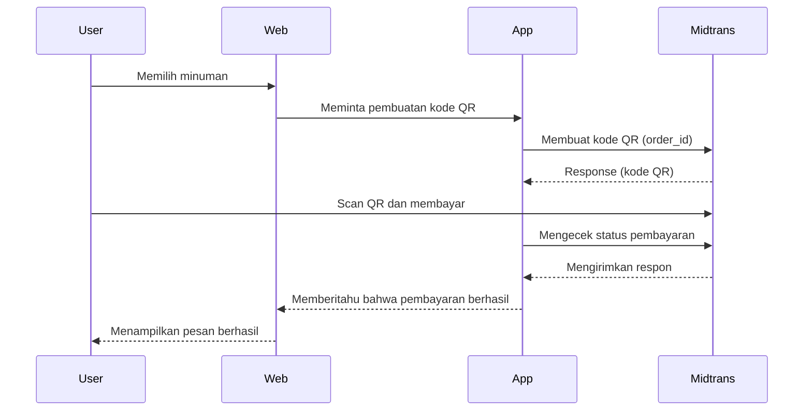
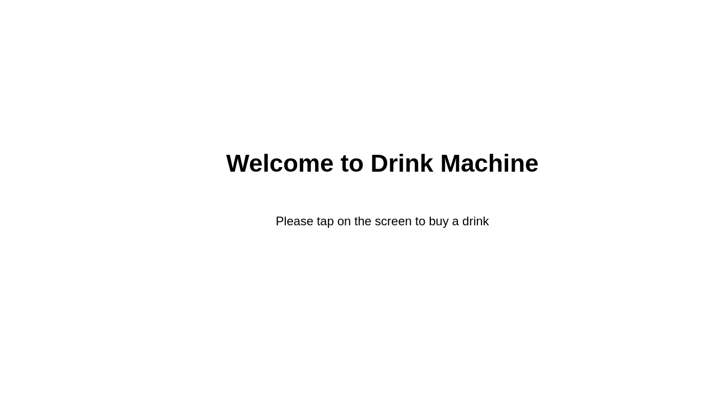

7 - Project Vending Machine (Part 2)
---

Author: Hudya (@perogeremmer)

<br />

# Overview

Pada bagian [kedua](8-project-vending-machine-part-2.md), kita sudah membuat dimana apabila website ditekan (touch) maka kode QR akan tampilan. Selanjutnya kita akan membuat dimana sistem akan memeriksa data pembayaran.

# Code Time

## Buat service baru

Sekarang kita perlu membuat service baru untuk memeriksa apakah pembayaran sudah dilakukan. Buat file baru bernama `order_created_service.py` di dalam folder `services` lalu masukkan kode berikut:

```python
from services.base_service import BaseService
from cores.broker import Broker
from constants.states import AppStates
from constants.redis_prefix import RedisPrefix
from time import sleep
from cores.app_log import AppLogger
from cores.utilities.midtrans_payment import MidtransPayment
import json
import websocket
from datetime import timedelta


class OrderCreatedService(BaseService):
    allowed_states = [AppStates.ORDER_CREATED.value]

    def __init__(self, broker: Broker):
        super().__init__()
        
        self.broker = broker
        self.logger = AppLogger()
        self.mp = MidtransPayment(
            is_production=False,
            client_key=self.config.MIDTRANS_CLIENT_KEY,
            server_key=self.config.MIDTRANS_SERVER_KEY,
        )
        self.ws = websocket.WebSocket()
        self.ws.connect("ws://0.0.0.0:3333")

    def execute(self):
        state = self.broker.get_state()

        if state not in self.allowed_states:
            return False

        self.logger.info(f"Order created service started. State: {self}")

        # Pengecekan data pembayaran
        data = self.broker.read_single_data(RedisPrefix.PAYMENT_DETAIL.value)
        if not data:
            raise Exception("Data pembayaran tidak ditemukan!")

        data = json.loads(data)

        order_id = data["payment_details"]["order_id"]

        attempt = 0
        response = None
        new_state = AppStates.PAYMENT_SUCCESS.value
        """
            Disini dilakukan perulangan sebanyak 40x.
            
            Setiap perulangan diberi jeda 1 detik, artinya setiap detik sistem 
            memeriksa ke server midtrans untuk memastikan apakah transaksi yang 
            baru saja dibuat sudah dibayar atau belum?
        """
        while attempt < 40:
            response = self.mp.check_transaction(order_id=order_id)
            self.logger.info(f"Check status from Midtrans: {response}")

            status_code = int(response["status_code"])
            
            # Kondisi pada kode status transaksi yang didapatkan dari dokumentasi midtrans
            if status_code == 200:
                break
            elif status_code == 201:
                attempt += 1
                sleep(1)
            else:
                new_state = AppStates.PAYMENT_FAILED.value
                break

        status_code = int(response["status_code"])
        
        # Kondisi dimana apabila kode status tidak 200 (tidak berhasil) maka pembayaran dinyatakan gagal
        if status_code != 200:
            new_state = AppStates.PAYMENT_FAILED.value
            self.logger.error(f"Error payment midtrans! Response: {response}")
            self.broker.set_state(new_state)
            return

        self.logger.info(f"Payment finished: {response}")
        self.broker.set_state(new_state)

        # Kirimkan hasil pengecekan ke websocket agar web dapat menerima responnya
        ws_payload = json.dumps({"event": new_state, "values": response})
        self.ws.send(ws_payload)
        self.logger.info(f"Change state into: {new_state}")
```

Class `OrderCreatedService` akan berfungsi sebagai pengecekan terhadap status pembayaran yang baru saja dibuat, pada algoritma kode di atas terdapat perulangan sebanyak 40x yang diberi jeda setiap detik untuk bertanya ke server midtrans.

Kurang lebih alur dari pembuatan kode QR sampai pengecekan akan menjadi seperti ini:



## Ubah file index.html

Sekarang ubah semua kode pada file `index.html` agar menjadi seperti ini:

```html
<!DOCTYPE html>
<html>

<head>
    <style>
        html,
        body {
            height: 100%;
        }

        body {
            display: flex;
            flex-direction: column;
            align-items: center;
            justify-content: center;
            font-family: sans-serif;
        }

        .title {
            font-weight: bold;
            font-size: 48px;
        }

        .subtitle {
            font-size: 24px;
        }

        h2 {
            text-align: center;
            font-weight: bold;
            padding-bottom: 40px;
            font-size: 48px;
        }

        .card-drink {
            width: 200px;
            border: 1px solid #ddd;
            border-radius: 5px;
            text-align: center;
            cursor: pointer;
        }

        .cards {
            display: flex;
            justify-content: center;
        }

        .image-bottle {
            padding: 10px;
        }
    </style>
</head>

<body>
    <p class="title">Welcome to Drink Machine</p>
    <p class="subtitle">Please tap on the screen to buy a drink</p>
</body>

<script>
    document.body.addEventListener('click', function (evt) {
        if (evt.target.className === 'card-drink') {}
    }, false);

    showHome()

    function connect() {
        return new WebSocket("ws://localhost:3333/ws");
    }

    var ws = connect()
    cur_event = null;

    ws.onclose = function (event) {
        console.log(event)
        console.log("Closed! Connecting in 3 seconds.")
        setTimeout(() => {
            ws = connect()
            showHome()
        }, 3000)
    }

    ws.onerror = function (evt) {
        console.log(event)
        console.log("Error! Connecting in 3 seconds.")
        setTimeout(() => {
            ws = connect()
            showHome()
        }, 3000)

    };

    ws.onopen = function (event) {
    }

    ws.onmessage = function (event) {
        if (event.data.includes("connected")) {
            return
        } else if (event.data.includes("disconnected")) {
            return
        } else if (event.data.includes("closed")) {
            return
        }
        
        var data = {}
        try {
            data = JSON.parse(event.data);
            cur_event = data.event.toString()

            // Apabila statenya merupakan show_menu maka fungsi showmenu dipanggil
            if (data.event === "SHOW_MENU") {
                showMenu(data.values)
            } else if (data.event === "ORDER_CREATED") {
                // Apabila statenya merupakan order created maka fungsi showPayment dipanggil
                showPayment(data.values)
            }  else if (data.event === "PAYMENT_SUCCESS") {
                // Apabila statenya merupakan payment success maka fungsi paymentSuccess dipanggil
                paymentSuccess()
                // Memanggil fungsi showHomeAfter dimana fungsi untuk kembali menampilkan halaman home dalam 3 detik
                showHomeAfter()
            } else if (data.event === "PAYMENT_FAILED") {
                // Apabila statenya merupakan payment failed maka fungsi paymentFailed dipanggil
                paymentFailed()
                // Memanggil fungsi showHomeAfter dimana fungsi untuk kembali menampilkan halaman home dalam 3 detik
                showHomeAfter()
            }
        } catch (e) {
            console.log(e)
        }
    };

    function showHome() {
        document.body.innerHTML = `
        <p class="title">Welcome to Drink Machine</p>
        <p class="subtitle">Please tap on the screen to buy a drink</p>
        `
    }

    // Fungsi yang mengurus ketika layar ditekan
    function handleBodyClick() {
        if (cur_event != null) {
            return
        }
        
        // Create JSON data    
        var message = {
            event: "SHOW_MENU",
            values: {}
        };

        // Convert to string
        var json = JSON.stringify(message);

        // Send json data
        ws.send(json);
    }

    // Menampilkan detail pembayaran
    function showPayment(payload) {
        const payment_details = payload.payment_details

        var qr_url = ""
        // Karena actions pada response midtrans merupakan array dan terdapat empat data, maka lakukan looping.
        for (let item of payment_details.actions) {
            if (item.name === "generate-qr-code") {
                qr_url = item.url
            }
        }

        document.body.innerHTML = `
            <h2 class="title">Please do payment using QRIS</h2>
            <div class="card">
                
            </div>
            <p class="subtitle">You will buy ${payload.item_details[0].name}, 
                the price is Rp ${payload.transaction_details.gross_amount}</p>
            <p class="subtitle">The code will be expired in 15 minutes</p>
        `
    }

    // Fungsi menampilkan menu
    function showMenu(values) {

        var drink = values
        
        // Membuat elemen div
        const cardsContainer = document.createElement('div');

        // menambahkan class cards ke dalam elemen div
        cardsContainer.classList.add('cards');

        // Lakukan looping dari data yang diterima melalui websocket, data tersebut adalah daftar menu.
        values.forEach(drink => {

            // Buat elemen div beserta class dan data atribut berupa id
            const card = document.createElement('div');

            // Menambahkan class card-drink pada elemen
            card.classList.add('card-drink');

            // Set data atribute dengan data-item=id_minuman
            card.setAttribute('data-item', drink.id.toString());

            // Tampilkan gambar dari data yang diterima
            const image = document.createElement('img');
            image.classList.add('image-bottle');
            image.src = drink.icon;
            image.width = 100;

            // Menampilkan nama minuman
            const name = document.createElement('p');
            name.textContent = drink.name;

            // Memasukan elemen-elemen DOM ke dalaman elemen div dari variabel card karena data gambar dan nama berada di dalam element card
            card.appendChild(image);
            card.appendChild(name);

            // Memasukan elemen-elemen DOM ke dalaman elemen div dari variabel cardsContainer
            cardsContainer.appendChild(card);
        });

        // Membuat teks menu 
        const heading = document.createElement('h2');
        heading.textContent = 'Please choose a drink';

        // Memasukan elemen-elemen DOM ke body
        document.body.innerHTML = '';
        document.body.appendChild(heading);
        document.body.appendChild(cardsContainer);

        // Mengaktifkan event apabila class card-drink tertekan.
        var cards = document.getElementsByClassName("card-drink");
        for (var i = 0; i < cards.length; i++) {
            cards[i].addEventListener("click", function () {
                cardClicked(this);
            });
        }

    }

    // Tampilan loading
    function showLoading() {
        document.body.innerHTML = `
            <h2 class="title">Please wait</h2>
            <p class="subtitle">Creating your payment...</p>
        `
    }

    // Event ketika minuman ditekan
    function cardClicked(element) {
        try {
            // Mengambil ID minuman yang dipilih
            var item = element.getAttribute("data-item");
            
            // Membuat struktur payload untuk dikirimkan melalui websocket yang akan diterima websocket_event.py
            var message = {
                event: "ORDER",
                values: {
                    "id": item,
                    "total": 1
                }
            };

            // Convert to string
            var json = JSON.stringify(message);

            showLoading()
            // Send json data
            setTimeout(() => {
                ws.send(json);
            }, 2000)

        } catch (e) {
            console.log(e)
        }
    }

    function showHomeAfter() {
        setTimeout(() => {
            ws = connect()
            showHome()
        }, 3000)
    }

    function paymentSuccess() {
        document.body.innerHTML = `
        <p class="title">Payment Success!</p>
        <p class="subtitle">Please wait while we serve your drink</p>
        `
    }

    function paymentFailed() {
        document.body.innerHTML = `
        <p class="title">Payment Failed!</p>
        <p class="subtitle">Please try again</p>
        `
    }

    document.body.onclick = handleBodyClick;
</script>
</html>
```

Kode HTML di atas menambahkan beberapa fungsi baru seperti `paymentSuccess`, `paymentFailed`, dan `showHomeAfter` yang akan berfungsi sesuai dengan nama fungsinya masing-masing.

## Ubah main file

Sekarang ubah file `main.py` dengan kode berikut:

```python
import argparse

from cores.broker import Broker
from constants.services import Services, all_services
from services.order_service import OrderService
from services.order_created_service import OrderCreatedService
from time import sleep
from cores.app_log import AppLogger


class Main:
    def __init__(self):
        env = "not-test"
        db = 0

        if env == "test":
            db = 1

        self.redis = Broker(db=db)
        self.redis.set_state("IDLE")

        self.logger = AppLogger()

    def execute(self, service: str):
        try:
            service = service.upper()
            if service not in all_services:
                self.logger.info(f"Service is not found. Input: {service}")

            app = None
            if service == Services.ORDER_SERVICE.value:
                app = OrderService(broker=self.redis)
            elif service == Services.ORDER_CREATED_SERVICE.value:
                app = OrderCreatedService(broker=self.redis)

            if not app:
                raise Exception("App is not found!")

            self.logger.info(f"Service {app} started....")
            print(f"Service {app} started....")
            while True:
                app.execute()
                sleep(0.5)
        except Exception as e:
            import traceback

            traceback.print_exc()
            self.logger.error(e)
            print(e)


if __name__ == "__main__":
    parser = argparse.ArgumentParser(description="Processing app service.")
    parser.add_argument("--service", type=str, required=True, help="Service of app")

    args = parser.parse_args()
    m = Main()
    m.execute(args.service)
```

Pada file di atas ktia menambahkan kondisi baru yaitu service `ORDER_CREATED` agar aplikasi `main.py` dapat menjalankan service baru yang baru saja kita bangun.

## Menjalankan file

Untuk menjalankannya, ingat kembali konsep websocket.

Karena web dan websocket client yang pada kasus ini adalah class `OrderCreatedService` bergantung kepada websocket server yaitu file `websocket_server.py`, maka kita perlu memastikan bahwa `websocket_server.py` berjalan lebih dahulu. Jalankan file `websocket_server.py` dengan cara:

```bash
python websocket_server.py
```

Kemudian kamu baru dapat menjalankan class OrderService dengan cara:

```bash
python main.py --service ORDER
```

Buka tab terminal baru lalu jalankan juga service order created dengan kode berikut:

```bash
python main.py --service ORDER_CREATED
```

Terakhir, kamu dapat membuka `index.html` kembali. Lakukan simulasi pembayaran seperti yang kamu lakukan pada tutorial kedua, apabila pembayaran berhasil maka tampilannya akan menjadi seperti ini.




