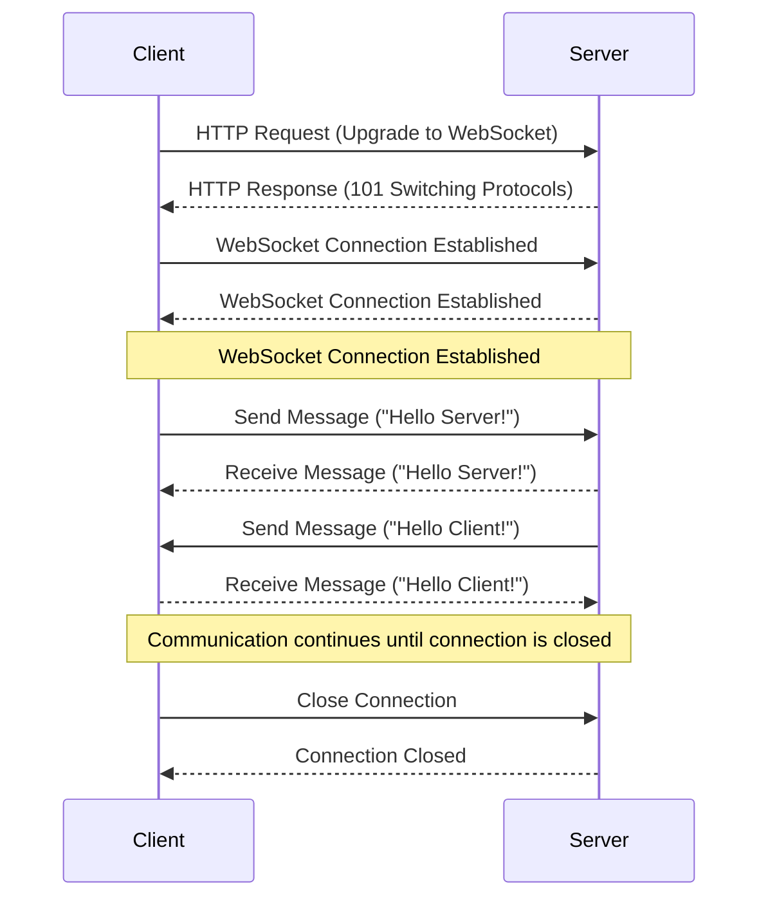
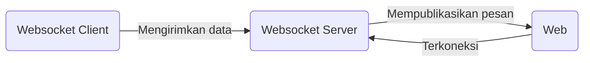

8 - Project Vending Machine (Part 1)
---

Author: Hudya (@perogeremmer)

<br />

# Overview

Sekarang saatnya mempelajari membuat aplikai sederhana. Pada proyek yang akan dibangun, studi kasusnya adalah vending machine. Nantinya aplikasi vending machine akan berjalan dengan alur sebagai berikut:

1. Pengguna menekan layar dengan cara diklik, tujuannya untuk mensimulasikan seolah layar sedang di-tap.
2. Pengguna memilih minuman yang tersedia, untuk studi kasus ini, minumannya hanya dibuat dua saja terlebih dahulu.
3. Pengguna akan menunggu sistem menyiapkan pembayaran, nantinya sistem akan berkomunikasi dengan midtrans selaku payment gateway pembayaran. Dengan sistem midtrans kita akan menggunakan sandbox mode, artinya ini sama saja dengan mode developer dan data yang ditampilkan tidak akan real.
4. Sistem akan menunggu hingga pembayaran dilakukan, nantinya kita akan mengunjungi URL yang disediakan oleh API Midtrans untuk mensimulasikan pembayaran.
5. Sistem akan menampilkan pesan sukses apabila pembayaran berhasil dibayar.

# Code Time

Pada pengerjaannya, silahkan gunakan repository yang sudah dibuat pada [sample nomor 6](../project/6-automation-testing/), silahkan download kembali apabila belum memilikinya.

## Rancangan Struktur

Berikut struktur yang akan kita bangun pada proyek ini.

```markdown
├── constants/
├── cores/
├── logs/
├── services/
├── templates/
├── tests/
├── venv/
├── .env
├── .env.example
├── docker-compose.yml
├── generate_data_drink.py
├── main.py
├── publisher.py
├── requirements.txt
└── websocket_server.py
```

<br/>

## Menyiapkan Data Awal

Secara teori aplikasi yang dibangun adalah aplikasi IoT, dimana aplikasi vending machine dapat terhubung dengan Internet. Aplikasi yang terhubung dengan internet akan mengambil data pada server menggunakan API, namun karena kita hanya mensimulasikan saja maka dari itu kita akan membuat sebuah file sederhana. Pada folder root, sejajar dengan file `main.py`, buat file baru bernama `generate_data_drink.py` lalu masukkan kode berikut:

```python
import json

from cores.broker import Broker
from cores.app_log import AppLogger

key = "drink:items"
data =  [
    {
        "id": "ce33fb74-ba55-40c6-99d7-47bef4cd785e",
        "name": "Cola",
        "icon": "assets/images/cola.png",
        "price": 7000
    },
    {
        "id": "4bdfb8e9-2eb7-4db4-9738-a9be7962055f",
        "name": "Lemon",
        "icon": "assets/images/lemon.png",
        "price": 10000
    },
]

r = Broker(db=0)
data = json.dumps(data)
r.create_single_data(key, data)
```

Kode di atas akan membuat sistem dapat menggunakan redis untuk menyimpan dua data, yaitu minuman lemon dan cola. Pada kasus dunia nyata, IoT dapat menggunakan Redis sebagai media penyimpanan karena redis memiliki performa yang baik, ringan, cepat, dan dapat membangun data dengan TTL (Time to Live). Sekarang jalankan filenya dan lihatlah dengan cara menuliskan `GET drink:items` di dalam redis-cli dan kamu akan melihat sebuah data. Jangan lupa untuk mengunduh aset yang dibutuhkan [disini](./assets/8-project-vending-machine/).

Masukkan gambar yang telah diunduh pada folder `templates/assets/images`. Jadi, buat folder `assets` di dalam folder `templates`, dan buat folder `images` di dalam folder `assets`.

## Websocket

Jadi pada projek ini, kita akan menggunakan HTML sebagai media tampilannya, mengapa HTML?

- Ringan: Menggunakan HTML sudah pasti ringan apalagi tidak terlalu banyak kode barisnya.
- Cepat (Dengan Websocket): HTML tidak dapat berkomunikasi secara langsung dengan server, untuk membuatnya dapat berkomunikasi kita akan menggunakan Javascript yang terhubung dengan Websocket.
- Mudah dikostumisasi tampilannya dengan CSS: Karena tampilannya perlu menarik, maka HTML dapat dipadukan dengan CSS.

### Apa itu Websocket?

WebSocket adalah protokol komunikasi yang memungkinkan koneksi dua arah (bidirectional) antara klien (seperti browser web) dan server. Ini berarti data dapat dikirim dan diterima secara real-time tanpa perlu klien terus-menerus meminta (request) informasi dari server.

### Mengapa WebSocket?

- Real-time Communication: WebSocket memungkinkan aplikasi untuk menerima data dari server segera setelah data tersebut tersedia. Ini sangat penting untuk aplikasi seperti chat, notifikasi, permainan online, dan aplikasi yang membutuhkan pembaruan data secara langsung.
- Efisiensi: Dengan WebSocket, setelah koneksi awal terbentuk, komunikasi antara klien dan server menjadi lebih efisien karena tidak perlu membuat koneksi baru untuk setiap pesan.

## Bagaimana Cara Kerjanya?

- Handshake: Pertama, klien mengirim permintaan HTTP ke server untuk memulai koneksi WebSocket. Ini disebut "handshake".
- Upgrade: Jika server menerima permintaan tersebut, ia mengirimkan respon yang meng-upgrade koneksi dari HTTP ke WebSocket.
- Komunikasi Dua Arah: Setelah koneksi terbentuk, klien dan server dapat saling mengirim dan menerima pesan secara langsung dan terus-menerus sampai salah satu pihak menutup koneksi.

Kurang lebih seperti ini gambaran diagramnya.



## Membuat Prefix

Pertama buat dulu redis prefix constants dimana class ini adalah class enumerate untuk menyimpan nilai konstanta terhadap data prefix redis sehingga tidak perlu ditulis berulang kali. Buat file `redis_prefix.py` di dalam folder `constants` lalu masukkan kode berikut.

```python
from enum import Enum


class RedisPrefix(Enum):
    SELECTED_MENU_DATA = "menu:clicked"
    DRINK_ITEMS = "drink:items"
    PAYMENT_DETAIL = "payment:detail"
    FAILED_PAYMENT = "payment:failed"
```

Nantinya ada empat data, apabila menu dipilih, data minuman, data detail pembayaran, dan terakhir data pembayaran yang gagal.

Sekarang perbaiki juga isi kode `services.py` pada folder constants.

```python
from enum import Enum

class Services(Enum):
    ORDER_SERVICE = "ORDER"
    ORDER_CREATED_SERVICE = "ORDER_CREATED"
        
all_services = [i.value for i in Services]
```

Terakhir, perbaiki juga `states.py` di dalam folder yang sama untuk menambahkan beberapa state baru.

```python
from enum import Enum

class AppStates(Enum):
    MENU_CLICKED = "MENU_CLICKED"
    ORDER_CREATED = "ORDER_CREATED"
    PAYMENT_SUCCESS = "PAYMENT_SUCCESS"
    PAYMENT_FAILED = "PAYMENT_FAILED"
    IDLE = "IDLE"
```

## Membuat Websocket Event

Karena aplikasi Python yang dibangun akan menjadi Websocket Server, maka kita memerlukan untuk membuat websocket event class. Buat file baru bernama `websocket_event.py` di dalam folder cores lalu masukkan kode berikut.

```python
from cores.broker import Broker
from constants.states import AppStates
from constants.redis_prefix import RedisPrefix
from datetime import timedelta
import json


class WebsocketEvents:
    def __init__(self, event: str, payload: dict):
        self.event = event
        self.payload = payload

        db = 0
        self.redis = Broker(db=db)

    def execute(self):
        events = {
            "SHOW_MENU": self.choose_menu,
            "ORDER": self.order,
        }

        if self.event not in events:
            return False

        return events[self.event]()

    def choose_menu(self):
        prefix = RedisPrefix.DRINK_ITEMS.value

        res = self.redis.read_single_data(prefix)

        data = {}
        if res:
            data = json.loads(res)

        return {"event": "SHOW_MENU", "values": data}

    def order(self):
        payload = self.payload

        data = {"id": payload.get("id")}

        data = json.dumps(data)
        self.redis.create_single_data(
            RedisPrefix.SELECTED_MENU_DATA.value, data, expired=timedelta(hours=24)
        )
        self.redis.set_state(AppStates.MENU_CLICKED.value)

        return {"EVENT": "MENU_CLICKED", "values": {}}
```

## Install Library

Untuk membuat websocket server, kita menginstall beberapa library di bawah ini, copy satu persatu kode di bawah ini.

```bash
pip install SimpleWebSocketServer
pip install websocket-client
pip install python-dotenv
```

Jadi nantinya projek kita akan tergambar sebagai berikut.



WC yang merupakan service kita akan terhubung dengan websocket server kemudian dapat mengirimkan data, WS akan mempublikasikan data ke semua client yang terhubung dengannya, pada kasus ini yaitu FE (Web) salah satunya. FE akan menerima pesan realtime dan mengatur logic dari sisi web untuk mengganti tampilannya.

## Membuat Websocket Server

Buat file baru bernama `websocket_server.py` sejajar dengan `main.py`, lalu masukkan kode berikut.

```python
import json
import traceback

from SimpleWebSocketServer import SimpleWebSocketServer, WebSocket
from cores.websocket_event import WebsocketEvents


class Server(WebSocket):
    clients = []
    websocket_events = WebsocketEvents(None, {})

    def handleMessage(self):
        try:
            if self.data:
                data = json.loads(self.data)
                if "event" in data and data["event"]:
                    self.websocket_events.event = data["event"]
                    self.websocket_events.payload = data["values"]

                    result = self.websocket_events.execute()
                    if result:
                        self.data = json.dumps(result)

            print(self.address[0] + " - " + self.data)
            for client in self.clients:
                client.sendMessage(self.data)
        except Exception as e:
            print(e)

    def handleConnected(self):
        self.clients.append(self)
        for client in self.clients:
            client.sendMessage(self.address[0] + " - connected")
        print(self.address, "connected")

    def handleClose(self):
        self.clients.remove(self)
        for client in self.clients:
            client.sendMessage(self.address[0] + " - disconnected")
        print(self.address, "closed")


host = "0.0.0.0"
port = "3333"
server = SimpleWebSocketServer(host, port, Server)

while True:
    try:
        print(f"Websocket running on {host}:{port}")
        server.serveforever()
    except Exception as e:
        print(e)
```

## Membuat file Index

Sekarang buat file `index.html` di dalam folder `templates` lalu masukkan kode berikut:

```html
<!DOCTYPE html>
<html>

<head>
    <style>
        html,
        body {
            height: 100%;
        }

        body {
            display: flex;
            flex-direction: column;
            align-items: center;
            justify-content: center;
            font-family: sans-serif;
        }

        .title {
            font-weight: bold;
            font-size: 48px;
        }

        .subtitle {
            font-size: 24px;
        }

        h2 {
            text-align: center;
            font-weight: bold;
            padding-bottom: 40px;
            font-size: 48px;
        }

        .card-drink {
            width: 200px;
            border: 1px solid #ddd;
            border-radius: 5px;
            text-align: center;
            cursor: pointer;
        }

        .cards {
            display: flex;
            justify-content: center;
        }

        .image-bottle {
            padding: 10px;
        }
    </style>
</head>

<body>
    <p class="title">Welcome to Drink Machine</p>
    <p class="subtitle">Please tap on the screen to buy a drink</p>
</body>

<script>
    document.body.addEventListener('click', function (evt) {
        if (evt.target.className === 'card-drink') {}
    }, false);

    showHome()

    function connect() {
        return new WebSocket("ws://localhost:3333/ws");
    }

    var ws = connect()
    cur_event = null;

    ws.onclose = function (event) {
        console.log(event)
        console.log("Closed! Connecting in 3 seconds.")
        setTimeout(() => {
            ws = connect()
            showHome()
        }, 3000)
    }

    ws.onerror = function (evt) {
        console.log(event)
        console.log("Error! Connecting in 3 seconds.")
        setTimeout(() => {
            ws = connect()
            showHome()
        }, 3000)

    };

    ws.onopen = function (event) {
    }

    ws.onmessage = function (event) {
        console.log(event)
    };

    function showHome() {
        document.body.innerHTML = `
        <p class="title">Welcome to Drink Machine</p>
        <p class="subtitle">Please tap on the screen to buy a drink</p>
        `
    }

</script>
</html>
```

Sekarang coba akses file `index.html` kamu pada browser, lalu klik kanan > inspect element dan lihat pada bagian console. Kamu akan menemukan pesan `127.0.0.1 - connected`