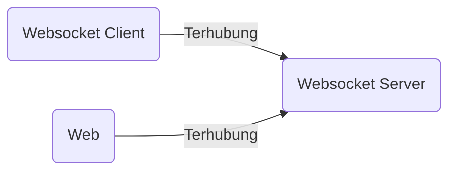
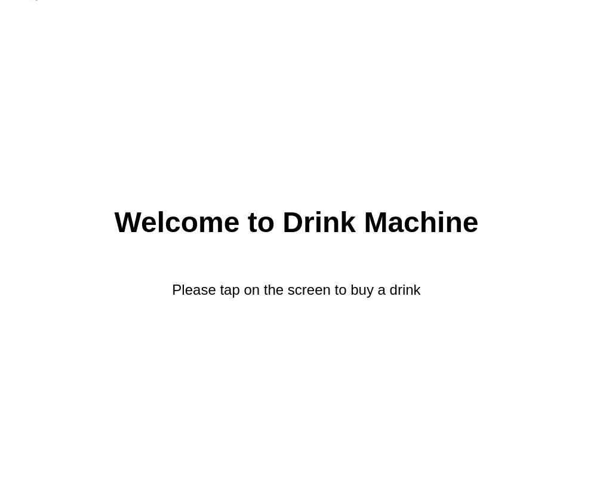
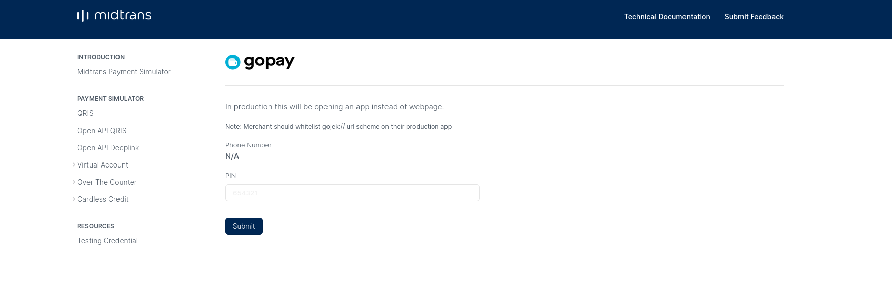
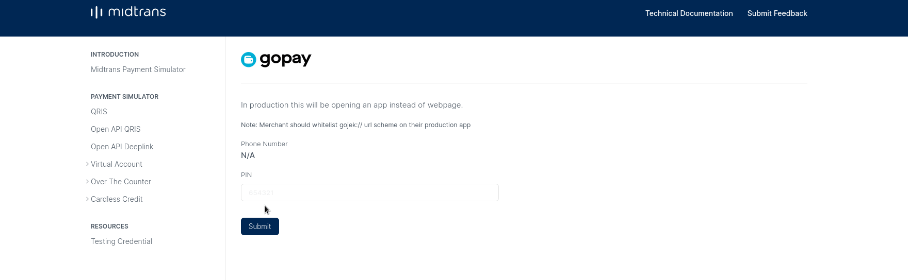

8 - Project Vending Machine (Part 2)
---

Author: Hudya (@perogeremmer)

<br />

# Overview

Pada bagian [pertama](8-project-vending-machine-part-1.md), kita sudah membangun struktur dasar untuk membuat websocket server dan client. Sekarang kita akan melanjutkan untuk membuat screen untuk menampilkan QR code transaksi yang ditujukan untuk membayar.

# Code Time

## Menambahkan Library

Untuk membuat QR Pembayaran, kita akan menggunakan library Midtrans. Nah silahkan install librarynya dengan cara memasukkan kode di bawah ini.

```bash
pip install midtransclient
```

> [!NOTE]
> Pastikan sudah mengaktifkan virtualenv dengan perintah `source venv/bin/activate`

## Membuat Akun

Sekarang kamu perlu membuat akun Midtrans. Kunjungi website resmi [Midtrans](https://midtrans.com/) lalu buatlah akun. Setelah masuk, pindahlah ke environment `sandbox`. Environment ini adalah environment untuk ujicoba program sebagai seorang developer, sehingga kamu tidak perlu membayar transaksinya secara real.

Tampilannya akan menjadi seperti ini.


Sekarang pergi ke `Settings > Access Keys`, disana kamu akan menemukan `Client Key` dan `Server Key`. Simpan kedua key ini pada komputer atau perangkatmu.

## Membuat file .env

File `.env` digunakan untuk menyimpan kredensial yang bersifat rahasia, biasanya file ini tidak akan kita bawa ke repository dan akan didaftarkan ke .gitignore.

Buat file `.env` sejajar dengan `main.py` lalu masukkan kode dibawah ini:

```plain
MIDTRANS_CLIENT_KEY=
MIDTRANS_SERVER_KEY=
```

Masukkan nilai client key dan server key kamu sehingga menjadi seperti ini:

```plain
MIDTRANS_CLIENT_KEY=xxxxxxxxxxxxxxx
MIDTRANS_SERVER_KEY=xxxxxxxxxxxxxxx
```

> [!NOTE]
> Ganti xxxxx dengan key kamu

## Membuat file Library

Setelah menginstall library midtrans, kita perlu untuk membuat file yang menampung library midtrans untuk membuat kode QR pembayaran. Buat file baru bernama `midtrans_payment.py` pada folder `cores/utilities`. Folder utilities akan berada pada folder `cores`, sehingga apabila kamu belum memilikinya, buat saja foldernya. Setelah file dibuat, masukkan kode berikut:

```python
import midtransclient

class MidtransPayment:
    def __init__(
        self, is_production: bool = False, client_key: str = "", server_key: str = ""
    ):
        self.core_api = midtransclient.CoreApi(
            is_production=is_production,
            server_key=server_key,
            client_key=client_key,
        )

    def create_qr(
        self,
        transaction_details: dict = {},
        item_details: list = [],
        customer_details: dict = {},
    ):
        payload = {
            "payment_type": "gopay",
            "item_details": item_details,
            "transaction_details": transaction_details,
            "customer_details": customer_details
        }

        return self.core_api.charge(payload)

    def check_transaction(self, order_id: str):
        """Sample Response
        {
            "status_code" : "200",
            "status_message" : "Success, Credit Card transaction is successful",
            "transaction_id" : "249fc620-6017-4540-af7c-5a1c25788f46",
            "masked_card" : "48111111-1114",
            "order_id" : "example-1424936368",
            "payment_type" : "credit_card",
            "transaction_time" : "2015-02-26 14:39:33",
            "transaction_status" : "capture",
            "fraud_status" : "accept",
            "approval_code" : "1424936374393",
            "signature_key" : "2802a264cb978fbc59f631c68d120cbda8dc853f5dfdc52301c615cf4f14e7a0b09aa...",
            "bank" : "bni",
            "gross_amount" : "30000.00",
            "channel_response_code": "00",
            "channel_response_message": "Approved",
            "card_type": "credit",
            "payment_option_type": "GOPAY_WALLET",
            "shopeepay_reference_number": "103995032913255264",
            "reference_id": "DL-dduIy7XtGtvxJtNNpOfbAt"
        }
        """
        return self.core_api.transactions.status(order_id)
```

File library midtrans yang kita bangun untuk saat ini hanya memiliki dua method / fungsi yaitu create dan check transaction, hal ini dikarenakan kita hanya memerlukan dua fungsi saja untuk saat ini. Untuk QR yang ditampilkan nantinya menggunakan metode pembayaran gopay terlebih dahulu karena untuk metode pembayaran QRIS memerlukan setting lebih lanjut, namun secara bentuk data nantinya mirip dengan pembayaran gopay. Jadinya pembayaran gopay ini mensimulasikan bahwa QR yang ditampilkan adalah QR yang dapat dibayar melalui aplikasi Gopay pengguna.

## Membuat file Config

Untuk mengakses isi file .env kita memerlukan sebuah file baru yang menjadi class object dari konfigurasi app yang kita bangun. Buat file baru dengan nama `config.py` di dalam folder `cores` lalu masukkan kode berikut:

```python
from dotenv import load_dotenv
import os


class Config:
    load_dotenv()
    MIDTRANS_CLIENT_KEY = os.getenv('MIDTRANS_CLIENT_KEY') or ""
    MIDTRANS_SERVER_KEY = os.getenv('MIDTRANS_SERVER_KEY') or ""
```

Nantinya library dotenv akan membaca file `.env` pada struktur dasar proyek.

## Perubahan kode broker

Kita perlu memperbaiki kode dari file `broker`, perbaiki fungsi `create_single_data` dengan kode berikut:

```python
def create_single_data(self, key: str, values: object, expired: timedelta = None):
    res = self.redis_client.set(key, values)

    if expired:
        self.redis_client.expire(key, expired)

    return res
```

Jangan lupa import library `timedelta` pada bagian paling atas kode:

```python
from datetime import timedelta
```

Parameter `expired` ditambahkan agar data otomatis menghilang setelah waktu yang ditentukan, secara default redis hanya menerima dapat membuat sebuah data expired dalam satuan detik. Namun karena kita menggunakan library kita dapat menggunakan `timedelta`, library waktu yang mempermudah kita mengatur jumlah hari, jam, menit, hingga detik pada saat mengatur waktu expired.

Keseluruhan kode akan menjadi seperti ini:

```python
from redis import Redis
from datetime import timedelta

class Broker:
    def __init__(self, host="localhost", port=6379, db=0):
        self.host = host
        self.port = port
        self.db = db
        self.redis_client = Redis(host=self.host, port=self.port, db=self.db)

        self.prefix: str = "app:state"
        self.decoding: str = "utf-8"

    def get_state(self):
        state = self.redis_client.get(self.prefix)

        if not state:
            return ""

        state = state.decode(self.decoding)
        return state

    def set_state(self, state: str):
        state = self.redis_client.set(name=self.prefix, value=state)

        return state

    def create_single_data(self, key: str, values: object, expired: timedelta = None):
        res = self.redis_client.set(key, values)

        if expired:
            self.redis_client.expire(key, expired)

        return res

    def read_single_data(self, key: str):
        data = self.redis_client.get(key)

        if not data:
            return None

        return data.decode("utf-8")

    def flush_all_data(self, force=False):
        if not force:
            return

        self.redis_client.flushdb()
        self.redis_client.flushall()
```

## Perubahan kode services

Sekarang kita akan mengubah business logic dari aplikasi yang dibangun. Pertama, kita ubah `base_service.py` yang berada pada folder `services` dengan kode berikut:

```python
from abc import ABC, abstractmethod
from uuid import uuid4
from cores.config import Config


class BaseService(ABC):
    config: Config
    
    def __init__(self):
        self.config = Config()

    @abstractmethod
    def execute(self):
        pass

    def generate_uuid(self):
        return str(uuid4())
```

Nantinya class `BaseService` akan menurunkan objek `config` yang dapat kita akses pada class yang menurunkan sifatnya.

Kemudian buat file baru bernama `order_service.py` dan isi dengan kode berikut:

```python
from services.base_service import BaseService
from cores.broker import Broker
from constants.states import AppStates
from constants.redis_prefix import RedisPrefix
from time import sleep
from cores.app_log import AppLogger
from cores.utilities.midtrans_payment import MidtransPayment
from datetime import timedelta
import json
import websocket


class OrderService(BaseService):
    allowed_states = [AppStates.MENU_CLICKED.value]

    def __init__(self, broker: Broker):
        super().__init__()
        self.broker = broker
        self.logger = AppLogger()
        self.mp = MidtransPayment(
            is_production=False,
            client_key=self.config.MIDTRANS_CLIENT_KEY,
            server_key=self.config.MIDTRANS_SERVER_KEY,
        )
        self.ws = websocket.WebSocket()
        self.ws.connect("ws://0.0.0.0:3333")

    def execute(self):
        state = self.broker.get_state()

        if state not in self.allowed_states:
            return False

        self.logger.info(f"Order service started. State: {self}")

        data = self.broker.read_single_data(RedisPrefix.SELECTED_MENU_DATA.value)
        if not data:
            raise Exception("Menu tidak dipilih!")

        data = json.loads(data)

        menu = self.broker.read_single_data(RedisPrefix.DRINK_ITEMS.value)
        if not menu:
            raise Exception("Daftar menu tidak ditemukan!")

        menu = json.loads(menu)

        # Menemukan menu yang dipilih
        selected_menu = {}
        for item in menu:
            if item["id"] == data["id"]:
                selected_menu = item
                break

        # Membuat data untuk melakukan pembayaran
        item_details = []
        payload = {
            "id": selected_menu["id"],
            "price": selected_menu["price"],
            "name": selected_menu["name"],
            "quantity": 1,
        }

        item_details.append(payload)

        gross_amount = 0
        gross_amount += selected_menu["price"]

        transaction_details = {
            "order_id": self.generate_uuid(),
            "gross_amount": float(gross_amount),
        }

        customer_details = {
            "first_name": "Buy Drink",
            "last_name": "Customer",
            "email": "customer@buydrink.com",
            "phone": "088888888",
        }

        # Membuat QR pembayaran
        response = self.mp.create_qr(
            transaction_details=transaction_details,
            item_details=item_details,
            customer_details=customer_details,
        )
        self.logger.info(f"QR created: {response}")

        # Mengubah state menjadi order_created
        new_state = AppStates.ORDER_CREATED.value
        self.broker.set_state(new_state)

        payload = {
            "transaction_details": transaction_details,
            "item_details": item_details,
            "customer_details": customer_details,
            "payment_details": response,
        }

        # Mencatat info pembayaran pada redis dengan expired 1 jam
        self.broker.create_single_data(
            RedisPrefix.PAYMENT_DETAIL.value,
            values=json.dumps(payload),
            expired=timedelta(hours=1),
        )

        # Mempublikasikan data melalui websocket agar frontend menerima pesan ini
        ws_payload = json.dumps({"event": new_state, "values": payload})
        self.ws.send(ws_payload)
        
        self.logger.info(f"Change state into: {new_state}")
```

## Ubah file index.html

Sekarang kita ubah file index.html dengan kode berikut:

```html
<!DOCTYPE html>
<html>

<head>
    <style>
        html,
        body {
            height: 100%;
        }

        body {
            display: flex;
            flex-direction: column;
            align-items: center;
            justify-content: center;
            font-family: sans-serif;
        }

        .title {
            font-weight: bold;
            font-size: 48px;
        }

        .subtitle {
            font-size: 24px;
        }

        h2 {
            text-align: center;
            font-weight: bold;
            padding-bottom: 40px;
            font-size: 48px;
        }

        .card-drink {
            width: 200px;
            border: 1px solid #ddd;
            border-radius: 5px;
            text-align: center;
            cursor: pointer;
        }

        .cards {
            display: flex;
            justify-content: center;
        }

        .image-bottle {
            padding: 10px;
        }
    </style>
</head>

<body>
    <p class="title">Welcome to Drink Machine</p>
    <p class="subtitle">Please tap on the screen to buy a drink</p>
</body>

<script>
    document.body.addEventListener('click', function (evt) {
        if (evt.target.className === 'card-drink') {}
    }, false);

    showHome()

    function connect() {
        return new WebSocket("ws://localhost:3333/ws");
    }

    var ws = connect()
    cur_event = null;

    ws.onclose = function (event) {
        console.log(event)
        console.log("Closed! Connecting in 3 seconds.")
        setTimeout(() => {
            ws = connect()
            showHome()
        }, 3000)
    }

    ws.onerror = function (evt) {
        console.log(event)
        console.log("Error! Connecting in 3 seconds.")
        setTimeout(() => {
            ws = connect()
            showHome()
        }, 3000)

    };

    ws.onopen = function (event) {
    }

    ws.onmessage = function (event) {
        if (event.data.includes("connected")) {
            return
        } else if (event.data.includes("disconnected")) {
            return
        } else if (event.data.includes("closed")) {
            return
        }
        
        var data = {}
        try {
            data = JSON.parse(event.data);
            cur_event = data.event.toString()

            // Apabila statenya merupakan show_menu maka fungsi showmenu dipanggil
            if (data.event === "SHOW_MENU") {
                showMenu(data.values)
            } else if (data.event === "ORDER_CREATED") {
                // Apabila statenya merupakan order created maka fungsi showPayment dipanggil
                showPayment(data.values)
            } 
        } catch (e) {
            console.log(e)
        }
    };

    function showHome() {
        document.body.innerHTML = `
        <p class="title">Welcome to Drink Machine</p>
        <p class="subtitle">Please tap on the screen to buy a drink</p>
        `
    }

    // Fungsi yang mengurus ketika layar ditekan
    function handleBodyClick() {
        if (cur_event != null) {
            return
        }
        
        // Create JSON data    
        var message = {
            event: "SHOW_MENU",
            values: {}
        };

        // Convert to string
        var json = JSON.stringify(message);

        // Send json data
        ws.send(json);
    }

    // Menampilkan detail pembayaran
    function showPayment(payload) {
        const payment_details = payload.payment_details

        var qr_url = ""
        // Karena actions pada response midtrans merupakan array dan terdapat empat data, maka lakukan looping.
        for (let item of payment_details.actions) {
            if (item.name === "generate-qr-code") {
                qr_url = item.url
            }
        }

        document.body.innerHTML = `
            <h2 class="title">Please do payment using QRIS</h2>
            <div class="card">
                
            </div>
            <p class="subtitle">You will buy ${payload.item_details[0].name}, 
                the price is Rp ${payload.transaction_details.gross_amount}</p>
            <p class="subtitle">The code will be expired in 15 minutes</p>
        `
    }

    // Fungsi menampilkan menu
    function showMenu(values) {

        var drink = values
        
        // Membuat elemen div
        const cardsContainer = document.createElement('div');

        // menambahkan class cards ke dalam elemen div
        cardsContainer.classList.add('cards');

        // Lakukan looping dari data yang diterima melalui websocket, data tersebut adalah daftar menu.
        values.forEach(drink => {

            // Buat elemen div beserta class dan data atribut berupa id
            const card = document.createElement('div');

            // Menambahkan class card-drink pada elemen
            card.classList.add('card-drink');

            // Set data atribute dengan data-item=id_minuman
            card.setAttribute('data-item', drink.id.toString());

            // Tampilkan gambar dari data yang diterima
            const image = document.createElement('img');
            image.classList.add('image-bottle');
            image.src = drink.icon;
            image.width = 100;

            // Menampilkan nama minuman
            const name = document.createElement('p');
            name.textContent = drink.name;

            // Memasukan elemen-elemen DOM ke dalaman elemen div dari variabel card karena data gambar dan nama berada di dalam element card
            card.appendChild(image);
            card.appendChild(name);

            // Memasukan elemen-elemen DOM ke dalaman elemen div dari variabel cardsContainer
            cardsContainer.appendChild(card);
        });

        // Membuat teks menu 
        const heading = document.createElement('h2');
        heading.textContent = 'Please choose a drink';

        // Memasukan elemen-elemen DOM ke body
        document.body.innerHTML = '';
        document.body.appendChild(heading);
        document.body.appendChild(cardsContainer);

        // Mengaktifkan event apabila class card-drink tertekan.
        var cards = document.getElementsByClassName("card-drink");
        for (var i = 0; i < cards.length; i++) {
            cards[i].addEventListener("click", function () {
                cardClicked(this);
            });
        }

    }

    // Tampilan loading
    function showLoading() {
        document.body.innerHTML = `
            <h2 class="title">Please wait</h2>
            <p class="subtitle">Creating your payment...</p>
        `
    }

    // Event ketika minuman ditekan
    function cardClicked(element) {
        try {
            // Mengambil ID minuman yang dipilih
            var item = element.getAttribute("data-item");
            
            // Membuat struktur payload untuk dikirimkan melalui websocket yang akan diterima websocket_event.py
            var message = {
                event: "ORDER",
                values: {
                    "id": item,
                    "total": 1
                }
            };

            // Convert to string
            var json = JSON.stringify(message);

            showLoading()
            // Send json data
            setTimeout(() => {
                ws.send(json);
            }, 2000)

        } catch (e) {
            console.log(e)
        }
    }

    document.body.onclick = handleBodyClick;
</script>
</html>
```

## Ubah Main file

Sekarang ubah file `main.py` agar menjadi seperti ini:

```python
import argparse

from cores.broker import Broker
from constants.services import Services, all_services
from services.order_service import OrderService
from time import sleep
from cores.app_log import AppLogger


class Main:
    def __init__(self):
        env = "not-test"
        db = 0

        if env == "test":
            db = 1

        self.redis = Broker(db=db)
        self.redis.set_state("IDLE")

        self.logger = AppLogger()

    def execute(self, service: str):
        try:
            service = service.upper()
            if service not in all_services:
                self.logger.info(f"Service is not found. Input: {service}")

            app = None
            if service == Services.ORDER_SERVICE.value:
                app = OrderService(broker=self.redis)

            if not app:
                raise Exception("App is not found!")

            self.logger.info(f"Service {app} started....")
            print(f"Service {app} started....")
            while True:
                app.execute()
                sleep(0.5)
        except Exception as e:
            import traceback

            traceback.print_exc()
            self.logger.error(e)
            print(e)


if __name__ == "__main__":
    parser = argparse.ArgumentParser(description="Processing app service.")
    parser.add_argument("--service", type=str, required=True, help="Service of app")

    args = parser.parse_args()
    m = Main()
    m.execute(args.service)
```

## Menjalankan kode

Untuk menjalankan proyek yang kita bangun, kita perlu menjalankannya secara satu persatu. Pertama perhatikan diagram di bawah ini:



Karena web dan websocket client yang pada kasus ini adalah class `OrderService` bergantung kepada websocket server yaitu file `websocket_server.py`, maka kita perlu memastikan bahwa `websocket_server.py` berjalan lebih dahulu. Jalankan file `websocket_server.py` dengan cara:

```bash
python websocket_server.py
```

Kemudian kamu baru dapat menjalankan class OrderService dengan cara:

```bash
python main.py --service ORDER
```

Terakhir, kamu dapat membuka `index.html` kembali.

> [!NOTE]
> Ingat bahwa file yang dijalankan tidak boleh `index.html` atau service `Order`, melainkan `websocket_server.py`. Hal ini dikarenakan kedua file tersebut bergantung dan memerlukan websocket server untuk terhubung.

Apabila kamu memaksa menjalankan service order kamu akan mendapatkan pesan error.

```bash
Traceback (most recent call last):
  File "main.py", line 31, in execute
    app = OrderService(broker=self.redis)
  File "/home/hudya/code/komandro/buy-drink-practice/services/order_service.py", line 26, in __init__
    self.ws.connect("ws://0.0.0.0:3333")
  File "/home/hudya/code/komandro/buy-drink-practice/venv/lib/python3.8/site-packages/websocket/_core.py", line 256, in connect
    self.sock, addrs = connect(
  File "/home/hudya/code/komandro/buy-drink-practice/venv/lib/python3.8/site-packages/websocket/_http.py", line 145, in connect
    sock = _open_socket(addrinfo_list, options.sockopt, options.timeout)
  File "/home/hudya/code/komandro/buy-drink-practice/venv/lib/python3.8/site-packages/websocket/_http.py", line 232, in _open_socket
    raise err
  File "/home/hudya/code/komandro/buy-drink-practice/venv/lib/python3.8/site-packages/websocket/_http.py", line 209, in _open_socket
    sock.connect(address)
ConnectionRefusedError: [Errno 111] Connection refused
[Errno 111] Connection refused
```

Hal ini karena server websocket belum berjalan. Sama halnya dengan `index.html` apabila kamu tetap memaksa membuka sebelum `websocket_server.py` berjalan, maka tidak akan terjadi apapun dan kamu akan menemukan pesan error pada console tab.

---

Setelah kamu membuka `index.html` maka hasilnya akan menjadi seperti ini.

  

## Simulasi pembayaran

Sesaat setelah kode QR muncul, pergi ke tab `websocket_server.py` lalu kamu akan melihat pesan seperti ini:

```bash
127.0.0.1 - {"event": "ORDER_CREATED", "values": {"transaction_details": {"order_id": "c3a7298e-6dfa-4c8e-8578-de1a403591ab", "gross_amount": 7000.0}, "item_details": [{"id": "ce33fb74-ba55-40c6-99d7-47bef4cd785e", "price": 7000, "name": "Cola", "quantity": 1}], "customer_details": {"first_name": "Buy Drink", "last_name": "Customer", "email": "customer@buydrink.com", "phone": "088888888"}, "payment_details": {"status_code": "201", "status_message": "GoPay transaction is created", "transaction_id": "98cca833-5d68-4bcb-b6c2-eb65dd2ee892", "order_id": "c3a7298e-6dfa-4c8e-8578-de1a403591ab", "merchant_id": "G175426742", "gross_amount": "7000.00", "currency": "IDR", "payment_type": "gopay", "transaction_time": "2024-06-22 15:45:39", "transaction_status": "pending", "fraud_status": "accept", "actions": [{"name": "generate-qr-code", "method": "GET", "url": "https://api.sandbox.midtrans.com/v2/gopay/98cca833-5d68-4bcb-b6c2-eb65dd2ee892/qr-code"}, {"name": "deeplink-redirect", "method": "GET", "url": "https://simulator.sandbox.midtrans.com/gopay/partner/app/payment-pin?id=018305c1-ec89-417e-bf9e-ff3958819dd4"}, {"name": "get-status", "method": "GET", "url": "https://api.sandbox.midtrans.com/v2/98cca833-5d68-4bcb-b6c2-eb65dd2ee892/status"}, {"name": "cancel", "method": "POST", "url": "https://api.sandbox.midtrans.com/v2/98cca833-5d68-4bcb-b6c2-eb65dd2ee892/cancel"}], "expiry_time": "2024-06-22 16:00:39"}}}
```

Yep, itu adalah respon dari midtrans terhadap data yang ingin kamu beli, kamu perhatikan terdapat empat data yang ada di key `actions`.

```text
[
  {
    "name": "generate-qr-code",
    "method": "GET",
    "url": "https://api.sandbox.midtrans.com/v2/gopay/98cca833-5d68-4bcb-b6c2-eb65dd2ee892/qr-code"
  },
  {
    "name": "deeplink-redirect",
    "method": "GET",
    "url": "https://simulator.sandbox.midtrans.com/gopay/partner/app/payment-pin?id=018305c1-ec89-417e-bf9e-ff3958819dd4"
  },
  {
    "name": "get-status",
    "method": "GET",
    "url": "https://api.sandbox.midtrans.com/v2/98cca833-5d68-4bcb-b6c2-eb65dd2ee892/status"
  },
  {
    "name": "cancel",
    "method": "POST",
    "url": "https://api.sandbox.midtrans.com/v2/98cca833-5d68-4bcb-b6c2-eb65dd2ee892/cancel"
  }
]
```

Berikut penjelasannya.

- Pada bagian `generate-qr-code`, kita gunakan untuk menampilkan datanya pada frontend. Kamu bisa cek kembali kodenya pada web html yang dibangun.
- Pada bagian `deeplink-redirect`, kita gunakan untuk menuju website simulasi pembayaran yang telah disiapkan oleh midtrans.
- Pada bagian `get-status`, kita gunakan untuk memeriksa status pembayaran pada part-3 tutorial dimana sistem akan memeriksa status pembayaran.
- Pada bagian `cancel`, kita gunakan apabila pengguna mentrigger permintaan pembatalan transaksi, namun kita tidak menjelaskannya pada studi kasus ini.

Apabila kamu mengunjungi website midtrans pada bagian `deeplink-redirect`, kamu akan mendapati tampilan seperti ini:



Untuk melakukan pembayaran, cukup ketik PIN 654321 sesuai placeholder yang tertera dan kamu akan menemukan pesan pembayaran berhasil.



Pada tutorial selanjutnya kita akan membuat sistem memeriksa hasil pembayaran.
