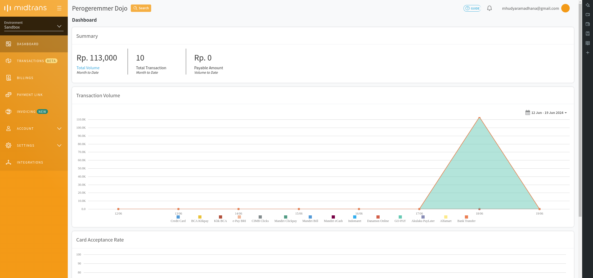

8 - Project Vending Machine (Part 2)
---

Author: Hudya (@perogeremmer)

<br />

# Overview

Pada bagian [pertama](8-project-vending-machine-part-1.md), kita sudah membangun struktur dasar untuk membuat websocket server dan client. Sekarang kita akan melanjutkan untuk membuat screen untuk menampilkan QR code transaksi yang ditujukan untuk membayar.

# Code Time

## Menambahkan Library

Untuk membuat QR Pembayaran, kita akan menggunakan library Midtrans. Nah silahkan install librarynya dengan cara memasukkan kode di bawah ini.

```bash
pip install midtransclient
```

> [!NOTE]
> Pastikan sudah mengaktifkan virtualenv dengan perintah `source venv/bin/activate`

## Membuat Akun

Sekarang kamu perlu membuat akun Midtrans. Kunjungi website resmi [Midtrans](https://midtrans.com/) lalu buatlah akun. Setelah masuk, pindahlah ke environment `sandbox`. Environment ini adalah environment untuk ujicoba program sebagai seorang developer, sehingga kamu tidak perlu membayar transaksinya secara real.

Tampilannya akan menjadi seperti ini.



Sekarang pergi ke `Settings > Access Keys`, disana kamu akan menemukan Client Key dan Server Key. Simpan kedua key ini pada komputer atau perangkatmu.

## Membuat file .env