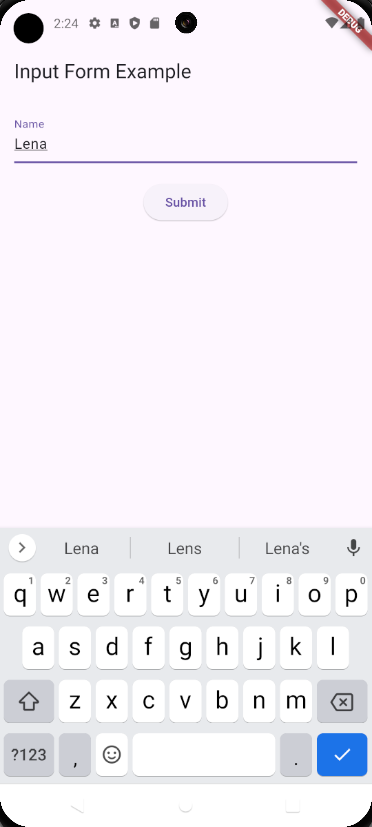
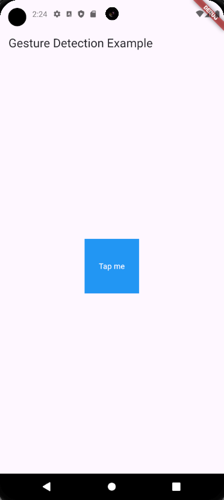
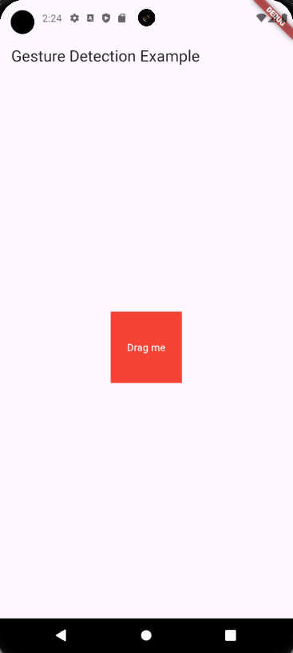

# Interaksi dan Input
Interaksi dan input adalah aspek penting dalam pengembangan aplikasi untuk memungkinkan pengguna berinteraksi dengan aplikasi. Di Flutter, ini dapat dilakukan dengan menggunakan berbagai widget dan deteksi gesture. Berikut adalah penjelasan tentang cara membuat form, menggunakan `TextField`, memvalidasi input pengguna, dan menangani gesture seperti tap, swipe, dan drag.

# Form dan Input
- ### Membuat Form dan Menggunakan TextField
    `TextField` adalah widget yang digunakan untuk menerima input teks dari pengguna. `Form` adalah widget yang menyediakan container untuk form fields.

    ```dart
    import 'package:flutter/material.dart';

    void main() {
    runApp(MyApp());
    }

    class MyApp extends StatelessWidget {
    @override
    Widget build(BuildContext context) {
        return MaterialApp(
        home: InputFormScreen(),
        );
    }
    }

    class InputFormScreen extends StatefulWidget {
    @override
    _InputFormScreenState createState() => _InputFormScreenState();
    }

    class _InputFormScreenState extends State<InputFormScreen> {
    final _formKey = GlobalKey<FormState>();
    String _name = '';

    void _submitForm() {
        if (_formKey.currentState!.validate()) {
        _formKey.currentState!.save();
        print('Form submitted with name: $_name');
        }
    }

    @override
    Widget build(BuildContext context) {
        return Scaffold(
        appBar: AppBar(
            title: Text('Input Form Example'),
        ),
        body: Padding(
            padding: const EdgeInsets.all(16.0),
            child: Form(
            key: _formKey,
            child: Column(
                children: [
                TextFormField(
                    decoration: InputDecoration(labelText: 'Name'),
                    validator: (value) {
                    if (value == null || value.isEmpty) {
                        return 'Please enter your name';
                    }
                    return null;
                    },
                    onSaved: (value) {
                    _name = value!;
                    },
                ),
                SizedBox(height: 20),
                ElevatedButton(
                    onPressed: _submitForm,
                    child: Text('Submit'),
                ),
                ],
            ),
            ),
        ),
        );
    }
    }
    ```
<p align="center">

</p>

- Kita membuat `InputFormScreen` yang memiliki sebuah `Form` dengan `TextFormField`.

- `TextFormField` memiliki `validator` untuk memvalidasi input dan onSaved untuk menyimpan nilai input.

- Tombol submit akan memanggil `_submitForm`, yang akan memvalidasi form dan mencetak nama yang dimasukkan.

# Gesture Detection
Flutter menyediakan beberapa widget dan metode untuk menangani berbagai gesture seperti tap, swipe, dan drag.

- ### Menangani Gesture Tap
    Untuk menangani gesture tap, kita bisa menggunakan widget GestureDetector atau InkWell.

    ```dart
    import 'package:flutter/material.dart';

    void main() {
    runApp(MyApp());
    }

    class MyApp extends StatelessWidget {
    @override
    Widget build(BuildContext context) {
        return MaterialApp(
        home: GestureDetectionScreen(),
        );
    }
    }

    class GestureDetectionScreen extends StatelessWidget {
    @override
    Widget build(BuildContext context) {
        return Scaffold(
        appBar: AppBar(
            title: Text('Gesture Detection Example'),
        ),
        body: Center(
            child: GestureDetector(
            onTap: () {
                print('Container tapped');
            },
            child: Container(
                width: 100,
                height: 100,
                color: Colors.blue,
                child: Center(
                child: Text(
                    'Tap me',
                    style: TextStyle(color: Colors.white),
                ),
                ),
            ),
            ),
        ),
        );
    }
    }
    ```
    <p align="center">
    
    </p>

    Dalam contoh di atas, ketika `Container` di-tap, pesan akan dicetak ke konsol.

- ### Menangani Gesture Swipe dan Drag
    GestureDetector juga dapat digunakan untuk menangani gesture swipe dan drag.
    
    ```dart
    import 'package:flutter/material.dart';

    void main() {
    runApp(MyApp());
    }

    class MyApp extends StatelessWidget {
    @override
    Widget build(BuildContext context) {
        return MaterialApp(
        home: GestureDetectionScreen(),
        );
    }
    }

    class GestureDetectionScreen extends StatelessWidget {
    @override
    Widget build(BuildContext context) {
        return Scaffold(
        appBar: AppBar(
            title: Text('Gesture Detection Example'),
        ),
        body: Center(
            child: GestureDetector(
            onHorizontalDragUpdate: (details) {
                print('Dragging horizontally: ${details.localPosition}');
            },
            onVerticalDragUpdate: (details) {
                print('Dragging vertically: ${details.localPosition}');
            },
            child: Container(
                width: 100,
                height: 100,
                color: Colors.red,
                child: Center(
                child: Text(
                    'Drag me',
                    style: TextStyle(color: Colors.white),
                ),
                ),
            ),
            ),
        ),
        );
    }
    }
    ```
    <p align="center">
    
    </p>
- `onHorizontalDragUpdate` digunakan untuk menangani gesture drag horizontal.

- `onVerticalDragUpdate` digunakan untuk menangani gesture drag vertikal.

Dengan mempelajari materi ini, kita sudah memahami cara membuat form dengan `TextField` dan memvalidasi input pengguna, serta bagaimana menangani berbagai gesture seperti tap, swipe, dan drag menggunakan `GestureDetector`. Pemahaman ini sangat penting untuk membuat aplikasi yang interaktif dan responsif.

Jika kalian ingin tahu lebih lanjut tentang materi diatas kalian bisa check langsung dokumentasi [Interaksi dan Input](https://docs.flutter.dev/ui/widgets/input).

