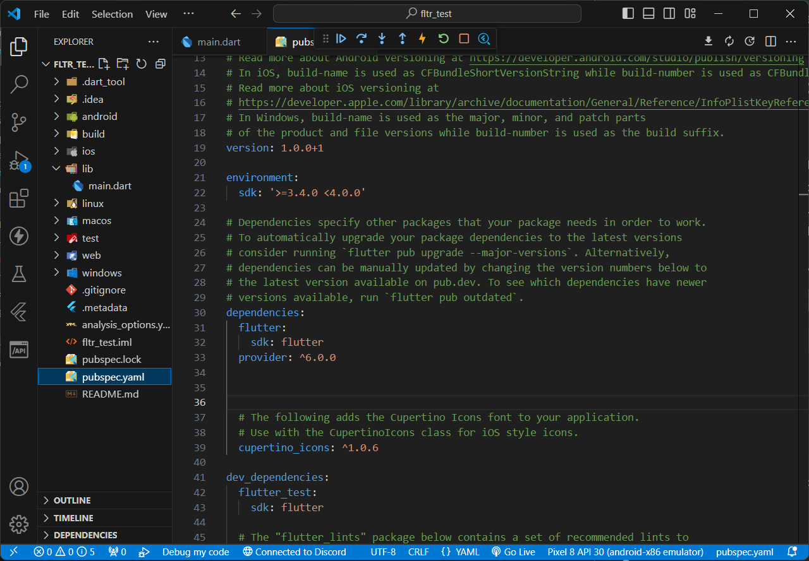
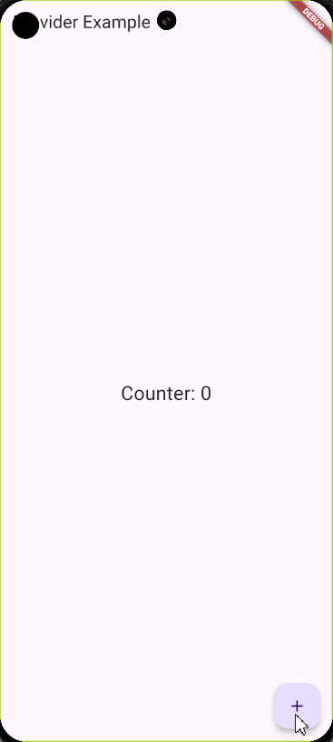

# State Management Lanjutan
Setelah mempelajari cara mengelola state dasar dengan `setState` dan `InheritedWidget`, sekarang kita akan membahas state management yang lebih canggih menggunakan `Provider`. `Provider` adalah salah satu paket state management yang paling populer dan dianjurkan dalam ekosistem Flutter.

# Provider
Provider memisahkan logika bisnis dari UI dan memungkinkan state untuk diakses dan dibagikan di seluruh aplikasi tanpa memerlukan boilerplate kode yang banyak. Ini membuat pengelolaan state menjadi lebih mudah dan lebih terstruktur.

### Menggunakan Provider
Pertama, tambahkan provider ke pubspec.yaml:
```yaml
dependencies:
  flutter:
    sdk: flutter
  provider: ^6.0.0
```
 <p align="center">

</p>

setelah itu tekan `CTRL + S` untuk save sekaligus mengunduh depedensi.

### Contoh menggunakan Provider

```dart
import 'package:flutter/material.dart';
import 'package:provider/provider.dart';
void main() {
  runApp(
    ChangeNotifierProvider(
      create: (context) => Counter(),
      child: MyApp(),
    ),
  );
}

class MyApp extends StatelessWidget {
  @override
  Widget build(BuildContext context) {
    return MaterialApp(
      home: CounterScreen(),
    );
  }
}

class CounterScreen extends StatelessWidget {
  @override
  Widget build(BuildContext context) {
    return Scaffold(
      appBar: AppBar(
        title: Text('Provider Example'),
      ),
      body: Center(
        child: Consumer<Counter>(
          builder: (context, counter, child) {
            return Text(
              'Counter: ${counter.count}',
              style: TextStyle(fontSize: 24),
            );
          },
        ),
      ),
      floatingActionButton: Consumer<Counter>(
        builder: (context, counter, child) {
          return FloatingActionButton(
            onPressed: counter.increment,
            tooltip: 'Increment',
            child: Icon(Icons.add),
          );
        },
      ),
    );
  }
}


class Counter with ChangeNotifier {
  int _count = 0;

  int get count => _count;

  void increment() {
    _count++;
    notifyListeners();
  }
}

```
<p align="center">

</p>


### Penjelasan 

### 1. Menggunakan Provider di main.dart:

 - Kami memulai aplikasi dengan menjalankan `runApp` yang membungkus `MyApp` dalam `ChangeNotifierProvider`. Ini menyediakan instance `Counter` ke seluruh aplikasi.
 
- `ChangeNotifierProvider` adalah widget yang menyediakan instance dari `ChangeNotifier` kepada semua anak di bawahnya dalam tree widget.

```dart
void main() {
  runApp(
    ChangeNotifierProvider(
      create: (context) => Counter(),
      child: MyApp(),
    ),
  );
}
```

### 2. MyApp Widget:
`MyApp` adalah widget utama yang memulai aplikasi dan menampilkan `CounterScreen`.

```dart
class MyApp extends StatelessWidget {
  @override
  Widget build(BuildContext context) {
    return MaterialApp(
      home: CounterScreen(),
    );
  }
}
```

### 3. Model Counter
- `Counter` adalah kelas model yang mengelola state counter dan mewarisi `ChangeNotifier`. Ini berarti setiap kali nilai counter berubah, semua pendengar yang terdaftar akan diberitahu.

- `_count` adalah variabel privat yang menyimpan nilai counter

- `increment` adalah metode yang menambah nilai counter dan memanggil `notifyListeners` untuk memperbarui UI.

```dart
class Counter with ChangeNotifier {
  int _count = 0;

  int get count => _count;

  void increment() {
    _count++;
    notifyListeners();
  }
}
```

### 4. `CounterScreen` Widget:
- `CounterScreen` adalah widget yang menampilkan nilai counter dan memiliki tombol untuk menambah nilai counter.

- `Consumer` digunakan untuk mendengarkan perubahan pada `Counter`. `Consumer` memerlukan `builder` yang menyediakan konteks dan instance model `Counter`.

- `FloatingActionButton` juga menggunakan `Consumer` untuk memanggil metode `increment` dari model `Counter`.

```dart
class CounterScreen extends StatelessWidget {
  @override
  Widget build(BuildContext context) {
    return Scaffold(
      appBar: AppBar(
        title: Text('Provider Example'),
      ),
      body: Center(
        child: Consumer<Counter>(
          builder: (context, counter, child) {
            return Text(
              'Counter: ${counter.count}',
              style: TextStyle(fontSize: 24),
            );
          },
        ),
      ),
      floatingActionButton: Consumer<Counter>(
        builder: (context, counter, child) {
          return FloatingActionButton(
            onPressed: counter.increment,
            tooltip: 'Increment',
            child: Icon(Icons.add),
          );
        },
      ),
    );
  }
}
```
Dengan mempelajari cara menggunakan Provider, kita sudah memahami bagaimana memisahkan logika bisnis dari UI, membuat state lebih terstruktur, dan memudahkan pengelolaan state di seluruh aplikasi. Namun, perlu diingat bahwa Provider bukan satu-satunya pilihan untuk state management di Flutter. Ada juga solusi lain seperti Bloc, Riverpod, Redux, dan lain-lain yang bisa dipertimbangkan sesuai dengan kebutuhan aplikasi Anda.

Jika kalian ingin tahu lebih lanjut tentang materi diatas kalian bisa check langsung dokumentasi [Provider](https://pub.dev/packages/provider).
