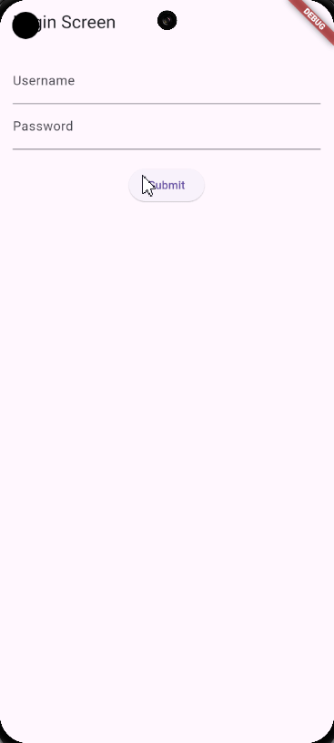

# Soal:

Buatlah aplikasi Flutter yang memiliki tiga layar: `LoginScreen`, `HomeScreen`, dan `ProfileScreen`. Gunakan state management dengan `Provider` untuk mengelola state pengguna yang sedang login.

1. LoginScreen:

- Form login dengan dua `TextFormField` untuk username dan password.

- Validasi input:
    - Username tidak boleh kosong.
    - Password tidak boleh kosong dan minimal 6 karakter.
- Tombol submit yang menyimpan username dan password ke model `UserModel` yang dikelola oleh `Provider`. Jika validasi berhasil, navigasi ke `HomeScreen`.

2. HomeScreen:

    - Tampilkan pesan selamat datang menggunakan username yang dimasukkan di `LoginScreen`.

    - Tombol untuk navigasi ke `ProfileScreen`.

3. ProfileScreen:

    - Tampilkan informasi username dan password.

    - Tombol untuk logout yang menghapus data pengguna dari `UserModel` dan kembali ke `LoginScreen`.

