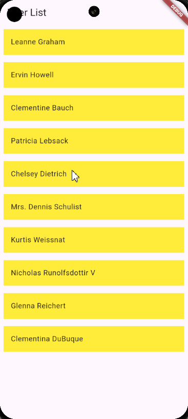

# Soal
Buatlah aplikasi Flutter yang dapat menampilkan daftar pengguna dari API eksternal. Gunakan package `http` untuk melakukan permintaan GET ke URL `https://jsonplaceholder.typicode.com/users`. Aplikasi ini harus memiliki dua layar: `UserListScreen` dan `UserDetailScreen`.

1. UserListScreen:
    - Lakukan permintaan GET untuk mendapatkan daftar pengguna.

    - Tampilkan daftar nama pengguna dalam bentuk ListView.

    - Setiap item dalam daftar harus bisa diklik untuk navigasi ke UserDetailScreen dengan mengirimkan data pengguna yang dipilih.

2. UserDetailScreen:
    - Tampilkan detail informasi pengguna, termasuk nama, email, dan alamat.

